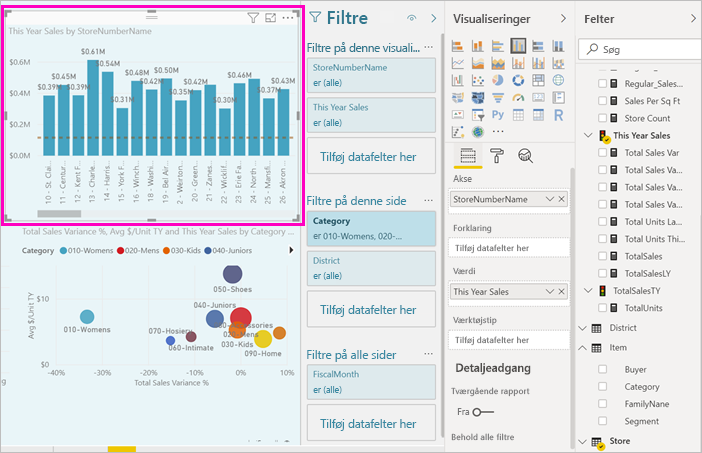
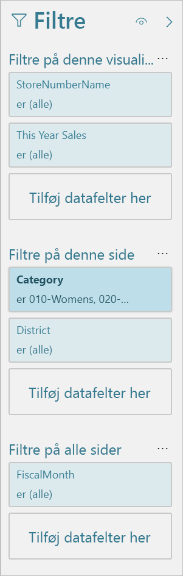
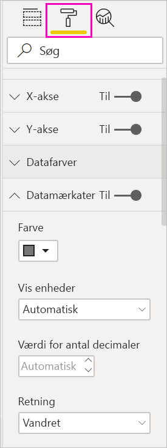

# Præsentation af rapporteditor i Power BI

I Power BI Desktop og i Power BI-tjenesten er *rapporteditor* det sted, hvor du designer rapporter med diagrammer, tabeller, kort og andre visualiseringer, som forbrugerne ser. Det er næsten det samme i de to miljøer. Du starter typisk med at oprette en rapport i Power BI Desktop. Derefter publicerer du den i Power BI-tjenesten, hvor du kan fortsætte med at ændre den. Power BI-tjenesten er også det sted, hvor du opretter de dashboards, der er baseret på dine rapporter.

Når du har oprettet dine dashboards og rapporter, kan du distribuere dem til dine rapportforbrugere. Afhængigt af hvordan du deler dem, kan dine slutbrugere interagere med dem i Læsevisning i Power BI-tjenesten, men ikke redigere dem. Læs mere om, [hvad rapportforbrugere kan gøre i Power BI-tjenesten](../consumer/end-user-reading-view.md). 

Denne video viser rapporteditoren i Power BI Desktop. I denne artikel kan du også se rapporteditoren i Power BI Desktop. 

<iframe width="560" height="315" src="https://www.youtube.com/embed/IkJda4O7oGs" frameborder="0" allowfullscreen></iframe>

I Power BI-tjenesten er rapporteditoren kun tilgængelig i redigeringsvisning. Hvis du vil åbne en rapport i Redigeringsvisning, skal du være rapportejer eller rapportforfatter eller være bidragyder til det arbejdsområde, der indeholder rapporten.

Power BI-rapporteditor er inddelt i flere hovedafsnit:  

1. Øverste navigationsrude
1. Rapportlærred
1. Ruden Filtre
1. Ruden Visualiseringer
1. Ruden Felter

## 1. Den øverste navigationsrude
Der er mange handlinger tilgængelige i den øverste navigationsrude, og der tilføjes hele tiden nye handlinger. Brug indholdsfortegnelsen eller søgefeltet i dokumentationen til Power BI for at få oplysninger om en bestemt handling.

## 2. Rapportcanvasset
Rapportcanvasset er det sted, dit arbejde vises. Når du bruger ruderne Felter, Filtre og Visualiseringer til at oprette visuelle elementer, bygges og vises de på dit rapportcanvas. Hver fane nederst på canvasset repræsenterer en side i rapporten. Vælg en fane for at åbne siden. 

## Rapporteditorens ruder

Tre ruder er synlige, når du åbner en rapport: Filtre, Visualiseringer og Felter. I de første to ruder til venstre, Filtre og Visualiseringer, styrer du, hvordan dine visualiseringer ser ud: type, farver, filtrering og formatering. I den sidste rude til højre, Felter, administrerer du de underliggende data, der bruges i visualiseringerne. Det indhold, der vises i rapporteditoren, varierer i forhold til valg, du foretager på rapportcanvasset. 

Når du f.eks. vælger en individuel visualisering, såsom dette søjlediagram:

I ruden **Filtre** vises alle filtre i visualiseringen, på siden eller på alle sider. I dette tilfælde er der filtre på sideniveau, men der er ingen filtre på visualiseringsniveau.

**Øverst i ruden Visualisering** identificeres den type visualisering, der bruges. I dette eksempel bruges et grupperet søjlediagram. 

**Nederst i ruden Visualisering** er der tre faner:

 **Felter** viser felterne i visualiseringen. Du skal muligvis rulle ned for at se alle detaljerne. Dette diagram bruger Butiksnummernavn og Dette års salg.

 **Formatér** Vælg malerrulleikonet for at få vist formateringsruden for den valgte visualisering.

 **Analyse** Vælg ikonet med forstørrelsesglasset for at få vist ruden Analyse.

**I ruden Felter** vises alle tilgængelige tabeller i datamodellen. Når du udvider en tabel, kan du se felterne i den pågældende tabel. Et gult flueben angiver, at mindst ét felt fra den pågældende tabel findes i en visualisering.

Læs videre for at få oplysninger om hver rude.

## 3. Ruden Filtre
Brug ruden Filtre til at få vist, angive og redigere faste filtre til dine rapporter på side-, rapport-, detaljeadgangs- og visualiseringsniveau. Du kan udføre ad hoc-filtrering på rapportsider og visualiseringer ved at vælge elementer i visualiseringerne eller ved at anvende værktøjer såsom udsnit. Filtrering i ruden Filtre har den fordel, at filtrenes status gemmes sammen med rapporten. 

Ruden Filtre indeholder en anden effektiv funktion: Du kan filtrere ved hjælp af et felt, *der ikke allerede bruges i en af visualiseringerne i din rapport*. Lad mig forklare. Når du opretter en visualisering, føjer Power BI automatisk alle de felter, du bruger i visualiseringerne, til filterområdet i ruden Filtre på visualiseringsniveau. Hvis du vil angive en visualisering, en side, detaljeadgang eller et rapportfilter ved hjælp af et felt, der ikke bruges i en visualisering i øjeblikket, skal du bare trække det til en filterbucket.

Den nye filtervisning giver større fleksibilitet. Du kan f.eks. formatere filtre, så de ligner selve rapporten. Du kan også låse filtre eller skjule dem for dine rapportforbrugere. 

Læs mere om [den nye filtreringsoplevelse](power-bi-report-filter.md).

## 4. Ruden Visualiseringer

Selve visualiseringsruden indeholder fire sektioner. Vi starter øverst i ruden.

Dette er stedet, hvor du vælger en visualiseringstype. De små ikoner viser de forskellige typer visualiseringer, du kan oprette. På billedet herover er boblediagrammet valgt. Hvis du begynder at oprette en visualisering ved at vælge felter uden først at vælge en visualiseringstype, vælger Power BI visualiseringstypen for dig. Du kan bevare Power BI's valg eller ændre typen ved at vælge et andet ikon.

Du kan downloade brugerdefinerede visualiseringer til Power BI Desktop. Deres ikoner vises også i denne rude. 

### Administrer felterne i en visualisering

De buckets (også kaldet *brønde*), der er vist i denne rude, varierer, afhængigt af hvilken visualiseringstype du har valgt.  Hvis du f.eks. har valgt et søjlediagram, kan du se Akse, Forklaring og Værdier. Når du vælger et felt eller trækker det over på lærredet, føjer Power BI dette felt til en af disse buckets.  Du kan også trække felter fra listen Felter direkte til buckets.  Nogle buckets er begrænset til visse datatyper.  For eksempel accepterer **Værdier** ikke felter, der ikke er numeriske. Så hvis du trækker et felt for **Kategori** til bucketen **Værdier**, ændrer Power BI det til **Antal kategori**.

Du kan finde flere oplysninger i [Føj visualiseringer til en Power BI-rapport](../visuals/power-bi-report-add-visualizations-i.md).

Denne del af ruden indeholder også indstillinger for at styre [detaljeadgang](desktop-drillthrough.md) og filtreringsfunktionalitet.

### Formatér dine visuelle elementer
Vælg ikonet med malerullen for at åbne ruden Formatér. De tilgængelige indstillinger afhænger af den valgte type visualisering.

Der er omfattende formateringsmuligheder.  Udforsk selv for at få mere for at vide, eller gå til disse artikler:

* [Tilpas visualiseringstitel, -baggrund og -forklaring](../visuals/power-bi-visualization-customize-title-background-and-legend.md)
* [Farveformatering](../visuals/service-getting-started-with-color-formatting-and-axis-properties.md)
* [Tilpas egenskaber for x- og y-akse](../visuals/power-bi-visualization-customize-x-axis-and-y-axis.md)

### Føj analyser til din visualiseringer
Vælg forstørrelsesglasikonet for at få vist ruden Analystics. De tilgængelige indstillinger afhænger af den valgte type visualisering.

I ruden Analytics i Power BI-tjenesten kan du føje dynamiske referencelinjer til visuelle elementer og sætte fokus på vigtige tendenser eller indsigter. Du kan finde flere oplysninger under [Ruden Analyse i Power BI Desktop](../transform-model/desktop-analytics-pane.md).

## 5. Ruden Felter
Ruden Felter indeholder tabellerne, mapperne og felterne i dine data, som er tilgængelige for dig, så du kan bruge dem til at oprette visualiseringer.

|  |  |
| --- | --- |
|  |<ul><li>Træk et felt til siden for at starte en ny visualisering.  Du kan også trække et felt til en eksisterende visualisering for at føje feltet til den pågældende visualisering.  </li> <li>Når du markerer afkrydsningsfeltet ud for et felt, føjer Power BI dette felt til den aktive (eller nye) visualisering. Og den beslutter også, hvilken bucket dette felt skal placeres i.  Skal feltet f.eks. bruges som en forklaring, akse eller værdi? Power BI gætter på bedste vis, og du kan om nødvendigt flytte det fra denne bucket til en anden.   </li><li>Uanset hvad, føjes hvert enkelt felt til ruden Visualiseringer i rapporteditoren.</li></ul> |

I Power BI Desktop har du også mulighed for at vise/skjule felter, tilføje beregninger osv.

## Feltikonerne

Power BI bruger en række forskellige ikoner til at angive typerne af felter i en rapport. Når du genkender dem, forstår du bedre, hvordan de fungerer i forskellige visualiseringer. Her er nogle af de mere almindelige.

|Ikon  |Betydning  |
|---------|---------|
|  | Mappe på listen Felter |
| | Numerisk felt: Numeriske felter er samlinger, der f.eks. kan sammenlægges eller beregnes som gennemsnit. Samlinger importeres med dataene og defineres i den datamodel, som din rapport er baseret på. Du kan finde flere oplysninger i [Aggregeringer i Power BI-rapporter](service-aggregates.md). |
| | Beregnet kolonne med en datatype, der ikke er numerisk: En ny ikke-numerisk kolonne, du opretter, med en DAX-formel (Data Analysis Expressions), der definerer kolonnens værdier. Læs mere om [beregnede kolonner](../transform-model/desktop-calculated-columns.md). |
|     |   Numerisk beregnet kolonne: En ny kolonne, du opretter, med en DAX-formel (Data Analysis Expressions), der definerer kolonnens værdier. Læs mere om [beregnede kolonner](../transform-model/desktop-calculated-columns.md). |
| |  Måling: Hver måling har sin egen hårdt kodede formel. Du kan ikke ændre beregningen – hvis det f.eks. er en sum, kan det kun være en sum. Værdierne gemmes ikke i en kolonne. De beregnes løbende, udelukkende afhængigt af hvordan de er placeret i en visualisering. Du kan finde flere oplysninger i [Forstå målinger](../transform-model/desktop-measures.md). |
|     | Målegruppe  |
| |      KPI: Et visuelt tip, der viser statussen mod et målbart mål. Læs mere om [KPI-visualiseringer (Key Performance Indicator)](../visuals/power-bi-visualization-kpi.md) |
|     |  Felthierarki: Vælg pilen for at se de felter, der udgør hierarkiet.  Du kan få flere oplysninger ved at se denne Power BI-video på YouTube om, [hvordan du opretter og arbejder med hierarkier](https://www.youtube.com/watch?v=q8WDUAiTGeU). |
|     | Geo-data: Disse placeringsfelter kan bruges til at oprette kortvisualiseringer. |
|      | Id-felt: Felter med dette ikon er *entydige felter*, som er angivet til at vise alle værdier, også selvom der er dubletter. Dine data kan f.eks. have poster for to forskellige personer med navnet "Robin Smith", og hver enkelt behandles som entydig. De opsummeres ikke.   |
|   | Parameter: Angiv parametre for at gøre dele af dine rapporter og datamodeller (f.eks. et forespørgselsfilter, en datakildereference, en målingsdefinition osv.) afhængige af en eller flere parameterværdier. Du kan finde flere oplysninger i dette Power BI-blogindlæg om [forespørgselsparametre](https://powerbi.microsoft.com/blog/deep-dive-into-query-parameters-and-power-bi-templates/). |
|  | Kalenderdatofelt med en indbygget datotabel |

## Næste trin
[Opret en rapport](service-report-create-new.md)

Læs mere om rapporter i programmerne [Power BI-tjenesten](service-report-create-new.md), [Power BI Desktop](desktop-report-view.md) og [Power BI – Mobil](../consumer/mobile/mobile-apps-view-phone-report.md).

[Grundlæggende begreber for Power BI-designere](../fundamentals/service-basic-concepts.md)

Har du flere spørgsmål? [Prøv at spørge Power BI-community'et](https://community.powerbi.com/)
