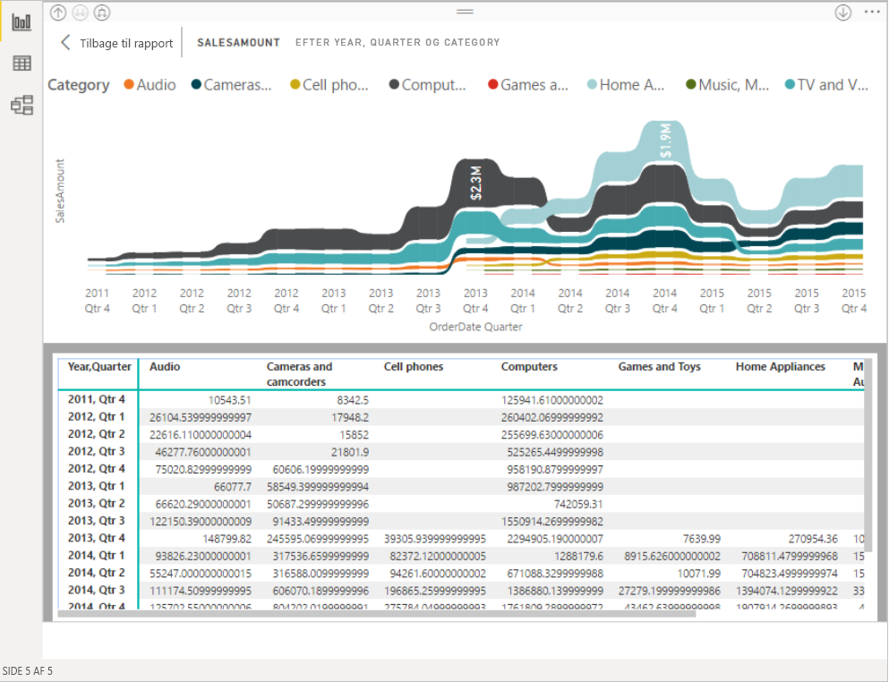

# Brug af rapporter i Power BI med tilgængelighedsværktøjer
Power BI indeholder mange indbyggede funktioner, der gør det nemmere for personer med et handicap at bruge og interagere med Power BI-rapporter. Disse værktøjer hjælper brugerne med at få de samme oplysninger ud af en rapport som personer, der ikke bruger hjælpeteknologi.

Der er et par begreber, du skal kende, når du læser denne artikel:

* **Fokus** er der, hvor musen befinder sig på siden. Fokus angives normalt med en blå kant omkring et objekt.
* **Lærred** er sideområdet i din rapport.

Følgende afsnit indeholder en beskrivelse af de tilgængelighedsværktøjer, der er tilgængelig til brug af Power BI-rapporter.

## Tastaturnavigation

Når du starter Power BI Desktop eller Power BI-tjenesten, vises der et værktøj i øverste højre hjørne, så snart du trykker på **tabulatortasten**. Linket med titlen **Tip til at bruge Power BI med en skærmlæser** dirigerer dig til denne artikel, som indeholder oplysninger om, hvordan du bruger en rapport med tilgængelighedsværktøjer. Når du klikker på linket **Gå til hovedindhold**, kommer du til rapportlærredet.

Når du trykker på **?** , åbnes en dialogboks med de oftest anvendte tastaturgenveje i Power BI. Hvis du vil se en komplet liste over tilgængelige tastaturgenveje i Power BI, kan du navigere til linket nederst i dialogboksen, hvorved du kommer til Power BI-dokumentationen om [tastaturgenveje](desktop-accessibility-keyboard-shortcuts.md).

Du kan skifte fokus mellem rapportens sidefaner eller objekter på en given rapportside ved hjælp af **Ctrl + F6**. Når der er fokus på en indlæst **rapportside**, skal du bruge tabulatortasten til at skifte fokus til de enkelte objekter på siden, som inkluderer alle tekstfelter, billeder, figurer og diagrammer. 

Generelt er brug af **Enter** til at vælge eller åbne og brug af **Esc** til at afslutte almindelige kommandoer i Power BI.

### Tastaturnavigation i forbindelse med visualiseringer

Mange skabere af Power BI-rapporter udarbejder rapporter, der indeholder mange data. Det kan være irriterende, at man skal bruge tabulatortasten for hvert eneste element i en visualisering, når man bevæger sig gennem en visualisering. Tastaturnavigation i forbindelse med visualiseringer er designet som et hierarki med tre niveauer. Disse tre niveauer er beskrevet i følgende afsnit.

Du navigerer gennem det første niveau i en visualisering ved at trykke på **Ctrl + pil til højre** for at åbne den pågældende visualisering. Når du har åbnet visualiseringen, kan du trykke på **tabulatortasten** for at cirkulere mellem visualiseringens hovedområder. De hovedområder, du kan cirkulere mellem, er dataafbildningsområderne, aksekategorierne (hvis relevant for visualiseringen) og forklaringen (hvis visualiseringen indeholder en).

På følgende .gif kan du se, hvordan en bruger cirkulerer gennem det første niveau i en visualisering:

I andet niveau af hierarkiet har du åbnet et af visualiseringens hovedområder (dataafbildningsområdet, x-aksekategorier, forklaring). I takt med at du bruger en rapport, kan du gå ind i et af disse hovedområder og cirkulere gennem datapunkterne eller kategorierne i dette afsnit af visualiseringen. Når du har besluttet, hvilket område du vil udforske yderligere, kan du trykke på **Enter** for at cirkulere gennem dette specifikke område.

Hvis du vil vælge alle datapunkter i en serie, skal du navigere til forklaringen og trykke på **Enter**. Når du har åbnet forklaringen, kan du trykke på **tabulatortasten** for at navigere gennem de forskellige kategorier i forklaringen. Tryk på **Enter** for at vælge specifikke serier.

Hvis du vil vælge specifikke datapunkter, skal du navigere til dataafbildningsområdet og trykke på **Enter**. Når du har åbnet dataafbildningsområdet, kan du trykke på **tabulatortasten** for at navigere gennem datapunkterne. Hvis der er flere serier i din visualisering, kan du trykke på **pil op** eller **pil ned** for at hoppe til datapunkterne i en anden serie.

Hvis du vil vælge alle datapunkter på en kategoriakse, skal du navigere til aksemærkaterne og trykke på **Enter**. Når du har åbnet aksemærkaterne, kan du trykke på **tabulatortasten** for at navigere gennem mærkatnavnene. Tryk på **Enter** for at vælge et mærkatnavn.

Hvis du har navigeret ind i et lag, kan du trykke på **Esc** for at komme ud af laget. På følgende .gif kan du se, hvordan en bruger kan åbne og afslutte niveauerne i en visualisering og vælge datapunkter, mærkater for x-aksekategorier, hoppe til en anden serie og vælge alle datapunkter i en serie.

Hvis du oplever, at du ikke kan navigere til et objekt eller en visualisering, mens du bruger tastaturet, kan det skyldes, at rapportforfatteren har besluttet at skjule det pågældende objekt i tabulatorrækkefølgen. Rapportforfattere skjuler ofte dekorative objekter i tabulatorrækkefølgen. Hvis du oplever, at du ikke kan bruge tabulatortasten til at navigere gennem en rapport på en logisk måde, bør du kontakte rapportforfatteren. Rapportforfattere kan angive tabulatorrækkefølgen for objekter og visualiseringer.

### Tastaturnavigation i forbindelse med udsnit

Der er også indbygget tilgængelighed i udsnit. Når du vælger et udsnit, kan du bruge **Ctrl + pil til højre** til at tilpasse værdien af udsnittet og skifte mellem de forskellige kontrolelementer i udsnittet. Hvis du f.eks. trykker på **Ctrl + højre piletast**, er fokus på viskelæderet. Når du derefter trykker på **mellemrumstasten**, svarer det til at klikke på viskelæderknappen, som sletter alle værdierne i udsnittet.

Du kan flytte gennem kontrolelementerne i et udsnit ved at trykke på **tabulatortasten**. Hvis du trykker på **tabulatortasten**, når fokus er på viskelæderet, flyttes fokus til rullelisten. Med endnu et tryk på **tabulatortasten** flyttes fokus til den første værdi i udsnittet (hvis der er flere værdier i udsnittet, f.eks. et interval).

### Skift af sider

Når der er fokus på en **rapports sidefaner**, skal du bruge **tabulator**- eller piletasten til at flytte fokus fra én rapportside til den næste. Titlen på rapportsiden, og om den er markeret i øjeblikket, læses højt af skærmlæseren. Brug **Enter** eller **mellemrumstasten** til at indlæse den rapportside, der i øjeblikket er fokus på.

### Adgang til den visuelle header
Når du navigerer mellem visuals, kan du trykke på **Alt + Skift + F10** for at flytte fokus til den visuelle header. Den visuelle header indeholder forskellige muligheder, herunder sortering, eksport af dataene bag diagrammet og fokustilstand. De ikoner, du kan se i den visuelle header, afhænger af de indstillinger, som rapportforfatteren har valgt at vise.

## Skærmlæser

Når du får vist en rapport, er det bedst at lade scanningstilstand være slået fra. Power BI bør håndteres mere som et program og mindre som et dokument, så det er konfigureret med brugerdefineret navigation for at gøre det nemmere at navigere i. Når du bruger en skærmlæser sammen med Power BI Desktop, bør du også sørge for, at skærmlæseren er åben, før du åbner Power BI Desktop.

Når du navigerer gennem objekter, læser skærmlæseren objekttypen og objektets titel op (hvis det findes). Skærmlæseren læser også en beskrivelse af det pågældende objekt (alternativ tekst) op, hvis det er angivet af rapportforfatteren.

### Vis data
Du kan trykke på **Alt + Skift + F11** for at få vist en tilgængelig version af vinduet **Vis data**. Vinduet gør det muligt at udforske data, der bruges i visualiseringen i en HTML-tabel, ved hjælp af de samme tastaturgenveje, du normalt anvender med din skærmlæser.

Funktionen **Vis data** er en HTML-tabel, der kun er tilgængelig for skærmlæsere via denne tastaturgenvej. Hvis du åbner **Vis data** fra indstillingen i den visuelle header, vises der en tabel, som *ikke* er kompatibel med en skærmlæser.  Når du bruger **Vis data** via tastaturgenvejene, kan du slå scanningstilstand til for at drage fordel af alle de genvejstaster, der angives af skærmlæseren.

Hvis du vil afslutte visningen **Vis data** og returnere til rapporten, skal du trykke på **Esc**.

## Tilstande med stor kontrast

Power BI-tjenesten forsøger at registrere de indstillinger for stor kontrast, der er valgt til Windows. Effektiviteten og nøjagtigheden af denne registrering afhænger af den browser, der viser Power BI-tjenesten. Hvis du vil angive temaet manuelt i Power BI-tjenesten, kan du vælge **Vis > Farver med høj kontrast** og derefter vælge det tema, du vil bruge i rapporten.

## Næste trin

Samlingen af artikler om tilgængelighed i Power BI er som følger:

* [Oversigt over tilgængelighed i Power BI](desktop-accessibility-overview.md) 
* [Oprettelse af tilgængelige Power BI-rapporter](desktop-accessibility-creating-reports.md) 
* [Oprettelse af Power BI-rapporter med tilgængelighedsværktøjer](desktop-accessibility-creating-tools.md)
* [Tastaturgenveje i forbindelse med tilgængelighed i Power BI-rapporter](desktop-accessibility-keyboard-shortcuts.md)
* [Tjekliste for tilgængeligheden af rapporten](desktop-accessibility-creating-reports.md#report-accessibility-checklist)

