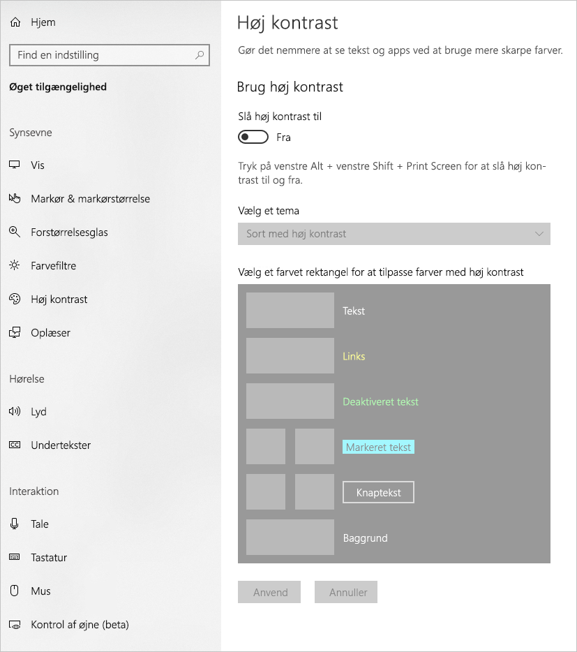
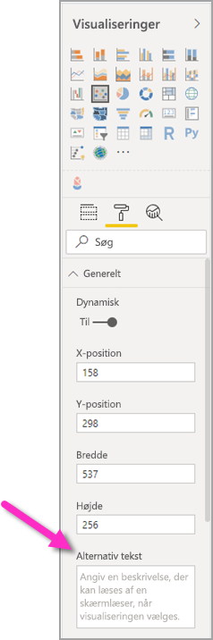
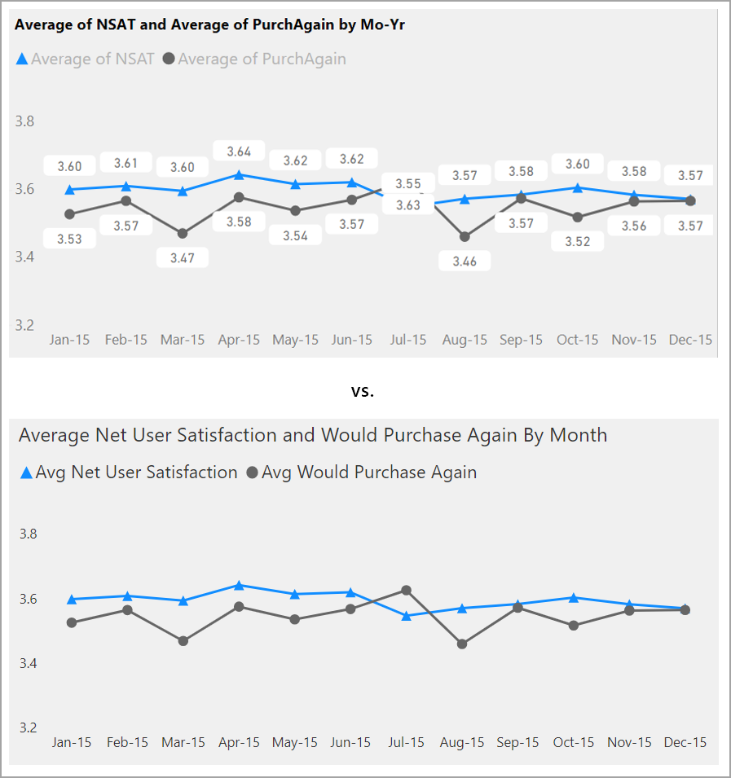

# Design tilgængelige Power BI-rapporter
Du kan designe og oprette flotte rapporter og samtidig have øje for tilgængelighed. Når du opbygger en rapport, bør du oprette den, så den kan bruges af så mange personer som muligt, uanset hvem din målgruppe er, uden at det er nødvendigt at tilpasse den til en slags specialdesign.

I denne artikel beskrives tilgængelighedsfunktioner og -værktøjer til oprettelse af tilgængelige rapporter i Power BI.

Når Power BI bruges sammen med en skærmlæser, anbefaler vi, at du aktiverer scanningstilstand eller browsertilstand.

Der er adgang til en genvejsmenu, som kan gøre det nemmere at oprette rapporter med skærmlæsere. Menuen giver mulighed for at flytte felter op eller ned i beholderen i listen **Felter**. Menuen tillader også flytning af feltet til andre beholdere såsom **Forklaring**, **Værdi** eller andre.

## Typer af tilgængelighedsfunktioner

Power BI indeholder egenskaber til at oprette tilgængelige rapporter, men som rapportforfatter er det op til dig at inkorporere dem i dine rapporter. I denne artikel beskrives tre kategorier af tilgængelighedsfunktioner:

* Indbyggede tilgængelighedsfunktioner (ingen konfiguration er påkrævet)
* Indbyggede tilgængelighedsfunktioner (konfiguration er påkrævet)
* Andre tip og overvejelser

Vi drøfter hver enkelt af disse kategorier i følgende afsnit.

## Indbyggede tilgængelighedsfunktioner

Power BI indeholder tilgængelighedsfunktioner, som er indbygget i produktet, og som ikke skal konfigureres af rapportforfatteren. Disse funktioner er som følger:

* Tastaturnavigation
* Kompatibilitet med skærmlæser
* Visning i farver med stor kontrast
* Fokustilstand
* Tabellen Vis data

Der er også funktioner, som hjælper med forbrugsoplevelsen af rapporten. Du finder artikler, der beskriver disse funktioner, i afsnittet [Næste trin](#next-steps) i slutningen af denne artikel.

Lad os se nærmere på hver af disse indbyggede tilgængelighedsfunktioner. 

### Tastaturnavigation

Som rapportforfatter behøver du ikke at bekymre dig om, om dine forbrugere kan bruge deres tastatur til at navigere i en rapport. Der kan navigeres i alle Power BI-visualiseringer ved hjælp af tastaturet, og forbrugerne af din rapport kan gennemgå datapunkterne i visualiseringerne, skifte mellem sidefaner og få adgang til interaktive egenskaber, herunder krydsfremhævning, filtrering og udsnit.

I takt med at en forbruger af en rapport navigerer i rapporten, vises fokus for at angive, hvor brugeren befinder sig i rapporten. Fokustilstanden kan blive vist forskelligt, afhængigt af hvilken browser der bruges.

Hvis du vil have adgang til de oftest anvendte tastaturgenveje, skal du trykke på *?* for at få vist en dialogboks med tastaturgenveje. Hvis du vil vide mere, kan du se disse artikler om forbrugsoplevelser og tastaturgenveje i forbindelse med tilgængelighed i afsnittet [Næste trin](#next-steps) i slutningen af denne artikel.

### Kompatibilitet med skærmlæser

Generelt er alle objekter i Power BI, der har tastaturnavigation, også kompatible med skærmlæsere. Når en forbruger af en rapport navigerer til en visualisering, bliver titlen, visualiseringstypen og evt. alternativ tekst, som er angivet, læst op af skærmlæseren.

### Visning af farver med stor kontrast

Power BI understøtter stor kontrast i rapporter. Hvis du bruger en tilstand med stor kontrast i Windows, registrerer Power BI Desktop automatisk, hvilket tema med stor kontrast der bruges og anvender disse indstillinger i dine rapporter. Disse farver med stor kontrast følger rapporten, når den publiceres i Power BI-tjenesten eller andre steder.

Power BI-tjenesten forsøger også at registrere de indstillinger for stor kontrast, der er valgt i Windows, men hvor effektiv og nøjagtig registreringen er, afhænger af den browser, er bruges med Power BI-tjenesten. Hvis du vil angive temaet manuelt i Power BI-tjenesten, kan du vælge **V > Farver med stor kontrast** i øverste højre hjørne og derefter vælge det tema, du vil bruge i rapporten.

### Fokustilstand
Hvis en forbruger af en rapport kigger på en visualisering på et dashboard, kan vedkommende udvide visualiseringen, så den fylder mere af skærmen, ved at navigere til genvejsmenuen for visualiseringen og vælge **Åbn i fokustilstand**.

### Tabellen Vis data
Forbrugere af rapporter kan også få vist dataene i en visualisering i et tabelformat ved at trykke på **Alt + Skift + F11**. Denne tabel svarer til at trykke på **Vis data** i visualiseringens genvejsmenu, men den viser en tabel, der er brugervenlig for skærmlæseren.

## Indbyggede tilgængelighedsfunktioner med påkrævet konfiguration

Power BI indeholder tilgængelighedsfunktioner, som er indbygget i produktet, og som skal konfigureres af rapportforfatteren.  Disse funktioner omfatter:

* Alternativ tekst
* Rækkefølge af faner
* Titler og mærkater
* Mærker
* Rapporttemaer

## Alternativ tekst

Alternativ tekst (alternative tekstbeskrivelser) bruges til at beskrive udseendet og funktionen af visualiseringer og billeder på rapportsiden til brugerne af skærmlæsere. Rapportforfattere bør føje alternativ tekst til alle objekter, der formidler meningsfulde oplysninger om en rapport. Når du angiver alternativ tekst, sikrer du, at forbrugere af din rapport forstår, hvad du forsøger at fortælle med en visualisering, selvom de ikke kan se visualiseringen, billedet, figuren eller tekstfeltet. Du kan angive alternativ tekst for et hvilket som helst objekt i en Power BI Desktop-rapport ved at vælge objektet (f.eks. en visualisering, figur osv.) og derefter i ruden **Visualiseringer** vælge afsnittet **Format**, udvide **Generelt**, rulle ned til bunden og udfylde tekstfeltet **Alternativ tekst**. Tekstfeltet **Alternativ tekst** har en grænse på 250 tegn.

Alternativ tekst bør indeholde oplysninger om den indsigt, du ønsker, at forbrugeren af rapporten får fra et visual. Da en skærmlæser læser titlen og visualiseringstypen op, skal du kun udfylde en beskrivelse. Et eksempel på alternativ tekst for den følgende visualisering kunne f.eks. være: *Samlet brugertilfredshed efter farven på det solgte produkt yderligere opdelt efter produktklasse.*

Husk, at beskrivelse af indsigt eller bestemte datapunkter måske ikke er det bedste at placere i statisk alternativ tekst, da dataene i Power BI er dynamiske. Hvis du vil bruge dynamisk alternativ tekst, skal du se næste afsnit, hvor betinget formatering af alternativ tekst beskrives.

### Betinget formatering af alternativ tekst

En af de ting, der gør Power BI så betagende, er, at dataene er dynamiske. Du kan bruge DAX-målinger og betinget formatering til at skabe dynamisk alternativ tekst. Skærmlæsere kan derefter læse værdier op, der er specifikke for de data, som en forbruger af en rapport får vist.

### Rækkefølge af faner
Når du angiver tabulatorrækkefølgen, hjælper du brugerne af tastaturet med at navigere i din rapport i en rækkefølge, der matcher den måde, brugerne visuelt bearbejder visualiseringerne i rapporten på. Hvis du inkluderer dekorative figurer og billeder i din rapport, skal du fjerne dem fra tabulatorrækkefølgen. 

Du angiver tabulatorrækkefølgen ved at vælge fanen **Vis** på båndet og vælge knappen for **ruden Markering** for at få vist ruden Markering.

I **ruden Markering** vises den aktuelle tabulatorrækkefølge for din rapport, når du vælger **Tabulatorrækkefølge**. Du kan vælge et objekt og derefter bruge pil op og pil ned til at flytte objektet i hierarkiet, eller du kan vælge et objekt med musen og trække det til den placering, det skal have på listen. Hvis du klikker på tallet ud for et objekt, skjules objektet fra tabulatorrækkefølgen.

### Titler og mærkater
Titler på visualiseringer og rapportsider er vigtige tilgængelighedsfunktioner, der orienterer forbrugeren af rapporten. Undgå at bruge akronymer eller jargon i titlerne på dine rapport. Hvis du deler rapporten med en ny bruger eller nogen uden for din organisation, ved vedkommende måske ikke, hvad dine begreber eller akronymer betyder. På følgende billede kan du se en visualisering med et akronym i titlen (til venstre) og en tydeligere titel på visualiseringen til højre.

I en visualisering skal du sørge for, at alle titler, aksemærkater, forklaringsværdier og datamærkater er nemme at læse og forstå. Sammenlign følgende billeder, hvor der er få tal eller beskrivelser af data på det første billede og mange på det andet.

I forbindelse med datamærkater kan du vælge at slå mærkaterne til eller fra for hver serie i din visualisering eller placere dem over eller under en serie. Selvom Power BI gør sit bedste for at placere datamærkaterne over eller under en linje, er det ikke altid tydeligt. På følgende visualisering er datamærkaterne rodet sammen og svære at læse.

Placering af datamærkaterne over eller under din serie kan hjælpe, især hvis du bruger et kurvediagram med flere linjer. Med nogle få justeringer ser datamærkaterne nu meget bedre ud.

### Mærker

Det er bedste praksis at undgå at bruge farve (herunder funktioner med betinget formatering) som den eneste måde at formidle oplysninger på. Du kan i stedet bruge mærker til at formidle forskellige serier.

I forbindelse med visualiseringer med kurve-, område- eller kombinationsdiagrammer samt punkt- og boblediagrammer kan du slå mærker til og bruge en forskellig mærkefigur for hver linje.

Du slår Mærker til ved at vælge afsnittet Format i ruden Visualiseringer. Udvid derefter afsnittet **Figurer**, rul ned for at finde til/fra-knappen **Vis mærker**, og sæt det til **Til**, som vist på følgende billede. 

Du kan også bruge **Tilpas serier** for at vælge navnet på hver linje (eller område, hvis du bruger et områdediagram) via rullelisten i afsnittet Figurer. Under rullelisten kan du derefter justere mange aspekter for det mærke, der bruges til den valgte linje, herunder form, farve og størrelse.

Selvom vi foreslår, at rapportforfattere slår datamærkater og mærker til, kan det være distraherende at slå dem alle sammen til for hver visualisering, og det kan gøre din rapport mindre tilgængelig. På følgende billede kan du sammenligne en visualisering, hvor både datamærkater og mærker er slået til, og derefter en mere forståelig version, hvor datamærkater er slået fra.

Hvis du er usikker på, om dit visual eller din rapport er for spraglet, kan du teste det ved at udføre en [test, hvor du kniber øjnene sammen](https://chrome.google.com/webstore/detail/the-squint-test/gppnipfbappicilfniaimcnagbpfflpg).  Hvis dine øjne tiltrækkes mere af datamærkaterne end datapunkterne, bør du slå datamærkaterne fra.

### Temaer, kontrast og farver, der er gode til farveblinde

Du bør sikre, at der er nok kontrast mellem teksten og evt. baggrundsfarver i dine rapporter. I henhold til succeskriterium 1.4.3 i WCAG 2.1 bør tekst og baggrundsfarver have et kontrastforhold på mindst 4,5:1. Du kan bruge flere værktøjer, f.eks. [Color Contrast Analyzer](https://developer.paciellogroup.com/resources/contrastanalyser/), [WebAIM](https://webaim.org/resources/contrastchecker/) og [Accessible Colors](https://accessible-colors.com/), til at kontrollere farverne i din rapport.

Du bør også tage højde for, at nogle af dem, der får vist din rapport, kan være farveblinde. Værktøjer som [Coblis](https://www.color-blindness.com/coblis-color-blindness-simulator/) og [Vischeck](https://www.vischeck.com/vischeck/vischeckImage.php) simulerer, hvad farveblinde personer, der får vist rapporten, ser.  Brug af færre farver eller en monokrom palet i rapporten hjælper med at sikre, at du ikke opretter rapporter, der ikke er tilgængelige.

Visse farvekombinationer er særligt svære for farveblinde brugere at skelne. De omfatter følgende kombinationer: 

* grøn og rød
* grøn og brun
* blå og lilla
* grøn og blå
* lysegrøn og gul
* blå og grå
* grøn og grå
* grøn og sort

Undgå at bruge disse farver sammen i et diagram eller på samme rapportside. Power BI har nogle indbyggede temaer, der hjælper med at gøre din rapport mere tilgængelig, men det er bedste praksis at kontrollere din rapport med nogle af de andre værktøjer, der er foreslået i denne artikel.

## Tip og overvejelser
Dette afsnit indeholder en vejledning, tip og overvejelser, du skal huske på, når du opretter rapporter med øje for tilgængelighed.

### Forstå, hvad din målgruppe ønsker

Oprettelse af en rapport er en iterativ proces. Før du begynder at placere visualiseringer på siden, bør du tale med nogle af forbrugerne af dine rapporter for at få en bedre forståelse af, hvilke oplysninger de ønsker at få fra din rapport, og hvordan de vil se dem.  

Indbygning af tilgængelighed bør være en del af denne proces. Du finder måske ud af, at din vision ikke er den samme som den, forbrugerne af din rapport har. Når du har forberedt en indledende kladde af din rapport, bør du vise den til en forbruger af rapporten og indsamle mere feedback. Som rapportforfatter kan indsamling af feedback hjælpe med at reducere en fremtidig strøm af anmodninger om ændringer fra utilfredse forbrugere af rapporten.

### Hold din rapport enkel og ensartet

Hold din rapport så enkel som muligt. Folk forsøger ofte at angive for meget i en enkelt visualisering. Hvis man nedbryder den i flere visualiseringer, bliver den ofte enklere og nemmere at forstå. Overvej at bruge flere visualiseringer, hvis de viser forskellige facetter af dataene, og brug filtre eller visuelle interaktioner til at skabe en mere omfattende oplevelse. Samtidig kan du holde antallet af visualiseringer på en side til et minimum. Prøv at undgå unødvendig redundans og rod på siden. Du behøver ikke to visuals til at vise det samme. Forbrugere af rapporter kan blive overvældet over alle de oplysninger, de får fra alt for mange visualiseringer, eller de kan have begrænset opmærksomhed og blive distraheret. Det gør ikke alene din rapport nemmere at bruge, men alt for mange visualiseringer på en side kan gøre ydeevnen af rapporten langsommere.

Sørg for, at din rapport er ensartet ved at bruge den samme skriftfarve og -typografi for alle visualiseringer i hele rapporten. Brug den samme skriftstørrelse til alle titler på visualiseringer, datamærkater og aksetitler. Hvis du bruger udsnit på flere rapportsider, bør du bevare dem på samme placering på hver side i rapporten.

### Test til svagtseende

En hurtig måde at teste, hvordan en rapport vil se ud på for svagtseende forbrugere, er at skrue lysstyrken på din skærm eller mobilenhed ned.  Der findes browsertilføjelsesprogrammer, der kan hjælpe dig med at udføre en test, hvor du kniber øjnene sammen.

## Tjekliste for tilgængeligheden af rapporten

Ud over at levere tilgængelighedsværktøjer og -funktionalitet indeholder Power BI følgende tjekliste, som du kan bruge, når du opretter rapporter. Denne tjekliste hjælper dig med at sikre, at dine rapporter er tilgængelige og kan tilgås af den størst mulige målgruppe, før du publicerer den. 

### Alle visualiseringer

* Sørg for, at farvekontrasten mellem titel, aksemærkat og tekst i datamærkaten og baggrunden er mindst 4,5:1.
* Undgå at bruge farve som den eneste måde at formidle oplysninger på. Brug tekst eller ikoner til at supplere eller erstatte farven.
* Erstat jargon eller akronymer, du ikke har brug for.
* Sørg for, at **alternativ tekst** føjes til alle ikke-dekorative visualiseringer på siden.
* Kontrollér, at din rapportside fungerer for farveblinde brugere.

### Udsnit
* Hvis du har en samling af flere udsnit på dine rapportsider, skal du sikre, at dit design er ensartet på tværs af siderne. Brug den samme skrifttype og afstandsplacering samt de samme farver så meget som muligt.

### Tekstfelt
* Sørg for, at farvekontrasten mellem skrifttypen og baggrunden er mindst 4,5:1.
* Sørg for at placere tekst i feltet **alternativ tekst**, så skærmlæsere kan læse dem.

### Interaktioner mellem visualiseringer
* Er vigtige oplysninger kun tilgængelige via en interaktion? Hvis det er tilfældet, skal du omarrangere dine visualiseringer, så de er filtreret på forhånd for at gøre den vigtige konklusion mere tydelig.
* Bruger du bogmærker til navigation? Prøv at navigere i din rapport ved hjælp af et tastatur for at sikre, at oplevelsen er acceptabel for brugere, der kun bruger et tastatur.

### Sorteringsrækkefølgen
* Har du angivet sorteringsrækkefølgen bevidst for hver visualisering på siden? Den tilgængelige tabel **Vis data** viser dataene i den sorteringsrækkefølge, du har angivet for visualiseringen.

### Værktøjstip
* Brug ikke værktøjstip til at formidle vigtige oplysninger. Brugere med motoriske problemer og brugere, der ikke bruger en mus, vil have svært ved at tilgå dem.
* Det er en god idé at føje værktøjstip til diagrammer som supplerende oplysninger. Det er inkluderet i den tilgængelige tabel **Vis data** for hver visualisering.

### Video
* Undgå video, der starter automatisk, når siden gengives.
* Sørg for, at din video indeholder undertekster eller en afskrift.

### Lyd
* Undgå lyd, der starter automatisk, når siden gengives.
* Levér en afskrift af al lyd.

### Figurer
* Sørg for, at alle dekorative figurer er markeret som skjulte i tabulatorrækkefølgen, så de ikke læses op af en skærmlæser.
* Undgå at bruge så mange dekorative figurer, at de bliver distraherende.
* Når du bruger figurer til at læse datapunkter op, skal du bruge **alternativ tekst** til at forklare, hvad der kommer frem.

### Billeder
* Når du bruger billeder til at læse datapunkter op, skal du bruge **alternativ tekst** til at forklare, hvad der kommer frem.
* Sørg for, at alle dekorative billeder er markeret som skjulte i tabulatorrækkefølgen, så de ikke læses op af en skærmlæser.
* Undgå at bruge så mange dekorative billeder, at de bliver distraherende.

### Power BI-visualiseringer
* Kontrollér den tilgængelige tabel **Vis data** for Power BI-visuals. Hvis de viste oplysninger ikke er nok, skal du kigge efter en anden visualisering.
* Hvis du bruger den brugerdefinerede visualisering *Afspilningsakse*, skal du sørge for, at den ikke afspilles automatisk. Gør det tydeligt, at brugeren skal trykke på knappen Afspil/pause for at starte/stoppe de skiftende værdier.

### På tværs af visualiseringer på siden
* Angiv tabulatorrækkefølgen, og slå tabulatorrækkefølgen fra (markér elementet som skjult) for alle dekorative elementer.

## Overvejelser og begrænsninger
Der er et par kendte problemer og begrænsninger i forbindelse med tilgængelighedsfunktioner. Beskrivelser af disse problemer og begrænsninger fremgår af følgende liste:

* Når du bruger skærmlæsere med **Power BI Desktop**, får du den bedste oplevelse, hvis du åbner din skærmlæser, før du åbner nogen filer i **Power BI Desktop**.

## Næste trin

Samlingen af artikler om tilgængelighed i Power BI er som følger:

* [Oversigt over tilgængelighed i Power BI](desktop-accessibility-overview.md) 
* [Brug af Power BI-rapporter med tilgængelighedsværktøjer](desktop-accessibility-consuming-tools.md)
* [Oprettelse af Power BI-rapporter med tilgængelighedsværktøjer](desktop-accessibility-creating-tools.md)
* [Tastaturgenveje i forbindelse med tilgængelighed i Power BI-rapporter](desktop-accessibility-keyboard-shortcuts.md)
* [Tjekliste for tilgængeligheden af rapporten](#report-accessibility-checklist)
