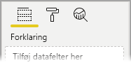
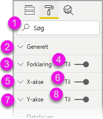
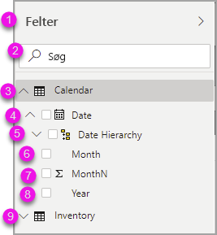
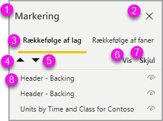

# Oprettelse af rapporter i Power BI ved hjælp af tilgængelighedsværktøjer

Power BI har mange indbyggede egenskaber til skabere af rapporter, der bruger tilgængelighedsværktøjer, som kan hjælpe med processen.

Denne artikel indeholder en beskrivelse af de mange typer af tilgængelighedsværktøjer, der er tilgængelige til skabere af rapporter i Power BI Desktop.

## Navigation på programniveau
Når du navigerer i Power BI Desktop, kan du flytte fokus til hovedområderne i programmet ved at trykke på **Ctrl + F6**. Skift af fokus i hovedområdet i Power BI Desktop sker i følgende rækkefølge:

1. Objekter på lærredet
2. Sidefaner
3. Ruder (hver enkel separat, fra venstre mod højre for dem, der er åbne)
4. Vis navigator
5. Sidefod
6. Logon
7. Gul linje med advarsel/fejl/opdateringer

Almindelige procedurer i Power BI omfatter i de fleste tilfælde brug af **Enter** til at vælge – eller åbne – et område og derefter brug af **Esc** til at afslutte.

## Navigation på båndet

Tryk på **Alt** for at se de små bokse kaldet *Tastetip* over hver kommando, som er tilgængelig i den aktuelle visning på båndet. Derefter kan du trykke på det bogstav, der vises i *Tastetip*, og som svæver over den kommando, du vil bruge. 

På følgende billede er der f.eks. blevet trykket på **Alt**-tasten for at få vist Tastetip, der indeholder bogstaverne for tilgængelige tilgængelighedskommandoer. Hvis du trykker på **M**, åbnes fanen **Udformning** på båndet.

Du kan måske se flere Tastetip, afhængigt af hvilket bogstav du trykker på. Hvis fanen **Start** f.eks. er aktiv, og du trykker på **W**, vises fanen **Vis** sammen med Tastetip for grupperne på denne **Vis**-båndfane. Du kan fortsætte med at trykke på bogstaver, der vises i Tastetip, indtil du trykker på bogstavet for den specifikke kommando, du vil bruge. Tryk på **Esc** for at gå til det forrige sæt Tastetip. Tryk på **Alt** for at annullere den handling, du er i gang med, og skjule Tastetip.

## Navigation i ruden Visualiseringer

Hvis du vil navigere til ruden **Visualiseringer**, skal du først sørge for, at fokus er på ruden, ved at trykke på **Ctrl + F6**, indtil du når den pågældende rude. Når en bruger navigerer gennem ruden Visualiseringer, lander fokus først på overskriften. Fra toppen er tabulatorrækkefølgen, som vist på følgende billede:

1. Overskriften
2. Udvid/skjul-vinklen
3. Ikonet for den første visualisering

Når du kommer til visualiseringerne, kan du bruge piletasterne til at navigere til en bestemt visualisering og trykke på **Enter** for at vælge den. Hvis du bruger en skærmlæser, fortæller den, om du har oprettet et nyt diagram, og hvilken type det er, eller den fortæller dig, at du har ændret et diagram af en bestemt type til en anden diagramtype. 

Efter afsnittet med visualiseringer i ruden skifter fokus til rudepivots, som vist på følgende billede.

Når fokus er på rudepivots, lander du kun på ikonet for den rude, der valgt, når du bruger tabulatortasten. Brug piletasterne til at skifte til andre ruder.

## Feltbrønd

Når fokus er på rudepivots, som beskrevet i forrige afsnit, avancerer du til **Feltbrønden** ved at trykke på tabulatortasten igen. 

I **Feltbrønden** flyttes fokusrækkefølgen til:

* titlen på hver brønd (først)
* efterfulgt af et givet felt i hver brønd (næste)
* knappen på rullelisten for at åbne feltmenuen (derefter)
* derefter knappen til fjernelse (sidst)

På følgende billede kan du se forløbet af denne fokusrækkefølge.

En skærmlæser læser navnet på brønden og dens værktøjstip op. For hvert felt i en brønd læser skærmlæseren navnet på feltet og dets værktøjstip op. Hvis en brønd er tom, skal fokus flyttes til hele den tomme brønd. Skærmlæseren bør læse navnet på brønden og værktøjstippet op, samt at den er tom.

Når feltmenuen er åben, kan du flytte gennem den ved hjælp af **tabulatortasten**, **Shift + tabulatortasten** eller piletasterne **op** / **ned**. En skærmlæser læser navnene på indstillingerne op.

Hvis du vil flytte et felt fra én bucket i feltbrønden til en anden bucket, kan du bruge tastaturet og vælge indstillingen **Flyt til** i menuen i feltbrønden, som vist på følgende billede.

## Ruden Formatering

Fokusrækkefølgen for ruden **Formatering** går fra toppen og derefter nedad i kortrækkefølgen. Fokus flyttes efter kortets navn efterfulgt af **til/fra**-knappen, hvis den findes. Når fokus er på kortets navn, læser en skærmlæser navnet på kortet op, og om kortet er udvidet eller skjult. Du kan trykke på **Enter** for at udvide eller skjule kortet. Tasten **Enter** kan også bruges til at skifte til/fra-knappen mellem **Til** og **Fra**.

Hvis et kort er åbent, flyttes der med **tabulatortasten** gennem kontrolelementerne på kortet, før der fortsættes til næste kort. For kontrolelementerne på et kort læser en skærmlæser titlen, den aktuelle værdi og typen af kontrolelement op.  

## Navigation på listen Felter

Du kan trykke på **tabulatortasten** for at navigere på listen **Felter**. På samme måde som med ruden Formatering flytter fokusrækkefølgen rundt i følgende rækkefølge, hvis tabellerne er skjult:

1. Overskrift på listen **Felter**
2. Søgelinjen
3. Hvert tabelnavn

Hvis du vil udvide alle tabeller i brønden **Felter**, skal du trykke på **Alt + Skift + 9**. Hvis du vil skjule alle tabeller, skal du trykke på **Alt + Skift + 1**. Hvis du vil udvide en enkelt tabel, skal du trykke på **pil til højre**. Hvis du vil skjule en enkelt tabel, skal du trykke på **pil til venstre**. På samme måde som med ruden Formatering indeholder listen Felter de felter, der vises, når tabulatortasten bruges til at navigere, hvis en tabel er udvidet. En skærmlæser læser op, om du har udvidet eller skjult en tabel.

Du kan markere et felt ved at navigere til det ønskede felt og trykke på **Enter**.   En skærmlæser læser det felt, som fokus er på, op, og om feltet er markeret eller ikke markeret.

Brugere, der anvender en mus, trækker og slipper typisk felter til lærredet eller de relevante filterbuckets, de ønsker. Hvis du vil bruge dit tastatur, kan du føje et felt til en filterbucket ved at angive et felts genvejsmenu ved at trykke på **Skift + F10**, bruge piletasterne til at navigere til **Føj til filtre** og derefter trykke på **Enter** på den filtertype, du vil føje feltet til.

## Navigation i ruden Markering
I ruden **Markering** er forløbet af fokus som følger:

1. Overskrift
2. Knappen Afslut
3. Skifter til lag-/tabulatorrækkefølge
4. Knappen Flyt op i lag
5. Knappen Flyt ned i lag
6. Knappen Vis
7. Knappen Skjul
8. Objekter

Du kan flytte gennem fokusrækkefølgen ved hjælp af tabulatortasten og trykke på **Enter** for at vælge det element, du er interesseret i.  

Når du kommer til skifteren til lag-/tabulatorrækkefølge, skal du bruge pil til venstre og pil til højre for at skifte mellem lag- og tabulatorrækkefølgen.

Når du kommer til objekterne i ruden **Markering**, skal du trykke på **F6** for at aktivere ruden **Markering**. Når du har aktiveret ruden **Markering**, kan du bruge pil op/ned til at navigere til de forskellige objekter i ruden **Markering**.
Når du har navigeret til et objekt af interesse, er der nogle forskellige handlinger, du kan udføre:

* Tryk på **Ctrl + Skift + S** for at skjule/vise et objekt
* Tryk på **Ctrl + Skift + F** for at flytte et objekt op i lagrækkefølgen
* Tryk på **Ctrl + Skift + B** for at flytte et objekt ned i lagrækkefølgen
* Tryk på **Ctrl + mellemrum** for at vælge flere objekter

## Dialogbokse i Power BI Desktop

Alle dialogbokse i Power BI Desktop er tilgængelige via tastaturnavigation og fungerer med skærmlæsere.

Dialogbokse i Power BI Desktop omfatter følgende:

* Dialogboksen Hurtigmåling
* Dialogboksen Betinget formatering og datalinjer
* Dialogboksen med stifinder til Spørgsmål og svar
* Dialogboksen Introduktion
* Dialogboksen med menuen Filer og Om
* Advarselslinjen
* Dialogboksen til Gendannelse af fil
* Dialogboksen Frowns

## Understøttelse af stor kontrast

Når du bruger tilstande for stor kontrast i Windows, anvendes disse indstillinger og den valgte farvepalet også i rapporter i Power BI Desktop.

Power BI Desktop registrerer automatisk, hvilket tema med stor kontrast Windows bruger, og anvender indstillingerne i dine rapporter. Farverne med høj kontrast følger også rapporten, når den publiceres på Power BI-tjenesten eller andre steder.

## Næste trin

Samlingen af artikler om tilgængelighed i Power BI er som følger:

* [Oversigt over tilgængelighed i Power BI](desktop-accessibility-overview.md) 
* [Oprettelse af tilgængelige Power BI-rapporter](desktop-accessibility-creating-reports.md) 
* [Brug af rapporter i Power BI med tilgængelighedsværktøjer](desktop-accessibility-consuming-tools.md)
* [Tastaturgenveje i forbindelse med tilgængelighed i Power BI-rapporter](desktop-accessibility-keyboard-shortcuts.md)
* [Tjekliste for tilgængeligheden af rapporten](desktop-accessibility-creating-reports.md#report-accessibility-checklist)

