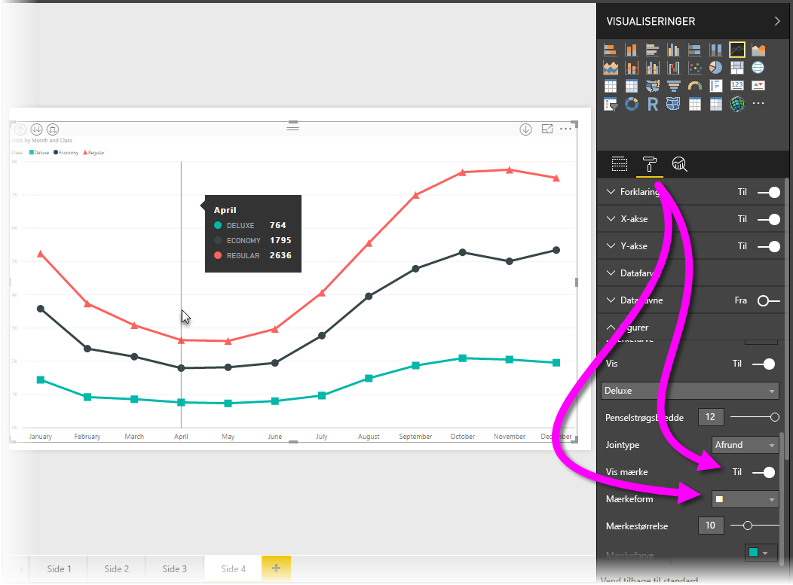
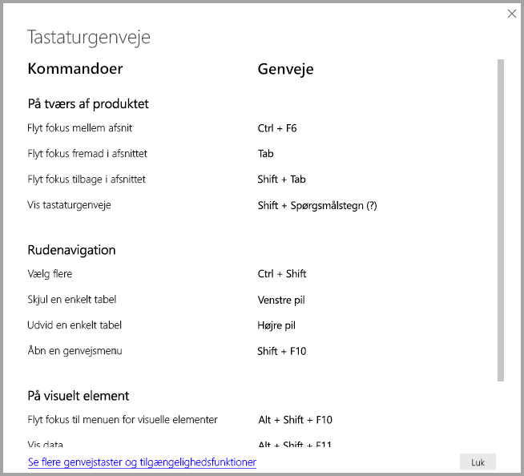
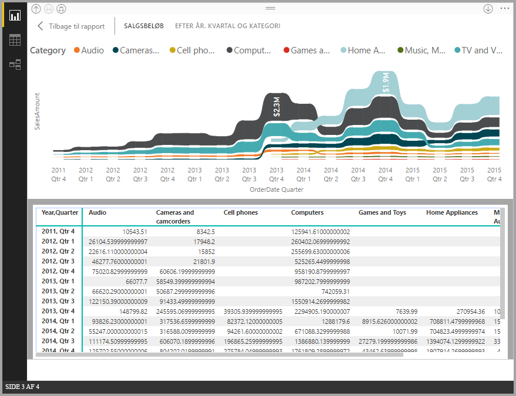
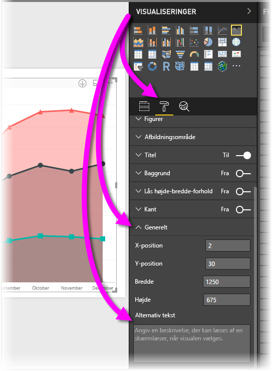

# Tilgængelighed i Power BI Desktop-rapporter
**Power BI Desktop** indeholder funktioner, der gør det nemmere for personer med et handicap at bruge og interagere med **Power BI Desktop**-rapporter. Funktionerne omfatter muligheden for at bruge en rapport ved hjælp tastaturet eller en skærmlæser, bruge tabulatortasten til at sætte fokus på forskellige objekter på en side og bruge markører i visualiseringer.

> [!NOTE]
> Disse tilgængelighedsfunktioner er tilgængelige i versionen af **Power BI Desktop** fra juni 2017 og nyere versioner. Der er planlagt yderligere tilgængelighedsfunktioner for fremtidige versioner.
> 
> 

## Brug en Power BI Desktop-rapport med et tastatur eller en skærmlæser
Fra og med versionen af **Power BI Desktop** fra september 2017 kan du trykke på tasten med spørgsmålstegnet (**?**) for at få vist et vindue, der beskriver de tastaturgenveje for tilgængelighed, som findes i **Power BI Desktop**.

Med den udvidede tilgængelighed kan du bruge en **Power BI Desktop**-rapport med et tastatur eller en skærmlæser med følgende teknikker:

Du kan skifte fokus mellem rapportens sidefaner eller objekter på en given rapportside ved hjælp af **Ctrl + F6**.

* Når der er fokus på en *rapports sidefaner*, skal du bruge *tabulator*- eller *pile*tasten til at flytte fokus fra én rapportside til den næste. Titlen på rapportsiden, og om den er markeret i øjeblikket, læses højt af skærmlæseren. For at indlæse den rapportside, der i øjeblikket er i fokus, skal du bruge *Enter* eller *mellemrumstasten*.
* Når der er fokus på en indlæst *rapportside*, skal du bruge *tabulatortasten* til at skifte fokus til de enkelte objekter på siden, som inkluderer alle tekstfelter, billeder, figurer og diagrammer. Skærmlæseren læser typen af objekt op og giver en beskrivelse af objektet, der er angivet af forfatteren. 

Du kan trykke på **Alt + Skift + F10** for at flytte fokus til en visuel menu.

Du kan trykke på **Alt + Skift + F11** for at få vist en tilgængelighedsversion af vinduet *Se data*.

Disse tilgængelighedstilføjelser er oprettet for at give brugere mulighed for at bruge alle funktioner i **Power BI Desktop**-rapporter ved hjælp af en skærmlæser og tastaturnavigation.

## Tip til oprettelse af tilgængelighedsrapporter
Følgende tip kan hjælpe dig med at oprette **Power BI Desktop**-rapporter med større tilgængelighed.

* For de visuelle elementer for **linje**, **område** og **kombinationsfelt** samt for de visuelle elementer for **punktdiagram** og **boble** skal du slå mærkerne til og bruge en anden *mærkeform* for hver linje.
  
  * Slå *Mærker* til, vælg sektionen **Format** i ruden **Visualiseringer**, udvid sektionen **Former**, og rul derefter ned for at finde **Mærker**, og slå indstillingen *til*.
  * Vælg derefter navnet på de enkelte linjer (eller området, hvis du bruger et **område**diagram) på rullelisten i sektionen **Former**. Under rullelisten kan du derefter justere mange aspekter for det mærke, der bruges til den valgte linje, herunder form, farve og størrelse.
  
  
  
  * Hvis du bruger en anden *mærkeform* for hver linje, kan brugere af rapporter nemmere adskille linjer (eller områder) fra hinanden.
* Som opfølgning til forrige punkt skal du ikke bruge farver til at angive oplysninger. Det er praktisk at bruge former på linjer (mærker som beskrevet i tidligere punkter).
* Vælg et *tema*, der har stor kontrast, og som kan bruges af farveblinde, fra temagalleriet, og importér det ved hjælp af [eksempelfunktionen **Temaer**](desktop-report-themes.md).
* For alle objekter i en rapport skal du angive en *alternativ tekst*. Hvis du gør det, sikrer du, at brugere af din rapport forstår, hvad du forsøger at fortælle med et visuelt element, selvom de ikke kan se det visuelle element, billedet, formen eller tekstfeltet. Du kan angive en *alternativ tekst* for et hvilket som helst objekt i en **Power BI Desktop**-rapport ved at vælge objektet (f.eks. en visual, en figur osv.), gå til ruden **Visualiseringer** og vælge **Format**, udvide **Generelt**, rulle til bunden og udfylde tekstfeltet **Alternativ tekst**.
  
  
* Kontrollér, at der er tilstrækkelig kontrast mellem teksten og eventuelle baggrundsfarver i dine rapporter.
* Brug tekststørrelser og skrifttyper, der er nemme at læse. En lille tekststørrelse eller skrifttyper, der kan være vanskelige at læse, hjælper ikke i forbindelse med tilgængelighed.
* Medtag en titel, akseetiketter og datanavne i alle visuelle elementer.

## Overvejelser og begrænsninger
Der er et par kendte problemer og begrænsninger i forbindelse med tilgængelighedsfunktioner, hvilket er beskrevet på følgende liste:

* JAWS understøttes i rapporter, som kan ses i **Power BI-tjenesten**, herunder alle integrerede rapporter. JAWS understøttes også i **Power BI Desktop**, men du skal åbne skærmlæseren, før du åbner **Power BI Desktop**-filer, for at skærmlæseren kan fungere korrekt.

## Næste trin
* [Brug rapporttemaer i Power BI Desktop (prøveversion)](desktop-report-themes.md)

