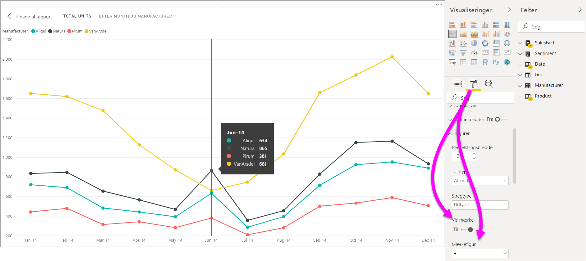
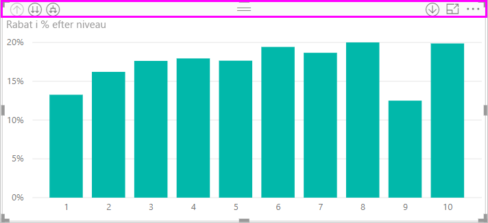
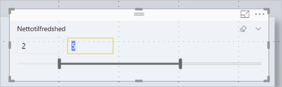
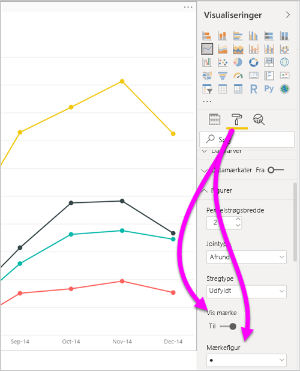
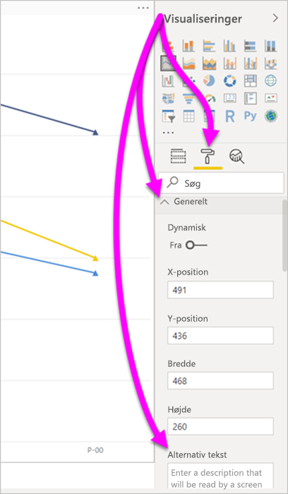
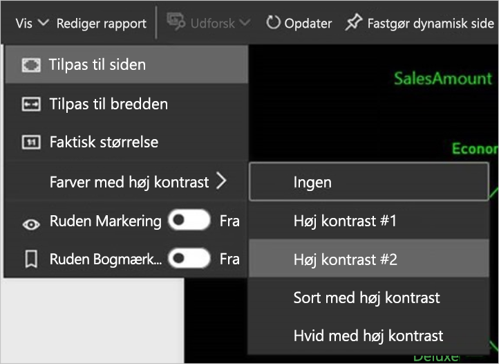

# Tilgængelighed i Power BI Desktop-rapporter
Power BI indeholder funktioner, der gør det nemmere for personer med et handicap at bruge og interagere med Power BI-rapporter. Funktionerne omfatter muligheden for at bruge en rapport ved hjælp tastaturet eller en skærmlæser, bruge tabulatortasten til at sætte fokus på forskellige objekter på en side og bruge markører i visualiseringer.

## Brug en Power BI Desktop-rapport med et tastatur eller en skærmlæser
Fra og med versionen af **Power BI Desktop** fra september 2017 kan du trykke på **Skift + ?** for at få vist et vindue, der beskriver de tastaturgenveje for tilgængelighed, som findes i **Power BI Desktop**.

Med den udvidede tilgængelighed kan du bruge en Power BI-rapport med et tastatur eller en skærmlæser med følgende teknikker:

> [!NOTE]
> Når du får vist en rapport, skal du generelt slå scanningstilstand fra.

Du kan skifte fokus mellem rapportens sidefaner eller objekter på en given rapportside ved hjælp af **Ctrl + F6**.

* Når der er fokus på en **rapports sidefaner**, skal du bruge **tabulator**- eller piletasten til at flytte fokus fra én rapportside til den næste. Titlen på rapportsiden, og om den er markeret i øjeblikket, læses højt af skærmlæseren. For at indlæse den rapportside, der i øjeblikket er i fokus, skal du bruge **Enter** eller mellemrumstasten.
* Når der er fokus på en indlæst **rapportside**, skal du bruge tabulatortasten til at skifte fokus til de enkelte objekter på siden, som inkluderer alle tekstfelter, billeder, figurer og diagrammer. Skærmlæseren læser objekttypen og objektets titel (hvis det findes). Skærmlæseren læser også en beskrivelse af det pågældende objekt, hvis det er angivet i rapportens forfatter. 

Når du navigerer mellem visuals, kan du trykke på **Alt + Skift + F10** for at flytte fokus til den visuelle header. Den visuelle header indeholder forskellige muligheder, herunder sortering, eksport af dataene bag diagrammet og fokustilstand. 

Du kan trykke på **Alt + Skift + F11** for at få vist en tilgængelig version af vinduet **Vis data**. Vinduet gør det muligt at udforske data, der bruges i visualiseringen i en HTML-tabel, ved hjælp af de samme tastaturgenveje, du normalt anvender med din skærmlæser. 

> [!NOTE]
> Funktionen **Vis data** er kun tilgængelig for skærmlæsere ved brug af denne tastaturgenvej. Hvis du åbner **Vis data** via indstillingen i visualiseringens overskrift, vil det ikke være tilgængelig for skærmlæsere. Når du bruger **Vis data**, kan du slå scanningstilstand for at drage fordel af alle de genvejstaster, der angives i skærmlæseren.

Fra og med udgivelsen af **Power BI Desktop** i juli 2018 har udsnit nu tilgængelighedsfunktioner indbygget. Når du vælger et udsnit, kan du bruge **Ctrl + højre piletast** til at justere værdien af udsnittet for at skifte mellem de forskellige kontrolelementer i udsnittet. Hvis du f.eks. trykker på **Ctrl + højre piletast**, er fokus på viskelæderet. Når du derefter trykker på mellemrumstasten, svarer det til at klikke på viskelæderknappen, som sletter alle værdierne i udsnittet. 

Du kan flytte gennem kontrolelementerne i et udsnit ved at trykke på **tabulatortasten**. Hvis du trykker på **tabulatortasten**, når fokus er på viskelæderet, flyttes fokus til rullelisten. Med endnu et tryk på **tabulatortasten** flyttes fokus til den første værdi i udsnittet (hvis der er flere værdier i udsnittet, f.eks. et interval). 

Disse tilgængelighedstilføjelser giver brugere mulighed for at bruge alle funktioner i Power BI-rapporter ved hjælp af en skærmlæser og tastaturnavigation.

## Tip til oprettelse af tilgængelighedsrapporter
Følgende tip kan hjælpe dig med at oprette **Power BI Desktop**-rapporter med større tilgængelighed.

### Generelle tip til tilgængelighedsrapporter

* For de visuelle elementer for **linje**, **område** og **kombinationsfelt** samt for de visuelle elementer for **punktdiagram** og **boble** skal du slå **Vis mærker** til og bruge en anden **mærkeform** for hver linje.
  
  * Hvis du vil slå **Vis mærker** til, skal du vælge afsnittet **Format** i ruden **Visuals** og udvide sektionen **Former**. Rul ned for at finde afkrydsningsfeltet **Vis mærker** til/fra, og slå den **til**.
  * Hvis du vil tilpasse de enkelte linjer, skal du finde knappen **Tilpas serie** og slå den **til**. Vælg derefter navnet på de enkelte linjer (eller området, hvis du bruger et **område**diagram) på rullelisten i sektionen **Former**. Under rullelisten kan du derefter justere mange aspekter for det mærke, der bruges til den valgte linje, herunder form, farve og størrelse.
  
    
  
  * Hvis du bruger en anden **mærkeform** for hver linje, kan brugere af rapporter nemmere adskille linjer (eller områder) fra hinanden.
* Som opfølgning til forrige punkt skal du ikke bruge farver til at angive oplysninger. Når du bruger figurer på linje- og punktdiagrammer, behøver du ikke nøjes med betinget formatering for at få indsigt i tabeller og matrixer. 
* Vælg en bevidst sorteringsrækkefølge for hver visualisering i din rapport. Når brugere af skærmlæsere navigerer mellem de underliggende data i diagrammet, benyttes den samme rækkefølge som i visualiseringen.
* Vælg et tema, der har stor kontrast, og som kan bruges af farveblinde, fra temagalleriet. Importér den ved hjælp af [**prøveversionsfunktionen** Temaer](desktop-report-themes.md).
* For alle objekter i en rapport skal du angive en alternativ tekst. Det sikrer, at brugerne af din rapport forstår, hvad du forsøger at kommunikere med en visual. Det hjælper også, hvis de ikke kan se visualen, billedet, figuren eller tekstboksen. Du kan angive en alternativ tekst for et hvilket som helst objekt i en **Power BI Desktop**-rapport ved at vælge objektet (f.eks. en visual, en figur osv.), gå til ruden **Visualiseringer** og vælge **Format**. Udvid derefter **Generelt**, rul til bunden, og udfyld tekstboksen **Alternativ tekst**.
  
  
  
  Alternativ tekst kan også ændres dynamisk med et udtryk, der f.eks. afspejler filtre, som er anvendt i en visualisering. Du angiver et udtryk på samme måde som en visualiseringstitel. [Betinget formatering af titler på visualiseringer](desktop-conditional-format-visual-titles.md)
  
* Kontrollér, at der er tilstrækkelig kontrast mellem teksten og eventuelle baggrundsfarver i dine rapporter. Der er flere værktøjer (f.eks. [Colour Contrast Analyser](https://developer.paciellogroup.com/resources/contrastanalyser/)), som du kan bruge til at kontrollere farverne i din rapport. 
* Brug tekststørrelser og skrifttyper, der er nemme at læse. En lille tekststørrelse eller skrifttyper, der kan være vanskelige at læse, hjælper ikke i forbindelse med tilgængelighed.
* Inkluder en titel, akseetiketter og datamærkater i alle visualieringer.
* Brug titler, der giver mening, for alle rapportsider.
* Undgå dekorative figurer og billeder i din rapport, hvis det er muligt, da de er inkluderet i tabulatorrækkefølgen af rapporten. Hvis du er nødt til at indsætte dekorative objekter i din rapport, kan du opdatere objektets alternative tekst for at fortælle brugere af skærmlæsere, at objektet kun har et dekorativt formål.

### Arrangering af elementer i Felt-buckets
Fra og med udgivelsen af **Power BI Desktop** fra oktober 2018 kan du navigere i beholderen **Felter** ved hjælp af et tastatur og interagere med skærmlæsere. 

Der er adgang til en genvejsmenu, som kan gøre det nemmere at oprette rapporter med skærmlæsere. Menuen giver mulighed for at flytte felter op eller ned i beholderen i listen **Felter**. Menuen tillader også flytning af feltet til andre beholdere såsom **Forklaring**, **Værdi** eller andre.

## Understøttelse af stor kontrast i rapporter

Når du bruger stor kontrast i Windows, anvendes disse indstillinger og den valgte farvepalet også i rapporter i **Power BI Desktop**. 

**Power BI Desktop** registrerer automatisk, hvilket tema med stor kontrast Windows bruger, og anvender indstillingerne i dine rapporter. Farverne med høj kontrast følger også rapporten, når den publiceres på Power BI-tjenesten eller andre steder.

Power BI-tjenesten forsøger også at registrere de indstillinger for høj kontrast, der er valgt til Windows. Effektiviteten og nøjagtigheden af denne registrering afhænger af den browser, der viser Power BI-tjenesten. Hvis du vil angive temaet manuelt i Power BI-tjenesten, kan du vælge **Vis** > **Farver med høj kontrast** og derefter vælge det tema, du vil bruge i rapporten.

## Overvejelser og begrænsninger
Der er et par kendte problemer og begrænsninger i forbindelse med tilgængelighedsfunktioner. Beskrivelser af disse problemer og begrænsninger fremgår af følgende liste:

* Når du bruger skærmlæsere med **Power BI Desktop**, får du den bedste oplevelse, hvis du åbner din skærmlæser, før du åbner nogen filer i **Power BI Desktop**.
* Hvis du bruger Oplæser, vil der være nogle begrænsninger, når du navigerer omkring **Vis data** som en HTML-tabel.

## Tastaturgenveje
Tastaturgenveje er nyttige til at navigere i Power BI-rapporter ved hjælp af tastaturet. I følgende tabel beskrives de genveje, som er tilgængelige i en Power BI-rapport. Disse tastaturgenveje fungerer ikke blot i **Power BI Desktop**, men du kan også bruge dem i følgende:

* Dialogboksen **med stifinder til Spørgsmål og svar**
* Dialogboksen **Introduktion**
* Menuen **Filer** og dialogboksen **Om**
* **Advarselslinjen**
* Dialogboksen **til Gendannelse af fil**
* Dialogboksen **Frowns**

Idet vi løbende forbedrer tilgængeligheden, omfatter ovenstående liste også understøttelse af skærmlæsere og indstillinger med stor kontrast.

### Ofte anvendte genveje
| For at udføre denne handling           | Tryk på                |
| :------------------- | :------------------- |
| Flyt fokus mellem afsnit  | **Ctrl + F6** |
| Flyt fokus fremad i afsnittet | **Tab**         |
| Flyt fokus tilbage i afsnittet | **Skift + Tab** |
| Markér eller fjern markeringen af et objekt | **Enter** eller **Mellemrum** |
| Markér flere objekter | **Ctrl + mellemrum** |

### På visuelt element
| For at udføre denne handling           | Tryk på                |
| :------------------- | :------------------- |
| Flyt fokus til menuen for visuelle elementer | **Alt + Skift + F10** |
| Vis data | **Alt + Skift + F11**  |
| Angiv en visualisering | **Ctrl + højre piletast** |
| Angiv et lag | **Enter** |
| Afslut et lag eller en visualisering | **Esc** |
| Markér eller fjern markeringen af et datapunkt | **Enter** eller **Mellemrum** |
| Vælg flere | **Ctrl + Enter** eller **Ctrl + mellemrum** |
| Højreklik | <ul><li>Windows-tastatur: **Windows-genvejstasten + F10**. Windows-genvejstasten er mellem Alt-tasten til venstre og pil til venstre</li><li>Andet tastatur: **Skift + F10**</li></ul> |
| Ryd det markerede | **Ctrl + Skift + C** |

### Navigation i tabel og matrix
| For at udføre denne handling          | Tryk på                |
| :------------------- | :------------------- |
| Flyt fokus én celle op/ned (på tværs af alle celler i alle områder)  | **Pil op** / **Pil ned** |
| Flyt fokus én celle til venstre/højre (på tværs af alle celler i alle områder)  | **Genvejstast** / **Højre piletast** |

### Rudenavigation
| For at udføre denne handling           | Tryk på                |
| :------------------- | :------------------- |
| Vælg flere | **Ctrl + mellemrum** |
| Skjul en enkelt tabel | **Venstre piletast** |
| Udvid en enkelt tabel | **Højre piletast** |
| Skjul alle tabeller | **Alt + Skift + 1** |
| Udvid alle tabeller | **Alt + Skift + 9** |
| Åbn en genvejsmenu | <ul><li>Windows-tastatur: **Windows-genvejstasten + F10**.  Windows-genvejstasten er mellem Alt-tasten til venstre og pil til venstre</li><li>Andet tastatur: **Skift + F10**</li></ul> |

### Udsnit
| For at udføre denne handling         | Tryk på                |
| :------------------- | :------------------- |
| Interager med et udsnitsværktøj | **Ctrl + højre piletast** |

### Ruden Markering
| For at udføre denne handling           | Tryk på                |
| :------------------- | :------------------- |
| Aktivér ruden Markering | **F6** |
| Flyt et objekt op i lagdelingen | **Ctrl + Skift + F** |
| Flyt et objekt ned i lagdelingen | **Ctrl + Skift + B** |
| Skjul/Vis (slå til og fra) et objekt | **Ctrl + Skift + S** |

### DAX-editor
| For at udføre denne handling          | Tryk på                |
| :------------------- | :------------------- |
| Flyt linje op/ned | **Alt + Pil op** / **Pil ned** |
| Kopiér linjen op/ned | **Skift + Alt + Pil op** / **Pil ned** |
| Indsæt linje nedenfor | **Ctrl + Enter** |
| Indsæt linje ovenfor | **Ctrl + Skift + Enter** |
| Gå til matchende parentes | **Ctrl + Skift +** \ |
| Indryk streg/udvid linje til margenen | **Ctrl + ]** / **[** |
| Indsæt markøren | **Alt + klik** |
| Vælg den aktuelle linje | **Ctrl + I** |
| Vælg alle forekomster af det aktuelle valg | **Ctrl + Skift + L** |
| Vælg alle forekomster af det aktuelle ord | **Ctrl + F2** |

### Angiv data
| For at udføre denne handling           | Tryk på                |
| :------------------- | :------------------- |
| Afslut redigerbart gitter | **Ctrl + Tab** |

## Næste trin
* [Brug rapporttemaer i Power BI Desktop (prøveversion)](desktop-report-themes.md)

