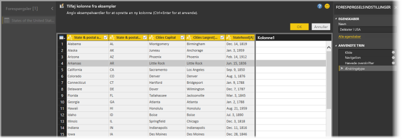
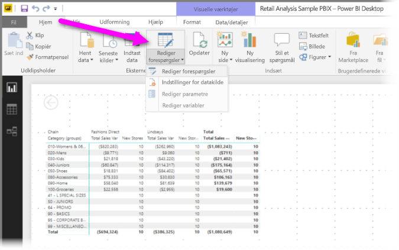
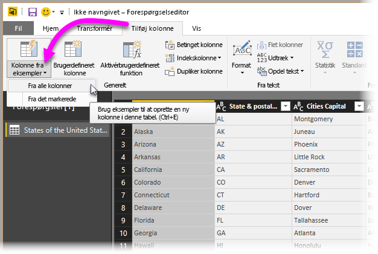
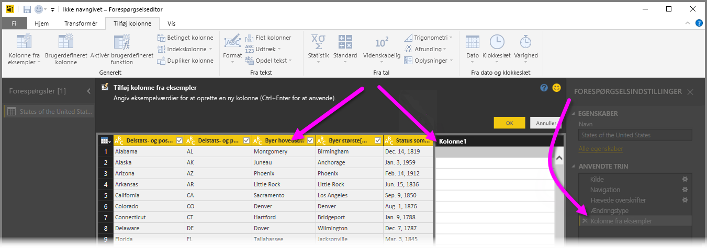
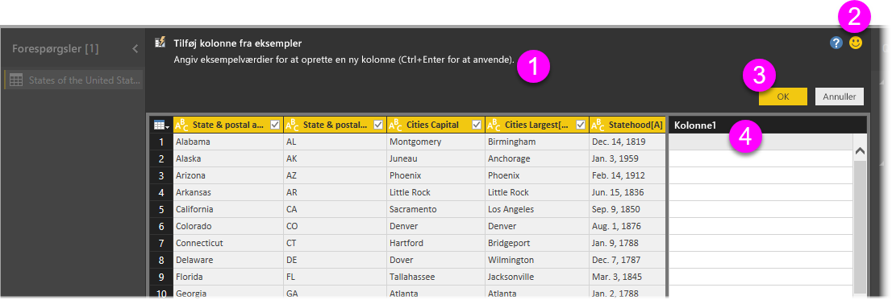
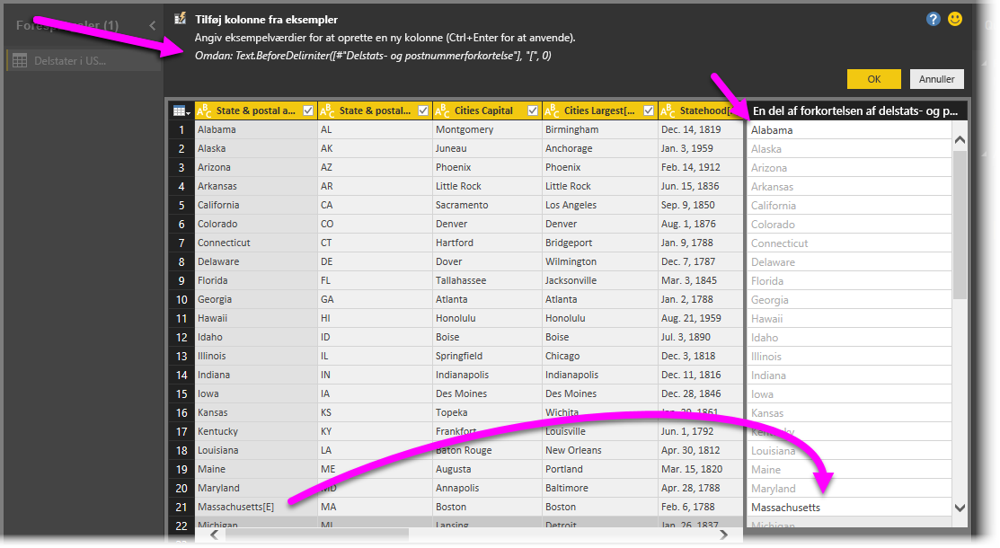

# Tilføj en kolonne ud fra et eksempel i Power BI Desktop
Fra og med udgivelsen af **Power BI Desktop** i april 2017 kan du føje nye kolonner af data til modellen ved hjælp af **Forespørgselseditor** ved blot at angive en eller flere eksempelværdier for den nye kolonne. Du kan oprette et nyt kolonneeksempel ud fra en aktuel markering eller angive input baseret på alle (eller de markerede) kolonner i en bestemt tabel.

Med denne metode kan du hurtigt og nemt oprette nye kolonner, og den er specielt nyttig i følgende situationer:

* Du kender det dataresultat, du gerne vil se i din nye kolonne, men du er i tvivl om, hvilken transformation (eller samling af transformationer) der vil give dette resultat.
* Du har allerede, hvilke transformationer du har brug for, men du er i tvivl om, hvor du skal klikke, eller hvad du skal vælge i brugergrænsefladen for at aktivere dem.
* Du ved alt om de transformationer, du skal bruge ved hjælp af udtrykket *Brugerdefineret kolonne* i **M**, men en (eller flere) af disse udtryk er ikke tilgængelige, så du kan klikke på dem eller tilføje dem i brugergrænsefladen.

Ved hjælp af funktionen **add column from example** (tilføj kolonne fra eksempel) bliver det nemt og ligetil. I de følgende afsnit skal vi se, hvor nemt det egentligt er.

## Brug Forespørgselseditor til at tilføje en ny kolonne fra eksempler
Hvis du vil oprette en ny kolonne fra et eksempel, skal du starte **Forespørgselseditor**. Det kan du også gøre ved at vælge **Rediger forespørgsler** på båndet **Hjem** i **Power BI Desktop**.

Hvis du vil hente data fra en webside, kan du gå til fanen **Hjem**, klikke på **Hent data > Web** og derefter indsætte URL-adressen i den dialogboks, der vises. I denne artikel bruger vi data fra en Wikipedia-artikel. Du kan klikke på linket nedenfor for at hente dataene selv og følge med:

* [**Liste over stater og områder i USA**](https://wikipedia.org/wiki/List_of_states_and_territories_of_the_United_States)

Når **Forespørgselseditor** er startet, og du har indlæst data, kan du komme i gang med at tilføje en kolonne fra eksempler. Når du vil tilføje en ny kolonne, skal du i **Forespørgselseditor** vælge fanen **Tilføj kolonne** på båndet og vælge **Kolonne fra eksempler**. Hvis du vælger rullelisten, kan du enten vælge **From All Columns** (Fra alle kolonner), som er standard, hvis du blot vælger knappen i stedet for rullelisten, eller du kan vælge **From Selection** (Fra markering). I denne artikel gennemgår vi valg af **From All Columns** (Fra alle kolonner).

## Ruden Tilføj kolonne fra eksempler
Når du laver en markering for at tilføje en ny kolonne fra eksempler, vises en ny rude, der viser kolonnerne i den aktuelle tabel (du skal muligvis rulle for at kunne se dem alle). Den nye **Kolonne1** vises også til højre. Det er den kolonne, der oprettes i **Power BI Desktop** baseret på dine eksempler. Under overskriften til den nye **Kolonne1** er der tomme celler, hvor du kan skrive dine eksempler. De bruges i Power BI til at oprette regler og transformationer, der svarer til dit eksempel.

Bemærk, at dette er et **Anvendt trin** i ruden **Forespørgselsindstillinger**. Som det altid er tilfældet, vil **Forespørgselseditor** registrere dine transformationstrin og anvende dem til forespørgslen i rækkefølge.

Denne rude hedder **Add Columns From Examples** (Tilføj kolonner fra eksempler) og består af fire primære områder:

1. **Kommandolinjen**, som indeholder en kort beskrivelse af funktionen eller transformationen.
2. Indstillingen **Send feedback**, der hjælper med at forbedre denne funktion i Power BI.
3. Knapperne **OK** og **Annuller**, som du kan bruge til at bekræfte dine transformationer og tilføje kolonnen eller annullere.
4. Det nye kolonneområde, hvor du kan skrive dine eksempelværdier i en af rækkerne (for at sende dit eksempel til Power BI), der vedrører andre kolonner i den pågældende række.

Mens du skriver dit eksempel i den nye kolonne, får du i Power BI vist et eksempel på, hvordan den kolonne, som er ved at blive oprettet, vil se ud baseret på de transformationer, der registreres. Hvis du for eksempel skriver *Alabama* i den første række, svarer det til værdien *Alabama* i den første kolonne i tabellen. Så snart du trykker på *Enter*, udfylder Power BI kolonnen med udgangspunkt i denne værdi.

Men prøv så at gå til den række, der indeholder *Massachusetts [A]* , og slette den sidste del *[E]* (fordi du ikke har brug for den længere). Power BI registrerer ændringen og bruger eksemplet til at oprette en transformation. Læg mærke til forklaringen til transformationen i ruden foroven i midten.

Mens du fortsætter med at angive eksempler, føjer **Forespørgselseditor** til transformationerne. Når du er tilfreds, kan du vælge **OK** for at bekræfte dine ændringer.

## Se Tilføj kolonne fra eksempler i brug
Vil du se, hvordan dette fungerer? Følgende video viser denne funktion i brug med anvendelse af den datakilde, der blev angivet tidligere i eksemplet. Prøv at se det, og følg selv med!

<iframe width="560" height="315" src="https://www.youtube.com/embed/-ykbVW9wQfw" frameborder="0" allowfullscreen></iframe>

## Overvejelser og begrænsninger
Der er mange transformationer, der er tilgængelige, når du bruger **Tilføj kolonne fra eksempler**, men ikke alle transformationer er medtaget. På følgende liste vises alle understøttede transformationer.

* **Reference**
  
  * Reference til en bestemt kolonne (herunder transformationer i form af trim, rydning og store/små bogstaver)

* **Transformationer**
  
  * Kombiner (understøtter kombination af konstantstrenge og hele kolonneværdier)
  * Erstat
  * Længde
  * Udtræk   
    * Første tegn
    * Sidste tegn
    * Område
    * Tekst før afgrænser
    * Tekst efter afgrænser
    * Tekst mellem afgrænsere
    * Længde

* Følgende understøttede **teksttransformationer** er tilgængelige fra og med udgivelsen af **Power BI Desktop** i november 2017:
    
  * Fjern tegn
  * Behold tegn

> [!NOTE]
> Alle transformationer af *tekst* tager højde for et muligt behov for at anvende transformation til kolonneværdien i form af trim, rydning eller store/små bogstaver.
> 
> 

* **Datotransformationer**
  
  * Dag
  * Dag i uge
  * Navn på dag i uge
  * Dag i år
  * Måned
  * Navn på måned
  * Kvartal i år
  * Uge i måned
  * Uge i år
  * År
  * Alder
  * Årets start
  * Årets slutning
  * Månedens start
  * Månedens slutning
  * Kvartalets start
  * Dage i måned
  * Kvartalets slutning
  * Ugens start
  * Ugens slutning
  * Dag i måned
  * Dagens start
  * Dagens slutning

* **Tidstransformationer**
  
  * Time
  * Minut
  * Sekund  
  * Til lokal tid

> [!NOTE]
> I alle *dato*- og *tid*-transformationer tages der højde for et muligt behov for at konvertere kolonneværdien til *Dato* eller *Klokkeslæt* eller *DateTime*.
> 
> 

* **Taltransformationer** 

  * Absolut værdi
  * Arcus cosinus
  * Arcus sinus
  * Arcus tangens
  * Konverter til et tal
  * Cosinus
  * Kube
  * Division
  * Eksponent
  * Fakultet
  * Divider (heltal)
  * Er lige
  * Er ulige
  * Ln
  * Logaritme med grundtallet 10
  * Modulus
  * Multiplicer
  * Rund ned
  * Rund op
  * Fortegn
  * Sin.
  * Kvadratrod
  * Kvadrat
  * Subtraher
  * Sum
  * Tangent

* Følgende understøttede **taltransformation** er tilgængelig fra og med udgivelsen af **Power BI Desktop** i november 2017:

  * Inddeling/intervaller

* **Generelt**
  
  * Betinget kolonne