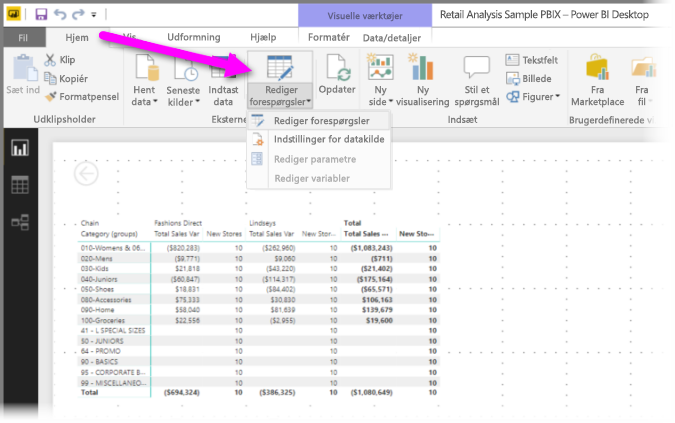
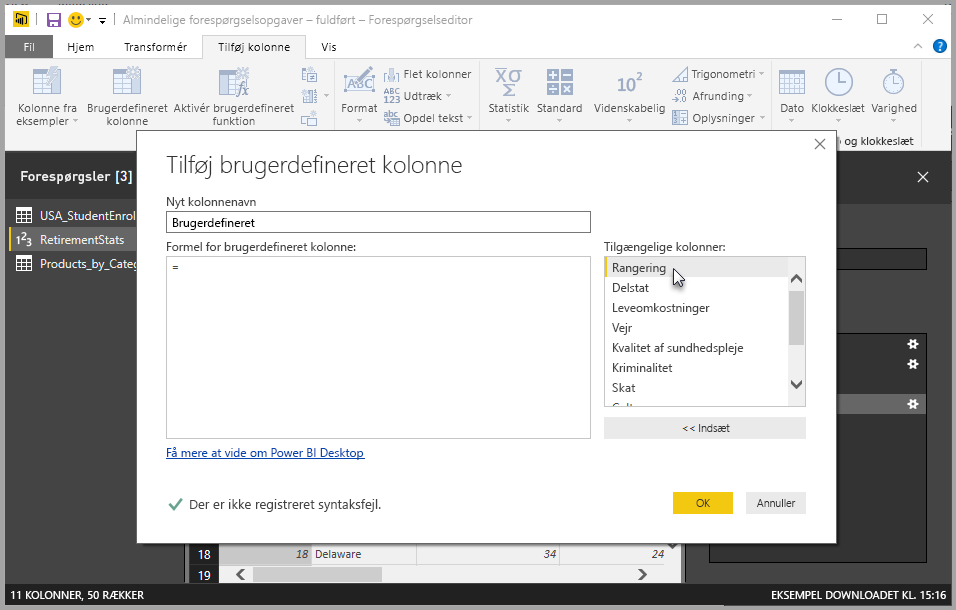
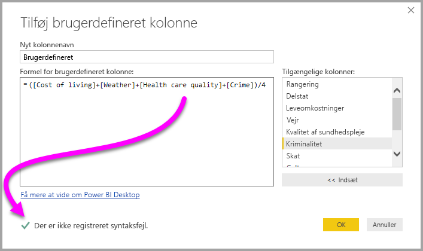

# Tilføj en brugerdefineret kolonne i Power BI Desktop
Du kan nemt føje en ny brugerdefineret kolonne med data til din model ved hjælp af **forespørgselseditoren** i **Power BI Desktop**. Du kan oprette og omdøbe din brugerdefinerede kolonne ved hjælp af knapper til oprettelse af [M-formler](https://msdn.microsoft.com/library/mt270235.aspx), der definerer din brugerdefinerede kolonne. M-formlen har et [indholdssæt med omfattende funktionsreference](https://msdn.microsoft.com/library/mt779182.aspx). 

Du kan også oprette en brugerdefineret kolonne som et andet **anvendt trin** i forbindelse med den forespørgsel, du opretter i **forespørgselseditoren**, hvilken betyder, at den kan ændres, flyttes før eller senere eller redigeres når som helt.

## Brug forespørgselseditoren til at tilføje en ny brugerdefineret kolonne
Hvis du vil oprette en ny brugerdefineret forespørgsel, skal du starte **forespørgselseditoren**. Det kan du også gøre ved at vælge **Rediger forespørgsler** på båndet **Hjem** i **Power BI Desktop**.

Når **forespørgselseditoren** er startet, og der er indlæst nogle data, kan du tilføje en brugerdefineret kolonne ved at vælge fanen **Tilføj kolonne** på båndet og derefter vælge **Brugerdefineret kolonne**.

Vinduet **Tilføj brugerdefineret kolonne** vises. Vinduet beskrives i det følgende afsnit.

## Vinduet Tilføj brugerdefineret kolonne
I vinduet **Tilføj brugerdefineret kolonne** kan du se en liste over tilgængelige felter i ruden til højre, navnet på din brugerdefinerede kolonne øverst (du kan omdøbe den ved ganske enkelt at skrive et nyt navn i dette tekstfelt) og den [**M**-formel](https://msdn.microsoft.com/library/mt779182.aspx), du opretter (eller skriver), afhængigt af hvilke felter du indsætter fra højre, hvilke operatorer du tilføjer, og hvordan du ellers bygger den formel, som din nye brugerdefinerede kolonne defineres ud fra. 

## Opret formler til din brugerdefinerede kolonne
Du kan vælge et felt på listen **Tilgængelige kolonner:** til højre og vælge **<< Indsæt** for at føje dem til formlen for den brugerdefinerede kolonne. Du kan også bare dobbeltklikke på en kolonne på listen for at tilføje den.

Efterhånden som du skriver formlen og bygger din kolonne, kan du nederst i vinduet se en indikator, der fortæller dig i realtid (mens du skriver), om der er registreret syntaksfejl. Hvis alt er, som det skal være, kan du se et grøn markering.

Hvis der er fejl i syntaksen, vises der i stedet et gult advarselsikon sammen med den registrerede fejl og et link, som placerer markøren (i formlen) der, hvor fejlen er registreret.

Når du vælger **OK**, føjes din brugerdefinerede kolonne til modellen, og trinnet **Tilføjet brugerdefineret** føjes til **Anvendte trin** for din forespørgsel.

Hvis du dobbeltklikker på trinnet **Tilføjet brugerdefineret** i ruden **Anvendte trin**, åbnes vinduet **Tilføj brugerdefineret kolonne** igen, og den brugerdefinerede kolonneformel, du allerede har oprettet, er indlæst, så du evt. kan redigere den.

## Brug de brugerdefinerede kolonner for den avancerede editor
Du kan også oprette en brugerdefineret kolonne (og for den sags skyld også redigere alle trin i din forespørgsel) ved hjælp af den **avancerede editor**. I **forespørgselseditoren** skal du vælge fanen **Vis** og derefter vælge **Avanceret editor** for at vise den **avancerede editor**.

Den **avancerede editor** giver dig fuld kontrol over din forespørgsel.

## Næste trin
Du kan også oprette en brugerdefineret kolonne på andre måder, f.eks. ved at oprette en kolonne, der er baseret på eksempler, du angiver i **forespørgselseditoren**. I følgende artikel kan du få flere oplysninger om, hvordan du opretter brugerdefinerede kolonner ud fra eksempler:

* [Tilføj en kolonne ud fra et eksempel i Power BI Desktop](desktop-add-column-from-example.md)
* [Introduktion til M-formelsprog](https://msdn.microsoft.com/library/mt270235.aspx)
* [M-funktionsreference](https://msdn.microsoft.com/library/mt779182.aspx)  

