# Sammenlægninger i Power BI Desktop (prøveversion)

Brug af **sammenlægninger** i Power BI muliggør interaktiv analyse af big data på måder, der ikke tidligere var mulig. **Sammenlægninger** kan drastisk reducere omkostningerne til at låse store datasæt op i forbindelse med beslutningstagning.

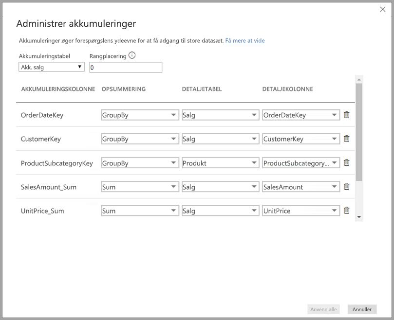

Følgende liste indeholder fordele ved brug af **sammenlægninger**:

* **Forespørgselsydeevne over big data** – når brugere interagerer med visualiseringer i Power BI-rapporter, sendes der DAX-forespørgsler til datasættet. Sæt forespørgselshastighederne op ved at cachelagre data på det aggregerede niveau med en brøkdel af de ressourcer, der kræves på detaljeringsniveauet. Få adgang til big data på en måde, der ellers ville være umulig.
* **Optimering af dataopdatering** – reducer cachestørrelser og antallet af opdateringer ved at cachelagre data på det aggregerede niveau. Forkort den tid, det tager at gøre data tilgængelige for brugere.
* **Opnå balancerede arkitekturer** – tillad Power BI-cachen i hukommelsen til at håndtere aggregerede forespørgsler effektivt. Begræns mængden af forespørgsler, der sendes til datakilden i DirectQuery-tilstand, for at overholde grænserne for samtidighed. De forespørgsler, der kommer igennem, er ofte ufiltrerede forespørgsler på transaktionsniveau, som normalt håndteres godt af data warehouses og big data-systemer.

### Lagring på tabelniveau
Lagring på tabelniveau bruges normalt sammen med sammenlægningsfunktionen. Du kan finde flere oplysninger i artiklen om [lagringstilstand i Power BI Desktop](desktop-storage-mode.md).

### Datakildetyper
Sammenlægninger bruges sammen med datakilder, der repræsenterer dimensionelle modeller, f.eks. data warehouses, datacentre og Hadoop-baserede big data-kilder. Denne artikel beskriver de typiske modelleringsforskelle i Power BI for hver type datakilde.

Alle Power BI Import- og DirectQuery-kilder (ikke-flerdimensionelle) fungerer sammen med sammenlægninger.

## Aktivering af prøveversionsfunktionen for sammenlægninger

Funktionen **sammenlægninger** findes i en prøveversion og skal aktiveres i **Power BI Desktop**. Du kan aktivere **sammenlægninger** ved at vælge **Fil > Indstillinger > Indstillinger > Funktioner til eksempelvisning** og derefter vælge afkrydsningsfelterne **Sammensatte modeller** og **Administrer sammenlægninger**. 

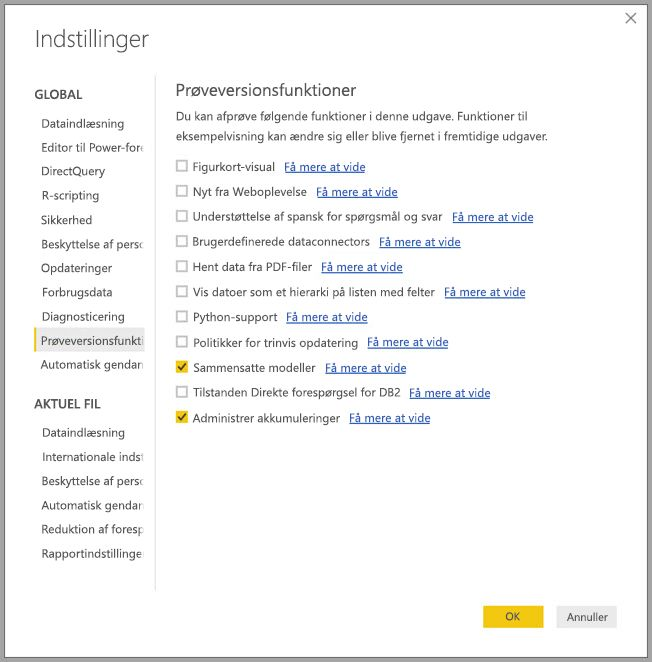

Du skal genstarte **Power BI Desktop**, før funktionen kan bruges.

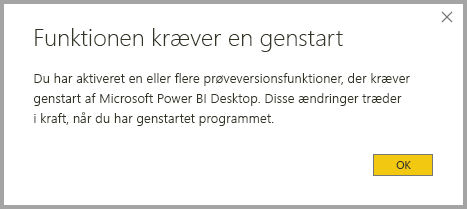

## Sammenlægninger baseret på relationer

**Sammenlægninger** baseret på relationer bruges typisk med dimensionelle modeller. Power BI-datasæt, som stemmer fra data warehouses og datacentre, ligner star/snowflake-skemaer med relationer mellem dimensionstabeller og faktatabeller.

Se den følgende model, som er hentet fra en enkelt datakilde. Lad os sige, at alle tabellerne bruger DirectQuery til at starte med. Faktatabellen **Sales** indeholder milliarder af rækker. Det ville kræve betydelig hukommelse og administration at indstille lagertilstanden i **Sales** til **Import** for cachelagring.

I stedet opretter vi tabellen **Sales Agg** som en sammenlægningstabel. Den har højere kornethed end **Sales** og indeholder derfor langt færre rækker. Antallet af rækker skal svare til summen af **SalesAmount** grupperet efter **CustomerKey**, **DateKey** og **ProductSubcategoryKey**. I stedet for milliarder kan der være millioner af rækker, hvilket er meget nemmere at administrere.

Lad os antage, at følgende dimensionstabeller er de oftest anvendte til forespørgslerne med høj forretningsværdi. De er de tabeller, der kan filtrere **Sales Agg** ved hjælp af *en-til-mange*-relationer (eller *mange-til-en*).

* Geografi
* Kunde
* Dato
* Produktunderkategori
* Produktkategori

Denne model er vist på det følgende billede.

> [!NOTE]
> Tabellen **Sales Agg** er en almindelig tabel, så den er fleksibel nok til at kunne indlæses på flere forskellige måder. Eksempelvis kan sammenlægning udføres i kildedatabasen ved hjælp af ETL/ELT-processer eller ved hjælp af [M-udtrykket](https://msdn.microsoft.com/query-bi/m/power-query-m-reference) for tabellen. Den kan bruge lagringstilstanden Import med eller uden [trinvis opdatering i Power BI Premium](service-premium-incremental-refresh.md), eller det kan være DirectQuery og optimeret til hurtige forespørgsler ved hjælp af [kolonnelagerindekser](https://docs.microsoft.com/sql/relational-databases/indexes/columnstore-indexes-overview). Denne fleksibilitet muliggør balancerede arkitekturer, der fordeler mængden af forespørgsler for at undgå flaskehalse.

### Lagertilstand 
Lad os fortsætte med det eksempel, vi bruger. Vi angiver lagringstilstanden for **Sales Agg** til **Import** for at fremskynde forespørgsler.

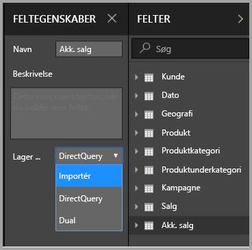

Når vi gør det, vises følgende dialogboks, som viser, at de relaterede dimensionstabeller kan angives til lagringstilstanden **Dual**. 

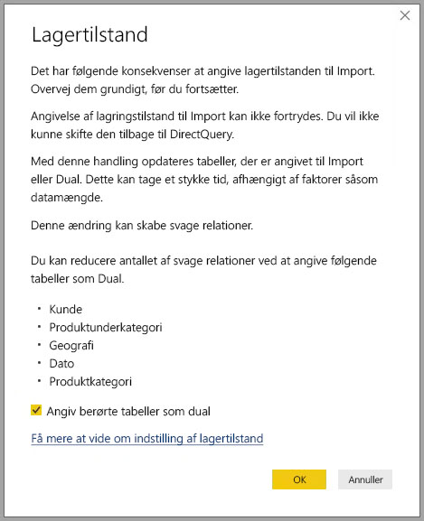

Ved af indstille dem til **Dual** er det muligt for de relaterede dimensionstabeller at fungere som enten Import eller DirectQuery, afhængigt af underforespørgslen.

* Forespørgsler, der samler målepunkter fra tabellen **Sales Agg**, hvilket er Import, og grupperer efter attribut/attributter fra de relaterede Dual-tabeller, kan returneres fra cachen i hukommelsen.
* Forespørgsler, der samler målepunkter i tabellen **Sales**, hvilket er DirectQuery, og grupperer efter attribut/attributter fra de relaterede Dual-tabeller, kan returneres fra cachen i hukommelsen. Forespørgselslogikken, herunder gruppér efter handling, overføres til kildedatabasen.

Læs mere om lagringstilstanden **Dual** i artiklen om [lagringstilstand](desktop-storage-mode.md).

### Stærke versus svage relationer
Sammenlægningsforekomster baseret på relationer kræver stærke relationer.

Stærke relationer omfatter følgende kombinationer, hvor begge tabeller er fra en *enkelt kilde*.

| Tabel på *mange-siden | Tabel på *én*-siden |
| ------------- |----------------------| 
| Dual          | Dual                 | 
| Importér        | Import eller Dual       | 
| DirectQuery   | DirectQuery eller Dual  | 

Det eneste tilfælde, hvor en relation *på tværs af kilder* anses for at være stærk, er, hvis begge tabeller er angivet til Import. Mange til mange-relationer anses altid for at være svage.

Se afsnittet herunder om sammenlægninger baseret på kolonner af typen Gruppér efter for at få mere at vide om sammenlægningsforekomster *på tværs af kilder*, der ikke er afhængige af relationer.

### Sammenlægningstabellen er skjult
Tabellen **Sales Agg** er skjult. Sammenlægningstabeller bør altid skjules for brugerne af datasættet. Brugere og forespørgsler refererer til tabellen med detaljer, ikke sammenlægningstabellen. De behøver ikke vide, at sammenlægningstabellen eksisterer.

### Administrer dialogboksen sammenlægninger
Lad os definere sammenlægningerne. Vælg genvejsmenuen **Administrer sammenlægninger** for tabellen **Sales Agg** ved at højreklikke på tabellen.

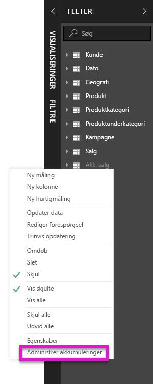

Dialogboksen **Administrer sammenlægninger** vises. Der vises en række for hver kolonne i tabellen **Sales Agg**, hvor vi kan specificere funktionsmåden sammenlægning. Forespørgsler sendt til Power BI-datasættet, der refererer til tabellen **Sales**, omdirigeres internt til tabellen **Sales Agg**. Brugere af datasættet behøver ikke vide, at tabellen **Sales Agg** eksisterer.

I følgende tabel vises sammenlægningerne for tabellen **Sales Agg**.

#### Opsummeringsfunktion

Følgende værdier kan vælges i rullelisten Opsummering.
* Antal
* GroupBy
* Maks.
* Min.
* Sum
* Optæl tabelrækker

#### Valideringer

Følgende bemærkelsesværdige valideringer gennemtvinges af dialogboksen:

* Den valgte detaljekolonne skal have samme datatype som sammenlægningskolonnen med undtagelse af opsummeringsfunktionerne Optæl og Optæl tabelrækker. Optæl og Optæl tabelrækker tilbydes kun til kolonner til sammenlægning af heltal og kræver ikke en tilsvarende datatype.
* Sammenkædede sammenlægninger, der dækker tre eller flere tabeller, er ikke tilladt. Det er f.eks. ikke muligt at konfigurere sammenlægninger på **Tabel A**, som refererer til **Tabel B**, der har sammenlægninger, som refererer til **Tabel C**.
* Duplikerede sammenlægninger, hvor to poster bruger samme opsummeringsfunktion og henviser til den samme detaljetabel/-kolonne, er ikke tilladt.

I denne offentlige prøveversion til **sammenlægninger** gennemtvinges følgende valideringer også. Vi har til hensigt at fjerne disse valideringer, når de er frigivet og offentligt tilgængelige.

* Sammenlægninger kan ikke bruges med sikkerhed på rækkeniveau (RLS). *Begrænsning af offentlig prøveversion.*
* Detaljetabellen skal være DirectQuery, ikke Import. *Begrænsning af offentlig prøveversion.*

De fleste sådanne valideringer gennemtvinges ved at deaktivere værdier i rullelisten og vise forklarende tekst i værktøjstippet som vist på følgende billede.

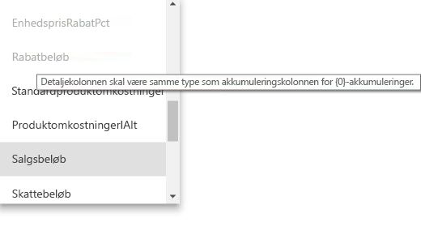

### Kolonnevis gruppering

I dette eksempel er de tre GroupBy-poster valgfrie. De påvirker ikke sammenlægningsadfærden (undtagen eksempelforespørgslen DISTINCTCOUNT, som vises på det følgende billede). De medfølger primært af hensyn til læsbarheden. Uden disse GroupBy-poster ville sammenlægninger stadig få forekomster på baggrund af relationerne. Dette er forskellig funktionalitet fra brug af sammenlægninger uden relationer, som er omfattet af eksemplet med big data, der følger senere i denne artikel.

### Registrering af, om sammenlægninger giver forekomster eller ej ved forespørgsler

Få mere at vide om, hvordan du registrerer, om der returneres forespørgsler fra cachelageret i hukommelsen (lagringsprogrammet) eller DirectQuery (sendt til datakilden) ved hjælp af SQL Profiler, i artiklen om [lagringstilstand](desktop-storage-mode.md). Denne proces kan også bruges til at registrere, om sammenlægninger giver forekomster.

Derudover forekommer følgende udvidede hændelse i SQL Profiler.

    Query Processing\Aggregate Table Rewrite Query

Det følgende JSON-kodestykke viser et eksempel på outputtet fra hændelsen, når der anvendes en sammenlægning.

* **matchingResult** viser, at der blev brugt en sammenlægning til underforespørgslen.
* **dataRequest** viser den/de gruppér efter-kolonner og den/de aggregerede kolonner, der anvendes af underforespørgslen.
* **mapping** viser kolonnerne i den tilknyttede sammenlægningstabel.

### Eksempler på forespørgsler
Følgende forespørgsel giver forekomster ved sammenlægningen, fordi kolonner i tabellen *Date* har den granularitet, der kan give forekomster. Sammenlægningen **Sum** til **SalesAmount** vil blive brugt.

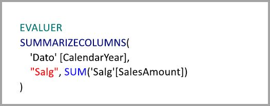

Følgende forespørgsel giver ikke forekomster ved sammenlægningen. På trods af at den anmoder om summen af **SalesAmount**, foretager den en handling af typen Gruppér efter på en kolonne i tabellen **Product**, som ikke har en kornethed, der kan give forekomster ved sammenlægningen. Hvis du lægger mærke til relationerne i modellen, kan et produkts underkategori have flere rækker af typen **Product**, og forespørgslen vil ikke kunne bestemme, hvilket produkt der skal sammenlægges til. I dette tilfælde vender forespørgslen tilbage til DirectQuery og sender en SQL-forespørgsel til datakilden.

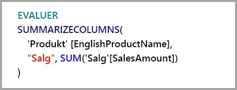

Sammenlægninger er ikke kun til simple beregninger, der giver en ukompliceret sum. De kan også være en fordel for komplekse beregninger. En kompleks beregning opdeles i underforespørgsler for hver SUM, MIN, MAX og COUNT, og hver underforespørgsel evalueres for at bestemme, om sammenlægningen kan give forekomster. Denne logik gælder ikke i alle tilfælde på grund af optimeringen af forespørgselsplaner, men den bør være gældende generelt set. I følgende eksempel giver sammenlægningen forekomster:

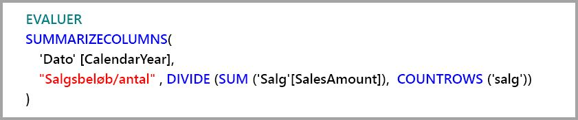

Funktionen COUNTROWS kan drage fordel af sammenlægninger. Følgende forespørgsel giver forekomster ved sammenlægningen, fordi der er defineret en sammenlægning af **Count**-tabelrækker for tabellen **Sales**.

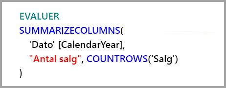

Funktionen AVERAGE kan drage fordel af sammenlægninger. Følgende forespørgsel giver forekomster ved sammenlægningen, fordi AVERAGE foldes internt til SUM divideret med COUNT. Da kolonnen **UnitPrice** indeholder sammenlægninger, der er defineret for både SUM og COUNT, giver sammenlægningen forekomster.

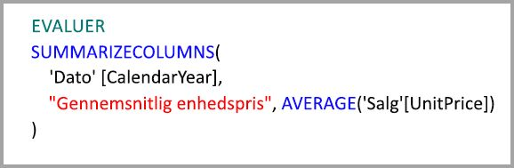

I visse tilfælde kan funktionen DISTINCTCOUNT drage fordel af sammenlægninger. Følgende forespørgsel giver sammenlægningen forekomster, fordi der er en GroupBy-post for **CustomerKey**, som bevarer særpræget for **CustomerKey** i sammenlægningstabellen. Denne metode er stadig underlagt ydelsesgrænsen, hvor mellem omtrent to til fem millioner forskellige værdier kan påvirke resultaterne af forespørgslen. Den kan dog være nyttig i situationer, hvor der er milliarder af rækker i detaljetabellen og to til fem millioner forskellige værdier i kolonnen. I dette tilfælde er det hurtigere at optælle end at scanne tabellen med milliarder af rækker, selv om det er cachelagret i hukommelsen.

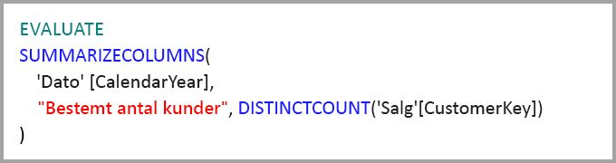

## Sammenlægninger baseret på gruppér efter-kolonner 

Hadoop-baserede big data-modeller har andre egenskaber end dimensionelle modeller. For at undgå joinforbindelser mellem store tabeller er de ofte ikke afhængige af relationer. I stedet denormaliseres dimensionsattributter ofte til faktatabeller. Sådanne big data-modeller kan låses op til interaktiv analyse ved hjælp af **sammenlægninger** baseret på gruppér efter-kolonner.

Følgende tabel indeholder den numeriske kolonne **Movement**, der skal sammenlægges. Alle andre kolonner er attributter, som der skal grupperes efter. Den indeholder IoT-data og et enormt antal rækker. Lagringstilstanden er DirectQuery. Forespørgsler på datakilden, der er samlet på tværs af hele datasættet, er langsomme på grund af størrelsen.

For at aktivere interaktive analyser af dette datasæt tilføjer vi en sammenlægningstabel, der grupperer efter de fleste af attributterne, men udelukker attributter med høj kardinalitet såsom længdegrad og breddegrad. Denne reducerer antallet af rækker markant, og den er så lille, at den nemt kan ligge i et cachelager i hukommelsen. Lagringstilstanden for **Driver Activity Agg** er Import.

Derefter skal vi definere sammenlægningstilknytningerne i dialogboksen **Administrer sammenlægninger**. Der vises en række for hver kolonne i tabellen **Driver Activity Agg**, hvor vi kan specificere sammenlægningens funktionalitet.

I følgende tabel vises sammenlægningerne for tabellen **Driver Activity Agg**.

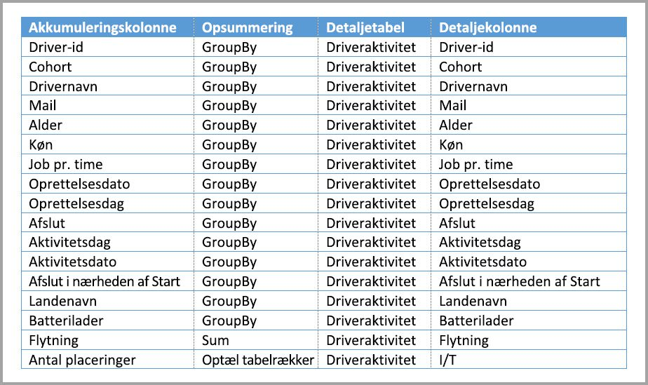

### Kolonnevis gruppering

I dette eksempel er **GroupBy**-posterne **ikke valgfrie**, og uden dem ville sammenlægningerne ikke give forekomster. Dette er an anderledes funktionsmåde en brug af sammenlægninger baseret på relationer, som er omfattet af det dimensionelle modeleksempel, der er angivet tidligere i denne artikel.

### Eksempler på forespørgsler

Følgende forespørgsel giver sammenlægningen forekomster, fordi kolonnen **Activity Date** er dækket af sammenlægningstabellen. Sammenlægningen Optæl tabelrækker anvendes af funktionen COUNTROWS.

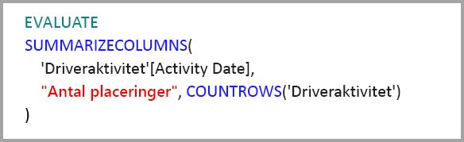

Især til modeller, der indeholder filterattributter i faktatabeller, er det en god idé at bruge Optæl tabelrækker-sammenlægninger. Power BI kan sende forespørgsler til datasættet ved hjælp af COUNTROWS i tilfælde, hvor brugeren ikke udtrykkeligt anmoder om dette. Dialogboksen filtre viser f.eks. antallet af rækker for hver værdi.

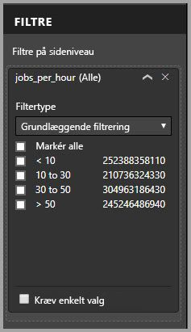

## Rangplacering af sammenlægninger

Rangplacering af sammenlægninger gør det muligt for en enkelt underforespørgsel at tage flere sammenlægningstabeller i betragtning.

Se følgende eksempel. Det er en [sammensat model](desktop-composite-models.md), som indeholder flere DirectQuery-kilder.

* Importtabellen **Driver aktivitet Agg2** har høj granularitet, fordi der er få gruppér efter-attributter, og disse har lav kardinalitet. Antallet af rækker kan være så lavt som nogle tusinde, så den kan nemt cachelagres i hukommelsen. Disse attributter anvendes af et executive dashboard med høj profil, så forespørgsler, der henviser til disse, skal være så hurtige som muligt.
* Tabellen **Driver Activity Agg** er en mellemliggende sammenlægningstabel i DirectQuery-tilstand. Den indeholder over en milliard rækker og er optimeret til den datakilde, der anvender kolonnelagerindekser.
* Tabellen **Driver Activity** er DirectQuery og indeholder mere end en billion rækker med IoT-data, der leveres af et big data-system. Det behandler forespørgsler med detaljeadgang for at se individuelle IoT-aflæsninger i forbindelse med styrede filtre.

Denne model bruger forholdsvis lidt hukommelse, men giver adgang til et stort datasæt. Den repræsenterer en balanceret arkitektur, fordi den fordeler forespørgselsbelastningen på flere komponenter i arkitekturen og udnytter dem ud fra deres styrker.

Dialogboksen **Administrer sammenlægninger** for **Driver Activity Agg2** viser, at feltet *Rangplacering* er 10, som er højere end tallet for **Driver Activity Agg**, hvilket betyder, at den anvendes først af forespørgsler, der anvender sammenlægninger. Underforespørgsler, ikke der har en granularitet, som kan besvares af **Driver Activity Agg2**, anvender **Driver Activity Agg** i stedet. Detaljerede forespørgsler, der ikke kan besvares af nogen af sammenlægningstabellerne, sendes til **Driver Activity**.

Den tabel, der er angivet i kolonnen **Detail Table**, er **Driver Activity**, ikke **Driver Activity Agg**, fordi sammenkædede sammenlægninger ikke er tilladt (se [valideringer](#validations) tidligere i denne artikel).

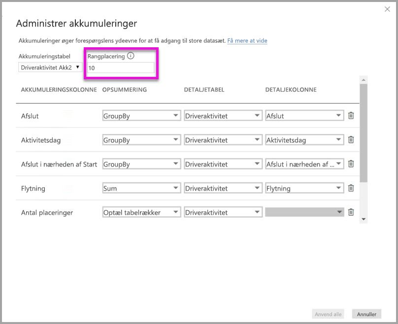

I følgende tabel vises sammenlægningerne for tabellen **Driver Activity Agg2**.

## Sammenlægninger, der er baseret på gruppér efter-kolonner kombineret med relationer

Som beskrevet tidligere i denne artikel kan du endda kombinere de to teknikker til sammenlægninger. **Sammenlægninger** baseret på relationer kan kræve, at denormaliserede dimensionstabeller opdeles i flere tabeller. Hvis dette er dyrt eller upraktisk for visse dimensionstabeller, kan de nødvendige attributter replikeres i sammenlægningstabellen for visse dimensioner og relationer, der bruges til andre.

Følgende model replikerer *Måned*, *Kvartal*, *Semester* og *År* i tabellen**Sales Agg**. Der er ingen relation mellem **Sales Agg** og tabellen **Dato**. Der er relationer til **Kunde** og **Produktunderkategori**. Lagringstilstanden for **Sales Agg** er Import.

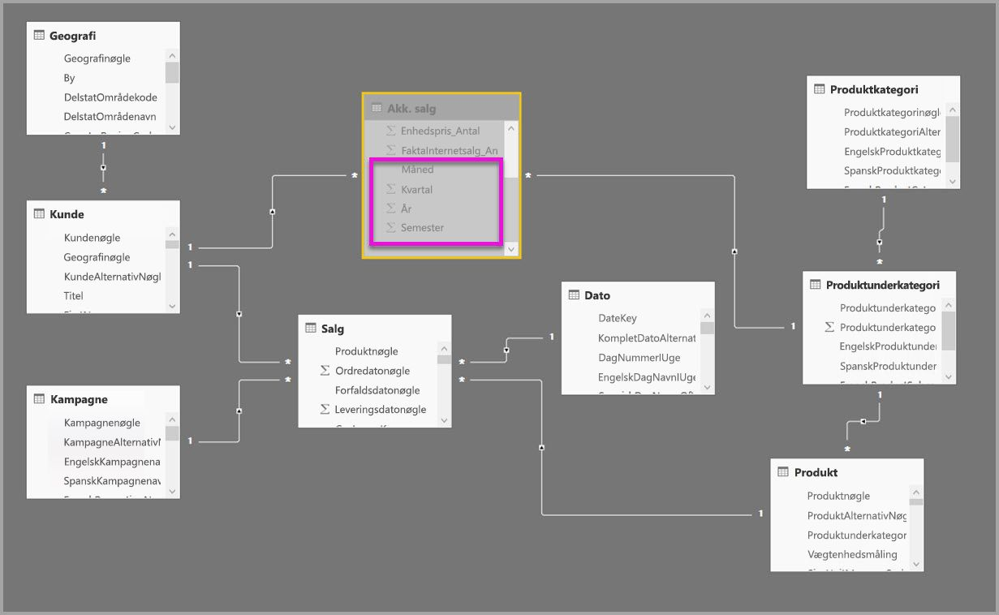

I følgende tabel vises de poster, der er angivet i dialogboksen **Administrer sammenlægninger** for tabellen **Sales Agg**. GroupBy-posterne, hvor **Dato** er detaljetabellen, er obligatoriske, hvis sammenlægninger skal give forekomster ved forespørgsler, der grupperes efter Datoattributter. Som i det forrige eksempel påvirker GroupBy-poster til CustomerKey og ProductSubcategoryKey ikke forekomster fra sammenlægningen på grund af tilstedeværelsen af relationer (igen med undtagelse af DISTINCTCOUNT).

> Bemærk! Denne model kræver, at tabellen **Dato** skal være i DirectQuery-tilstand for at udfylde dialogboksen Administrer sammenlægninger, fordi det er en detaljetabel. Dette er en begrænsning i prøveversion, som vi forventer at fjerne for at sikre offentlig tilgængelighed.

### Eksempler på forespørgsler

Følgende forespørgsel giver forekomster ved sammenlægningen, fordi CalendarMonth er dækket af sammenlægningstabellen, og CategoryName er tilgængelig via en-til-mange-relationer. Sammenlægningen Sum for **SalesAmount** anvendes.

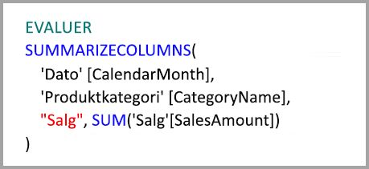

Følgende forespørgsel giver ikke forekomster ved sammenlægningen, fordi CalendarDay ikke er dækket af sammenlægningstabellen.

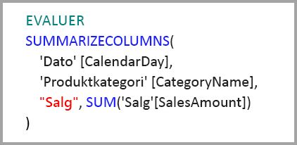

Følgende tidsintelligensforespørgsel giver ikke forekomster ved sammenlægningen, fordi funktionen DATESYTD genererer en tabel over CalendarDay-værdier, der ikke er omfattet af sammenlægningstabellen.

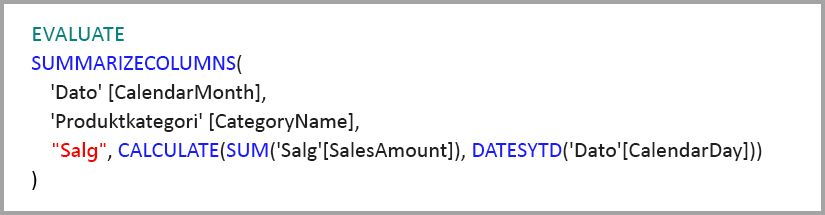

## Cacher bør holdes synkroniserede

**Sammenlægninger**, der kombinerer DirectQuery og Import og/eller Dual lagringstilstand, kan returnere forskellige data, hvis cachehukommelsen ikke synkroniseres med kildedataene. Udførelse af forespørgsler vil ikke forsøge at maskere dataproblemer ved f.eks. at filtrere DirectQuery-resultater for at matche cachelagrede værdier. Disse funktioner er optimeringer af ydeevnen og må kun anvendes på måder, der ikke kompromitterer din mulighed for at imødekomme forretningskrav. Det er dit ansvar at kende dine dataflows, så du bør designe i henhold hertil. Der er fastlagt teknikker til at håndtere sådanne problemer ved kilden, hvis det er nødvendigt.

## Næste trin

I følgende artikler beskrives sammensatte modeller yderligere, og du finder også en detaljeret beskrivelse af DirectQuery.

* [Sammensatte modeller i Power BI Desktop (Preview)](desktop-composite-models.md)
* [Mange til mange-relationer i Power BI Desktop (Preview)](desktop-many-to-many-relationships.md)
* [Lagringstilstand i Power BI Desktop (Preview)](desktop-storage-mode.md)

Artikler om DirectQuery:

* [Brug af DirectQuery in Power BI](desktop-directquery-about.md)
* [Understøttede datakilder i forbindelse med DirectQuery i Power BI](desktop-directquery-data-sources.md)
