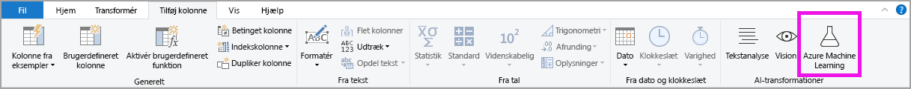

# Brug kunstig intelligens i Power BI Desktop (eksempelvisning)

I Power BI kan du bruge AI-indsigter til at få adgang til en samling af forudoplærte modeller til maskinel indlæring, der forbedrer din dataforberedelse. Der er adgang til AI-indsigt i **Power Query Editor**, og der er adgang til de tilhørende funktioner via fanerne **Hjem** og **Tilføj kolonne** i **Power Query Editor**. 

I denne artikel beskrives funktionerne Tekstanalyse og Vision, der begge kommer fra Azure Cognitive Services. I denne artikel er der også et afsnit, hvor du kan beskrive de brugerdefinerede funktioner, der er tilgængelige i Power BI fra Microsoft Azure Machine Learning.

## Sådan aktiverer du AI-indsigter

AI-indsigter i Power BI er en prøveversionsfunktion, som skal aktiveres. Du aktiverer den ved at vælge **Fil > Indstillinger > Indstillinger** og derefter vælge **Funktioner i prøveversionen** i venstre kolonne. I ruden til højre kan du vælge en **funktionsbrowser for AI-indsigter**. Markér afkrydsningsfeltet ud for **Funktionsbrowser for AI-indsigter** for at aktivere prøveversionsfunktionen. Du skal genstarte Power BI Desktop, før prøveversionsfunktionen kan træde i kraft.

## Brug af Tekstanalyse og Vision

Med Tekstanalyse og Vision i Power BI kan du anvende forskellige algoritmer fra [Azure Cognitive Services](https://azure.microsoft.com/services/cognitive-services/) til at forbedre dine data i Power Query.

Følgende tjenester understøttes i dag:

* [Synspunktanalyse](https://docs.microsoft.com/azure/cognitive-services/text-analytics/how-tos/text-analytics-how-to-sentiment-analysis)
* [Udtrækning af nøgleudtryk](https://docs.microsoft.com/azure/cognitive-services/text-analytics/how-tos/text-analytics-how-to-keyword-extraction)
* [Sprogregistrering](https://docs.microsoft.com/azure/cognitive-services/text-analytics/how-tos/text-analytics-how-to-language-detection)
* [Billedtagging](https://docs.microsoft.com/azure/cognitive-services/computer-vision/concept-tagging-images). 

Transformationerne udføres i Power BI-tjenesten og kræver ikke et Azure Cognitive Services-abonnement. 

> [!IMPORTANT]
> 
> Brug af funktionerne Tekstanalyse eller Vision kræver Power BI Premium.

### Aktivering af Tekstanalyse og Vision i Premium-kapaciteter

Cognitive Services understøttes i forbindelse med Premium-kapacitetsnoderne EM2, A2, P1 og højere. En separat AI-arbejdsbelastning i kapaciteten bruges til at køre Cognitive Services. Denne arbejdsbelastning var som standard deaktiveret i den offentlige prøveversion af disse funktioner (før juni 2019). Før du bruger Cognitive Services i Power BI, skal AI-arbejdsbelastningen være aktiveret i **indstillingerne for kapaciteten** på administrationsportalen. Du kan slå **AI-arbejdsbyrden** til i afsnittet for **arbejdsbelastninger** og definere den maksimale hukommelsesmængde, denne opgave må forbruge. Den anbefalede hukommelsesgrænse er 20 %. En overskridelse af denne grænse medfører, at forespørgslen bliver langsommere.

### Tilgængelige funktioner

I dette afsnit beskrives de tilgængelige funktioner i Cognitive Services i Power BI.

#### Registrer sprog

Funktionen til sprogregistrering evaluerer tekstinput og returnerer sprognavn og ISO-id for hvert felt. Denne funktion er nyttig for datakolonner, der indsamler vilkårlig tekst, hvor sproget er ukendt. Funktionen forventer data i tekstformat som input.

Tekstanalyse genkender op til 120 sprog. Du kan finde flere oplysninger under [understøttede sprog](https://docs.microsoft.com/azure/cognitive-services/text-analytics/text-analytics-supported-languages).

#### Udtræk nøgleudtryk

Funktionen til **udtræk af nøgleudtryk** evaluerer ustruktureret tekst og returnerer en liste over nøgleudtryk for hvert enkelt tekstfelt. Funktionen kræver et tekstfelt som input og accepterer et valgfrit input i **Kulturinfo**.

Udtræk af nøgleudtryk fungerer bedst, når du giver større tekstdele at arbejde med. Dette er det modsatte fra analyse af synspunkter, som fungerer bedre med mindre tekstdele. Hvis du vil have de bedste resultater fra begge handlinger, bør du derfor overveje at omstrukturere input.

#### Scor synspunkt

Funktionen til **scoring af synspunkt** evaluerer tekstinput og returnerer en synspunktsscore for hvert dokument, der spænder fra 0 (negativ) til 1 (positiv). Denne funktion er nyttig i forbindelse med registrering af positive og negative synspunkter på sociale medier, i kundeanmeldelser og debatforummer.

Tekstanalyse bruger en maskinel indlæringsklassificeringsalgoritme til at generere en synspunktscore mellem 0 og 1. Scorer tæt på 1 indikerer et positivt synspunkt, mens scorer tæt på 0 indikerer et negativt synspunkt. Modellen er oplært ved hjælp af en omfattende tekstmængde med tilknyttede synspunkter. Det er i øjeblikket ikke muligt at få dine egne træningsdata. Modellen bruger en kombination af teknikker under tekstanalyse, herunder tekstbehandling, ordklasseanalyse, ordplacering og ordassociationer. Du kan få flere oplysninger om algoritmen under [Introduktion til Tekstanalyse](https://blogs.technet.microsoft.com/machinelearning/2015/04/08/introducing-text-analytics-in-the-azure-ml-marketplace/).

Analyser af synspunkter udføres på hele inputfeltet i modsætning til udtræk af synspunkter for et bestemt objekt i teksten. I praksis er der en tendens til, at scoringsnøjagtigheden forbedres, når dokumenter indeholder en eller to sætninger i stedet for en stor tekstmængde. Under objektivitetsvurderingen bestemmer modellen, om et inputfelt som helhed er objektivt eller indeholder et synspunkt. Et inputfelt, der primært er objektivt fortsætter ikke til synspunktsregistreringsfasen, hvilket resulterer i en score på 0,50 uden yderligere behandling. I forbindelse med inputfelter, der fortsætter i pipelinen, genererer den næste fase en score over eller under 0,50, afhængigt af, hvordan synspunktet registreres i inputfeltet.

I øjeblikket understøtter synspunktsanalysen engelsk, tysk, spansk og fransk. Andre sprog er tilgængelig som prøveversion. Du kan finde flere oplysninger under [understøttede sprog](https://docs.microsoft.com/azure/cognitive-services/text-analytics/text-analytics-supported-languages).

#### Tag billeder

Funktionen **Tag billeder** returnerer tags baseret på mere end 2.000 genkendelige objekter, levende væsener, landskaber og handlinger. Når tags er tvetydige eller ikke er almen viden, giver outputtet *tip*, der tydeliggør betydningen af tagget i forbindelse med en kendt kontekst. Tags ikke er organiseret som en taksonomi, og der findes ingen nedarvningshierarkier. En samling af indholdstags udgør fundamentet for en *billedbeskrivelse*, der vises som sprog i hele sætninger, der kan læses af mennesker.

Når et billede er uploadet, eller en URL-adresse til et billede er angivet, genereres tags af Computer Vision-algoritmer baseret på de objekter, levende væsener og handlinger, der er identificeret på billedet. Tagging er ikke begrænset til det primære emne, f.eks. en person i forgrunden, men det indeholder også omgivelserne (indendørs eller udendørs), møbler, værktøjer, planter, dyr, tilbehør, gadgets og osv.

Denne funktion kræver en URL-adresse til billedet eller et base-64-felt som input. I øjeblikket understøtter billedtagging engelsk, spansk, japansk, portugisisk og kinesisk (forenklet). Du kan finde flere oplysninger under [understøttede sprog](https://docs.microsoft.com/rest/api/cognitiveservices/computervision/tagimage/tagimage#uri-parameters).

### Kald af Tekstanalyse- eller Vision-funktioner i Power Query

Hvis du vil forbedre dine data med Tekstanalyse- eller Vision-funktioner, skal du åbne **Power Query Editor**. I dette eksempel gennemgås scoring af synspunkter for en tekst. De samme trin kan bruges til at udtrække nøgle udtryk, registrere sprog og markere billeder.

Vælg knappen **Tekstanalyse** på båndet **Hjem** eller **Tilføj kolonne**. Du bliver bedt om at logge på.

Når du har logget på, skal du vælge den funktion, du vil bruge, og den datakolonne, du vil transformere i pop op-vinduet.

Power BI vælger en Premium-kapacitet for at køre funktionen og sende resultaterne tilbage til Power BI Desktop. Den valgte kapacitet bruges kun til funktionen Tekstanalyse og Vision under anvendelsen og opdateres i Power BI Desktop. Når rapporten er publiceret, opdateres kørslen af Premium-kapaciteten for det arbejdsområde, hvor rapporten publiceres. Du kan ændre den kapacitet, der bruges til alle Cognitive Services, på rullelisten i nederste venstre hjørne af pop op-vinduet.

**Kulturinfo** er et valgfrit input til at angive sproget i teksten. Dette felt er en ISO-kode. Du kan bruge en kolonne som input til Kulturinfo eller et statisk felt. I dette eksempel er sproget angivet som engelsk (en) for hele kolonnen. Hvis du ikke udfylder dette felt, registrerer Power BI automatisk sproget, inden funktionen anvendes. Vælg derefter **Anvend**.

Første gang, du bruger Brug kunstig intelligens på en ny datakilde, bliver du bedt om at angive beskyttelsesniveauet for dine data.

> [!NOTE]
> Opdatering af datasættet i Power BI fungerer kun for de datakilder, hvor niveauet for beskyttelse af personlige oplysninger er angivet til offentligt eller organisatorisk.

Når funktionen er aktiveret, tilføjes resultatet som en ny kolonne i tabellen. Transformationen tilføjes også som et anvendt trin i forespørgslen.

I tilfælde af billedtagging og udtrækning af nøgleudtryk kan resultaterne returnere flere værdier. Hvert enkelt resultat returneres i en dublet af den oprindelige række.

### Publicering af en rapport med funktionerne Tekstanalyse eller Vision

Når du redigerer i Power Query og udfører opdateringer i Power BI Desktop, bruger Tekstanalyse og Vision den Premium-kapacitet, der blev valgt i Power Query Editor. Når rapporten er publiceret til Power BI, bruges Premium-kapaciteten for det arbejdsområde, som den blev udgivet i.

Rapporter med anvendte Tekstanalyse- og Vision-funktioner skal publiceres i et arbejdsområde, der ikke er på en Premium-kapacitet, da datasættet ellers ikke kan opdateres.

### Administration af effekt på en Premium-kapacitet

I de følgende afsnit beskrives det, hvordan du kan administrere effekterne af Tekstanalyse og Vision på kapaciteten.

#### Valg af en kapacitet

Forfattere af rapporter kan vælge, hvilken Premium-kapacitet Brug kunstig intelligens skal køres på. Som standard vælger Power BI den først oprettede kapacitet, som brugeren har adgang til.

#### Overvågning med appen Capacity Metrics

Premium-kapacitetsejere kan overvåge virkningen af Tekstanalyse- og Vision-funktioner på en kapacitet med [appen Power BI Premium Capacity Metrics](service-admin-premium-monitor-capacity.md). Appen omfatter detaljerede målepunkter for AI-arbejdsbelastningens tilstand i din kapacitet. Det øverste diagram viser AI-arbejdsbelastningernes hukommelsesforbrug. Administratorer af Premium-kapacitet kan angive hukommelsesgrænsen for AI-arbejdsbelastningen pr. kapacitet. Når hukommelsesforbruget når hukommelsesgrænsen, kan du overveje at øge hukommelsesgrænsen eller flytte nogle arbejdsområder til en anden kapacitet.

### Sammenligning af Power Query og Power Query Online

Funktionerne Tekstanalyse og Vision, der bruges i Power Query og Power Query Online er de samme. De eneste forskelle mellem oplevelserne er følgende:

* Power Query har separate knapper til Tekstanalyse, Vision og Azure Machine Learning. I Power Query Online er disse samlet i én menu.
* I Power Query kan rapportens forfatter vælge den Premium-kapacitet, der bruges til at køre funktionerne. Det kræves ikke i Power Query Online, da et dataflow allerede er på en bestemt kapacitet.

### Overvejelser og begrænsninger i forbindelse med Tekstanalyse

Der er nogle få overvejelser og begrænsninger, du skal huske på, når du arbejder med Tekstanalyse:

* Trinvis opdatering understøttes, men kan medføre problemer med ydeevnen, når den bruges på forespørgsler med AI-indsigter.
* DirectQuery understøttes ikke.

## Brug af Azure Machine Learning

Mange organisationer bruger **Machine Learning**-modeller for at få større indsigt i deres virksomhed og dens fremtidige udvikling. Muligheden for at visualisere og aktivere indsigt fra disse modeller i dine rapporter og dashboards og andre analyser kan hjælpe med at udbrede denne indsigt til de forretningsbrugere, der har størst behov for den. Power BI gør det nemt at integrere indsigt fra modeller, der hostes i Azure Machine Learning, ved hjælp af enkle peg og klik-håndbevægelser.

For at gøre det muligt at bruge denne funktion kan en dataspecialist ganske enkelt give BI analytikeren adgang til Azure Machine Learning-modellen ved hjælp af Microsoft Azure-portal. I starten af hver session finder Power-forespørgsel derefter alle de Azure Machine Learning-modeller, brugeren har adgang til, og viser dem som dynamiske funktioner i Power-forespørgsel. Brugeren kan derefter aktivere disse funktioner ved at oprette adgang til dem på båndet i Power Query Editor eller ved at aktivere funktionen M direkte. For at opnå en bedre ydeevne samler Power BI også automatisk anmodninger om adgang i bundter, når Azure Machine Learning-modellen aktiveres for et sæt af rækker.

Denne funktionalitet understøttes i øjeblikket kun for Power BI dataflows, og for Power Query Online i Power BI-tjenesten.

Du kan få mere at vide om dataflow i [Selvbetjent dataforberedelse i Power BI](service-dataflows-overview.md).

Du kan få mere at vide om Azure Machine Learning i følgende artikler:

- Oversigt: [Hvad er Azure Machine Learning?](https://docs.microsoft.com/azure/machine-learning/service/overview-what-is-azure-ml)
- Hurtig start- og selvstudier til Azure Machine Learning: [Azure Machine Learning-dokumentation](https://docs.microsoft.com/azure/machine-learning/)

### Tildeling af adgang til en Azure Machine Learning-model

For at få adgang til en Azure Machine Learning-model fra Power BI, skal brugeren have adgangen **Læs** til Azure-abonnementet. Derudover skal de have følgende:

- For modeller af typen Machine Learning Studio (klassisk): adgangen **Læs** til webtjenesten Machine Learning Studio (klassisk)
- For modeller af typen Machine Learning Studio: adgangen **Læs** til Machine Learning Studio-arbejdsområdet

Trinnene i dette afsnit beskriver, hvordan du tildeler en Power BI-bruger adgang til en model, der er hostet i Azure Machine Learning-tjenesten, så brugeren kan få adgang til denne model som en funktion i Power Query. Du kan få flere oplysninger i [Administrer adgang ved hjælp af RBAC og Microsoft Azure-portal](https://docs.microsoft.com/azure/role-based-access-control/role-assignments-portal).

1. Log på [Azure Portal](https://portal.azure.com/).
2. Gå til siden **Abonnementer**. Du finder siden **Abonnementer** via listen **Alle tjenester** i venstre navigationsmenu i Microsoft Azure-portal.
3. Vælg dit abonnement
4. Vælg **Adgangskontrol (IAM)** , og vælg derefter knappen **Tilføj**.
5. Vælg **Læser** som rollen. Vælg den Power BI-bruger, du vil give adgang til Azure Machine Learning-modellen.
6. Vælg **Gem**
7. Gentag trin tre til seks for at tildele brugeren adgangen **Læser** for den specifikke webtjeneste af typen Machine Learning Studio (klassisk) *eller* det Machine Learning-arbejdsområde, der hoster modellen.

### Skemasøgning for modeller til maskinel indlæring

Dataspecialister bruger primært Python til at udvikle og endda udrulle deres modeller til maskinel indlæring til Machine Learning. I modsætning til Machine Learning Studio (klassisk), som hjælper med at automatisere oprettelse af en skemafil til modellen, skal dataspecialisterne eksplicit generere skemafilen ved hjælp af Python, når det drejer sig om Machine Learning.

Denne skemafil skal inkluderes i den udrullede webtjeneste for modeller til maskinel indlæring. Hvis du vil generere skemaet for webtjenesten automatisk, skal du angive et eksempel på inputtet/outputtet i postscriptet for den udrullede model. Se underafsnittet om [(Valgfri) Automatisk generering af Swagger-skema i dokumentationen Udrul modeller med Azure Machine Learning](https://docs.microsoft.com/azure/machine-learning/service/how-to-deploy-and-where#optional-automatic-schema-generation) Service. Linket inkluderer eksemplet på postscriptet med sætninger for generering af skemaet.

Funktionerne _@input\_schema_ og _@output\_schema_ i postscriptet refererer specifikt til eksempelformaterne for input og output i eksempelvariablerne _input\__ og _output\__ og bruger disse eksempler til at generere en OpenAPI-specifikation (Swagger) for webtjenesten under udrulningen.

Disse instruktioner til generering af skemaet ved opdatering af postscriptet skal også anvendes for modeller, der er oprettet via automatiserede eksperimenter for maskinel indlæring veds hjælp af SDK'et til Azure Machine Learning.

> [!NOTE]
> Modeller, der er oprettet ved hjælp af den visuelle brugergrænseflade i Azure Machine Learning, understøtter i øjeblikket ikke generering af skemaer, men det vil de i efterfølgende udgaver.
> 
### Kald af en Azure Machine Learning-model i Power Query

Du kan kalde en hvilken som helst Azure Machine Learning-model, som du har fået adgang til, direkte fra Power Query Editor. Hvis du vil have adgang til Azure Machine Learning-modeller, skal du vælge knappen **Azure Machine Learning** på båndet **Hjem** eller **Tilføj kolonne** i Power Query Editor.

Alle Azure Machine Learning-modeller, du har adgang til, er angivet her som funktioner i Power Query. Inputparametrene for Azure Machine Learning-modellen er også automatisk tilknyttet som parametre for den tilsvarende funktion i Power-forespørgsel.

For at aktivere en Azure Machine Learning-model kan du angive en af den valgte enheds kolonner som input på rullelisten. Du kan også angive en konstant værdi, der skal bruges som input, ved at slå kolonneikonet til venstre for inputdialogboksen til og fra.

Vælg **OK** for at få vist Azure Machine Learning-modellens output som en ny kolonne i enhedstabellen. Du får også modelaktiveringen som et anvendt trin for forespørgslen.

Hvis modellen returnerer flere outputparametre, er de grupperet som en post i outputkolonnen. Du kan udvide kolonnen for at oprette individuelle outputparametre i separate kolonner.

### Overvejelser og begrænsninger i forbindelse med Azure Machine Learning

Følgende overvejelser og begrænsninger gælder for Azure Machine Learning i Power BI Desktop.

* Modeller, der er oprettet ved hjælp af den visuelle brugergrænseflade i Azure Machine Learning, understøtter i øjeblikket ikke generering af skemaer. Understøttelse forventes i de efterfølgende versioner.
* Trinvis opdatering understøttes, men kan medføre problemer med ydeevnen, når den bruges på forespørgsler med AI-indsigter.
* DirectQuery understøttes ikke.

## Næste trin

Denne artikel omfatter en oversigt over integration af Machine Learning i Power BI Desktop. Følgende artikler kan også være interessante eller nyttige.

- [Selvstudium: Aktivér en model af typen Machine Learning Studio (klassisk) i Power BI](service-tutorial-invoke-machine-learning-model.md)
- [Selvstudium: Brug af Cognitive Services i Power BI](service-tutorial-use-cognitive-services.md)
- [Cognitive Services i Power BI](service-cognitive-services.md)
- [Integration af Azure Machine Learning i Power BI](service-machine-learning-integration.md)
- [Overvågning af Premium-kapaciteter vha. appen](service-admin-premium-monitor-capacity.md)
- [AI-metrikker i appen Premium Capacity Metrics](https://powerbi.microsoft.com/blog/ai-metrics-now-available-in-power-bi-premium-capacity-metrics-app/)
