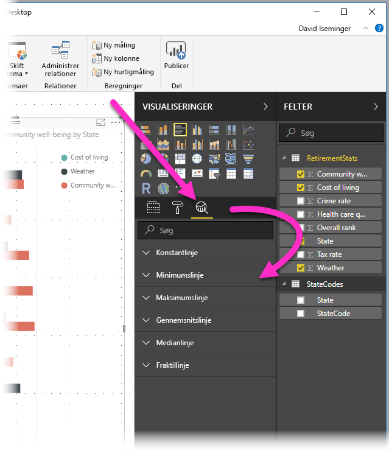
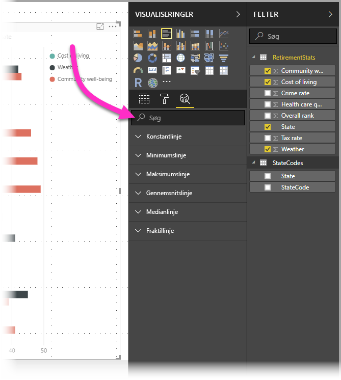
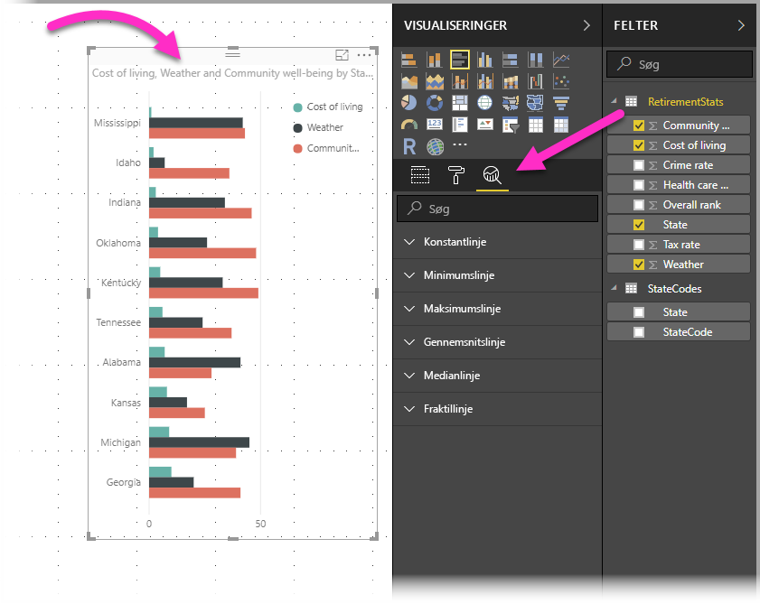
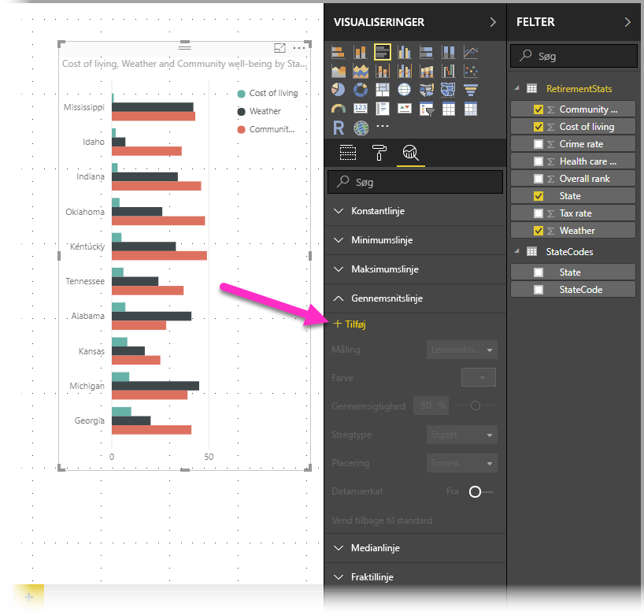
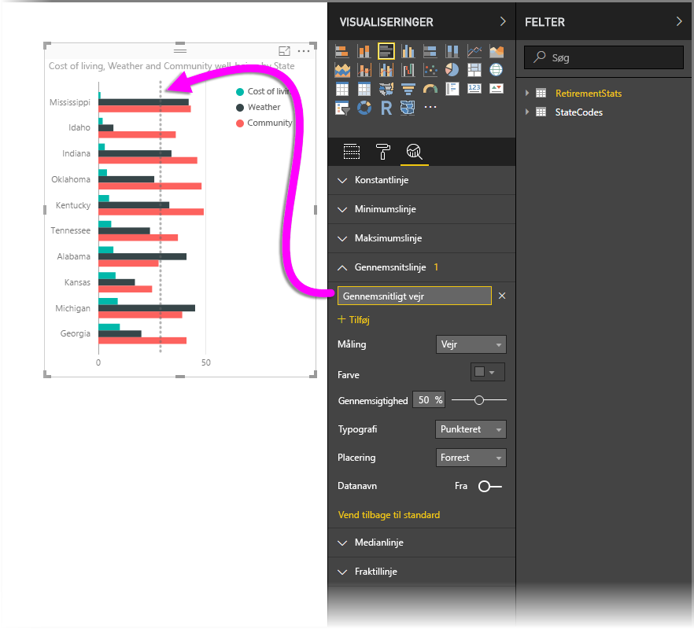
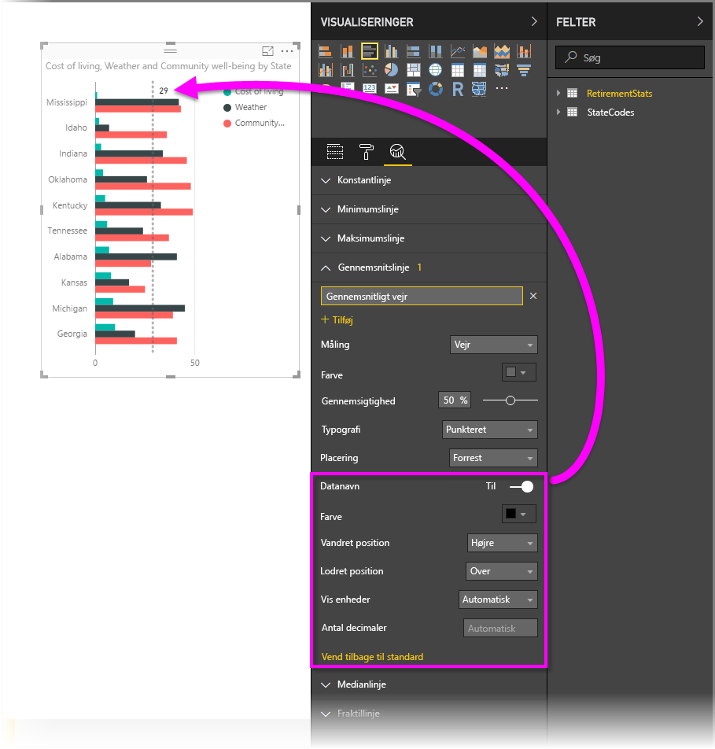
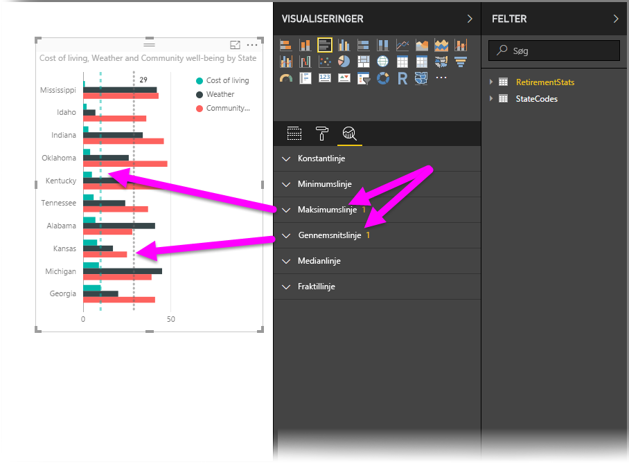
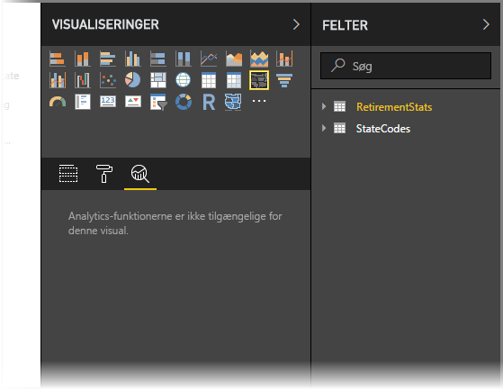
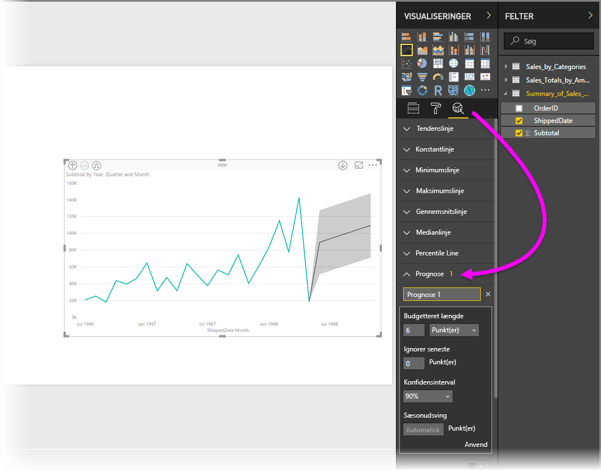

# Brug af ruden Analytics i Power BI Desktop
Med ruden **Analytics** i **Power BI Desktop** kan du tilføje dynamiske *referencelinjer* for visuelle elementer og give vigtige tendenser eller indsigt fokus. Du finder ruden **Analytics** i området **Visualiseringer** i Power BI Desktop.

> [!NOTE]
> Ruden **Analytics** vises kun, når du vælger en visuel effekt på Power BI Desktop-lærredet.

## Søg i ruden Analytics
Fra og med udgivelsen af **Power BI Desktop** i februar 2018 (version 2.55.5010.201 eller nyere) kan du søge i ruden **Analytics**, hvilket er et underafsnit af ruden **Visualiseringer**. Som vist på nedenstående billede vises et søgefelt, når ruden **Analytics** er markeret.

## Sådan bruges ruden Analytics
Med ruden **Analytics** kan du oprette følgende typer dynamiske referencelinjer (ikke alle linjer er tilgængelige for alle typer visuelle effekter):

* Konstantlinje for X-akse
* Konstantlinje for Y-akse
* Minimumlinje
* Maksimumlinje
* Gennemsnitslinje
* Medianlinje
* Fraktillinje

Følgende afsnit viser, hvordan du kan bruge ruden **Analytics** og dynamiske referencelinjer i dine visuelle effekter.

Få vist de tilgængelige dynamiske referencelinjer for en visuel effekt ved at følge disse trin:

1. Vælg eller opret en visuel effekt, og vælg derefter ikonet **Analytics** i ruden **Visualiseringer**.
   
   
2. Vælg pil ned til den linjetype, du vil oprette, for at udvide dens indstillinger. I dette tilfælde vælger vi **Gennemsnitslinje**.
   
   
3. Vælg **+ Tilføj** for at oprette en ny linje. Du kan derefter angive et navn på linjen ved at dobbeltklikke på tekstfeltet og derefter skrive navnet.
   
   Du har en række forskellige indstillinger for linjen. Du kan f.eks. vælge dens *farve*, *gennemsigtighed*, *typografi* og *position* (forhold til den visuelle effekts dataelementer), og om du vil medtage etiketten. Og du kan vælge, hvilken **Måling** i den visuelle effekt du ønsker, at linjen skal være baseret på, ved at vælge rullemenuen **Måling**, som automatisk er udfyldt med dataelementer fra den visuelle effekt. I dette tilfælde vælger vi *Weather* (Vejr) som målingen, mærker den *Average Weather* (Gennemsnitligt vejr) og tilpasser nogle af de andre indstillinger, som vist nedenfor.
   
   
4. Hvis du vil have vist et datanavn, skal du slå skyderen **Datanavn** til. Når du gør dette, får du mange yderligere indstillinger for dit datanavn som vist i følgende billede.
   
   
5. Bemærk tallet, der vises ved siden af elementet **Gennemsnitslinje** i ruden **Analytics**. Det fortæller dig, hvor mange dynamiske linjer du på nuværende tidspunkt har på dine visuelle effekter og hvilken type. Hvis vi tilføjer en **Maksimumlinje** for *Cost of Living* (Leveomkostninger), kan du se, at ruden **Analytics** viser, at vi nu har også anvender en **Maksimumlinje** som dynamisk referencelinje for den visuelle effekt.
   
   

Hvis der ikke kan anvendes dynamiske linjer for den valgte visuelle effekt (i dette tilfælde den visuelle effekt **Kort**), får du vist følgende, når du vælger ruden **Analytics**.

Der er mange typer interessant viden, du kan fremhæve ved at oprette dynamiske referencelinjer med ruden **Analytics**.

Vi planlægger flere funktioner og egenskaber herunder at udvide, hvilke visuelle effekter dynamiske referencelinjer kan anvendes til, så vend tilbage ofte for at se nyheder.

## Anvend Prognose
Du kan bruge funktionen **Prognose** ved at vælge et visuelt element og derefter udvide afsnittet **Prognose** i ruden **Analytics**. Du kan angive mange input for at redigere prognosen, f.eks. *Budgetteret længde*, *Konfidensinterval* og andet. Det følgende billede viser en grundlæggende linjevisualisering med anvendte prognose, men du kan bruge din fantasi (og afprøve funktionen *prognose* på forskellige måder) for at se, hvordan den kan anvendes til din modeller.

## Begrænsninger
Muligheden for at bruge dynamiske referencelinjer er baseret på typen af visuel effekt, der bruges. Følgende liste viser, hvilke dynamiske linjer der i øjeblikket er tilgængelig for de visuelle effekter:

Fuld brug af dynamiske linjer er tilgængelig på følgende visuelle effekter:

* Områdediagram
* Kurvediagram
* Punktdiagram
* Grupperet søjlediagram
* Grupperet liggende søjlediagram

Følgende visuelle effekter kan kun bruge en *konstantlinje* fra ruden **Analytics**:

* Stablet område
* Stablet liggende søjle
* Stablet søjle
* 100 % stablet liggende søjle
* 100 % stablet søjle

For følgende visuelle effekter er en *tendenslinje* i øjeblikket den eneste mulighed:

* Ikke-stablet linje
* Grupperet søjlediagram

Slutteligt kan ikke-kartesianske visuelle effekter i øjeblikket ikke anvende dynamiske linjer fra ruden **Analytics**, f.eks.:

* Matrix
* Cirkeldiagram
* Krans
* Tabel

Percentillinjen er kun tilgængelig, når importerede data bruges i **Power BI Desktop**, eller når der oprettet en liveforbindelse til en model på en server, der kører **Analysis Service 2016** eller nyere, **Azure Analysis Services** eller et datasæt på Power BI-tjenesten. 

## Næste trin
Du kan gøre mange forskellige ting med Power BI Desktop. Du kan finde flere oplysninger om funktionerne i følgende ressourcer:

* [Nyheder i Power BI Desktop](desktop-latest-update.md)
* [Download Power BI Desktop](desktop-get-the-desktop.md)
* [Hvad er Power BI Desktop?](desktop-what-is-desktop.md)
* [Oversigt over forespørgsler i Power BI Desktop](desktop-query-overview.md)
* [Datatyper i Power BI Desktop](desktop-data-types.md)
* [Udform og kombiner data med Power BI Desktop](desktop-shape-and-combine-data.md)
* [Almindelige forespørgselsopgaver i Power BI Desktop](desktop-common-query-tasks.md)    

