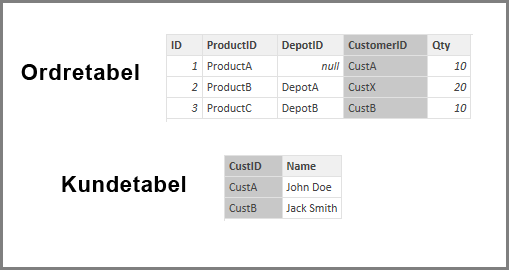

# Anvend indstillingen Antag referentiel integritet i Power BI Desktop
Når der oprettes forbindelse til en datakilde, der bruger **DirectQuery**, kan du bruge indstillingen **Antag referentiel integritet** for at gøre det muligt at køre mere effektive forespørgsler i forhold til datakilden. Denne funktion har et par krav til de underliggende data, og den er kun tilgængelig, når du bruger **DirectQuery**.

Hvis du angiver **Antag referentiel integritet**, kan forespørgsler til datakilden bruge **INNER JOIN**-sætninger i stedet **OUTER JOIN**, hvilket betyder, at forespørgslen bliver mere effektiv.

## Kravene til brug af Antag referentiel integritet
Det er en avanceret indstilling, og den er kun aktiveret, når der oprettes forbindelse til data ved hjælp af **DirectQuery**. Følgende krav er nødvendige, for at **Antag referentiel integritet** kan fungere korrekt:

* Dataene i kolonnen **From** i relationen er aldrig *Null* eller *tomme*
* For hver værdi i kolonnen **From**, findes der en tilsvarende værdi i kolonnen **To**

I denne kontekst er kolonnen **From** *mange*-siden i en *en til mange*-relation, eller det er kolonnen i den første tabel i en *en til en*-relation.

## Eksempel på brug af Antag referentiel integritet
I følgende eksempel vises, hvordan **Antag referentiel integritet** fungerer, når det bruges i dataforbindelser. I eksemplet oprettes der forbindelse til en datakilde, der indeholder tabellen**Orders**, tabellen **Products** og tabellen **Depots**.

1. På følgende billede, der viser tabellen **Orders** og tabellen **Products**, skal du lægge mærke til, at der findes en referentiel integritet mellem **Orders[ProductID]** og **Products[ProductID]** . Kolonnen **[ProductID]** i tabellen **Orders** er aldrig *Null*, og alle værdier vises også i tabellen **Products**. Derfor skal **Antag referentiel integritet**  angives for at få mere effektive forespørgsler (brug af denne indstilling ændrer ikke de værdier, der vises i visuelle elementer).
   
   
2. På næste billede kan du se, at der ikke findes referentiel integritet mellem tabellen **Orders[DepotID]** og **Depots[DepotID]** , fordi **DepotID** er *Null* for nogle *Orders*. Derfor skal **Antag referentiel integritet***ikke* angives.
   
   
3. Endelig findes der ingen referentiel integritet mellem **Orders[CustomerID]** og **Customers[CustID]** i følgende tabeller. **CustomerID** indeholder nogle værdier (i dette tilfælde *CustX*), der ikke findes i tabellen *Customers*. Derfor skal **Antag referentiel integritet***ikke* angives.
   
   

## Angiv Antag referentiel integritet
Hvis du vil aktivere denne funktion, skal du markere afkrydsningsfeltet ud for **Antag referentiel integritet** som vist på følgende billede.

Når indstillingen er valgt, valideres den i forhold til dataene for at sikre, at der ikke er *Null*-værdier eller uoverensstemmende rækker. *Men* i forbindelse med et meget stort antal værdier er valideringen ingen garanti for, at der ikke er problemer med referentiel integritet.

Desuden sker valideringen på det tidspunkt, hvor relationen redigeres, og den afspejler *ikke* efterfølgende ændringer af dataene.

## Hvad sker der, hvis du angiver Antag referentiel integritet forkert?
Hvis du angiver **Antag referentiel integritet**, når der er problemer med referentiel integritet i dataene, medfører det ikke en fejl. Det vil dog medføre åbenbare uoverensstemmelser i dataene. I forbindelse med relationen til tabellen **Depots**, der er beskrevet ovenfor, vil det f.eks. medføre følgende:

* Et visuelt element, der viser totalen for *Order Qty*, viser en værdi på 40
* Et visuelt element, der viser totalen for *Order Qty by Depot City*, viser en samlet værdi på kun *30*, fordi det ikke omfatter Order ID 1, hvor **DepotID** er *Null* .

## De næste trin
Få mere at vide om [DirectQuery](desktop-use-directquery.md)

Få mere at vide om [relationer i Power BI](desktop-create-and-manage-relationships.md)

Få mere at vide om [relationsvisning i Power BI Desktop](desktop-relationship-view.md).

