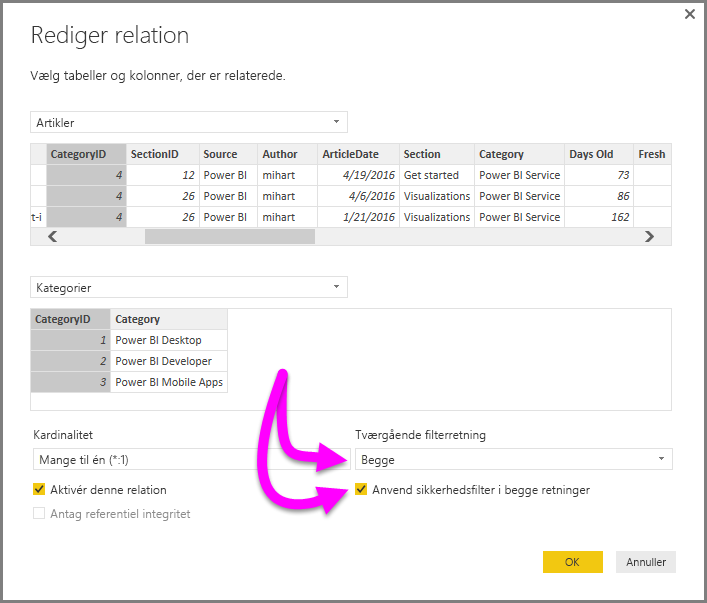

# Tovejskrydsfiltrering ved hjælp af DirectQuery i Power BI Desktop

Når tabeller filtreres for at give den relevante visning af data, står dem, der opretter rapporter og arbejder med data, over for udfordringer, når de skal fastlægge, hvordan filtrering anvendes på en rapport. Filteret blev kun anvendt på en tabel på den ene side af relationen, men ikke den anden, hvilket ofte krævede komplekse DAX-formler for at opnå de ønskede resultater.

Med tovejskrydsfiltrering har dem, der opretter rapporter og arbejder med data, nu mere kontrol over, hvordan filtrene anvendes, når de arbejder med relaterede tabeller, hvilket gør det muligt at anvende filtrene på *begge* sider af en tabelrelation. Dette opnås ved, at filterkonteksten overføres til en anden relateret tabel på den anden side af en tabelrelation.

Der findes en [detaljerede hvidbog](http://download.microsoft.com/download/2/7/8/2782DF95-3E0D-40CD-BFC8-749A2882E109/Bidirectional%20cross-filtering%20in%20Analysis%20Services%202016%20and%20Power%20BI.docx), der forklarer tovejskrydsfiltrering i Power BI Desktop. Hvidbogen omhandler også SQL Server Analysis Services 2016, da begge programmer har samme funktionsmåde.

* Hent hvidbogen om [tovejskrydsfiltrering til Power BI Desktop](http://download.microsoft.com/download/2/7/8/2782DF95-3E0D-40CD-BFC8-749A2882E109/Bidirectional%20cross-filtering%20in%20Analysis%20Services%202016%20and%20Power%20BI.docx)

### Aktivering af tovejskrydsfiltrering for DirectQuery

For at aktivere krydsfiltrering skal følgende afkrydsningsfelter være markeret i dialogboksen **Rediger relation** for en relation:

* **Tværgående filterretning** skal være angivet til **Begge**.
* **Anvend sikkerhedsfilter i begge retninger** skal også være markeret.
  
  

> [!NOTE]
> Når du opretter DAX-formler for krydsfiltrering i Power BI Desktop, skal du bruge *UserPrincipalName* (som ofte er det samme som en brugers logon, f.eks *joe@contoso.com*) i stedet for *UserName*. Det er muligt, at du bliver nødt til at oprette en relateret tabel, der knytter *UserName* (eller f.eks. EmployeeID) til *UserPrincipleName*.
> 
> 

Hvis du vil have flere oplysninger og eksempler på, hvordan tovejskrydsfiltrering fungerer, skal du læse den [hvidbog](http://download.microsoft.com/download/2/7/8/2782DF95-3E0D-40CD-BFC8-749A2882E109/Bidirectional%20cross-filtering%20in%20Analysis%20Services%202016%20and%20Power%20BI.docx), der er nævnt tidligere i denne artikel.

