# Opret bogmærker i Power BI Desktop for at dele indsigt og oprette tekstenheder
Med *bogmærker* i Power BI Desktop kan du registrere den aktuelt konfigurerede visning af en rapportside, herunder filtreringen af og tilstanden for visualiseringerne. Du kan vende tilbage til denne tilstand senere ved at vælge det gemte bogmærke. 

Du kan også oprette en samling af bogmærker, arrangere dem i den ønskede rækkefølge og senere gennemgå hvert bogmærke i en præsentation for at fremhæve en række indsigter eller den tekstenhed, du vil fortælle med dine visuelle elementer og rapporter. 

Bogmærker kan bruges til mange ting. Du kan f.eks. bruge bogmærker til at holde styr på dit eget fremskridt, når du opretter rapporter (det er nemt at tilføje, slette og omdøbe bogmærker), og du kan oprette bogmærker, hvis du vil lave en PowerPoint-lignende præsentation, der gennemgår bogmærker i en bestemt rækkefølge og dermed fortæller en historie med din rapport. 

> [!TIP]
> Du kan finde oplysninger om brug af personlige bogmærker i Power BI-tjenesten ved at se [Meddelelse om personlige bogmærker i Power BI-tjenesten](https://powerbi.microsoft.com/blog/announcing-personal-bookmarks-in-the-power-bi-service/). 

## Brug bogmærker
Hvis du vil bruge bogmærker, skal du vælge fanen **Vis** på båndet i Power BI Desktop og derefter vælge **Bogmærkerude**. 

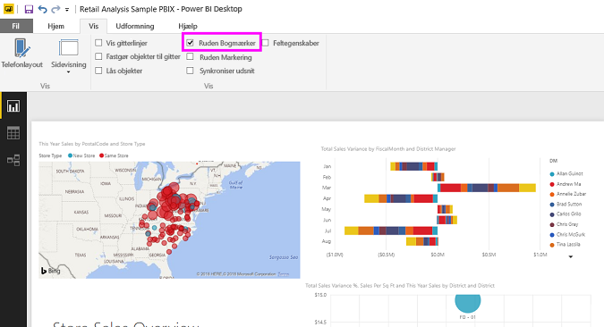

Når du opretter et bogmærke, gemmes følgende elementer sammen med bogmærket:

* Den aktuelle side
* Filtre
* Udsnit, herunder udsnitstypen (f.eks. rulleliste eller rullemenu) og udsnitstilstand
* Tilstand for visuel markering (f.eks. tværgående fremhævningsfiltre)
* Sorteringsrækkefølgen
* Placering af detailudledning
* Synlighed for et objekt (ved hjælp af ruden **Markering**)
* Tilstanden Fokus eller **Spotlight** for et synligt objekt

Konfigurer en rapportside, som du ønsker, den skal vises i bogmærket. Når din rapportside og dine visuelle elementer er arrangeret, som du ønsker det, skal du vælge **Tilføj** i ruden **Bogmærker** for at tilføje et bogmærke. 

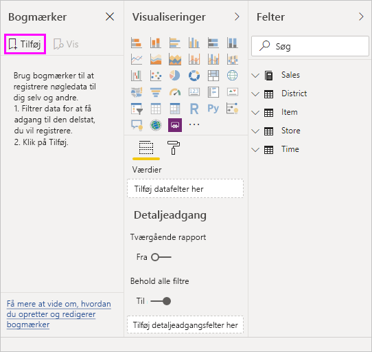

Power BI Desktop opretter et bogmærke og giver det et standardnavn. Du kan nemt **omdøbe**, **slette** eller **opdatere** et bogmærke ved at vælge ellipsen ud for bogmærkets navn og derefter vælge en handling i den viste menu.

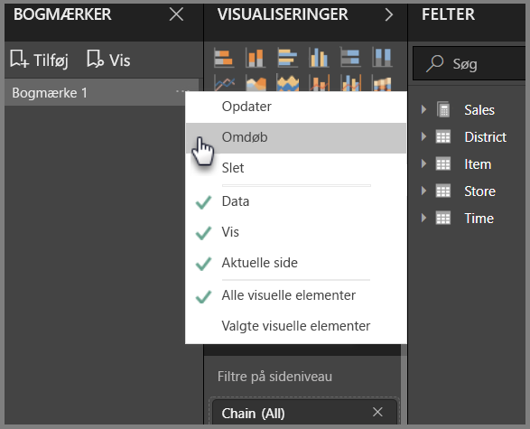

Når du har oprettet et bogmærke, kan du få det vist ved at vælge det i ruden **Bogmærker**. 

Du kan også vælge, om de enkelte bogmærker skal anvende **data**egenskaber, f.eks. filtre og udsnit, **visnings**egenskaber, f.eks. spotlight og synlighed, og ændringer af **aktuel side**, der viser den side, som kunne ses, da bogmærket blev tilføjet. Disse funktioner er nyttige, når du bruger bogmærker til at skifte mellem rapportvisninger eller valg af visualiseringer – i så fald vil du sandsynligvis deaktivere dataegenskaber, så filtre ikke nulstilles, når brugerne skifter visning ved at vælge et bogmærke. 

Du kan foretage sådanne ændringer ved at vælge ellipsen ud for bogmærkets navn og derefter markere eller fjerne markeringen i afkrydsningsfeltet ud for **Data**, **Visning** og andre objekter. 

## Arranger bogmærker
Når du opretter bogmærker, finder du måske ud af, at den rækkefølge, som du opretter dem i, ikke er den rækkefølge, som de skal vises i. Ikke noget problem. Du kan nemt ændre rækkefølgen af bogmærker.

- I ruden **Bogmærker** kan du trække og slippe bogmærker for at ændre rækkefølgen. 

   Den gule streg mellem bogmærker angiver, hvor det bogmærke, du trækker, placeres.

   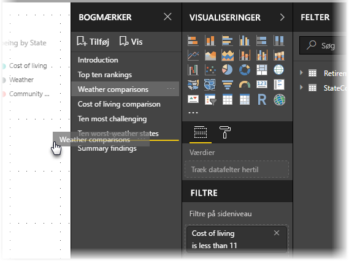

Rækkefølgen for bogmærkerne kan være vigtig, når du anvender funktionen **Vis** på bogmærker, som beskrevet i næste afsnit.

## Bogmærker som et slideshow
Når du har en samling af bogmærker, du vil vise i en bestemt rækkefølge, kan du vælge **Vis** i ruden **Bogmærker** for at starte et slideshow.

I tilstanden **Vis** er der nogle funktioner, du skal lægge mærke til.

   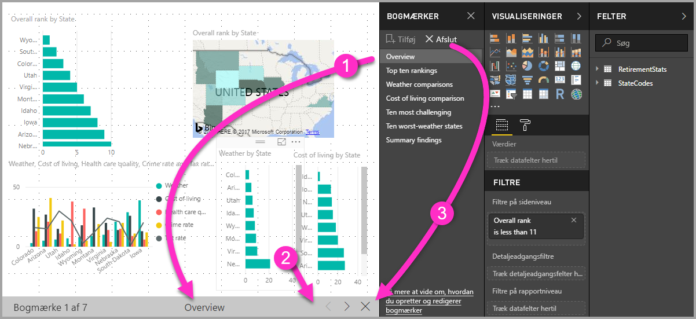

1. Navnet på bogmærket vises på bogmærkets titellinje, der vises nederst på lærredet.

2. Bogmærkets titellinje har pile, som du kan bruge til at flytte til næste eller forrige bogmærke.

3. Du kan afslutte tilstanden **Vis** ved at vælge **Afslut** i ruden **Bogmærker** eller ved at vælge krydset (**X**) i bogmærkets titellinje. 

Når du er i tilstanden **Vis**, kan du lukke ruden **Bogmærker** ved at vælge krydset (**X**) i ruden for at give mere plads til præsentationen. Alle visualiseringer er interaktive, når de er i tilstanden **Vis** og tilgængelige for tværgående fremhævning, ligesom når du interagerer med dem direkte. 

## Synlighed: Åbn ruden Markering
Ruden **Markering** er relateret til ruden **Bogmærker** og indeholder en liste over alle objekter på den aktuelle side, og du kan markere objektet og angive, om det skal være synligt. 

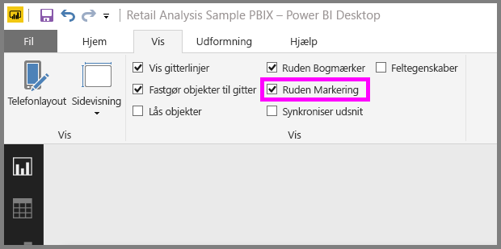

I ruden **Markering** skal du vælge et objekt og skifte mellem, om objektet i øjeblikket skal være synligt, ved at vælge ikonet med øjet til højre for objektet. 

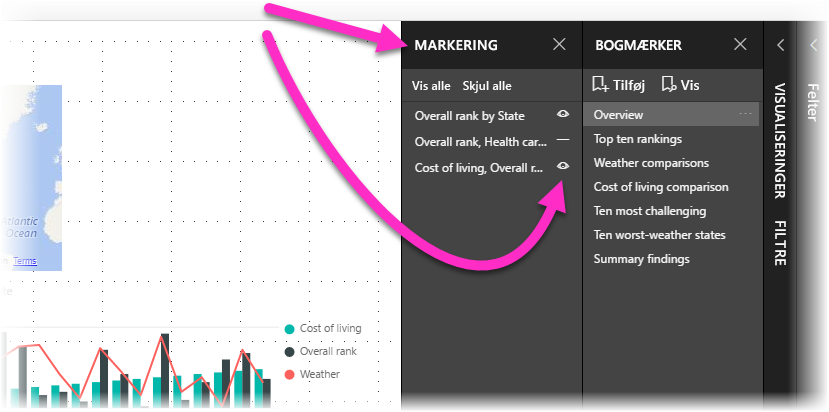

Når du tilføjer et bogmærke, gemmes synlighedsstatus for de enkelte objekter på baggrund af indstillingen i ruden **Markering**. 

Det er vigtigt at bemærke, at udsnit fortsat filtrerer en rapportside, uanset om de er synlige. Du kan derfor oprette mange forskellige bogmærker med forskellige indstillinger for udsnit og få en enkelt rapportside vist på forskellige måder (og fremhæve forskellig indsigt) i forskellige bogmærker.

## Bogmærker for figurer og billeder
Du kan også knytte figurer og billeder til bogmærker. Når du bruger denne funktion, og du vælger et objekt, vises det bogmærke, der er knyttet til objektet. Denne funktion kan især være nyttig, når du arbejder med knapper. Du kan få flere oplysninger i [Brug af knapper i Power BI](desktop-buttons.md). 

Sådan tildeler du et bogmærke til et objekt: 

1. Vælg objektet i rapportlærredet. Derefter skal du slå skyderen **Handling****til** i ruden **Formatér figur**, der vises.

2. Udvid sektionen **Handling**. Under **Type** skal du vælge **Bogmærke**.

3. Vælg et bogmærke under **Bogmærker**.

   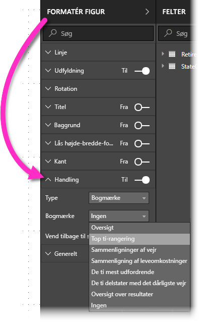

Du kan gøre mange forskellige interessante ting med bogmærker, der har tilknyttet et objekt. Du kan oprette en visuel tabel med indhold på din rapportside, eller du kan angive forskellige visninger (f.eks. visuelle typer) med de samme oplysninger.

Når du er i redigeringstilstand, skal du trykke på **Ctrl** og vælge linket for at følge det. Når du ikke er i redigeringstilstand, skal du markere objektet for at følge linket. 

## Bogmærkegrupper

Fra og med august 2018-versionen af Power BI Desktop kan du oprette og bruge bogmærkegrupper. En bogmærkegruppe er en samling af bogmærker, som du angiver, og som kan vises og organiseres som en gruppe. 

Sådan opretter du en bogmærkegruppe: 
1. Tryk på **Ctrl**, og vælg de bogmærker, du vil medtage i gruppen. 

2. Vælg ellipsen ud for dine valgte bogmærker, og vælg derefter **Gruppe** i den menu, der vises.

   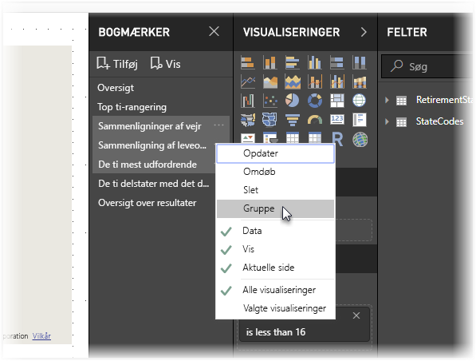

Power BI Desktop kalder automatisk gruppen for *Gruppe 1*. Du kan vælge ellipsen ud for dette navn, vælge **Omdøb** og omdøbe den til det, du ønsker.

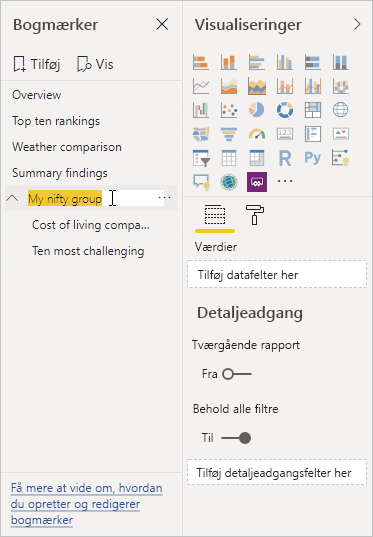

Hvis du udvider navnet på en bogmærkegruppe, er det kun bogmærkegruppen, der udvides eller skjules som med alle bogmærkegrupper. Selve gruppenavnet repræsenterer ikke et bogmærke. 

Når du bruger funktionen **Vis** med bogmærker, anvendes følgende oplysninger:

* Hvis det valgte bogmærke er i en gruppe, når du vælger **Vis** fra bogmærkerne, er det kun bogmærkerne *i den pågældende gruppe*, der vises. 

* Hvis det valgte bogmærke ikke er i en gruppe, eller det er på øverste niveau (f.eks navnet på en bogmærkegruppe), vises alle bogmærkerne for hele rapporten, herunder bogmærkerne i en gruppe. 

Sådan opdeler du gruppering af bogmærker: 
1. Vælg et bogmærke i en gruppe, og vælg ellipsen. 

2. Vælg **Opdel gruppe** i den menu, der vises.

   

   Hvis du vælger **Opdel gruppe** for et bogmærke i en gruppe, fjernes alle bogmærkerne fra gruppen. Det er kun gruppen, der slettes, ikke selve bogmærkerne. 

Sådan fjerner du et enkelt bogmærke fra en gruppe: 
1. **Opdel grupperingen** for et hvilket som helst medlem af gruppen. Derved slettes hele grupperingen. 

2. Vælg de ønskede medlemmer i den nye gruppe ved at trykke på **Ctrl** og vælge de enkelte bogmærker, og vælg derefter **Gruppe** igen. 

## Brug spotlight
En anden funktion, der er udgivet sammen med bogmærker, er *spotlight*. Du kan bruge spotlight til at fremhæve et bestemt diagram, f.eks. når du viser dine bogmærker i tilstanden **Vis**.

Lad os sammenligne spotlight med fokustilstanden for at se, hvordan de adskiller sig fra hinanden:

1. I fokustilstand skal du vælge ikonet **Fokustilstand** for et visuelt element, hvilket medfører, at det visuelle element udfylder hele lærredet.

2. Med spotlight kan du vælge **Spotlight** fra ellipsen for et visuelt element for at fremhæve ét visuelt element i den oprindelige størrelse, hvilket medfører, at alle andre visuelle elementer på siden kan udtones til at blive næsten gennemsigtige. 

Når du vælger ikonet **Fokustilstand** for det visuelle element i det forrige billede, vises siden på følgende måde:

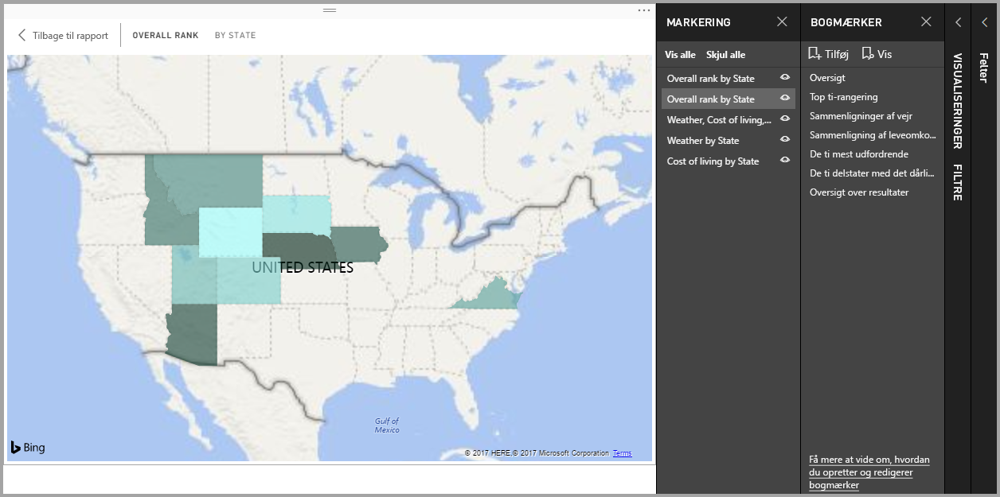

Når **Spotlight** derimod er valgt i ellipsemenuen for det visuelle element, ser siden sådan ud:

Hvis fokus- eller spotlighttilstanden er markeret, når du tilføjer et bogmærke, bevares den pågældende tilstand i bogmærket.

## Bogmærker i Power BI-tjenesten
Når du publicerer en rapport i Power BI-tjenesten med mindst ét bogmærke, kan du få vist og interagere med disse bogmærker i Power BI-tjenesten. Når bogmærker er tilgængelige i en rapport, kan du få vist ruderne **Markering** og **Bogmærker** ved at vælge **Vis** > **ruden Markering** eller **Vis** > **ruden Bogmærker**. 

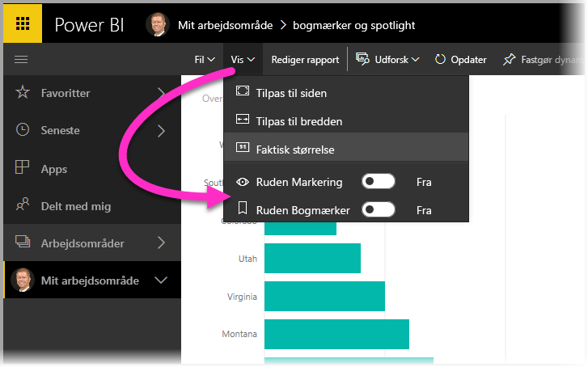

I Power BI-tjenesten fungerer ruden **Bogmærker** på samme måde som i Power BI Desktop, dvs. du har også mulighed for at vælge **Vis** for at få vist dine bogmærker i rækkefølge, f.eks. som et slideshow.

Brug den grå titellinje for bogmærker i stedet for de sorte pile til at navigere gennem bogmærkerne. (De sorte pile flytter dig gennem rapportsider, ikke bogmærker).

## Aktivér eksempelvisning af bogmærker (versioner fra før marts 2018)
Bogmærker er generelt tilgængelige fra og med versionen fra marts 2018 af Power BI Desktop. 

Det anbefales altid at opgradere til den nyeste version. Hvis din version af Power BI Desktop derimod er tidligere end dette, kan du prøve bogmærkefunktionen fra og med oktober 2017-versionen af Power BI Desktop samt i Power BI-tjenesten i forbindelse med rapporter, hvor bogmærker er aktiveret. 

Sådan aktiverer du funktionen til eksempelvisning af bogmærker: 

1. Vælg **Filer** > **Indstillinger** > **Indstillinger** > **Prøveversionsfunktioner**, og vælg derefter **Bogmærker**. 

   

2. Genstart Power BI Desktop for at aktivere prøveversionen af bogmærker.

## Begrænsninger og overvejelser
I denne version af bogmærkefunktioner er der nogle få begrænsninger og overvejelser at tage betragtning.

* De fleste brugerdefinerede visuals fungerer fint sammen med bogmærker. Men hvis du oplever problemer med et bogmærke og en brugerdefineret visual, kan du kontakte forfatteren af denne visual og bede om at få føjet understøttelse af bogmærker til deres visuals. 
* Hvis du tilføjer et visuelt element på en rapportside, når du har oprettet et bogmærke, vises det visuelle element i standardtilstanden. Det vil sige, at hvis du vil tilføje et udsnit på en side, hvor du tidligere har oprettet bogmærker, optræder udsnittet i standardtilstanden.
* Hvis du flytter rundt på et visuelt element, efter at der er oprettet et bogmærke, afspejles det automatisk i bogmærket. 

## De næste trin
Du kan finde flere oplysninger om de funktioner, der ligner eller interagerer med bogmærker, i følgende artikler:

* [Brug detaljeadgang i Power BI Desktop](desktop-drillthrough.md)
* [Vis et dashboardfelt eller en rapportvisualisering i fokustilstand](consumer/end-user-focus.md)

