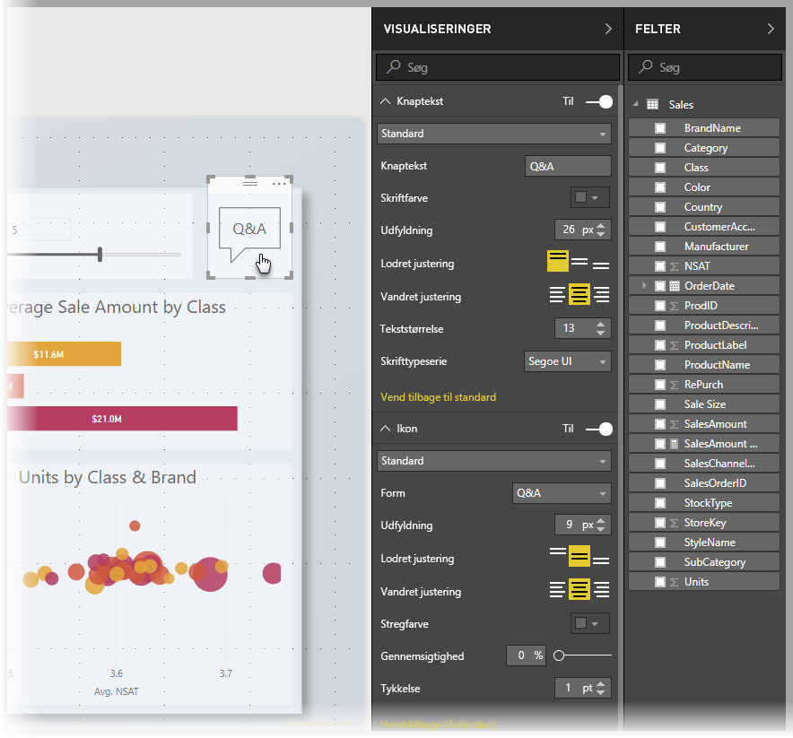
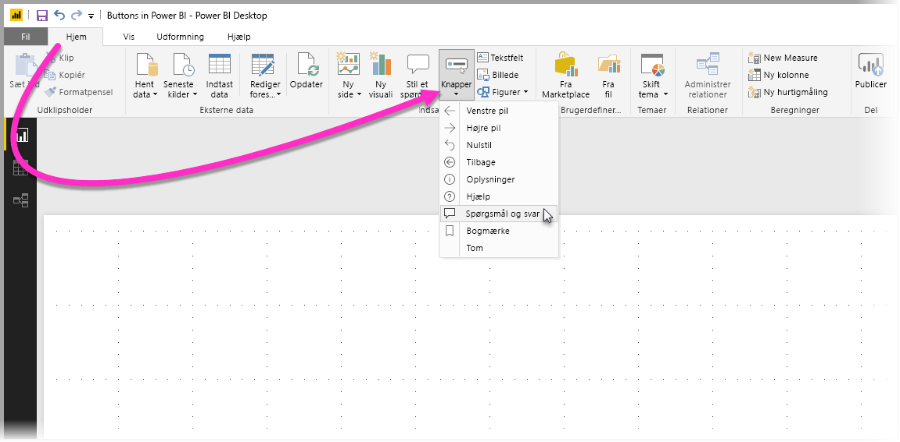
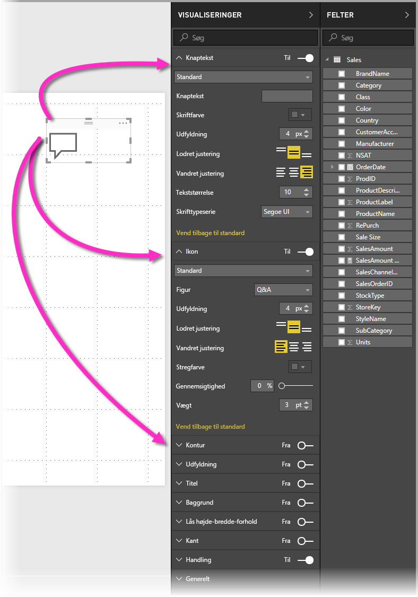
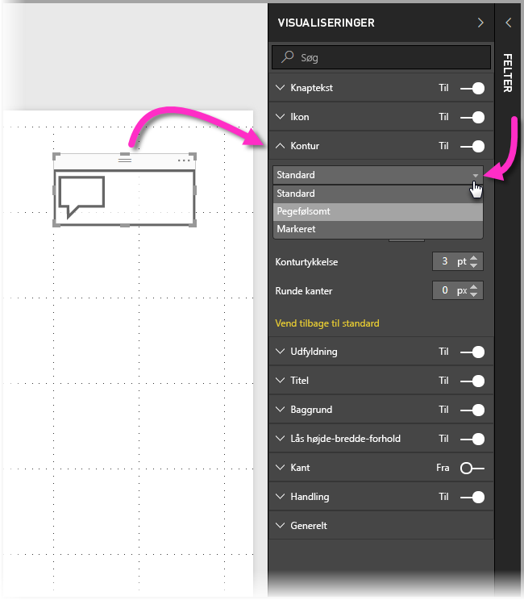

# Brug af knapper i Power BI
Ved hjælp af **knapper** i Power BI kan du oprette rapporter og dashboards, der fungerer på samme måde som apps, og dermed skabe et indtagende miljø, så brugerne kan holde over, klikke og yderligere interagere med Power BI-indhold. Du kan føje knapper til rapporter i **Power BI Desktop** og dele eller publicere disse rapporter i Power BI-tjenesten, så der oprettes dashboards, der giver brugerne en funktionsmåde, som ligner den i apps.

Knapper, som du opretter i **Power BI Desktop**, kan bruges i rapporter eller dashboards, der publiceres i **Power BI-tjenesten**.

## Oprettelse af knapper i rapporter
Du opretter knapper i en rapport i **Power BI Desktop** på følgende måde: På båndet **Hjem** skal du vælge **Knapper**. Så vises der en rullemenu, hvor du kan vælge mellem en række knapper og finde den, du vil have, som vist på følgende billede. 

Når du opretter en knap og vælger den på rapportcanvasset, kan du i ruden **Visualiseringer** se mange måder, som du kan tilpasse knappen på, så den passer til dine behov. Du kan f.eks. slå **Knaptekst** til eller fra ved at skifte skyderen på det pågældende kort i ruden **Visualiseringer**. Du kan redigere flere egenskaber for knappen. Du kan bl.a. ændre ikonet for knappen, udfyldning af knappen, titlen eller den handling, som udføres, når brugerne klikker på knappen i en rapport eller på et dashboard.

## Angiv egenskaber for knappen, når den er inaktiv, når der holdes over den, eller når den vælges

Der er tre tilstande for knapper i Power BI: standard (den måde de vises på, når der ikke holdes over dem, eller når de ikke vælges), når der holdes over dem, eller når de vælges (hvilket ofte omtales som "når der *klikkes* på dem"). Mange af kortene i ruden **Visualiseringer** kan ændres enkeltvist på baggrund af de tre tilstande, hvilket medfører masser af fleksibilitet til at tilpasse knapperne.

På følgende kort i ruden **Visualiseringer** kan du justere formateringen eller funktionsmåden af en knap på baggrund af de tre tilstande:

* Knaptekst
* Ikon
* Kontur
* Udfyldning

For hver tilstand kan du vælge, hvordan knappes skal fremstå. Udvid ét af disse kort, og vælg den rullemenu, der vises øverst på kortet. På følgende billede kan du se, at kortet **Kontur** udvidet med rullemenuen valgt for at vise de tre tilstande:

## Vælg handlingen for knappen

Du kan vælge, hvilken handling der udføres, når en bruger vælger en knap i Power BI. Du får adgang til indstillingerne for knappens handlinger via kortet **Handling** i ruden **Visualiseringer**.

Indstillingerne for en knaps handlinger er:

* Tilbage
* Bogmærke
* Spørgsmål og svar

Når **Tilbage** vælges, vender brugeren tilbage til den forrige side i rapporten. Dette er særligt nyttigt for sider med detailudledning.

Når **Bogmærke** vælges, præsenteres den rapportside, der er knyttet til et bogmærke, som er defineret for den aktuelle rapport. Du kan [få mere at vide om bogmærker i Power BI](desktop-bookmarks.md). 

Når **Spørgsmål og svar** vælges i rullemenuen, vises vinduet **Stifinder med spørgsmål og svar**. 

For nogle knapper er der valgt en standardhandling automatisk. For knappen **Spørgsmål og svar** er **Spørgsmål og svar** f.eks. valgt automatisk som standardhandling. Du kan få mere at vide om **Stifinder med spørgsmål og svar** i [dette blogindlæg](https://powerbi.microsoft.com/blog/power-bi-desktop-april-2018-feature-summary/#Q&AExplorer).

Du kan prøve eller teste de knapper, du opretter for din rapport, ved hjælp af *Ctrl + klik* på den knap, du vil bruge. 

## Næste trin
Du kan finde flere oplysninger om de funktioner, der er ens eller interagerer med knapper, i følgende artikler:

* [Brug detaljeadgang i Power BI Desktop](desktop-drillthrough.md)
* [Vis et dashboardfelt eller en rapport i fokustilstand](service-focus-mode.md)
* [Brug bogmærker til at dele indsigt og oprette historier i Power BI](desktop-bookmarks.md)

