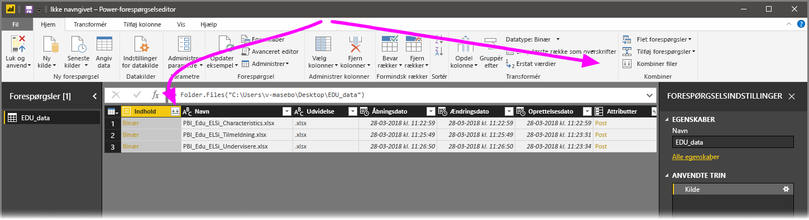
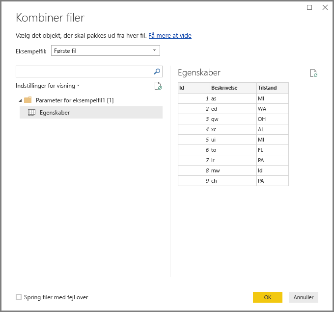
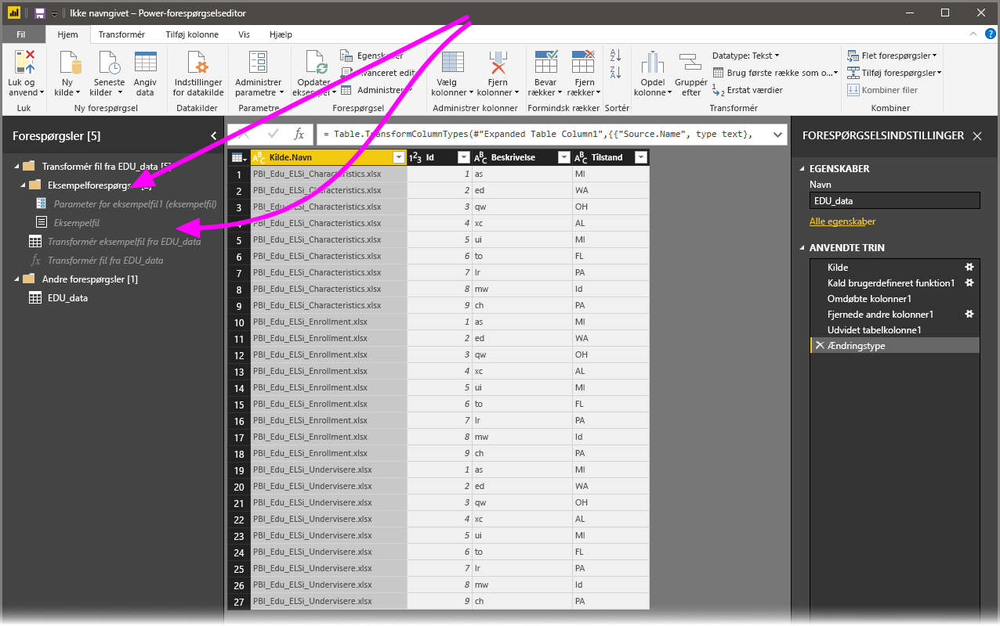

# Kombiner filer (binære) i Power BI Desktop
En effektiv måde at importere data på i **Power BI Desktop** er at kombinere flere filer, som har det samme skema, til en enkelt logisk tabel. I versionen af **Power BI Desktop** fra november 2016 (og efterfølgende versioner) er denne praktiske og populære metode blevet nemmere og mere omfattende, som beskrevet i denne artikel.

For at komme i gang med at kombinere filer fra samme mappe skal du vælge **Hent data > Filer > Mappe**.

## Tidligere funktionsmåde for kombination af filer (binære)
Før versionen af **Power BI Desktop** fra november 2016 blev denne funktionalitet kaldt for **Kombiner binære**, og du kunne kombinere bestemte filtyper med transformationen **Kombiner binære**, men der var nogle begrænsninger:

* Transformeringer blev ikke taget i betragtning for hver enkelt fil, før filerne blev komprimeret til en enkelt tabel. Du var derfor ofte nødt til at kombinere filer og derefter filtrere *headerværdierne* ud ved at filtrere rækker som en del af redigeringsprocessen.
* Transformeringen ved at **kombinere binære filer** fungerede kun for *tekst*- eller *CSV*-filer og kunne ikke anvendes på andre understøttede filformater f.eks. Excel-projektmapper, JSON-filer og andre.

Kunder har anmodet om en mere intuitiv håndtering af handlingen **Kombiner binære**, så transformationen er blevet forbedret og omdøbt til **Kombiner filer**.

## Nuværende funktionsmåde for kombination af filer
**Power BI Desktop** håndterer nu **Kombiner filer (binære)** mere effektivt. Du starter ved at vælge **Kombiner filer** enten på båndet **Hjem** i **Forespørgselseditor** eller fra selve kolonnen.

Transformationen **Kombiner filer** fungerer nu på følgende måde:

* Transformationen **Kombiner filer** analyserer de enkelte inputfiler og bestemmer det rette filformat, der skal bruges, f.eks. en fil af typen *tekst* eller *Excel-projektmappe* eller *JSON*.
* Transformeringen giver dig mulighed for at vælge et bestemt objekt fra den første fil, f.eks. en *Excel-projektmappe*, der skal trækkes ud.
  
  
* **Kombiner filer** udfører derefter automatisk følgende forespørgsler:
  
  * Opretter et eksempel på en forespørgsel, der udfører alle nødvendige udtrækningstrin i en enkelt fil.
  * Opretter en *funktionsforespørgsel*, der angiver parametre for filen/det binære input i *eksempelforespørgslen*. Exempelforespørgslen og funktionsforespørgslen er kædet sammen, så ændringer i eksempelforespørgslen afspejles i funktionsforespørgslen.
  * Anvender *funktionsforespørgslen* på den oprindelige forespørgsel med binære inputfiler (f.eks. forespørgslen *Mappe*), så den anvender funktionsforespørgslen for binære inputfiler på de enkelte rækker og derefter udvider det resulterende dataudtræk som kolonner på øverste niveau.
    
    

Med den nye funktionsmåde for **Kombiner filer** kan du nemt kombinere alle filer i en bestemt mappe, så længe de har samme filtype og struktur (f.eks. de samme kolonner).

Derudover kan du nemt kan anvende yderligere transformations- eller udtrækningstrin ved at ændre den automatisk oprettede *eksempelforespørgsel* uden at skulle bekymre dig om at ændre eller oprette yderligere trin til *funktionsforespørgslen*. Ændringer i *eksempelforespørgslen* oprettes automatisk i den tilknyttede *funktionsforespørgsel*.

## Næste trin
Du kan oprette forbindelse til mange forskellige typer data ved hjælp af Power BI Desktop. Du kan finde flere oplysninger om datakilder i følgende ressourcer:

* [Hvad er Power BI Desktop?](desktop-what-is-desktop.md)
* [Datakilder i Power BI Desktop](desktop-data-sources.md)
* [Udform og kombiner data med Power BI Desktop](desktop-shape-and-combine-data.md)
* [Opret forbindelse til CSV-filer i Power BI Desktop](desktop-connect-csv.md)   
* [Angiv data direkte i Power BI Desktop](desktop-enter-data-directly-into-desktop.md)   

