# Almindelige forespørgselsopgaver i Power BI Desktop
Når du arbejder i vinduet **Forespørgselseditor** i Power BI Desktop, er der nogle få opgaver, der udføres jævnligt. Dette dokument beskriver disse opgaver og indeholder links til flere oplysninger. 

Følgende almindelige forespørgselsopgaver vises her:

* Opret forbindelse til data
* Form og kombiner data
* Gruppér rækker
* Pivoter kolonner
* Opret brugerdefinerede kolonner
* Forespørgselsformler

Vi vil bruge dataforbindelser til at udføre disse opgaver. Du kan hente eller oprette forbindelse til disse data, hvis du vil gennemgå opgaverne selv.

Den første dataforbindelse er en Excel-projektmappe, som du kan downloade fra [dette link](http://download.microsoft.com/download/5/7/0/5701F78F-C3C2-450C-BCCE-AAB60C31051D/PBI_Edu_ELSi_Enrollment_v2.xlsx). Den anden er en webressource, som også bruges i andet indhold i hjælpen til Power BI Desktop, og som kan åbnes her:

[*http://www.bankrate.com/finance/retirement/best-places-retire-how-state-ranks.aspx*](http://www.bankrate.com/finance/retirement/best-places-retire-how-state-ranks.aspx)

De trin, der er nødvendige for at oprette forbindelse til begge disse datakilder, er, hvor de almindelige forespørgselsopgaver begynder.

## Opret forbindelse til data
Hvis du vil oprette forbindelse til data i Power BI Desktop, skal du vælge knappen **Hent data** under fanen **Hjem** på båndet. Der vises en menu med de mest almindelige datakilder i Power BI Desktop. Vælg knappen **Mere...**  nederst i menuen for at få vist en komplet liste over de datakilder, der kan oprettes forbindelse til i Power BI Desktop. Du kan finde flere oplysninger i [Datakilder i Power BI Desktop](https://docs.microsoft.com/power-bi/desktop-data-sources).

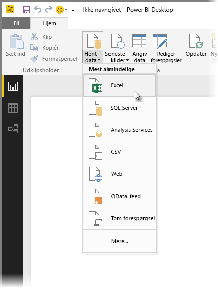

Begynd med at vælge **Excel**, gå til projektmappen, og vælg den. Projektmappen undersøges, og derefter vises de data, der blev fundet, i vinduet **Navigator**.

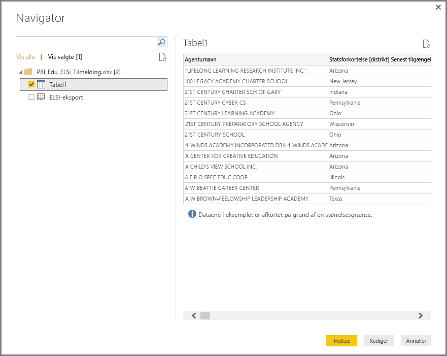

Du kan vælge **Rediger** for at justere eller *forme* dataene, før du indlæser dem i Power BI Desktop. Det er praktisk at redigere en forespørgsel, inden du indlæser den, når du arbejder med store datasæt, som du vil reducere før indlæsning. Det vil vi gerne gøre, så vi vælger **Rediger**.

Det er lige så nemt at oprette forbindelse til andre datatyper. Vi vil også til oprette forbindelse til en webressource. Vælg **Hent Data \> Mere...** , og vælg derefter **Andre \> Web**.

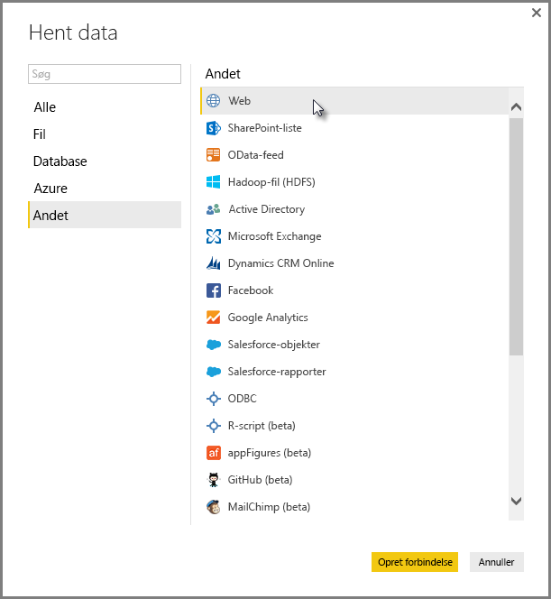

Vinduet **Fra web** vises, hvor du kan indtaste URL-adressen til websiden.

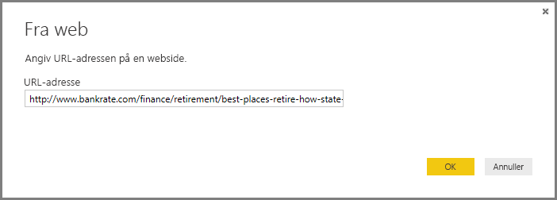

Vælg **OK**, og præcis som før undersøges mappen i Power BI Desktop, og de data, der findes, vises i vinduet **Navigator**.

Det samme gælder for andre dataforbindelser. Hvis godkendelse er nødvendig for at oprette en dataforbindelse, bliver du bedt om at angive de relevante legitimationsoplysninger i Power BI Desktop.

Hvis du vil have en trinvis vejledning til, hvordan du opretter forbindelse til data i Power BI Desktop, skal du se [Opret forbindelse til data i Power BI Desktop](https://docs.microsoft.com/power-bi/desktop-connect-to-data).

## Form og kombiner data
Du kan nemt forme og kombinere data ved hjælp af Forespørgselseditor. Dette afsnit indeholder nogle eksempler på, hvordan du kan forme data. Hvis du vil have en mere komplet demonstration af, hvordan du former og kombinere data, skal du se **[Form og kombiner data med Power BI Desktop](https://docs.microsoft.com/power-bi/desktop-shape-and-combine-data)**.

I det forrige afsnit tilsluttede vi to datasæt – en Excel-projektmappe og en webressource. Når dataene indlæses i Forespørgselseditor, får vi vist følgende, hvor forespørgslen fra websiden er valgt (taget fra de tilgængelige forespørgsler, der er angivet i ruden **Forespørgsler** i venstre side af vinduet Forespørgselseditor).

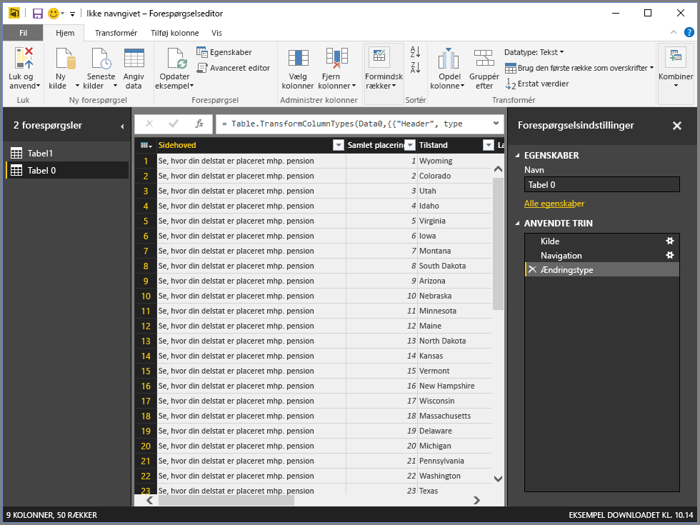

Når du former data, konverterer du en datakilde til den form og det format, der opfylder dine behov. I dette tilfælde har vi ikke brug for den første kolonne med navnet *Header*, så den fjerner vi.

Du kan finde mange af kommandoerne på båndet og i en kontekstafhængig genvejsmenu i **Forespørgselseditor**. Når du f.eks. højreklikker på kolonnen *Header*, kan du bruge den viste menu til at fjerne kolonnen. Du kan også markere kolonnen og derefter vælge knappen **Fjern kolonner** på båndet.

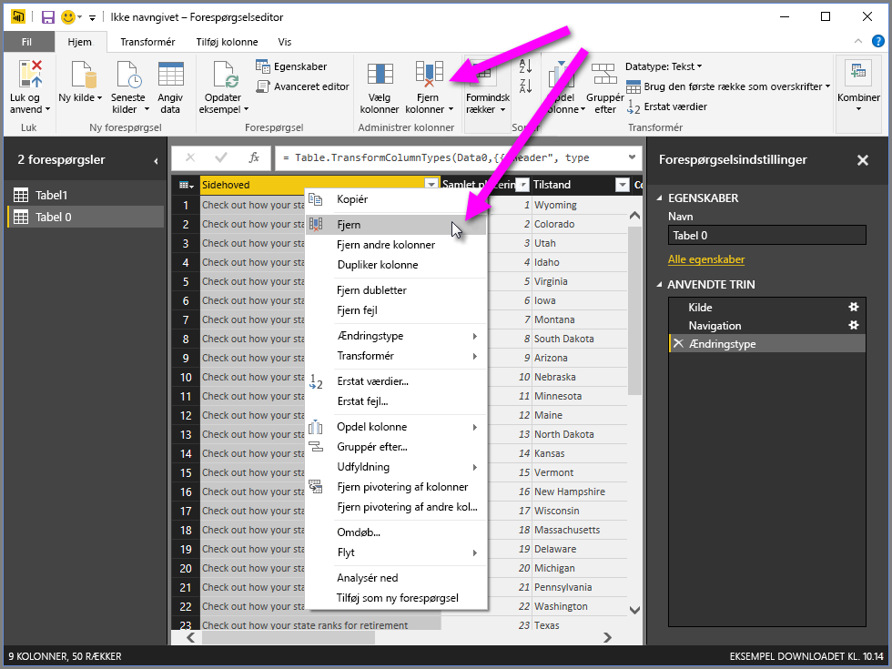

Der er mange andre måder, du kan forme dataene i denne forespørgsel på. Du kan fjerne et vilkårligt antal rækker fra toppen eller fra bunden. Du kan indsætte kolonner, opdele kolonner, erstatte værdier og udføre andre opgaver, der former dataene, for at få Forespørgselseditor til at vise dataene, som du vil have det.

## Gruppér rækker
Du kan gruppere værdierne i flere rækker i én enkelt værdi i Forespørgselseditor. Det kan være nyttigt, når du opsummerer det antal produkter, der tilbydes, det samlede salg eller antallet af studerende.

I dette eksempel grupperer vi rækker i et datasæt med uddannelsestilmeldinger. Dataene er fra en Excel-projektmappe og er blevet formet i Forespørgselseditor, så det kun er de kolonner, vi har brug for, der er blevet hentet. Tabellen er også blevet omdøbt, og der er også udført nogle andre transformeringer.

Lad os at finde ud af, hvor mange instanser hver stat har. Dette omfatter skoledistrikter og andre uddannelsesinstanser, f.eks regionale tjenestedistrikter osv. Vi vælger kolonnen *State Abbr* og vælger derefter knappen **Gruppér efter** under fanen **Transformér** eller fanen **Hjem** på båndet. **Gruppér efter** findes under begge faner.

Vinduet **Gruppér efter...** vises. Når rækker grupperes i Forespørgselseditor, oprettes der en ny kolonne, som resultaterne fra **Gruppér efter** placeres i. Du kan justere handlingen **Gruppér efter** på følgende måder:

1. *Gruppér efter* – dette er den kolonne, der skal grupperes. Den markerede kolonne vælges i Forespørgselseditor, men du kan ændre den til en hvilken som helst kolonne i tabellen i dette vindue.
2. *Nyt kolonnenavn* – der foreslås et navn til den nye kolonne i Forespørgselseditor, der er baseret på den handling, som anvendes på den kolonne, der grupperes. Men du kan også selv vælge et navn til den nye kolonne.
3. *Handling* – her angiver du den handling, som anvendes i Forespørgselseditor.
4. *Tilføj gruppering* og *Tilføj aggregering* – disse indstillinger vises, efter du har valgt indstillingen **Avanceret**. Du kan udføre grupperingshandlinger (handlinger af typen **Gruppér efter**) på flere kolonner og udføre flere aggregeringer samtidigt direkte fra vinduet **Gruppér efter**. Der oprettes en ny kolonne i Forespørgselseditor (ud fra dine valg i dette vindue), som er baseret på flere kolonner. 

Vælg knappen **Tilføj gruppering** eller **Tilføj aggregering** for at føje flere grupperinger eller aggregeringer til en handling af typen **Gruppér efter**. Du kan fjerne en gruppering eller aggregering ved at vælge ikonet **...** og vælge **Slet**. Så prøv det, og se, hvordan det kommer til at se ud.
   
   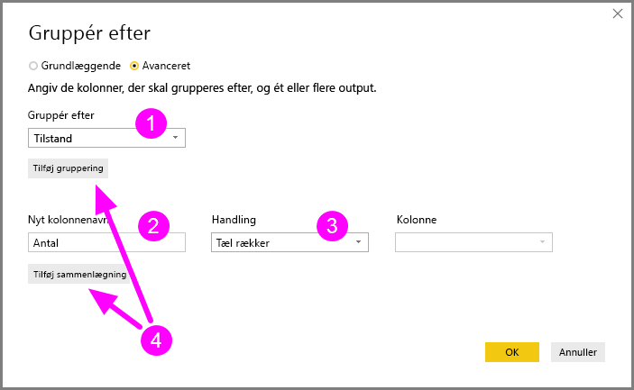

Når vi vælger **OK**, udføres handlingen **Gruppér efter**, og resultaterne returneres. Vi kan se, at Ohio, Texas, Illinois og Californien hver især har over 1.000 instanser!

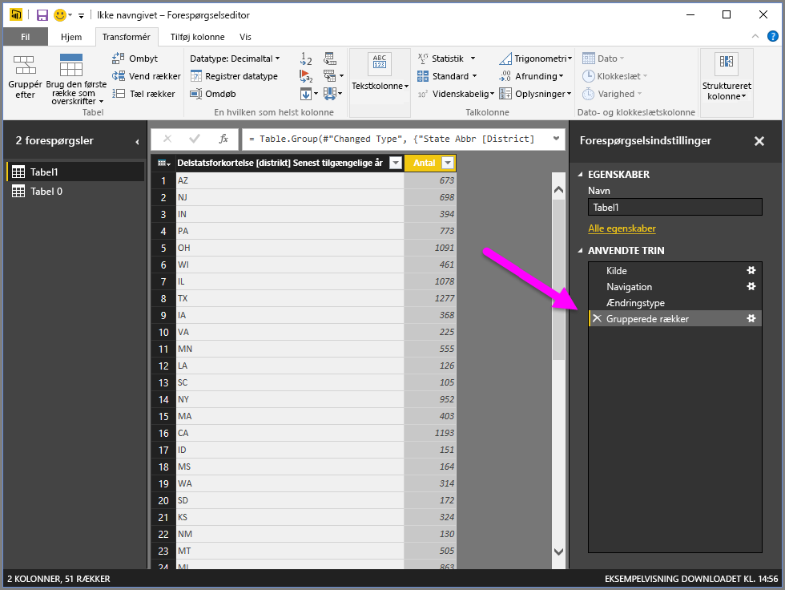

Og med Forespørgselseditor kan du altid fjerne den sidste udformningshandling ved at vælge **X** ud for det trin, der netop er udført. Så prøv at eksperimentere, gentag trinnene, hvis du ikke kan lide resultaterne, indtil dine data vises, som du vil have det, i Forespørgselseditor.

## Pivoter kolonner
Du kan pivotere kolonner i Power BI Desktop, og du kan også oprette en tabel med de aggregerede værdier for hver entydig værdi i en kolonne. Hvis du f.eks. har brug for at vide, hvor mange forskellige produkter du har i hver produktkategori, kan du hurtigt oprette en tabel, som gør netop det.

Lad os se på et eksempel. Tabellen **Products** nedenfor er blevet formet, så et produkt kun vises én gang (efter navn), og hvilken kategori det tilhører. Hvis du vil oprette en ny tabel, som viser antallet af produkter i hver kategori (baseret på kolonnen *CategoryName*), skal du markere kolonnen og derefter vælge **Pivotkolonne** under fanen **Transformér** på båndet.

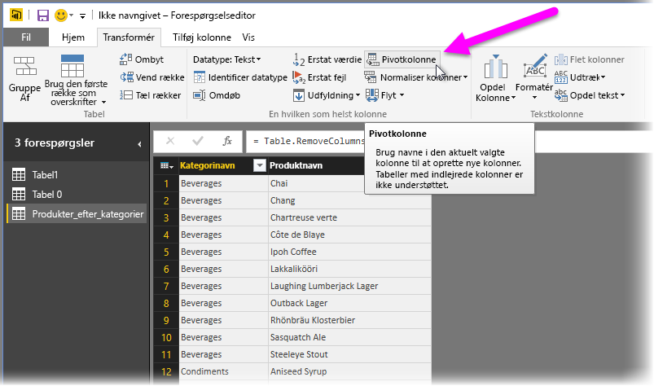

Vinduet **Pivotkolonne** vises. Her kan du se, hvilken kolonnes værdier der vil blive brugt til at oprette nye kolonner (1), og når du udvider **Avancerede indstillinger** (2), kan du vælge den funktion, der skal anvendes på de aggregerede værdier (3).

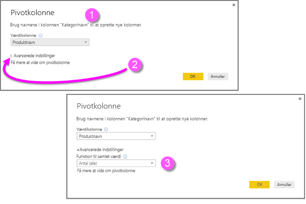

Når du vælger **OK**, vises tabellen i Forespørgselseditor ifølge de indstillinger, du har angivet i vinduet **Pivotkolonne**.

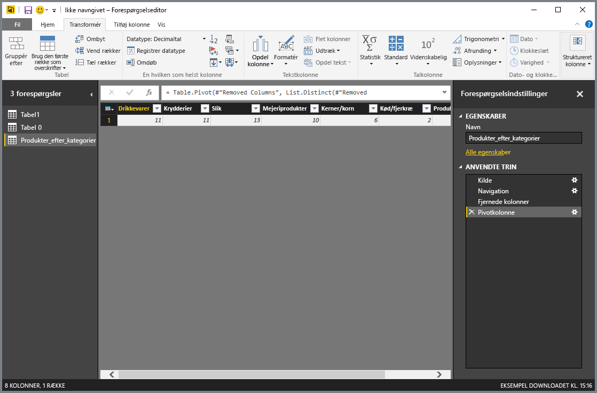

## Opret brugerdefinerede kolonner
Du kan oprette brugerdefinerede formler i Forespørgselseditor, som køres på flere kolonner i tabellen. Resultaterne af disse formler vises derefter i en ny, brugerdefineret kolonne. Forespørgselseditor gør det nemt at oprette brugerdefinerede kolonner.

Vælg **Brugerdefineret kolonne** under fanen **Tilføj kolonne** på båndet i Forespørgselseditor.

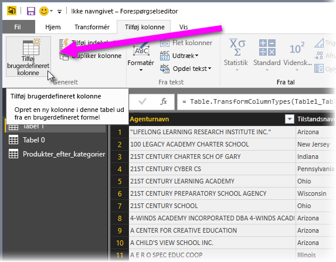

Følgende vindue vises. I følgende eksempel opretter vi en brugerdefineret kolonne med navnet *Percent ELL*, som beregner procentdelen af alle de studerende, der er ELL (English Language Learners).

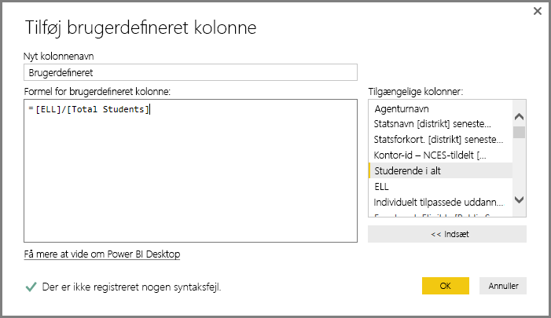

På samme måde som med alle andre trin i Forespørgselseditor kan du slette et trin i sektionen **Anvendte trin** i ruden **Forespørgselsindstillinger** ved at vælge **X** ud for trinnet **Tilføjet brugerdefineret**, hvis den nye brugerdefinerede kolonne ikke viser de data, du skal bruge.

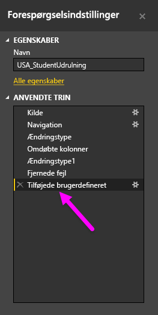

## Forespørgselsformler
Du kan redigere de trin, som oprettes i Forespørgselseditor, og du kan oprette brugerdefinerede formler for at få fuld kontrol over, hvordan du opretter forbindelse til og former dine data. Når der udføres en handling på data i Forespørgselseditor, vises den formel, der er tilknyttet handlingen, på **formellinjen**. Du kan få vist **formellinjen** ved at markere afkrydsningsfeltet ud for **Formellinje** under fanen **Vis** på båndet.

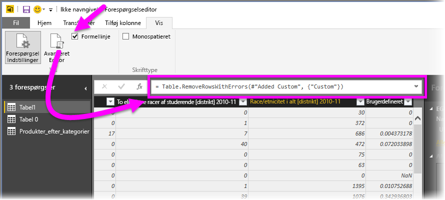

Alle anvendte trin for hver forespørgsel bevares som tekst i Forespørgselseditor, så du kan se eller redigere dem. Du kan se eller redigere teksten i alle forespørgsler ved hjælp af **Avanceret editor**, som vises, når du vælger **Avanceret editor** under fanen **Vis** på båndet.

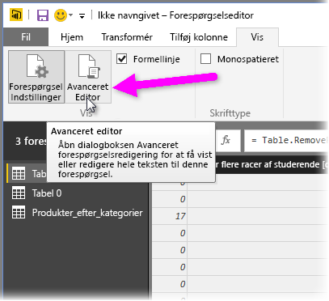

Her kan du se, hvordan **Avanceret editor** ser ud med de forespørgselstrin, der er tilknyttet den viste forespørgsel **USA\_StudentEnrollment**. Disse trin oprettes på det formelsprog i Power-forespørgsel, som ofte kaldes **M**. Du kan finde flere oplysninger i [Få mere at vide om formler i Power-forespørgsel](https://support.office.com/article/Learn-about-Power-Query-formulas-6bc50988-022b-4799-a709-f8aafdee2b2f?ui=en-US&rs=en-US&ad=US). Hvis du vil se selve sprogspecifikationen, skal du downloade [sprogspecifikationen for Microsoft Power-forespørgsel til Excel-formler](http://go.microsoft.com/fwlink/?linkid=320633).

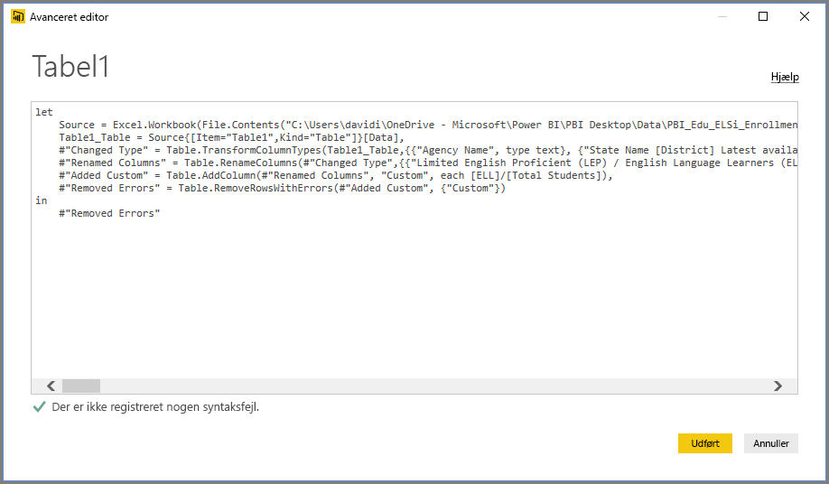

Der findes en lang række formelkategorier i Power BI Desktop. Du kan finde flere oplysninger og en komplet liste over alle formler i Forespørgselseditor ved at gå til [Formelkategorier i Power-forespørgsel](https://support.office.com/article/Power-Query-formula-categories-125024ec-873c-47b9-bdfd-b437f8716819).

Der findes følgende formelkategorier for Forespørgselseditor:

* Tal
  * Konstanter
  * Oplysninger
  * Konvertering og formatering
  * Format
  * Afrunding
  * Handlinger
  * Tilfældigt
  * Trigonometri
  * Byte
* Tekst
  * Oplysninger
  * Tekstsammenligninger
  * Udtræk
  * Ændring
  * Medlemskab
  * Transformationer
* Logisk
* Dato
* Klokkeslæt
* DateTime
* DateTimeZone
* Varighed
* Post
  * Oplysninger
  * Transformationer
  * Markering
  * Serialisering
* Liste
  * Oplysninger
  * Markering
  * Transformation
  * Medlemskab
  * Datasæt
  * Sortering
  * Gennemsnit
  * Addition
  * Tal
  * Generatorer
* Tabel
  * Oprettelse af tabel
  * Konverteringer
  * Oplysninger
  * Rækkehandlinger
  * Kolonnehandlinger
  * Medlemskab
* Værdier
* Aritmetiske handlinger
* Parametertyper
* Metadata
* Adgang til data
* URI
* Binære formater
  * Læsning af tal
* Binær
* Linjer
* Udtryk
* Funktion
* Fejl
* Sammenligningsfunktioner
* Opdelingsfunktioner
* Samlefunktion
* Erstatningsfunktioner
* Type

## Næste trin
Du kan gøre mange forskellige ting med Power BI Desktop. Du kan finde flere oplysninger om funktionerne i følgende ressourcer:

* [Hvad er Power BI Desktop?](desktop-what-is-desktop.md)
* [Oversigt over forespørgsler i Power BI Desktop](desktop-query-overview.md)
* [Datakilder i Power BI Desktop](desktop-data-sources.md)
* [Opret forbindelse til data i Power BI Desktop](desktop-connect-to-data.md)
* [Udform og kombiner data med Power BI Desktop](desktop-shape-and-combine-data.md)

