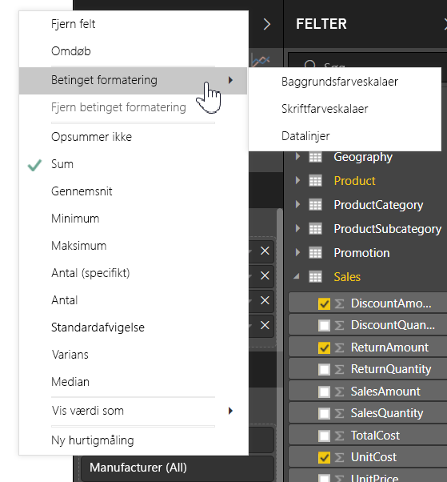
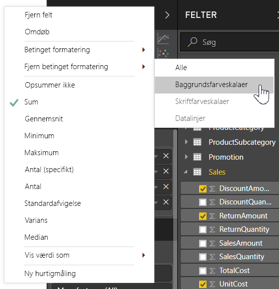
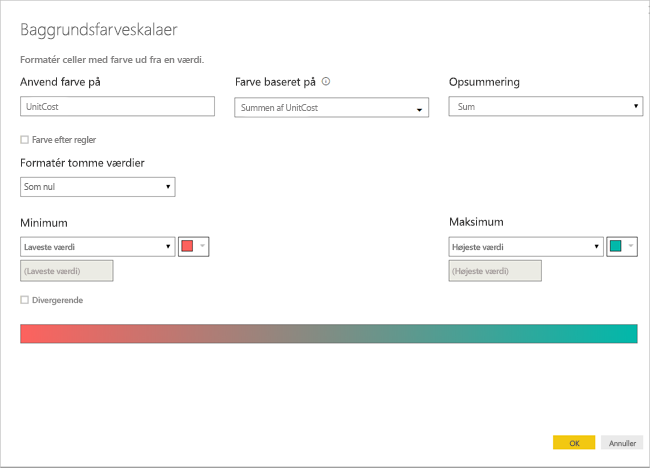
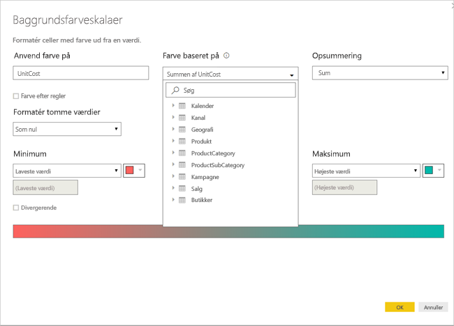
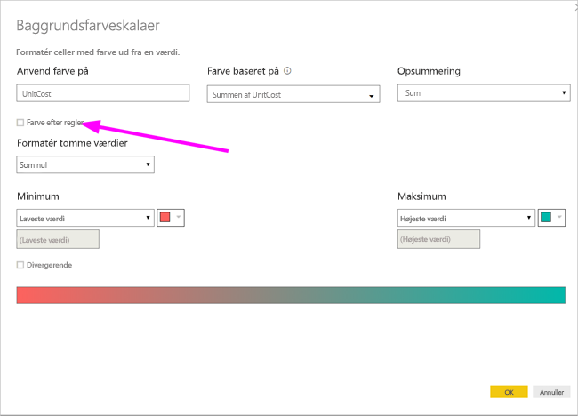
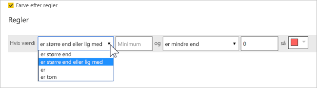
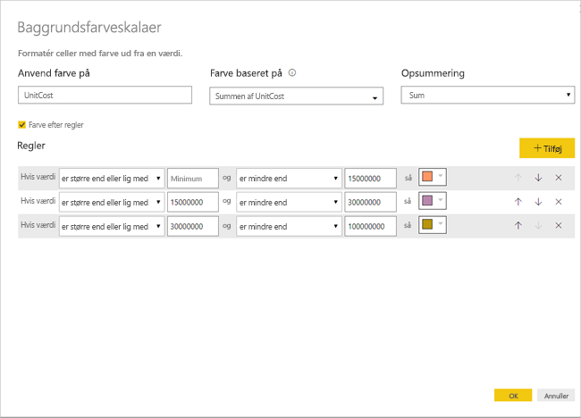
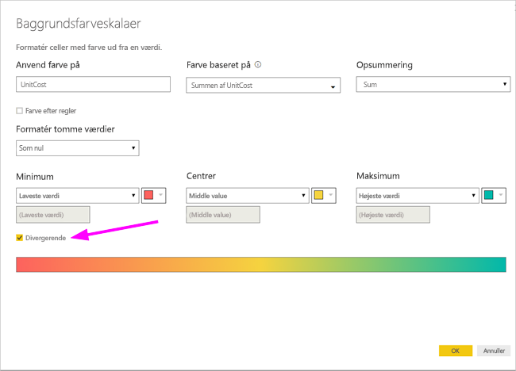
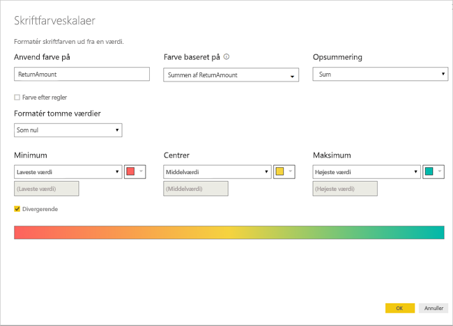
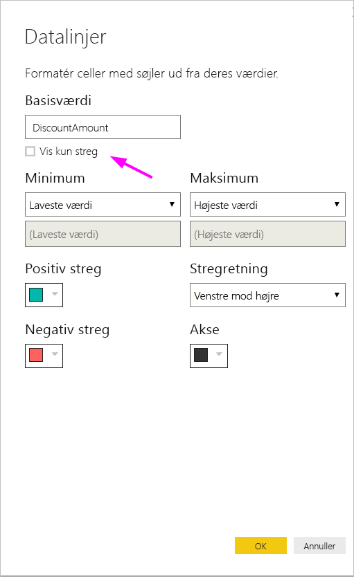

# Betinget formatering af tabeller 
Med betinget formatering af tabeller kan du angive brugerdefinerede farver for celler baseret på celleværdier eller baseret på andre værdier eller felter, og du kan bruge gradueringsfarver. Du kan også få vist celleværdier med datalinjer. 

Du får adgang til betinget formatering på følgende måde: I brønden **Felter** i ruden **Visualiseringer** i Power BI Desktop skal du vælge pil ned ved siden af værdien i brønden **Værdier**, som du vil formatere (eller du skal højreklikke på feltet). Du kan kun administrere betinget formatering for felter i området **Værdier** under **Felter**.

I de følgende afsnit beskrives hver af disse tre indstillinger for betinget formatering. En eller flere indstillinger kan kombineres i en enkelt tabelkolonne.

> [!NOTE]
> Når betinget formatering anvendes på en tabel, tilsidesættes alle brugerdefinerede tabelformater, som er anvendt i celler med betinget formatering.

Hvis du vil fjerne betinget formatering fra en visualisering, skal du blot højreklikke på feltet igen, vælge **Fjern betinget formatering** og derefter vælge den type formatering, du vil fjerne.

## Baggrundsfarveskalaer

Hvis du vælger **Betinget formatering** og derefter **Baggrundsfarveskalaer** vises følgende dialogboks.

Du kan vælge et felt fra din datamodel, som farverne skal baseres på, ved at angive **Farve baseret på** for dette felt. Desuden kan du angive sammenlægningstypen for det markerede felt med værdien **Opsummering**. Det felt, der skal farves, er angivet i feltet **Anvend farve på**. Du kan anvende betinget formatering på tekst- og datofelter, hvis du har valgt en numerisk værdi som udgangspunkt for formateringen.

Hvis du vil bruge specifikke farveværdier for de givne værdiområder, skal du vælge **Farve efter regler**. Du kan bruge et farvespektrum ved at fjerne markeringen i **Farve efter regler**. 

### Farve efter regler

Når du vælger **Farve efter regler**, kan du angive et eller flere værdiområder, som har hver deres eget farvesæt.  Hvert værdiområde starter med en *Hvis værdi*-betingelse, en *og*-betingelse og en farve.

Tabelceller med værdier i hvert område udfyldes med den angivne farve. Der er tre regler i følgende illustration.

Eksempeltabellen ser nu ud som følger:

### Farve for minimum- og maksimumværdi

Du kan konfigurere værdierne *Minimum* og *Maksimum* og deres farver. Hvis du vælger feltet **Divergerende**, kan du også konfigurere en valgfri værdi af typen *Centreret*.

Eksempeltabellen ser nu ud som følger:

## Skriftfarveskalaer

Hvis du vælger **Betinget formatering** og derefter **Skriftfarveskalaer** vises følgende dialogboks. Denne dialogboks ligner dialogboksen **Baggrundsfarveskalaer**, men den ændrer skriftfarven i stedet for cellens baggrundsfarve.

Eksempeltabellen ser nu ud som følger:

## Datalinjer

Hvis du vælger **Betinget formatering** og derefter **Datalinjer**, vises følgende dialogboks. 

Som standard er indstillingen **Vis kun linje** ikke markeret, så der vises både linje og faktisk værdi i tabelcellen.

Hvis indstillingen **Vis kun linje** er markeret, er det kun linjen, der vises i tabelcellen.

