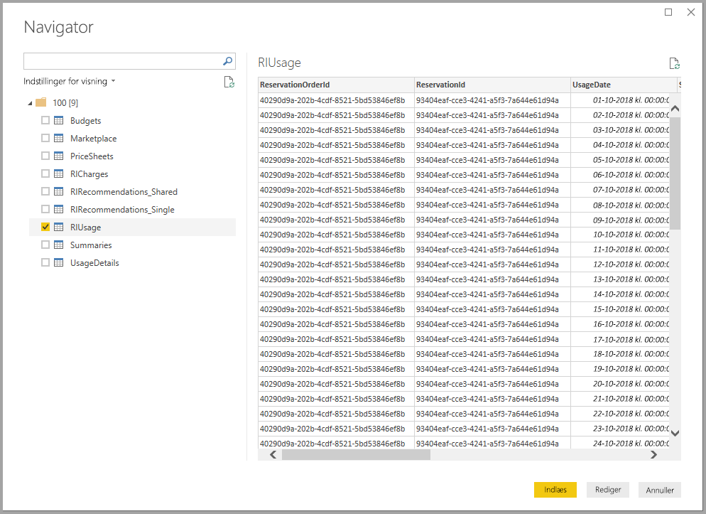

# Opret forbindelse til Azure Consumption Insights i Power BI Desktop (beta)
Ved hjælp af connectoren **Azure Consumption Insights** kan du bruge **Power BI Desktop** til at oprette forbindelse til Azure og få detaljerede data og oplysninger om din organisations brug af Azure-tjenester. Du kan også oprette målinger, brugerdefinerede kolonner og visuelle elementer, som kan rapporteres og deles, om din organisations brug af Azure. Denne version af connectoren **Azure Consumption and Insights** er en betaversion, som måske ændres.

I denne artikel kan du få mere at vide om, hvordan du opretter forbindelse via connectoren **Azure Consumption Insights**, hvordan du henter de data, du skal bruge, og hvordan du overfører ved hjælp af Azure Enterprise Connector, og du kan finde en tilknytning til *kolonner med brugsoplysninger* i **ACI**-API'en (Azure Consumption Insights).

## Opret forbindelse til Azure Consumption Insights
Hvis du vil oprette forbindelse ved hjælp af connectoren **Azure Consumption Insights**, skal du have adgang til Enterprise-funktionerne på Azure-portalen.

Hvis du vil oprette forbindelse ved hjælp af connectoren **Azure Consumption Insights**, skal du vælge **Hent data** på båndet **Hjem** i **Power BI Desktop**. Hvis du vælger **Onlinetjenester** fra kategorierne til venstre, kan du se **Microsoft Azure Consumption Insights (Beta)**. Vælg **Opret forbindelse**.

I den dialogboks, der vises, skal du angive dit *tilmeldingsnummer*.

* Du kan hente dit tilmeldingsnummer på [Azure Enterprise Portal](https://ea.azure.com) på den placering, der er vist på følgende billede:
  
  
  
  Denne version af connectoren understøtter kun virksomhedstilmeldinger fra https://ea.azure.com. Tilmeldinger i Kina understøttes ikke i øjeblikket.

Derefter skal du angive din *adgangsnøgle* for at oprette forbindelse.

* Din adgangsnøgle for tilmelding findes på [Azure Enterprise Portal](https://ea.azure.com).
  
  

Når du har angivet din *adgangsnøgle* og valgt **Opret forbindelse**, åbnes vinduet **Navigator** med de ni tabeller, der er tilgængelige for dig: 
* **Budgetter**: Viser budgetoplysninger, så du kan se de faktiske omkostninger eller brug sammenlignet med eksisterende budgetmål. 
* **MarketPlace**: Viser forbrugsbaserede gebyrer for Azure Marketplace.
* **PriceSheets**: Viser gældende priser pr. måler for en tilmelding.
* **RICharges**: Viser gebyrer knyttet til dine reserverede instanser i løbet af de sidste 24 måneder.
* **RIRecommendations_Single**: Viser anbefalinger til køb af reserverede instanser på baggrund af dine brugstendenser for et enkelt abonnement i løbet af de sidste 7, 30 eller 60 dage.
* **RIRecommendations_Shared**: Viser anbefalinger til køb af reserverede instanser på baggrund af dine brugstendenser på tværs af alle dine abonnementer i løbet af de sidste 7, 30 eller 60 dage.
* **RIUsage**: Viser oplysninger om forbrug for dine eksisterende reserverede instanser i løbet af den sidste måned.
* **Oversigter**: Viser en månedlig oversigt over saldi, nye køb, gebyrer for Azure Marketplace-tjenesten, justeringer og gebyrer for overforbrug.
* **UsageDetails**: Viser en opdeling af forbrugt antal og anslåede gebyrer for en tilmelding.

Du kan markere et afkrydsningsfelt ud for en af tabellerne for at få den vist. Du kan vælge en eller flere tabeller ved at markere afkrydsningsfeltet ud for deres navn og derefter vælge **Indlæs**.

> [!NOTE]
> Tabellerne *Summary* og *PriceSheet* er kun tilgængelige for API-nøglen på tilmeldingsniveau. Derudover har dataene i disse tabeller som standard den aktuelle måneds data for *Usage* og *PriceSheet*. Tabellerne *Summary* og *MarketPlace* er ikke begrænset til den aktuelle måned.
> 
> 

Når du vælger **Indlæs**, indlæses dataene i **Power BI Desktop**.

Når de markerede data er indlæst, kan de tabeller og felter, som du har valgt, ses i ruden **Felter**.

## Brug Azure Consumption Insights
Hvis du vil bruge connectoren **Azure Consumption Insights**, skal du have adgang til Enterprise-funktionerne på Azure-portalen.

Når du har indlæst data ved hjælp af connectoren **Azure Consumption Insights**, kan du oprette dine egne brugerdefinerede målinger og kolonner ved hjælp af **forespørgselseditoren**, og du kan oprette visuelle elementer, rapporter og dashboards, som du kan dele i **Power BI-tjenesten**.

Azure indeholder også en samling af brugerdefinerede eksempelforespørgsler, som du kan hente ved hjælp af en tom forespørgsel. For at gøre det skal du gå til båndet **Hjem** i **Power BI Desktop**, vælge rullelistepilen i **Hent data** og derefter vælge **Tom forespørgsel**. Det kan du også gøre i **forespørgselseditoren** ved at højreklikke i ruden **Forespørgsler** til venstre og derefter vælge **Ny forespørgsel > Tom forespørgsel** i den menu, der vises.

Skriv følgende på **formellinjen**:

    = MicrosoftAzureConsumptionInsights.Contents

Der vises en samling eksempler som vist på følgende billede:

Når du arbejder med rapporter og opretter forespørgsler, kan du bruge følgende:

* Hvis du vil definere antallet af måneder fra og med dags dato, skal du bruge *numberOfMonth*
  * Brug en værdi mellem 1 og 36 til at repræsentere antallet af måneder – fra dags dato – du vil importere. Det anbefales, at du højst henter 12 måneders data, for at undgå begrænsninger for import og begrænsninger for mængden af data, der er tilladt for forespørgsler i Power BI.
* Hvis du vil definere en månedsperiode i et historisk tidsvindue, skal du bruge *startBillingDataWindow* og *endBillingDataWindow*
* Brug *ikke* *numberOfMonth* sammen med *startBillingDataWindow* eller *endBillingDataWindow*

## Overfør fra Azure Enterprise Connector
Nogle kunder har oprettet visuelle elementer ved hjælp af *Azure Enterprise Connector (beta)*, som ophører og erstattes med connectoren **Azure Consumption Insights**. Connectoren **Azure Consumption Insights** indeholder funktioner og forbedringer, der omfatter følgende:

* Flere tilgængelige datakilder for *Saldooversigt* og *Køb fra Marketplace*
* Nye og avancerede parametre, f.eks. *startBillingDataWindow* og *endBillingDataWindow*
* Bedre ydeevne og svartid

For at hjælpe kunder med at skifte til den nyere **Azure Consumption Insights**-connector og for at gemme det arbejde, de har udført med at oprette brugerdefinerede dashboards og rapporter, kan du i følgende trin se, hvordan de kan flytte til den nye connector.

### Trin 1: Opret forbindelse til Azure ved hjælp af den nye connector
I første trin skal der oprettes forbindelse ved hjælp af connectoren **Azure Consumption Insights** som beskrevet detaljeret tidligere i denne artikel. I dette trin skal du vælge **Hent data > Tom forespørgsel** på båndet **Hjem** i **Power BI Desktop**.

### Trin 2: Brug den avancerede editor til at oprette en forespørgsel
I **forespørgselseditoren** skal du vælge **Avanceret editor** i sektionen **Forespørgsel** på båndet **Hjem**. Angiv følgende forespørgsel i vinduet **Avanceret editor**, der åbnes:

    let    
        enrollmentNumber = "100",
        optionalParameters = [ numberOfMonth = 6, dataType="DetailCharges" ],
        data = MicrosoftAzureConsumptionInsights.Contents(enrollmentNumber, optionalParameters)   
    in     
        data

Du skal naturligvis erstatte værdien i *enrollmentNumber* med dit eget tilmeldingsnummer, som du kan hente på [Azure Enterprise Portal](https://ea.azure.com). Parameteren *numberOfMonth* angiver, hvor mange måneder med data du vil gå tilbage i forhold til den aktuelle dato. Brug (0) for den aktuelle måned.

Når du har valgt **Udført** i vinduet **Avanceret editor**, opdateres eksempelvisningen, og du kan se data fra det angivne månedsinterval i tabellen. Vælg **Luk og anvend**, og vend tilbage.

### Trin 3: Flyt målinger og brugerdefinerede kolonner til den nye rapport
Derefter skal du flytte de brugerdefinerede kolonner eller målinger, du har oprettet, til den nye detaljetabel. Her er trinnene.

1. Åbn Notesblok (eller en anden teksteditor).
2. Vælg den måling, der skal flyttes, kopiér teksten fra feltet *Formel*, og indsæt den i Notesblok.
   
   
3. Omdøb *Query1* til navnet på den oprindelige detaljetabel.
4. Opret nye målinger og brugerdefinerede kolonner i tabellen ved at højreklikke på tabellen og vælge **Ny måling**. Klip og indsæt derefter dine gemte målinger og kolonner, når de er helt færdige.

### Trin 4: Sammenkæd igen tabeller, der havde relationer
Mange dashboards indeholder flere tabeller, der bruges til opslag eller filtrering, f.eks. datotabeller eller tabeller til brugerdefinerede projekter. De kan løse de fleste andre problemer ved at genoprette disse relationer. Her kan du se, hvordan du gør.

- Under fanen **Udformning** i **Power BI Desktop** skal du vælge **Administrer relationer** for at åbne et vindue, hvor du kan oprette relationer i modellen. Sammenkæd igen tabellerne efter behov.
   
    

### Trin 5: Kontrollér dine visualiseringer, og juster feltformatering efter behov
Nu, hvor du er nået så langt, fungerer de fleste af dine oprindelige visuelle elementer, tabeller, og detaljeadgange som forventet. Men du skal måske foretage et par mindre justeringer af formateringen, så det hele ser ud, som du ønsker det. Brug lidt tid på at kigge på dine dashboards og visuelle elementer for at sikre, at de ser ud, som du ønsker det.

## Brug ACI-API'en (Azure Consumption and Insights) til at hente forbrugsdata
Azure leverer også [**ACI-API'en (Azure Consumption and Insights)**](https://azure.microsoft.com/blog/announcing-general-availability-of-consumption-and-charge-apis-for-enterprise-azure-customers/). Du kan oprette dine egne brugerdefinerede løsninger til indsamling, rapportering og visualisering af oplysninger om Azure-forbrug ved hjælp af ACI-API'en.

### Tilknyt navne og brugsoplysninger mellem portalen, connectoren og API'en
Kolonnerne og navnene på oplysningerne på Azure-portalen er de samme i API'en og connectoren, men de er ikke altid identiske. For at tydeliggøre det indeholder tabellen nedenfor en tilknytning mellem API'en, connectoren og de kolonner, der vises på Azure-portalen. Det angives også, om kolonnen er forældet. Du kan finde flere oplysninger om og definitioner på disse vilkår ved at kigge i [Azure-ordbogen for faktureringsdata](https://docs.microsoft.com/azure/billing/billing-enterprise-api-usage-detail).

| ACI-connector/ContentPack ColumnName | Kolonnenavn for ACI-API | Kolonnenavn for EA | Forældet/vises for bagudkompatibilitet |
| --- | --- | --- | --- |
| AccountName |accountName |Kontonavn |Nej |
| AccountId |accountId | |Ja |
| AcccountOwnerId |accountOwnerEmail |AccountOwnerId |Nej |
| AdditionalInfo |additionalInfo |AdditionalInfo |Nej |
| AdditionalInfold | | |Ja |
| Forbrugt antal |consumedQuantity |Forbrugt antal |Nej |
| Forbrugt tjeneste |consumedService |Forbrugt tjeneste |Nej |
| ConsumedServiceId |consumedServiceId | |Ja |
| Cost |cost |ExtendedCost |Nej |
| Omkostningssted |costCenter |Omkostningssted |Nej |
| Dato |date |Dato |Nej |
| Dag | |Dag |Nej |
| DepartmentName |departmentName |Navn på afdeling |Nej |
| DepartmentID |departmentId | |Ja |
| Forekomst-id | | |Ja |
| InstanceId |instanceId |Forekomst-id |Nej |
| Location | | |Ja |
| Målerkategori |meterCategory |Målerkategori |Nej |
| Måler-id | | |Ja |
| Målernavn |meterName |Målernavn |Nej |
| Målerområde |meterRegion |Målerområde |Nej |
| Målerunderkategori |meterSubCategory |Målerunderkategori |Nej |
| MeterId |meterId |Måler-id |Nej |
| Måned | |Måned |Nej |
| Produkt |product |Produkt |Nej |
| ProductId |productId | |Ja |
| Ressourcegruppe |resourceGroup |Ressourcegruppe |Nej |
| Placering af ressource |resourceLocation |Placering af ressource |Nej |
| ResourceGroupId | | |Ja |
| ResourceLocationId |resourceLocationId | |Ja |
| ResourceRate |resourceRate |ResourceRate |Nej |
| ServiceAdministratorId |serviceAdministratorId |ServiceAdministratorId |Nej |
| ServiceInfo1 |serviceInfo1 |ServiceInfo1 |Nej |
| ServiceInfo1Id | | |Ja |
| ServiceInfo2 |serviceInfo2 |ServiceInfo2 |Nej |
| ServiceInfo2Id | | |Ja |
| Store Service-id |storeServiceIdentifier |Store Service-id |Nej |
| StoreServiceIdentifierId | | |Ja |
| Navn på abonnement |subscriptionName |Navn på abonnement |Nej |
| Mærker |tags |Mærker |Nej |
| TagsId | | |Ja |
| Måleenhed |unitOfMeasure |Måleenhed |Nej |
| År | |År |Nej |
| SubscriptionId |subscriptionId |SubscriptionId |Ja |
| SubscriptionGuid |subscriptionGuid |SubscriptionGuid |Nej |

## Næste trin
Du kan oprette forbindelse til mange forskellige typer data ved hjælp af Power BI Desktop. Du kan finde flere oplysninger om datakilder i følgende ressourcer:

* [Hvad er Power BI Desktop?](desktop-what-is-desktop.md)
* [Datakilder i Power BI Desktop](desktop-data-sources.md)
* [Udform og kombiner data med Power BI Desktop](desktop-shape-and-combine-data.md)
* [Opret forbindelse til Excel-projektmapper i Power BI Desktop](desktop-connect-excel.md)   
* [Angiv data direkte i Power BI Desktop](desktop-enter-data-directly-into-desktop.md)   

