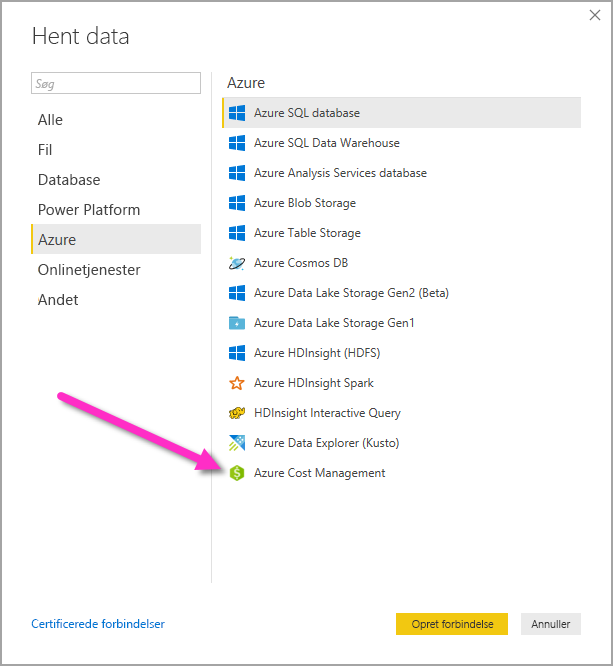
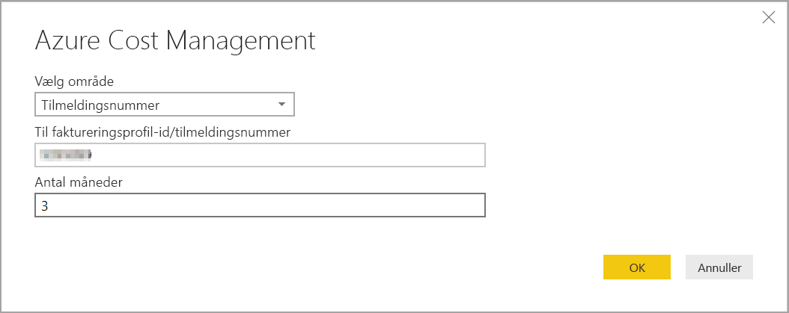

# Opret visualiseringer og rapporter med Azure Cost Management-connectoren i Power BI Desktop

Du kan bruge Azure Cost Management Connector til Power BI Desktop til at oprette effektive, brugerdefinerede visualiseringer og rapporter, der hjælper dig med bedre at forstå dit Azure-forbrug. Connectoren Azure Cost Management understøtter i øjeblikket kunder med en [Microsoft-kundeaftale](https://azure.microsoft.com/pricing/purchase-options/microsoft-customer-agreement/) eller en [Enterprise-aftale](https://azure.microsoft.com/pricing/enterprise-agreement/).  

Azure Cost Management-connectoren bruger OAuth 2.0 til godkendelse i Azure og identificerer de brugere, der skal bruge connectoren. Tokens, der genereres i denne proces, er gyldige i en bestemt periode. Power BI gemmer tokenet til næste logon. OAuth 2.0 er en standard for den proces, der foregår i baggrunden for at sikre sikker håndtering af disse tilladelser. Hvis du vil oprette forbindelse, skal du bruge en [Enterprise-administratorkonto](https://docs.microsoft.com/azure/billing/billing-understand-ea-roles) til Enterprise-aftaler eller en [faktureringskontoejer](https://docs.microsoft.com/azure/billing/billing-understand-mca-roles) for Microsoft-kundeaftaler. 

> [!NOTE]
> Denne connector erstatter de tidligere tilgængelige connectorer [Azure Consumption Insights og Azure Cost Management (beta)](desktop-connect-azure-consumption-insights.md). Alle rapporter, der er oprettet med den forrige connector, skal oprettes igen ved hjælp af denne connector.

## Opret forbindelse vha. Azure Cost Management

Benyt følgende fremgangsmåde for at bruge **Azure Cost Management**-connectoren i Power BI Desktop:

1.  Vælg **Hent data** på båndet **Hjem**.
2.  Vælg **Azure** på listen over datakategorier.
3.  Vælg **Azure Cost Management**.

    

4. I den dialogboks, der vises, skal du angive enten dit **faktureringsprofil-id** for **Microsoft-kundeaftaler** eller dit **registreringsnummer** for **Enterprise-aftaler (EA)** . 

## Opret forbindelse til en Microsoft-kundeaftalekonto 

Hvis du vil oprette forbindelse til en **Microsoft-kundeaftalekonto**, kan du hente dit **faktureringsprofil-id** fra Azure Portal:

1.  Gå til [Omkostningsstyring og fakturering](https://portal.azure.com/) i **Azure portal**.
2.  Vælg din faktureringsprofil. 
3.  Under **Indstillinger** i menuen skal du vælge **Egenskaber** i sidepanelet.
4.  Kopiér **id'et** under **Faktureringsprofil**. 
5.  I **Vælg omfang** skal du vælge **Faktureringsprofil-id** og indsætte faktureringsprofil-id'et fra det forrige trin. 
6.  Angiv antallet af måneder, og vælg **OK** .

    

7.  Når du bliver bedt om det, skal du logge på med din Azure-brugerkonto og din adgangskode. 

## Opret forbindelse til en Enterprise-aftalekonto

Hvis du vil oprette forbindelse til en Enterprise-aftalekonto (EA), kan du hente dit registrerings-id fra Azure Portal:

1.  Gå til [Omkostningsstyring og fakturering](https://portal.azure.com/) i **Azure portal**.
2.  Vælg din faktureringskonto.
3.  Kopiér **Faktureringskonto-id** i menuen **Oversigt**.
4.  I **Vælg omfang** skal du vælge **Registreringsnummer** og indsætte faktureringskonto-id'et fra det forrige trin. 
5.  Angiv antallet af måneder, og vælg derefter **OK** .

    

6.  Når du bliver bedt om det, skal du logge på med din Azure-brugerkonto og din adgangskode. 

## Data, der er tilgængelige via connectoren

Når du er blevet godkendt, vises vinduet **Navigator** med følgende tilgængelige datatabeller:

| **Tabel** | **Beskrivelse** |
| --- | --- |
| **Saldooversigt** | Oversigt over saldoen for Enterprise-aftaler (EA). |
| **Faktureringshændelser** | Viser en hændelseslog for nye fakturaer, kreditkøb osv. Kun Microsoft-kundeaftale. |
| **Budgetter** | Budgetoplysninger, hvor du kan se de faktiske omkostninger eller det faktiske forbrug sammenlignet med eksisterende budgetmål. |
| **Gebyrer** | En oversigt pr. måned over forbrug, gebyrer for Marketplace og separat fakturerede gebyrer i Azure. Kun Microsoft-kundeaftale. |
| **Kreditpartier** | Oplysninger om køb af Azure-kreditpartier for den angivne faktureringsprofil. Kun Microsoft-kundeaftale. |
| **Prisark** | Gældende priser efter måler for den angivne faktureringsprofil eller EA-registrering. |
| **Gebyrer for reserverede instanser** | Gebyrer knyttet til dine reserverede instanser i løbet af de sidste 24 måneder. |
| **Anbefalinger til reserverede instanser (delt)** | Anbefalinger til køb af reserverede instanser på baggrund af dine forbrugstendenser for alle abonnementer i løbet af de sidste 7, 30 eller 60 dage. |
| **Anbefalinger til reserverede instanser (enkelt)** | Anbefalinger til køb af reserverede instanser på baggrund af dine forbrugstendenser for et enkelt abonnement i løbet af de sidste 7, 30 eller 60 dage. |
| **Detaljer om RI-forbrug** | Oplysninger om forbrug for dine eksisterende reserverede instanser i løbet af den sidste måned. |
| **Oversigt over RI-forbrug** | Den daglige brug af Azure-reservationer i procent. |
| **Detaljer om forbrug** | En oversigt over forbrugt antal og anslåede gebyrer for den angivne faktureringsprofil i EA-registreringen. |
| **Oplysninger om amortiseret forbrug** | En oversigt over forbrugt antal og anslåede amortiserede gebyrer for den angivne faktureringsprofil i EA-registreringen. |

Du kan vælge en tabel for at få vist et eksempel. Du kan vælge en eller flere tabeller ved at markere afkrydsningsfeltet ud for tabellernes navn og derefter vælge **Indlæs**.

Når du vælger **Indlæs**, indlæses dataene i Power BI Desktop. 

Når de markerede data er indlæst, vises de tabeller og felter, som du har valgt, i ruden **Felter**.

## Næste trin

Du kan oprette forbindelse til mange forskellige datakilder ved hjælp af Power BI Desktop. Du kan få flere oplysninger i følgende artikler:

* [Hvad er Power BI Desktop?](desktop-what-is-desktop.md)
* [Datakilder i Power BI Desktop](desktop-data-sources.md)
* [Udform og kombiner data med Power BI Desktop](desktop-shape-and-combine-data.md)
* [Opret forbindelse til Excel-projektmapper i Power BI Desktop](desktop-connect-excel.md)   
* [Angiv data direkte i Power BI Desktop](desktop-enter-data-directly-into-desktop.md)   
