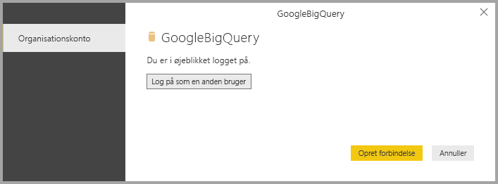
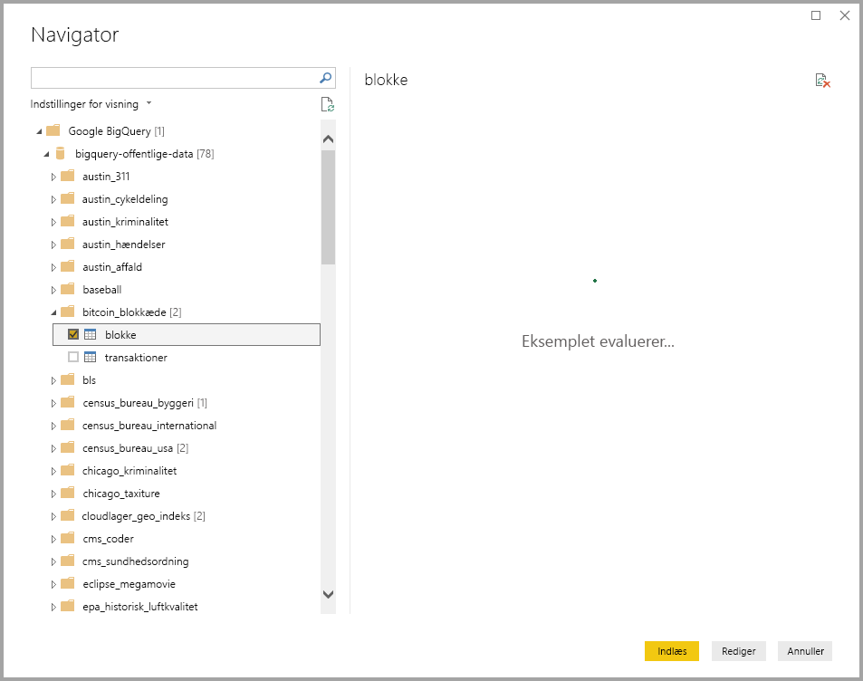

# <a name="connect-to-a-google-bigquery-database-in-power-bi-desktop"></a>Opret forbindelse til en Google BigQuery-database i Power BI Desktop
I Power BI Desktop kan du oprette forbindelse til en Google **BigQuery**-database og bruge de underliggende data på samme måde som enhver anden datakilde i Power BI Desktop.

## <a name="connect-to-google-bigquery"></a>Opret forbindelse til Google BigQuery
Hvis du vil oprette forbindelse til en Google **BigQuery**-database, skal du vælge **Hent data** på båndet **Hjem** i Power BI Desktop. Vælg **Database** blandt kategorierne til venstre, hvorefter du kan se **Impala**.


I vinduet **Google BigQuery**, der vises, skal du logge på din Google BigQuery-konto, og vælge **Opret forbindelse**.


Når du er logget på, kan du se følgende vindue, der angiver, at du er blevet godkendt. 



Når du har oprettet forbindelse, vises der et vindue af typen **Navigator**, hvor de data, der er tilgængelige på serveren, vises. Her kan du vælge et eller flere elementer, der skal importeres og bruges i **Power BI Desktop**.



## <a name="considerations-and-limitations"></a>Overvejelser og begrænsninger
Der er et par begrænsninger og overvejelser, du skal være opmærksom på i forbindelse med Google **BigQuery**-forbindelsen:

* Google BigQuery-forbindelsen er tilgængelig i Power BI Desktop og Power BI-tjenesten. I Power BI-tjenesten kan du få adgang til forbindelsen ved hjælp af cloud til cloud-forbindelsen fra Power BI til Google BigQuery.

Du kan bruge Power BI sammen med **faktureringsprojektet** i Google BigQuery. Power BI bruger som standard det første projekt på listen, som returneres til brugeren. Du kan tilpasse funktionsmåden for faktureringsprojektet, når du bruger det sammen med Power BI, ved at benytte følgende fremgangsmåde:

 * Angiv følgende indstilling i det underliggende M i kildetrinnet, som kan tilpasses ved at bruge **Power-forespørgsel** i Power BI Desktop:

    ```Source = GoogleBigQuery.Database([BillingProject="Include-Billing-Project-Id-Here"])```

## <a name="next-steps"></a>Næste trin
Du kan oprette forbindelse til mange forskellige typer data ved hjælp af Power BI Desktop. Du kan finde flere oplysninger om datakilder i følgende ressourcer:

* [Hvad er Power BI Desktop?](desktop-what-is-desktop.md)
* [Datakilder i Power BI Desktop](desktop-data-sources.md)
* [Udform og kombiner data med Power BI Desktop](desktop-shape-and-combine-data.md)
* [Opret forbindelse til Excel-projektmapper i Power BI Desktop](desktop-connect-excel.md)   
* [Angiv data direkte i Power BI Desktop](desktop-enter-data-directly-into-desktop.md)   

