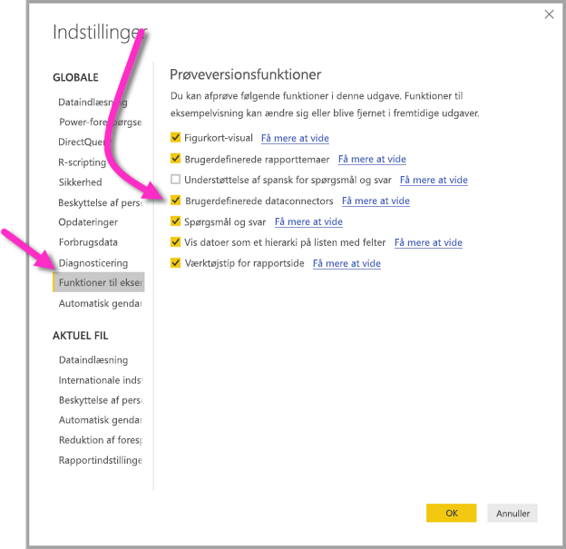

# Opret forbindelse til data oprettet af Power BI-dataflows i Power BI Desktop (prøveversion)
I **Power BI Desktop** kan du oprette forbindelse til data oprettet af **Power BI-dataflows** på samme måde som enhver anden datakilde i Power BI Desktop.

Med connectoren **Power BI-dataflows (prøveversion)** kan du oprette forbindelse til enheder oprettet af dataflows i Power BI-tjenesten. Da dataflows er tilgængelige i en prøveversion, er der nogle få trin, du skal foretage for at få adgang til dataflows-connectoren på dit system. 

## Download og aktivér Power BI-dataflows-connectoren (prøveversion)

Du skal downloade en kopi af **Power BI-dataflows**-connectoren og derefter kopiere den til en bestemt placering på din computer. I en kommende månedlig opdatering af Power BI Desktop vil connectoren automatisk være med på listen over dataforbindelser, hvorefter disse trin ikke vil være nødvendige.

Du kan downloade **Power BI-dataflows-connectoren** på denne placering: [Power BI-dataflows-connector](https://visuals.azureedge.net/cds-analytics/PublicPreview/CDSA.mez)

Gør følgende for at gøre **Power BI-dataflows**-connectoren (prøveversion) tilgængelig på din computer:

1. Download en kopi af .MEZ-filen (dataconnector-filen). Kunder med en personlig prøveversion modtager oplysninger om overførsel af .MEZ-filen direkte fra Microsoft.

2. Placer den overførte data-connector-fil i følgende mappe på computeren:  **Dokumenter > Power BI Desktop > Brugerdefineret connector-mappe**

3. I Power BI Desktop skal du vælge **Fil > Indstillinger > Indstillinger** og derefter vælge **Funktioner til eksempelvisning** i venstre rude.

    

4. Markér feltet **Brugerdefinerede dataconnectors**, hvis det ikke allerede er markeret. 

5. Genstart **Power BI Desktop** for at få vist connectoren.

## Brug Power BI-dataflows-connectoren (prøveversion)
Når **Power BI Desktop** er genstartet, vises connectoren som en tilgængelig datakilde. Hvis du vil oprette forbindelse til en datagruppe, skal du vælge **Hent data > Onlinetjenester > Power BI-dataflows (beta)** som vist på følgende billede:

## Overvejelser og begrænsninger

Hvis du vil bruge denne prøveversion af **Power BI-dataflows-connector**, skal du køre den seneste version af **Power BI Desktop**. Du kan altid [hente Power BI Desktop](desktop-get-the-desktop.md) og installere det på din computer for at sikre dig, at du har den nyeste version.  

Bemærk: Når Power BI-dataflows-connectoren optræder i en kommende månedlig opdatering af **Power BI Desktop**, *skal* du slette den downloadede .MEZ-fil fra mappen **Dokumenter > Power BI Desktop > Brugerdefinerede connectors** for at undgå konflikter. 

## Næste trin
Du kan finde en masse interessante ting, som du kan gøre med Power BI-dataforbindelser, samt artikler om **Power BI Desktop**, der kan være nyttige:

* [Datakilder i Power BI Desktop](desktop-data-sources.md)
* [Udform og kombiner data med Power BI Desktop](desktop-shape-and-combine-data.md)
* [Angiv data direkte i Power BI Desktop](desktop-enter-data-directly-into-desktop.md)   

