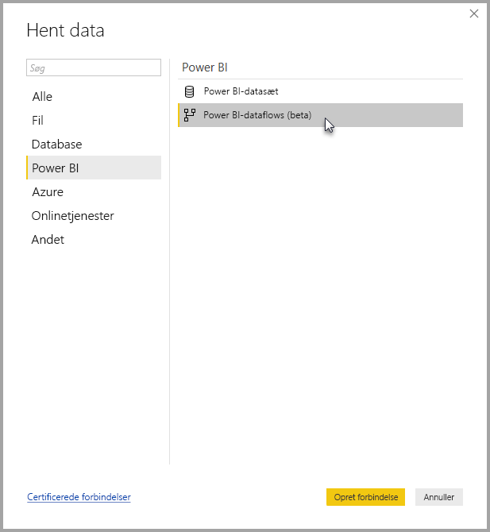

# Opret forbindelse til data oprettet af Power BI-dataflow i Power BI Desktop (beta)
I **Power BI Desktop** kan du oprette forbindelse til data oprettet af **Power BI-dataflows** på samme måde som enhver anden datakilde i Power BI Desktop.

Med connectoren **Power BI-dataflow (beta)** kan du oprette forbindelse til enheder, der er oprettet af dataflow i Power BI-tjenesten. 

## Overvejelser og begrænsninger

Hvis du vil bruge denne betaversion af **connectoren Power BI-dataflow**, skal du køre den seneste version af **Power BI Desktop**. Du kan altid [hente Power BI Desktop](desktop-get-the-desktop.md) og installere det på din computer for at sikre dig, at du har den nyeste version.  

> [!NOTE]
> I den tidligere version af connectoren Power BI-dataflow krævedes det, at du downloadede en .MEZ-fil og anbragte den i en mappe. Aktuelle versioner af **Power BI Desktop** inkluderer connectoren Power BI-dataflow, så denne fil er ikke længere påkrævet og kan medføre konflikter med den inkluderede version af connectoren. Hvis du har placeret denne .MEZ-fil i mappen manuelt, *skal* du slette denne downloadede .MEZ-fil fra mappen **Dokumenter > Power BI Desktop > Brugerdefinerede connectors** for at undgå konflikter. 

## Stationær computers ydeevne
**Power BI Desktop** kører lokalt på den computer, hvor det er installeret. Ydeevnen for dataindtagelse for dataflow bestemmes af en lang række faktorer. Disse faktorer omfatter mængden af dataene, din computers CPU og RAM, netværkets båndbredde, afstanden til datacenteret og andre faktorer.

Du kan forbedre ydeevnen for dataindtagelse for dataflow. Hvis f.eks. mængden af de overførte data er for stor til, at **Power BI Desktop** kan administrere dem på din computer, kan du bruge sammenkædede og beregnede objekter i dataflow til at samle dataene (i dataflow) og kun overføre de samlede data, der er klargjort i forvejen. Dette medfører, at behandling af store datamængder udføres online i dataflow i stedet for at blive udført lokalt i din kørende forekomst af **Power BI Desktop**. Denne tilgang giver Power BI Desktop mulighed for at overføre mindre datamængder og sørger for, at oplevelsen med dataflow forbliver dynamisk og hurtig.

## Næste trin
Du kan gøre mange forskellige interessante ting med Power BI-dataflow. Du kan finde flere oplysninger i følgende ressourcer:

* [Selvbetjent dataforberedelse med dataflow](service-dataflows-overview.md)
* [Opret og brug dataflow i Power BI](service-dataflows-create-use.md)
* [Brug beregnede objekter i Power BI Premium (prøveversion)](service-dataflows-computed-entities-premium.md)
* [Brug dataflow med datakilder i det lokale miljø (prøveversion)](service-dataflows-on-premises-gateways.md)
* [Udviklerressourcer til Power BI-dataflow (prøveversion)](service-dataflows-developer-resources.md)

Der findes også artikler om **Power BI Desktop**, som du kan finde nyttige:

* [Datakilder i Power BI Desktop](desktop-data-sources.md)
* [Udform og kombiner data med Power BI Desktop](desktop-shape-and-combine-data.md)
* [Angiv data direkte i Power BI Desktop](desktop-enter-data-directly-into-desktop.md)   

