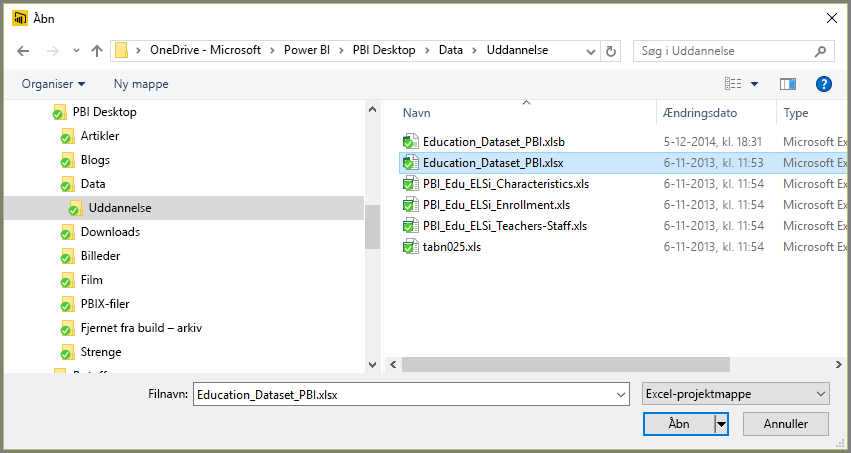
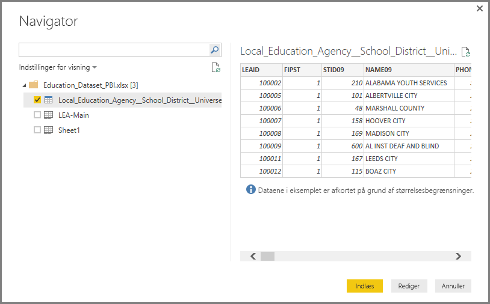

# Opret forbindelse til Excel i Power BI Desktop
Det er nemt at oprette forbindelse til en Excel-projektmappe fra Power BI Desktop, og i denne artikel gennemgås trinnene.

Vælg **Hent data > Excel** på båndet **Hjem** i Power BI Desktop.

Vælg din projektmappe i dialogboksen **Åbn**, der vises.

Power BI Desktop viser tabellerne på andre dataelementer fra projektmappen i vinduet **Navigator**. Når du vælger en tabel i venstre rude, vises der et eksempel på dataene i højre rude.

Du kan vælge knappen Indlæs for at importere dataene, eller hvis du vil redigere dataene i **forespørgselseditoren**, før du overfører dem til Power BI Desktop, skal du vælge knappen **Rediger**.

Når du indlæser dataene, åbner Power BI Desktop vinduet **Indlæs** og viser den aktivitet, der er knyttet til indlæsning af dataene.  

Når Power BI Desktop er færdig, vises de tabeller og felter, der er importeret fra din Excel-projektmappe, i ruden **Felter** i højre side af Desktop.

Det var det hele!

Du er nu klar til at bruge de data, der er importeret fra din Excel-projektmappe, i Power BI Desktop til at oprette visuelle elementer og rapporter eller interagere med andre data, som du måske vil oprette forbindelse til og importere, f.eks. andre Excel-projektmapper, databaser eller en hvilken som helst anden datakilde.

## Næste trin
Du kan oprette forbindelse til mange forskellige typer data ved hjælp af Power BI Desktop. Du kan finde flere oplysninger om datakilder i følgende ressourcer:

* [Hvad er Power BI Desktop?](desktop-what-is-desktop.md)
* [Datakilder i Power BI Desktop](desktop-data-sources.md)
* [Udform og kombiner data med Power BI Desktop](desktop-shape-and-combine-data.md)
* [Opret forbindelse til CSV-filer i Power BI Desktop](desktop-connect-csv.md)   
* [Angiv data direkte i Power BI Desktop](desktop-enter-data-directly-into-desktop.md)   

