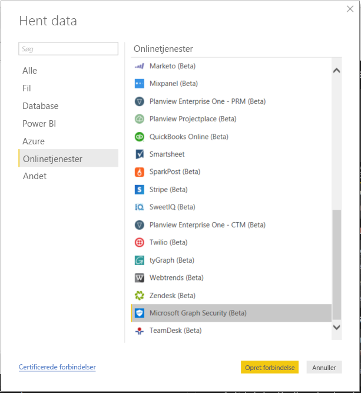
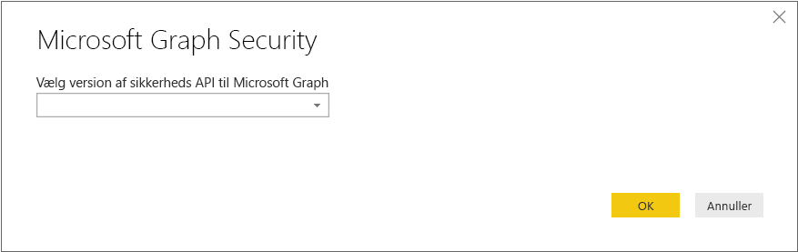
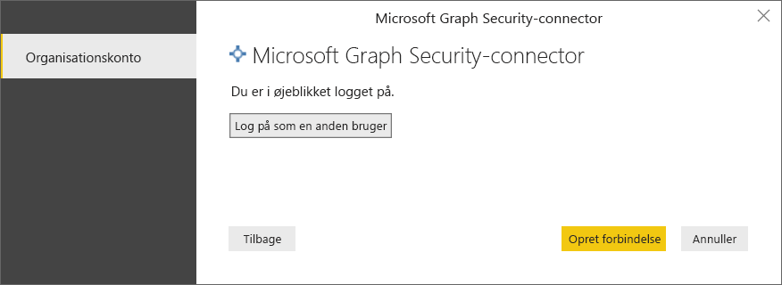

# Opret forbindelse til Microsoft Graph Security API i Power BI Desktop

Brug Microsoft Graph Security-connectoren til Power BI Desktop til at oprette forbindelse til [Microsoft Graph Security API](https://aka.ms/graphsecuritydocs). Du kan derefter skabe dashboards og rapporter, så du kan få indsigt i dine sikkerhedsrelaterede [beskeder](https://docs.microsoft.com/graph/api/resources/alert?view=graph-rest-1.0) og [sikkerhedsscorer](https://docs.microsoft.com/graph/api/resources/securescores?view=graph-rest-beta).

Microsoft Graph Security API'en opretter forbindelse til [flere sikkerhedsløsninger](https://aka.ms/graphsecurityalerts) fra Microsoft og Microsofts økosystem af partnere for at gøre korrelation mellem beskeder nemmere. Denne kombination giver adgang til detaljerede kontekstuelle oplysninger og forenkler automatisering. Den gør det muligt for organisationer hurtigt at få indsigt og reagere på tværs af flere sikkerhedsprodukter og samtidigt reducere omkostningerne og kompleksiteten.

## Forudsætninger for at bruge Microsoft Graph Security-connectoren

Hvis du vil bruge Microsoft Graph Security-connectoren, skal du have *udtrykkelig* samtykke fra administratoren af Azure Active Directory-lejeren (Azure AD). Se [Krav til godkendelse af Microsoft Graph Security](https://aka.ms/graphsecurityauth).
Samtykke kræver connectorens program-id og -navn, hvilket er nævnt her og tilgængeligt på [Azure Portal](https://portal.azure.com):

| Egenskab | Værdi |
|----------|-------|
| **Programnavn** | `MicrosoftGraphSecurityPowerBIConnector` |
| **Program-id** | `cab163b7-247d-4cb9-be32-39b6056d4189` |
|||

For at give samtykke for connectoren skal administratoren af din Azure AD-lejer følge en af disse metoder:

* [Giv samtykke til Azure AD-programmer](https://docs.microsoft.com/azure/active-directory/develop/v2-permissions-and-consent)

* Besvar en anmodning, som din logikapp sender i løbet af den første kørsel via [oplevelsen for programsamtykke](https://docs.microsoft.com/azure/active-directory/develop/application-consent-experience)
   
Den brugerkonto, der bruges til at logge på Microsoft Graph Security-connectoren, skal have rollen Sikkerhedslæser i Azure AD tildelt, **hvis** brugeren ikke er medlem af rollen *Sikkerhedsadministrator*. Se [Tildel Azure AD-roller til brugere](https://docs.microsoft.com/graph/security-authorization#assign-azure-ad-roles-to-users).

## Brug af Microsoft Graph Security-connectoren

Følg disse trin for at bruge connectoren:

1. Vælg **Hent data** > **Mere** på båndet **Hjem** i Power BI Desktop.
2. Vælg **Onlinetjenester** fra listen over kategorier i venstre side af vinduet.
3. Vælg **Microsoft Graph Security (beta)** .

    
    
4. Vælg den version af Microsoft Graph API, du vil sende forespørgsler til, i vinduet **Microsoft Graph Security**: **v1.0** eller **beta**.

    
    
5. Log på din Azure Active Directory-konto, når du bliver bedt om det. Denne konto skal have rollen *Sikkerhedslæser* eller *Sikkerhedsadministrator*, som nævnt i forrige afsnit.

     
    
6. Hvis du er lejeradministrator, *og* du endnu ikke har givet samtykke til Microsoft Graph Security Power BI-connectoren (program), får du vist følgende dialogboks. Vælg **Samtykke på vegne af din organisation**.

    
    
7. Når du er logget på, kan du se følgende dialogboks, der angiver, at du er blevet godkendt. Vælg **Opret forbindelse**.

    
    
8. Når du har oprettet forbindelse, vil du i vinduet **Navigator** se beskeder, sikkerhedsscorer og andre objekter, der er tilgængelige i [Microsoft Graph Security API](https://aka.ms/graphsecuritydocs), for den version, du valgte i trin 4. Vælg et eller flere objekter, du kan importere og bruge i Power BI Desktop. Vælg derefter **Indlæs** for at se resultatvisningen, der vises efter trin 9.

    
    
9. Hvis du vil foretage en avanceret forespørgsel i Microsoft Graph Security API, skal du vælge **Angiv brugerdefineret URL-adresse til Microsoft Graph Security for at filtrere resultaterne**. Brug denne funktion til at foretage en [OData.Feed](https://docs.microsoft.com/power-bi/desktop-connect-odata)-forespørgsel til Microsoft Graph Security API med de påkrævede tilladelser.

   Følgende eksempel bruger `https://graph.microsoft.com/v1.0/security/alerts?$filter=Severity eq 'High'` *serviceUri*. I [Indstillinger for forespørgsler til OData-systemet](https://docs.microsoft.com/graph/query-parameters) kan du se, hvordan du skaber forespørgsler for at filtrere, anmode om eller hente de seneste resultater.

   
    
   Når du vælger **Kør**, foretager **OData.Feed**-funktionen et kald til API'en, som åbner Forespørgselseditor. Du kan filtrere og finindstille datasæt, du vil bruge. Derefter indlæser du data i Power BI Desktop.

Her er resultaterne for de Microsoft Graph Security-objekter, vi sendte forespørgsler om:

   
    

Nu er du klar til at bruge de importerede data fra Microsoft Graph Security-connector i Power BI Desktop. Du kan oprette grafik eller rapporter. Eller du kan interagere med andre data, du importerer fra Excel-projektmapper, databaser eller andre datakilder.

## Næste trin
* Se Power BI-eksempler og -skabeloner, som bruger denne connector under [GitHub Power BI-eksempler til Microsoft Graph Security](https://aka.ms/graphsecuritypowerbiconnectorsamples).

* I [dette blogindlæg om Power BI-connectorer til Microsoft Graph Security](https://aka.ms/graphsecuritypowerbiconnectorblogpost) kan du se brugerscenarier og yderligere oplysninger.

* Du kan oprette forbindelse til mange forskellige typer data ved hjælp af Power BI Desktop. Du kan finde flere oplysninger i følgende ressourcer:

    * [Hvad er Power BI Desktop?](desktop-what-is-desktop.md)
    * [Datakilder i Power BI Desktop](desktop-data-sources.md)
    * [Udform og kombiner data med Power BI Desktop](desktop-shape-and-combine-data.md)
    * [Opret forbindelse til Excel-projektmapper i Power BI Desktop](desktop-connect-excel.md)
    * [Angiv data direkte i Power BI Desktop](desktop-enter-data-directly-into-desktop.md)
