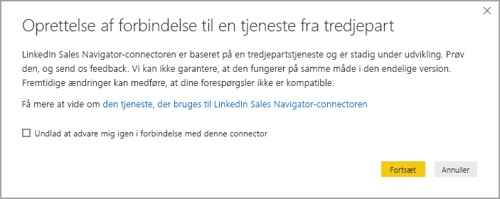
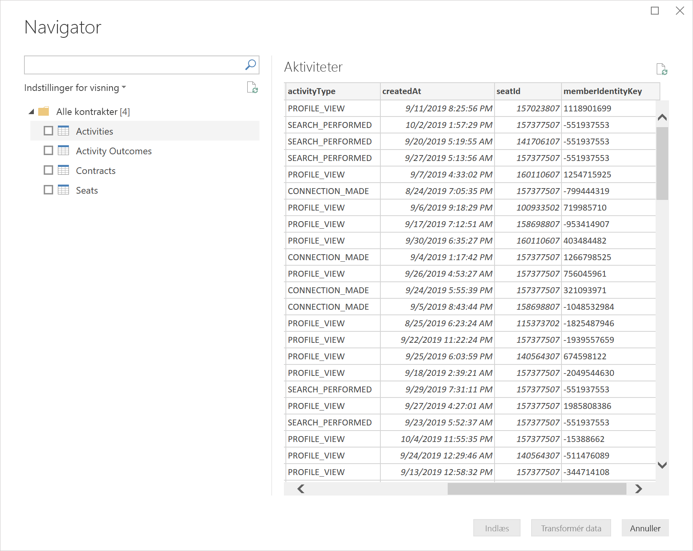
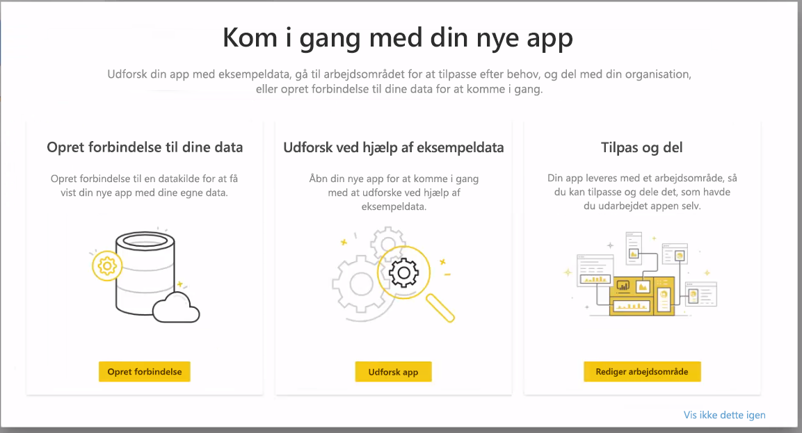
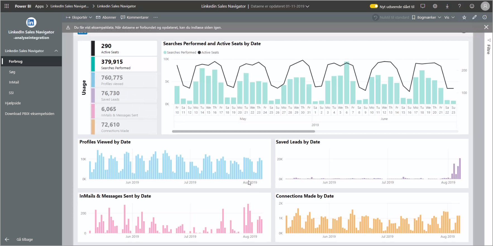

# Opret forbindelse til LinkedIn Sales Navigator i Power BI Desktop

I **Power BI Desktop**kan du oprette forbindelse til **LinkedIn Sales Navigator** for nemmere at finde og oprette relationer på samme måde som enhver anden datakilde i Power BI Desktop og oprette færdiglavede rapporter om dine fremskridt.

Hvis du vil oprette forbindelse til LinkedIn-data ved hjælp af **LinkedIn Sales Navigator**, skal du have en Sales Navigator Enterprise-plan og enten være administrator eller rapportbruger i Sales Navigator-kontrakten.

Følgende video giver en hurtig rundvisning i og et selvstudium til brugen af **LinkedIn Sales Navigator**-skabelonappen, der beskrives detaljeret [senere i denne artikel](#using-the-linkedin-sales-navigator-template-app). 

> [!VIDEO https://www.youtube.com/embed/ZqhmaiORLw0]

## Opret forbindelse til LinkedIn Sales Navigator

Du opretter forbindelse til **LinkedIn Sales Navigator**-data ved at vælge **Hent data** på båndet **Hjem** i Power BI Desktop. Vælg **Onlinetjenester** i kategorierne til venstre, og rul derefter, indtil du kan se **LinkedIn Sales Navigator (Beta)** .

Du bliver underrettet om, at du opretter forbindelse til en tredjeparts-connector, der stadig er under udvikling. 

Når du vælger **Fortsæt**, bliver du bedt om at angive de ønskede data.

I vinduet **LinkedIn Sales Navigator**, der vises, skal du vælge, hvilke data du vil returnere, enten *Alle kontakter* eller *Valgte kontakter* fra den første rullevælger. Du kan derefter angive start-og slutdatoer for at begrænse de data, der modtages, til et bestemt tidsvindue.

Når du har angivet oplysningerne, opretter Power BI Desktop forbindelse til de data, der er knyttet til din LinkedIn salgs Navigator-kontrakt. Brug den samme mailadresse, som du bruger til at logge på LinkedIn Sales Navigator, via webstedet. 

Når du har oprettet forbindelse, bliver du bedt om at vælge, hvilke data der skal hentes fra din LinkedIn Sales Navigator-kontrakt, i et **Navigator**-vindue.

Du kan oprette alle de rapporter, du vil, med dine LinkedIn Sales Navigator-data. For at gøre tingene nemmere er der også en LinkedIn Sales Navigator-.PBIX-fil, du kan downloade, hvor der allerede er angivet eksempeldata, så du kan blive fortrolig med dataene og rapporterne uden at skulle starte fra bunden.

Du kan downloade PBIX-filen fra følgende sted:
* [PBIX til LinkedIn Sales Navigator](service-template-apps-samples.md)

Ud over filen PBIX har LinkedIn Sales Navigator også en skabelonapp, du også kan downloade og bruge. I det næste afsnit beskrives skabelonappen mere detaljeret.

## Brug af LinkedIn Sales Navigator-skabelonappen

Hvis du vil bruge **LinkedIn Sales Navigator** så nemt som muligt, kan du bruge [skabelonappen](service-template-apps-overview.md), der automatisk opretter en færdiglavet rapport fra dine LinkedIn Sales Navigator-data.

Når du downloader appen, kan du vælge, om du vil oprette forbindelse til dine data eller udforske appen med eksempeldata. Du kan altid gå tilbage og oprette forbindelse til dine egne LinkedIn Sales Navigator-data, når du har udforsket eksempeldataene. 

Du kan downloade **LinkedIn Sales Navigator**-skabelonappen fra følgende link:
* [LinkedIn Sales Navigator-skabelonapp](https://appsource.microsoft.com/product/power-bi/pbi-contentpacks.linkedin_navigator-preview?flightCodes=17ad4c68-fbc5-4925-a351-139fd384ec33)

Skabelonappen indeholder fire faner, der kan hjælpe dig med at analysere og dele dine oplysninger:

* Forbrug
* Søg
* InMail
* SSI

Under fanen **Brug** kan du se de samlede LinkedIn Sales Navigator-data.

Under fanen **Søg** kan du få flere detaljer om dine søgeresultater:

**InMail** giver indsigt i din brug af InMail, herunder antallet af sendte mails, acceptrater og andre nyttige oplysninger:

Under fanen **SSI** kan du få flere detaljer om dit SSI (Social Selling Index):

Hvis du vil gå fra eksempeldataene til dine egne data, skal du vælge **Rediger app** i det øverste højre hjørne (blyantsikonet) og derefter vælge **Opret forbindelse til dine data** fra det skærmbillede, der vises.

Herfra kan du oprette forbindelse til dine egne data og vælge, hvor mange dages data, der skal indlæses. Du kan indlæse op til 365 dages data. Du skal logge på igen og bruge den samme mailadresse, som du bruger til at logge på LinkedIn Sales Navigator, via webstedet. 

Skabelonappen opdaterer derefter dataene i appen med dine data. Du kan også konfigurere en planlagt opdatering, så dataene i din app er lige så aktuelle, som opdateringshyppigheden angiver. 

Når dataene er opdateret, kan du se, at appen er udfyldt med dine egne data.

## Få hjælp

Hvis du støder på problemer, når du opretter forbindelse til dine data, kan du kontakte support til LinkedIn Sales Navigator på https://www.linkedin.com/help/sales-navigator. 

## Næste trin
Du kan oprette forbindelse til mange forskellige typer data ved hjælp af Power BI Desktop. Du kan finde flere oplysninger om datakilder i følgende ressourcer:

* [Hvad er Power BI Desktop?](desktop-what-is-desktop.md)
* [Datakilder i Power BI Desktop](desktop-data-sources.md)
* [Udform og kombiner data med Power BI Desktop](desktop-shape-and-combine-data.md)
* [Opret forbindelse til Excel-projektmapper i Power BI Desktop](desktop-connect-excel.md)   
* [Angiv data direkte i Power BI Desktop](desktop-enter-data-directly-into-desktop.md)   

