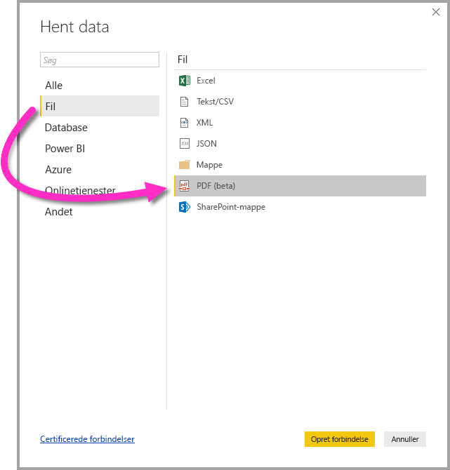

# Opret forbindelse til en PDF-fil i Power BI Desktop (prøveversion)
I Power BI Desktop kan du oprette forbindelse til en **PDF-fil** og bruge dataene fra filen på samme måde som enhver anden datakilde i Power BI Desktop.

I følgende afsnit beskrives det, hvordan du opretter forbindelse til en **PDF-fil**, vælger data og indfører disse data i **Power BI Desktop**.

## Aktivér PDF-connector
PDF-connectoren indgår i prøveversionen til **Power BI Desktop** og skal aktiveres. Du aktiverer PDF-connectoren ved at vælge **Fil > Indstillinger > Indstillinger > Funktioner til eksempelvisning** og derefter markere afkrydsningsfeltet ud for **Hent data fra PDF-filer**. 

Du skal genstarte **Power BI Desktop**, når du har markeret indstillingen.

Første gang du bruger **PDF (beta)**-connectoren, bliver du advaret om, at PDF-connectoren stadig er under udvikling og kan ændres senere. Vælg **Fortsæt** for at bruge connectoren.

Vi anbefaler, at du altid opgraderer til den nyeste version af **Power BI Desktop**, hvilket du kan gøre via et link i [Power BI Desktop](desktop-get-the-desktop.md). 

## Opret forbindelse til en PDF-fil
Hvis du vil oprette forbindelse til en **PDF-fil**, skal du vælge **Hent data** på båndet **Hjem** i Power BI Desktop. Vælg **Fil** blandt kategorierne til venstre, hvorefter du kan se **PDF (beta)**.

Du bliver bedt om at angive placeringen af den PDF-fil, du vil bruge. Når du har angivet placeringen, og PDF-filen indlæses, vises der et vindue af typen **Navigator**, hvor de data, der er tilgængelige fra filen, vises. Her kan du vælge et eller flere elementer, der skal importeres og bruges i **Power BI Desktop**.

Hvis du markerer et afkrydsningsfelt ud for de registrerede elementer i PDF-filen, vises de i ruden til højre. Når du er klar til at importere, skal du vælge knappen **Indlæse** for at overføre dataene til **Power BI Desktop**.

Fra og med udgivelsen af **Power BI Desktop** i november 2018 kan du angive **Startside** og **Slutside** som valgfrie parametre for din PDF-forbindelse. Du kan også angive disse parametre i computersproget med M-formlen i følgende format:

`Pdf.Tables(File.Contents("c:\sample.pdf"), [StartPage=10, EndPage=11])`

## Næste trin
Du kan oprette forbindelse til mange forskellige typer data ved hjælp af Power BI Desktop. Du kan finde flere oplysninger om datakilder i følgende ressourcer:

* [Hvad er Power BI Desktop?](desktop-what-is-desktop.md)
* [Datakilder i Power BI Desktop](desktop-data-sources.md)
* [Udform og kombiner data med Power BI Desktop](desktop-shape-and-combine-data.md)
* [Opret forbindelse til Excel-projektmapper i Power BI Desktop](desktop-connect-excel.md)   
* [Angiv data direkte i Power BI Desktop](desktop-enter-data-directly-into-desktop.md)   

