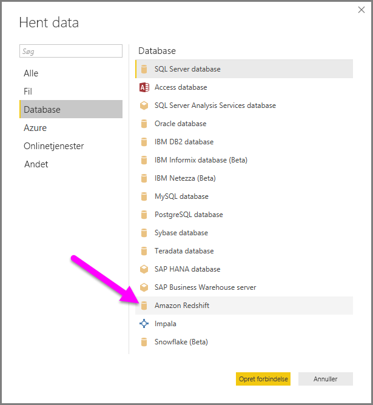
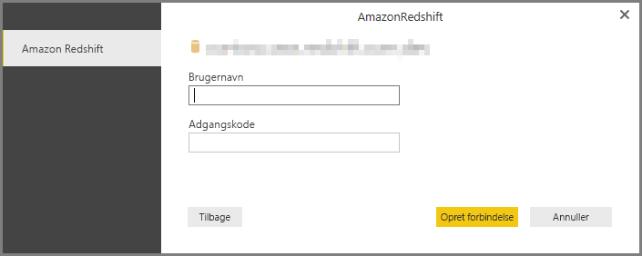

# Opret forbindelse til en Amazon Redshift-database i Power BI Desktop
I **Power BI Desktop** kan du oprette forbindelse til en **Amazon Redshift**-database og bruge de underliggende data på samme måde som enhver anden datakilde i Power BI Desktop.

## Opret forbindelse til en Amazon Redshift-database
Hvis du vil oprette forbindelse til en **Amazon Redshift**-database, skal du vælge **Hent data** på båndet **Hjem** i Power BI Desktop. Vælg **Database** blandt kategorierne til venstre, hvorefter du kan se **Amazon Redshift**.

I det **Amazon Redshift**-vindue, der åbnes, skal du skrive eller indsætte navnet på din **Amazon Redshift**-server og -database i feltet. I feltet *Server* kan brugerne angive en port i følgende format: *ServerURL:Port*

Når du bliver bedt om det, skal du angive dit brugernavn og din adgangskode. Du bør bruge et servernavn, der passer nøjagtigt til SSL-certifikatet, for at undgå fejl. 

Når du har oprettet forbindelse, vises et vindue af typen **Navigator**, hvor de data, der er tilgængelige på serveren, vises. Her kan du vælge et eller flere elementer, der skal importeres og bruges i **Power BI Desktop**.

Når du har foretaget valg i vinduet **Navigator**, kan du enten **indlæse** eller **redigere** dataene.

* Hvis du vælger at **indlæse** data, bliver du spurgt, om du vil bruge tilstanden *Import* eller *DirectQuery* til at indlæse dataene. Du kan finde flere oplysninger i denne [artikel, der forklarer DirectQuery](desktop-use-directquery.md).
* Hvis du vælger at **redigere** data, vises **forespørgselseditoren**, hvor du kan anvende alle mulige forskellige transformeringer og filtre på dataene, hvoraf mange anvendes på selve den underliggende **Amazon Redshift**-database (hvis det understøttes).

## De næste trin
Du kan oprette forbindelse til mange forskellige typer data ved hjælp af Power BI Desktop. Hvis du vil have mere at vide om datakilder, kan du se følgende ressourcer:

* [Hvad er Power BI Desktop?](desktop-what-is-desktop.md)
* [Datakilder i Power BI Desktop](desktop-data-sources.md)
* [Udform og kombiner data med Power BI Desktop](desktop-shape-and-combine-data.md)
* [Opret forbindelse til Excel-projektmapper i Power BI Desktop](desktop-connect-excel.md)   
* [Angiv data direkte i Power BI Desktop](desktop-enter-data-directly-into-desktop.md)   

