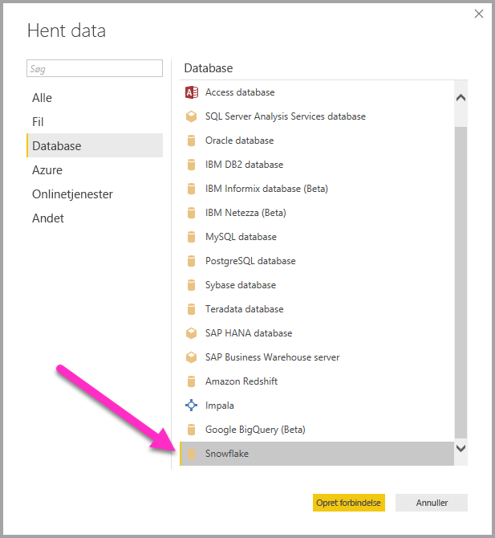
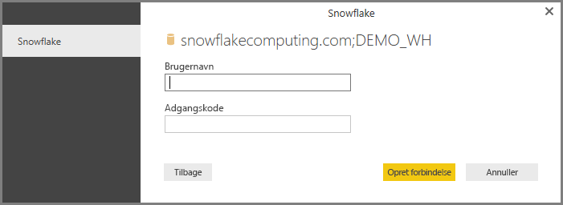

# Opret forbindelse til Snowflake i Power BI Desktop
I Power BI Desktop kan du oprette forbindelse til et **Snowflake**-databehandlingswarehouse og bruge de underliggende data på samme måde som enhver anden datakilde i Power BI Desktop. 

> [!NOTE]
> Du *skal* også installere **Snowflake ODBC-driveren** på computere, der bruger **Snowflake**-connectoren, vha. den arkitektur, der svarer til installationen af  **Power BI Desktop**, dvs. enten 32-bit eller 64-bit. Du skal blot følge nedenstående link og [downloade den relevante Snowflake ODBC-driver](http://go.microsoft.com/fwlink/?LinkID=823762).
> 
> 

## Opret forbindelse til et Snowflake-databehandlingswarehouse
Hvis du vil oprette forbindelse til et **Snowflake**-databehandlingswarehouse, skal du vælge **Hent data** på båndet **Hjem** i Power BI Desktop. Vælg **Database** blandt kategorierne til venstre, hvorefter du kan se **Snowflake**.

I det viste vindue, **Snowflake**, skal du skrive eller indsætte navnet på dit Snowflake-databehandlingswarehouse i feltet og vælge **OK**. Bemærk, at du kan vælge at **importere** data direkte i Power BI, eller du kan bruge **DirectQuery**. Du kan få mere at vide om [brug af DirectQuery](desktop-use-directquery.md).

Når du bliver bedt om det, skal du angive dit brugernavn og din adgangskode.

> [!NOTE]
> Når du angiver dit brugernavn og din adgangskode for en bestemt **Snowflake**-server, anvendes de samme legitimationsoplysninger i efterfølgende forsøg på at oprette forbindelse via Power BI Desktop. Du kan ændre disse legitimationsoplysninger ved at gå til **Filer > Indstillinger > Indstillinger for datakilde**.
> 
> 

Når du har oprettet forbindelse, vises et vindue af typen **Navigator**, hvor de data, der er tilgængelige på serveren, vises. Her kan du vælge et eller flere elementer, der skal importeres og bruges i **Power BI Desktop**.

Du kan **indlæse** den valgte tabel, der fører hele tabellen ind i **Power BI Desktop**, eller du kan **redigere** forespørgslen, der åbner **Forespørgselseditor**, så du kan filtrere og finindstille det datasæt, du vil bruge, og derefter indlæse dette finindstillede datasæt i **Power BI Desktop**.

## Næste trin
Du kan oprette forbindelse til mange forskellige typer data ved hjælp af Power BI Desktop. Du kan finde flere oplysninger om datakilder i følgende ressourcer:

* [Hvad er Power BI Desktop?](desktop-what-is-desktop.md)
* [Datakilder i Power BI Desktop](desktop-data-sources.md)
* [Udform og kombiner data med Power BI Desktop](desktop-shape-and-combine-data.md)
* [Opret forbindelse til Excel-projektmapper i Power BI Desktop](desktop-connect-excel.md)   
* [Angiv data direkte i Power BI Desktop](desktop-enter-data-directly-into-desktop.md)   

