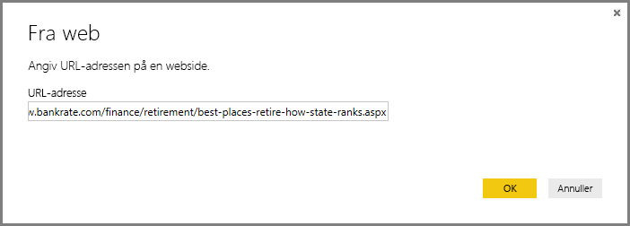
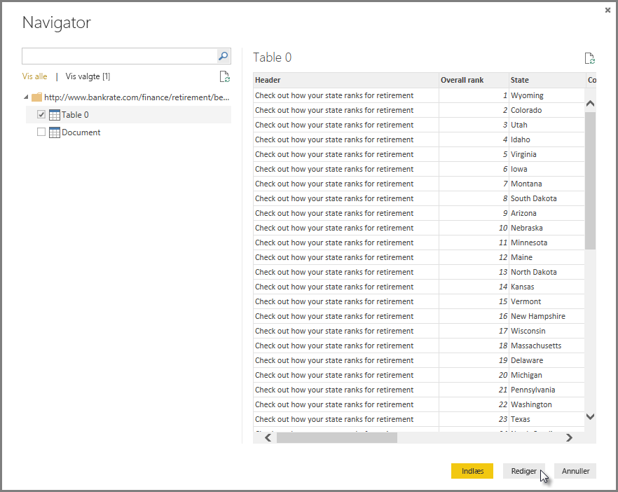
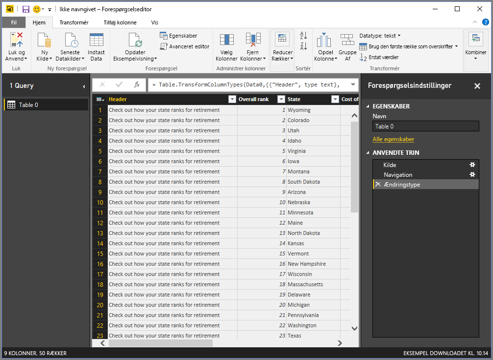
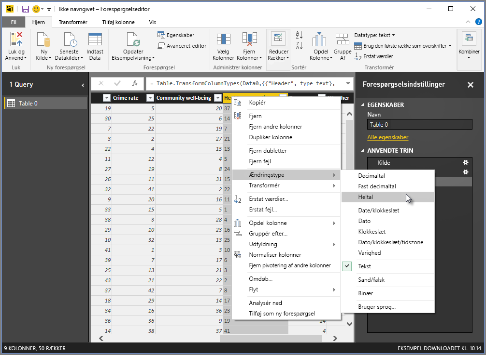
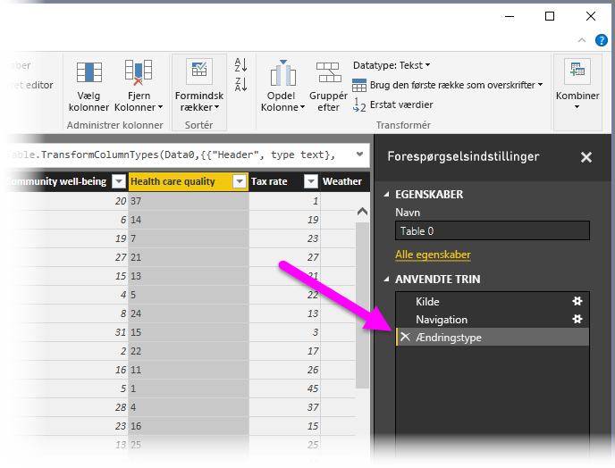
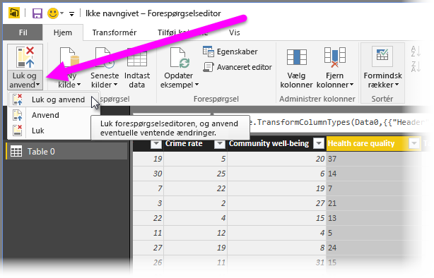
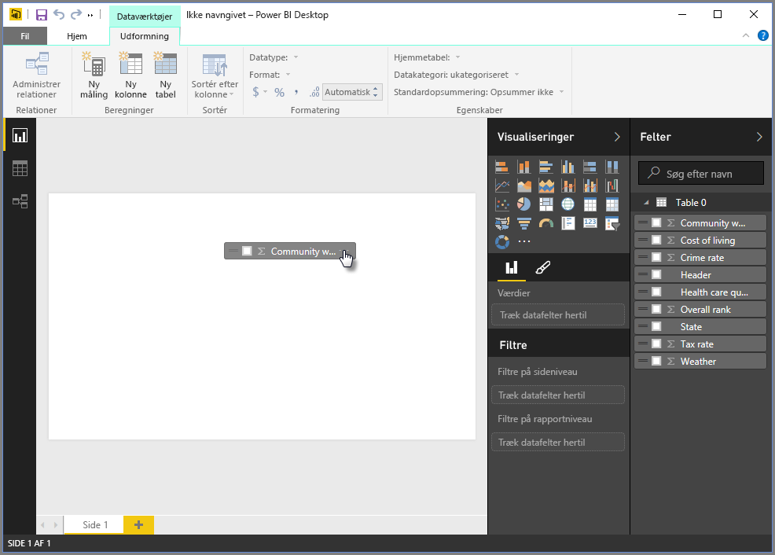
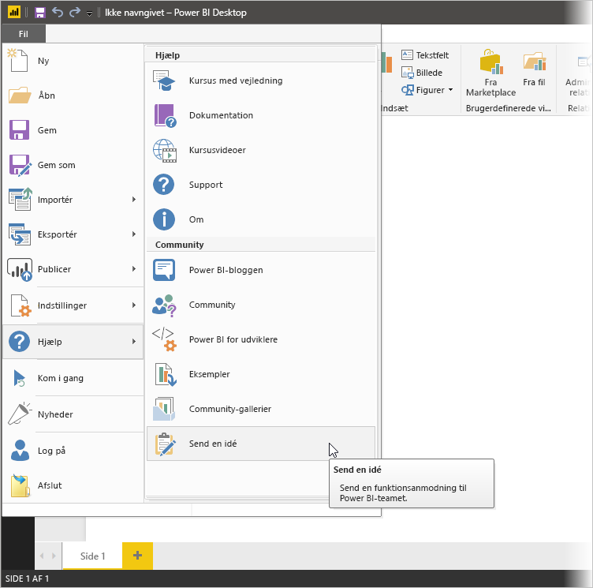

# Opret forbindelse til data i Power BI Desktop
I Power BI Desktop kan du nemt oprette forbindelse til en stadig større verden af data. Hvis du ikke har Power BI Desktop, kan du [downloade](http://go.microsoft.com/fwlink/?LinkID=521662) og installere det.

I Power BI Desktop findes der *alle mulige* forskellige datakilder. På følgende billede kan du se, hvordan du opretter forbindelse til data ved at vælge båndet **Filer** og derefter **Hent data \> Flere**.

## Eksempel på oprettelse af forbindelse til data
I dette eksempel opretter vi forbindelse til en datakilde af typen **Web**.

Forestil dig, at du går på pension – du vil gerne bo et sted, hvor der er masser af solskin, bedre skatter og et godt sundhedsvæsen. Eller… du er måske dataanalytiker, og du ønsker, at oplysningerne skal hjælpe dine kunder – f.eks. hjælpe en kunde, der producerer regnfrakker, med at målrette salg, hvor det regner *meget*.

Uanset hvad, kan du finde en webressource, der indeholder interessante data om disse og andre emner:

[*http://www.bankrate.com/finance/retirement/best-places-retire-how-state-ranks.aspx*](http://www.bankrate.com/finance/retirement/best-places-retire-how-state-ranks.aspx)

Vælg **Hent data \> Web**, og skriv adressen.

Når du vælger **OK**, begynder funktionen **Forespørgsel** i Power BI Desktop at arbejde. Power BI Desktop kontakter webressourcen, og i **navigatorvinduet** returneres resultaterne af det, der blev fundet på den pågældende webside. I dette tilfælde blev der fundet en tabel (Table 0) og det generelle dokument. Vi er interesseret i tabellen, så vi vælger den på listen. I **navigatorvinduet** vises der et eksempel.

På nuværende tidspunkt kan vi redigere forespørgslen, før tabellen indlæses, ved at vælge **Rediger** nederst i vinduet, eller vi kan indlæse tabellen.

Hvis vi vælger **Rediger**, indlæses tabellen, og forespørgselseditoren startes. Ruden **Forespørgselsindstillinger** vises (hvis ikke, kan du vælge **Vis** på båndet og derefter vælge **Vis \> Forespørgselsindstillinger** for at få vist ruden **Forespørgselsindstillinger**). Sådan ser det ud.

Alle disse resultater er tekst i stedet for tal, og vi skal bruge tal. Det er ikke noget problem – du skal bare højreklikke på kolonneoverskriften og vælge **Skift type \> Heltal** for at ændre dem. Hvis vi vil vælge mere end én kolonne, skal vi først vælge en kolonne og derefter holde **Skift** nede, vælge yderligere tilstødende kolonner og derefter højreklikke på en kolonneoverskrift for at ændre alle de valgte kolonner. Brug **Ctrl** til at vælge de kolonner, der ikke er tilstødende.

Under **Forespørgselsindstillinger** afspejler **Anvendte trin** de ændringer, der er foretaget. Når du foretager yderligere ændringer af dataene, registrerer forespørgselseditoren disse ændringer i sektionen **Anvendte trin**, som du kan tilpasse, vende tilbage til, omarrangere eller slette efter behov.

Der kan stadig foretages yderligere ændringer i tabellen, når den er indlæst, men på nuværende tidspunkt er det fint, som det er. Når vi er færdige, vælger vi **Luk og anvend** på båndet **Hjem**, og Power BI Desktop anvender vores ændringer og lukker forespørgselseditoren.

Mens datamodellen indlæst, kan vi i **rapportvisningen** i Power BI Desktop gå i gang med at oprette visualiseringer ved at trække felter til lærredet.

Det er selvfølgelig en simpel model med en enkelt dataforbindelse. De fleste Power BI Desktop-rapporter vil have forbindelser til forskellige datakilder, formet til dine behov, med relationer, der opretter en mere omfattende datamodel. 

## Næste trin
Du kan gøre mange forskellige ting med Power BI Desktop. Du kan finde flere oplysninger om funktionerne i følgende ressourcer:

* [Hvad er Power BI Desktop?](desktop-what-is-desktop.md)
* [Oversigt over forespørgsler i Power BI Desktop](desktop-query-overview.md)
* [Datakilder i Power BI Desktop](desktop-data-sources.md)
* [Udform og kombiner data med Power BI Desktop](desktop-shape-and-combine-data.md)
* [Almindelige forespørgselsopgaver i Power BI Desktop](desktop-common-query-tasks.md)   

Vil du give os feedback? Super! Brug menuelementet **Indsend en idé** i Power BI Desktop, eller besøg [Feedback fra community](http://community.powerbi.com/t5/Community-Feedback/bd-p/community-feedback). Vi ser frem til at høre fra dig!

