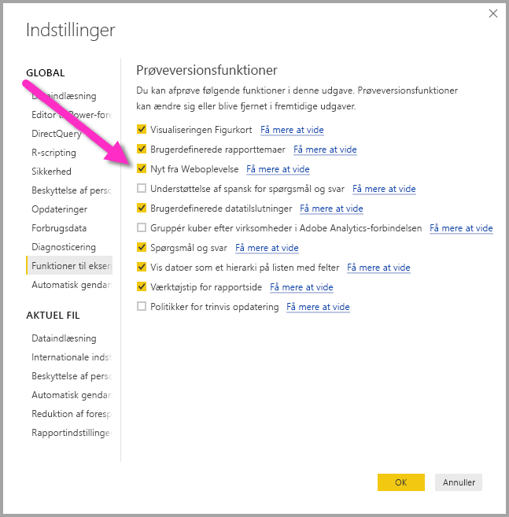
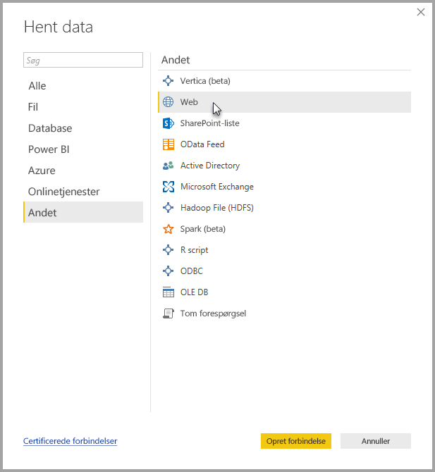
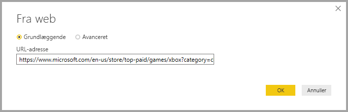
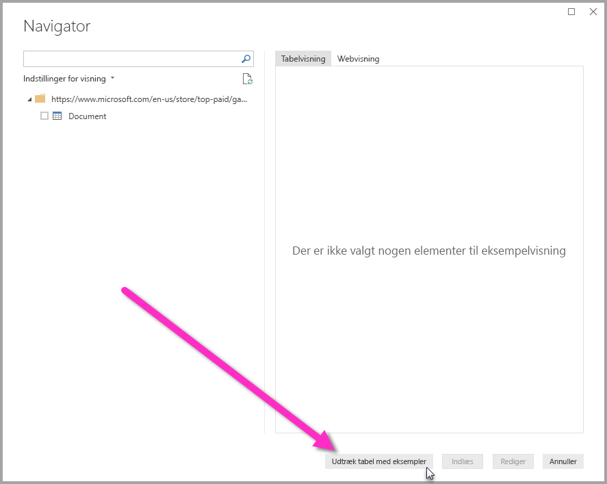
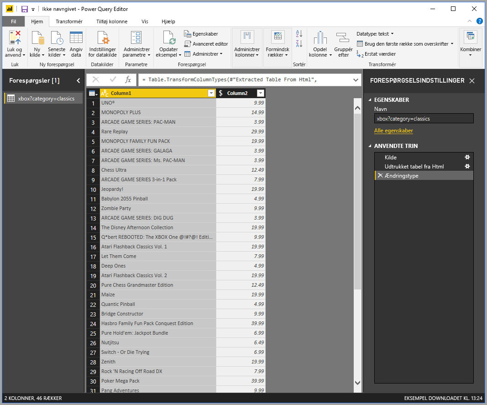

# Hent data fra en webside ved at angive et eksempel (prøveversion)

Ved at hente data fra en webside kan brugere nemt udpakke data fra websider og importere data til **Power BI Desktop**. Men ofte vises data på websider ikke i organiserede tabeller, der er lette at udtrække, så det kan være en udfordring at hente data fra disse sider – også selvom de er strukturerede og konsistente. 

Der findes en løsning. Via funktionen **Hent data fra web efter eksempel** kan du i store træk vise **Power BI Desktop**, hvilke data du vil udtrække, ved at angive et eller flere eksempler i connectordialogboksen. Derefter indsamler den andre data på siden, der svarer til dine eksempler. Med denne løsning kan du udtrække alle mulige slags data fra websider, herunder data, der findes i tabeller *og* andre data, der ikke stammer fra tabeller. 

## Aktivering af prøvefunktionen Hent data fra web efter eksempel

**Hent data fra web efter eksempel** er en prøveversionsfunktion, og den skal aktiveres i **Power BI Desktop**. Du aktiverer den ved at vælge **Filer > Indstillinger > Indstillinger > Prøveversionsfunktioner** og derefter markere afkrydsningsfeltet **Nyt fra Weboplevelse**. Du skal genstarte Power BI Desktop, når du har markeret indstillingen.

Når prøveversionsfunktionen er aktiveret, er du klar til at bruge den. 

## Brug Hent data fra web efter eksempel

Hvis du vil bruge **Hent data fra web efter eksempel**, skal du vælge **Hent data** i menuen **Hjem** på båndet. I vinduet, der vises, skal du vælge **Andet** i kategorierne i venstre rude og derefter vælge **Web**.

Angiv URL-adressen til den webside, som du vil udtække data fra. I denne artikel bruger vi websiden Microsoft Store og viser, hvordan denne connector fungerer. 

Hvis du vil følge med, kan du bruge den [URL-adresse til Microsoft Store](https://www.microsoft.com/en-us/store/top-paid/games/xbox?category=classics), som vi bruger i denne artikel:

    https://www.microsoft.com/en-us/store/top-paid/games/xbox?category=classics

Når du vælger **OK**, sendes du videre til dialogboksen **Navigator**, hvor der vises nogle automatisk registrerede tabeller fra websiden. I den situation, der vises på billedet nedenfor, blev der ikke fundet nogen tabeller, men der er en knap nederst på siden, der kaldes **Udtræk tabel med eksempler**, som du kan bruge til at angive eksempler.

Hvis du vælger **Udtræk tabel med eksempler**, vises der et interaktivt vindue, hvor du kan se indholdet af websiden og angive eksempelværdier for de data, du vil udtrække. 

I dette eksempel udtrækker vi *Navn* og *Pris* for alle spil på siden. Det kan vi gøre ved at angive et par eksempler fra siden for hver kolonne, som vist på følgende billede. Efterhånden som disse eksempler skrives, kan **Power-forespørgsel** (som er den underliggende teknologi, der udtrækker dataene fra websiden) udtrække data, der passer til mønsteret for eksempelposter, ved hjælp af smarte algoritmer til udtræk af data.

Når vi er tilfredse med de data, der er udtrukket fra websiden, vælger vi **OK** for at gå til **Forespørgselseditor**, hvor vi kan anvende flere transformationer eller forme dataene, f.eks. kombinere disse data med andre datakilder.

Herefter kan du oprette visuelle elementer eller på anden måde bruge websidedataene, når du opretter dine **Power BI Desktop**-rapporter.

## Næste trin
Du kan oprette forbindelse til mange forskellige typer data ved hjælp af **Power BI Desktop**. Du kan finde flere oplysninger om datakilder i følgende ressourcer:

* [Tilføj kolonne efter eksempel](desktop-add-column-from-example.md)
* [Opret forbindelse til en webside](desktop-connect-to-web.md)
* [Datakilder i Power BI Desktop](desktop-data-sources.md)
* [Udform og kombiner data med Power BI Desktop](desktop-shape-and-combine-data.md)
* [Opret forbindelse til Excel-projektmapper i Power BI Desktop](desktop-connect-excel.md)   
* [Opret forbindelse til CSV-filer i Power BI Desktop](desktop-connect-csv.md)   
* [Angiv data direkte i Power BI Desktop](desktop-enter-data-directly-into-desktop.md)   

