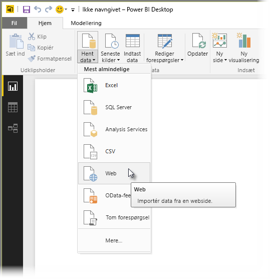
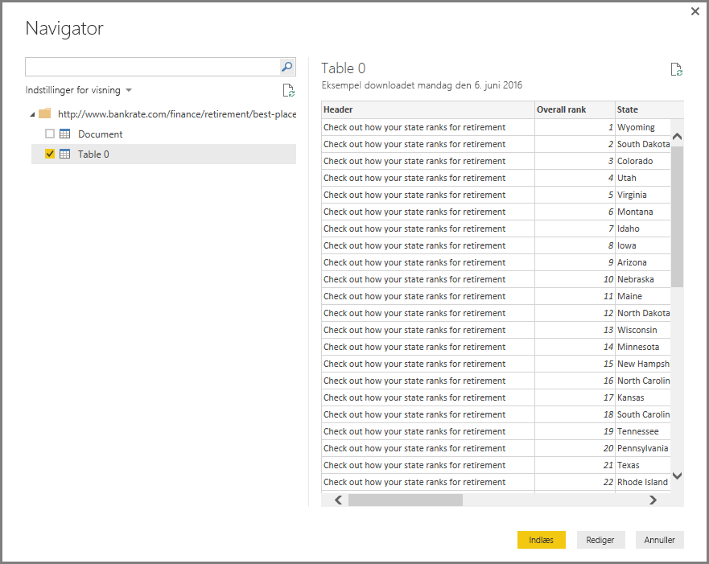

# Opret forbindelse til en webside fra Power BI Desktop
Du kan oprette forbindelse til en webside og importere data i Power BI Desktop for at bruge dem i dine visualiseringer og datamodeller.

Vælg **Hent data > Web** på båndet **Hjem** i Power BI Desktop.

Der vises en dialogboks, hvor du bliver bedt om at angive URL-adressen på den webside, hvorfra du vil importere data.

Når du har skrevet eller indsat URL-adressen, skal du vælge **OK**. Power BI Desktop opretter forbindelse til denne side og præsenterer derefter sidens tilgængelige data i vinduet **Navigator**. Når du vælger et af de tilgængelige dataelementer, f.eks. en tabel over hele siden, vises der et eksempel på disse data i højre side af vinduet **Navigator**.

Du kan vælge knappen **Rediger**, hvilket starter **Forespørgselseditor**, hvor du kan udforme og transformere dataene på denne webside, før du importerer den til Power BI Desktop. Du kan også vælge knappen **Indlæs** og importere alle dataelementer, du har valgt i venstre rude.

Når du vælger **Indlæs**, importerer Power BI Desktop de valgte elementer og gør dem tilgængelige i ruden **Felter**, som du finder i højre side af visningen Rapporter i Power BI Desktop.

Så nemt er det at oprette forbindelse til en webside og hente sidens data ind i Power BI Desktop.

Herfra kan du trække felterne til Rapportcanvas og oprette alle de visualiseringer, du vil. Du kan også bruge dataene fra denne webside på samme måde som andre data – du kan f.eks. forme dem, oprette relationer mellem dem og andre datakilder i din model og udføre andre handlinger for at oprette præcist den Power BI-rapport, du ønsker.

Hvis du vil se yderligere oplysninger om, hvordan du opretter forbindelse til en webside, skal du se [guiden Introduktion til Power BI Desktop](desktop-getting-started.md).

### Næste trin
Du kan oprette forbindelse til mange forskellige typer data ved hjælp af Power BI Desktop. Du kan finde flere oplysninger om datakilder i følgende ressourcer:

* [Datakilder i Power BI Desktop](desktop-data-sources.md)
* [Udform og kombiner data med Power BI Desktop](desktop-shape-and-combine-data.md)
* [Opret forbindelse til Excel-projektmapper i Power BI Desktop](desktop-connect-excel.md)   
* [Opret forbindelse til CSV-filer i Power BI Desktop](desktop-connect-csv.md)   
* [Angiv data direkte i Power BI Desktop](desktop-enter-data-directly-into-desktop.md)   

