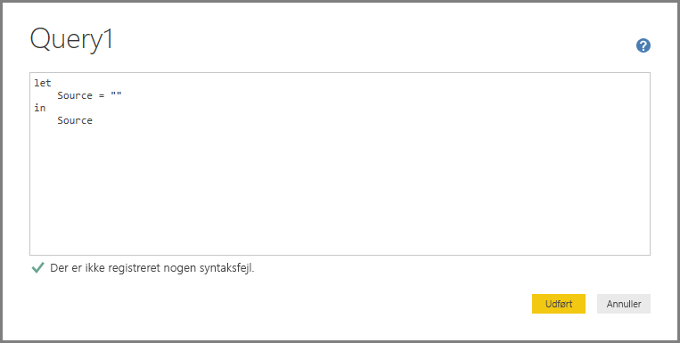

# Opret forbindelse til data med generiske grænseflader i Power BI Desktop
Du kan oprette forbindelse til en lang række forskellige datakilder i **Power BI Desktop** ved hjælp af de indbyggede dataforbindelser, der strækker sig lige fra **Access-databaser** til **Zendesk**-ressourcer, som vist i vinduet **Hent data**. Du kan også oprette forbindelse til mange *andre* typer datakilder for at få endnu flere muligheder for at oprette forbindelse ved hjælp af de generiske grænseflader (f.eks **ODBC** eller **REST API'er**), der er indbygget i **Power BI Desktop**.

## Datagrænseflader i Power BI Desktop
**Power BI Desktop** indeholder en stadig stigende samling af dataforbindelser, der er udviklet til at oprette forbindelse til en bestemt datakilde. Dataforbindelsen **SharePoint-liste** leverer f.eks. specifikke felter og understøttende oplysninger under den forbindelsessekvens, der er udviklet til **SharePoint-lister**. Det samme er gældende for de andre datakilder, der findes i det vindue, der vises, når du vælger **Hent data > Flere...**  (som vist i det forrige billede).

Desuden kan du i **Power BI Desktop** oprette forbindelse til de datakilder, der ikke er identificeret på listerne **Hent data**, ved hjælp af en af følgende generiske datagrænseflader:

* **ODBC**
* **OLE DB**
* **OData**
* **REST API'er**
* **R-Scripts**

Ved at angive de relevante parametre i de forbindelsesvinduer, som disse generiske grænseflader leverer, vil det antal datakilder, som du kan få adgang til og bruge i **Power BI Desktop**, vokse væsentligt.

Du kan finde en liste over de datakilder, disse generiske grænseflader kan få adgang til, i de følgende afsnit.

Kan du ikke finde den datakilde, du vil bruge med **Power BI Desktop**? Indsend din idé til Power BI teamets [liste over idéer og anmodninger](https://ideas.powerbi.com/).

## Datakilder, der er tilgængelige via ODBC
Med **ODBC**-connectoren i **Power BI Desktop** kan du importere data fra en ODBC-driver fra en tredjepart ved at angive et **datakildenavn** eller en  *forbindelsesstreng*. Du kan også vælge at angive en SQL-sætning, som skal køres mod ODBC-driveren.

Følgende liste indeholder nogle eksempler på de datakilder, som **Power BI Desktop** kan oprette forbindelse til ved hjælp af den generiske grænseflade **ODBC**.

| Generisk connector i Power BI Desktop | Ekstern datakilde | Link til flere oplysninger |
| --- | --- | --- |
| ODBC |Cassandra |[Cassandra ODBC-driveren](http://www.simba.com/drivers/cassandra-odbc-jdbc/) |
| ODBC |Couchbase DB |[Couchbase og Power BI](https://powerbi.microsoft.com/blog/visualizing-data-from-couchbase-server-v4-using-power-bi/) |
| ODBC |DynamoDB |[DynamoDB ODBC-driveren](http://www.simba.com/drivers/dynamodb-odbc-jdbc/) |
| ODBC |Google BigQuery |[BigQuery ODBC-driveren](http://www.simba.com/drivers/bigquery-odbc-jdbc/) |
| ODBC |HBase |[HBase ODBC-driveren](http://www.simba.com/drivers/hbase-odbc-jdbc/) |
| ODBC |Hive |[Hive ODBC-driveren](http://www.simba.com/drivers/hive-odbc-jdbc/) |
| ODBC |IBM Netezza |[IBM Netezza-oplysninger](https://www.ibm.com/support/knowledgecenter/SSULQD_7.2.1/com.ibm.nz.datacon.doc/c_datacon_plg_overview.html) |
| ODBC |Presto |[Presto ODBC-driveren](http://www.simba.com/drivers/presto-odbc-jdbc/) |
| ODBC |Projekt Online |[Project Online-artikel](desktop-project-online-connect-to-data.md) |
| ODBC |Progress OpenEdge |[Blogindlæg om Progress OpenEdge ODBC-driveren](https://na01.safelinks.protection.outlook.com/?url=https%3A%2F%2Fwww.progress.com%2Fblogs%2Fconnect-microsoft-power-bi-to-openedge-via-odbc-driver&data=02%7C01%7CMatt.Masson%40microsoft.com%7C5e63742e6c454308b58a08d4034b5923%7C72f988bf86f141af91ab2d7cd011db47%7C1%7C0%7C636137069555329811&sdata=gSu2Rq3vZ0uBVOgjaXxd8Y3uBf%2B8DidX6PG33jwAduY%3D&reserved=0) |

## Datakilder, der er tilgængelige via OLE DB
Med **OLE DB**-connectoren i **Power BI Desktop** kan du importere data fra en OLE DB-driver fra en tredjepart ved at angive en *forbindelsesstreng*. Du kan også vælge at angive en SQL-sætning, som skal køres mod OLE DB-driveren.

Følgende liste indeholder nogle eksempler på de datakilder, som **Power BI Desktop** kan oprette forbindelse til ved hjælp af den generiske grænseflade **OLE DB**.

| Generisk connector i Power BI Desktop | Ekstern datakilde | Link til flere oplysninger |
| --- | --- | --- |
| OLE DB |SAS OLE DB |[SAS-provider til OLE DB](https://support.sas.com/downloads/package.htm?pid=648) |
| OLE DB |Sybase OLE DB |[Sybase-provider til OLE DB](http://infocenter.sybase.com/help/index.jsp?topic=/com.sybase.infocenter.dc35888.1550/doc/html/jon1256941734395.html) |

## Datakilder, der er tilgængelige via OData
Med **OData**-connectoren i **Power BI Desktop** kan du importere data fra en hvilken som helst URL-adresse til **OData** ved at skrive eller indsætte URL-adressen til **OData**. Du kan tilføje flere URL-adressedele ved at indtaste eller indsætte disse links i tekstfelterne i vinduet **OData Feed**.

Følgende liste indeholder nogle eksempler på de datakilder, som **Power BI Desktop** kan oprette forbindelse til ved hjælp af den generiske grænseflade **OData**.

| Generisk connector i Power BI Desktop | Ekstern datakilde | Link til flere oplysninger |
| --- | --- | --- |
| OData |Kommer snart |Vend snart tilbage for at se en liste over OData-datakilder |

## Datakilder, der er tilgængelige via REST API'er
Du kan oprette forbindelse til datakilder med **REST API'er** og dermed bruge data fra alle mulige forskellige datakilder, der understøtter **REST**.

Følgende liste indeholder nogle eksempler på de datakilder, som **Power BI Desktop** kan oprette forbindelse til ved hjælp af den generiske grænseflade **REST API'er**.

| Generisk connector i Power BI Desktop | Ekstern datakilde | Link til flere oplysninger |
| --- | --- | --- |
| REST API'er |Couchbase DB |[Couchbase REST API-oplysninger](https://powerbi.microsoft.com/blog/visualizing-data-from-couchbase-server-v4-using-power-bi/) |

## Datakilder, der er tilgængelige via R Script
Du kan bruge **R Scripts** til at få adgang til datakilder og bruge disse data i **Power BI Desktop**.

Følgende liste indeholder nogle eksempler på de datakilder, som **Power BI Desktop** kan oprette forbindelse til ved hjælp af den generiske brugergrænseflade **OData**.

| Generisk connector i Power BI Desktop | Ekstern datakilde | Link til flere oplysninger |
| --- | --- | --- |
| R Script |SAS-filer |[R Script-vejledning fra CRAN](https://cran.r-project.org/doc/manuals/R-data.html) |
| R Script |SPSS-filer |[R Script-vejledning fra CRAN](https://cran.r-project.org/doc/manuals/R-data.html) |
| R Script |Statistiske R-filer |[R Script-vejledning fra CRAN](https://cran.r-project.org/doc/manuals/R-data.html) |

## Næste trin
Du kan oprette forbindelse til mange forskellige typer datakilder ved hjælp af **Power BI Desktop**. Du kan finde flere oplysninger om datakilder i følgende ressourcer:

* [Hvad er Power BI Desktop?](desktop-what-is-desktop.md)
* [Datakilder i Power BI Desktop](desktop-data-sources.md)
* [Udform og kombiner data med Power BI Desktop](desktop-shape-and-combine-data.md)
* [Opret forbindelse til Excel-projektmapper i Power BI Desktop](desktop-connect-excel.md)   
* [Angiv data direkte i Power BI Desktop](desktop-enter-data-directly-into-desktop.md)   

