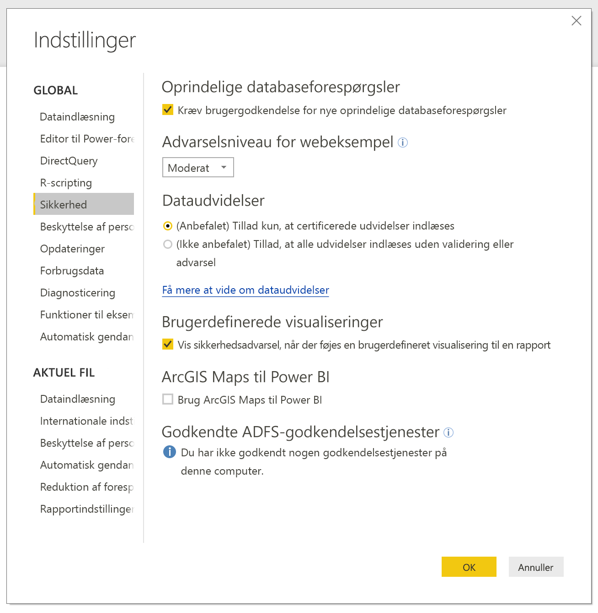
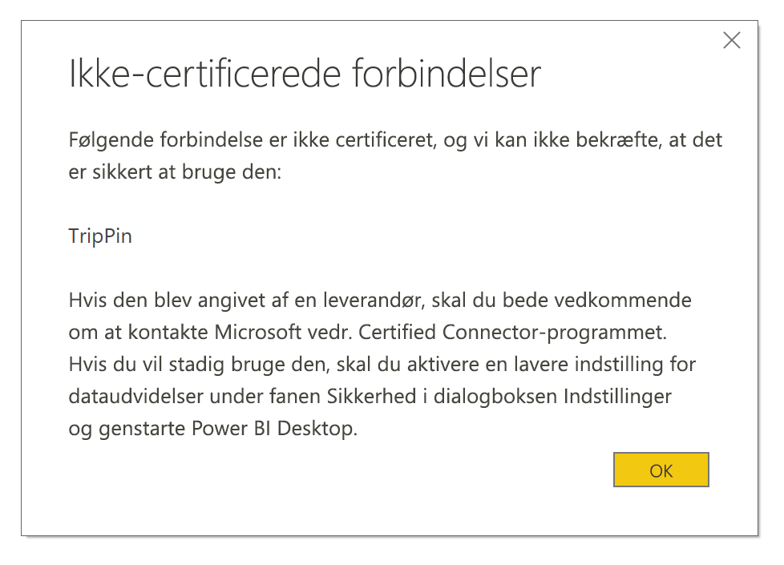

# Forbindelsesudvidelse i Power BI

I Power BI kan kunder og udviklere udvide de datakilder, som de opretter forbindelse til, på mange måder. De bruger eksisterende connectors og generiske datakilder (f.eks. ODBC, OData, Oledb, Web, CSV, XML og JSON). Eller udviklere opretter dataudvidelser kaldet **brugerdefinerede connectors** og gør dem til **certificerede forbindelser**.

I øjeblikket aktiverer du **brugerdefinerede connectors** ved hjælp af en menu, der gør det muligt for dig sikkert at styre det niveau af brugerdefineret kode, som du tillader at køre på systemet. Du kan vælge alle brugerdefinerede connectors eller kun connectors, som er certificeret og distribueret af Microsoft, i dialogboksen **Hent data**.

## Brugerdefinerede forbindelser

**Brugerdefinerede forbindelser** kan inkludere en bred vifte af muligheder lige fra små API'er, som er vigtige for din virksomhed, til store branchespecifikke tjenester, som Microsoft ikke har frigivet en forbindelse til. Mange connectors distribueres af leverandøren. Hvis du har brug for en bestemt dataconnector, skal du kontakte en leverandør.

Hvis du vil bruge en **brugerdefineret forbindelse**, skal du placere den i mappen *\[Dokumenter]\\Power BI Desktop\\Custom Connectors* og tilpasse sikkerhedsindstillingerne som beskrevet i følgende afsnit.

Du behøver ikke at justere sikkerhedsindstillingerne for at bruge **certificerede forbindelser**.

## Sikkerhed for dataudvidelse

Hvis du vil ændre sikkerhedsindstillingerne for en dataudvidelse i **Power BI Desktop**, skal du vælge **Fil > Indstillinger > Indstillinger > Sikkerhed**.

Under **Dataudvidelser** kan du vælge mellem to niveauer af sikkerhed:

* (Anbefalet) Tillad kun, at certificerede udvidelser indlæses
* (Ikke anbefalet) Tillad, at alle udvidelser indlæses uden advarsel

Hvis du planlægger at bruge **brugerdefinerede forbindelser** eller forbindelser, som du eller en tredjepart har udviklet, skal du vælge **(Ikke anbefalet) Tillad, at alle udvidelser indlæses uden advarsel**. Vi anbefaler ikke denne sikkerhedsindstilling, medmindre du har fuld tillid til dine brugerdefinerede forbindelser. Det skyldes, at koden kan håndtere legitimationsoplysninger, herunder sende dem via HTTP, og ignorere beskyttelsesniveauer.

Hvis der er brugerdefinerede connectors på computeren, får du vist fejlmeddelelsen "(anbefales)", får du fejlen "følgende connector er ikke certificeret, og vi kan ikke bekræfte, at den er sikker at bruge" efterfulgt af en liste over forbindelser, der ikke kan indlæses sikkert, ved sikkerhedsindstillingen **"(Anbefalet)"** .

Hvis du vil løse fejlen uden at ændre sikkerheden, skal du fjerne de usignerede connectors fra mappen 'Custom connectors'.

Hvis du vil løse fejlen og bruge disse forbindelser, skal du ændre dine sikkerhedsindstillinger til indstillingen **"(Ikke anbefalet) Tillad indlæsning af alle udvidelser uden advarsel"** som tidligere beskrevet. Genstart derefter **Power BI Desktop**.

## Certificerede forbindelser

Et begrænset undersæt af dataudvidelser anses som **certificerede**. Få adgang til de certificerede connectors i dialogboksen **Hent data**. Men den tredjepartsudvikler, der oprettede connectoren, er ansvarlig for dens vedligeholdelse og support. Selvom Microsoft distribuerer disse connectors, er de ikke ansvarlige for deres ydeevne og fortsatte funktion.

Hvis du vil certificere en brugerdefineret forbindelse, skal du få din leverandør til at kontakte dataconnectors@microsoft.com.
