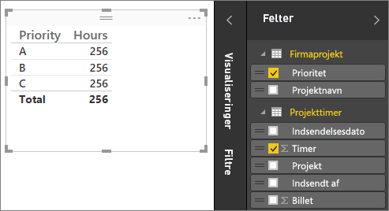
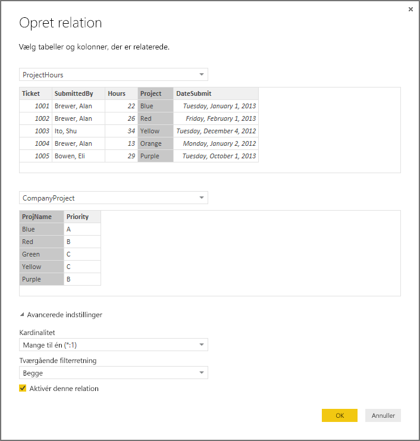
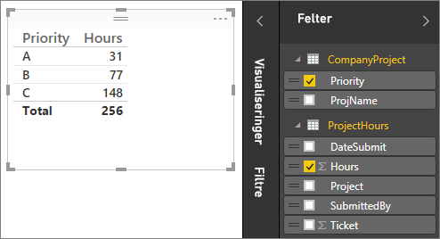
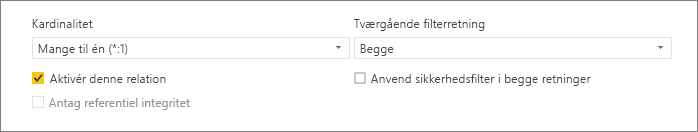
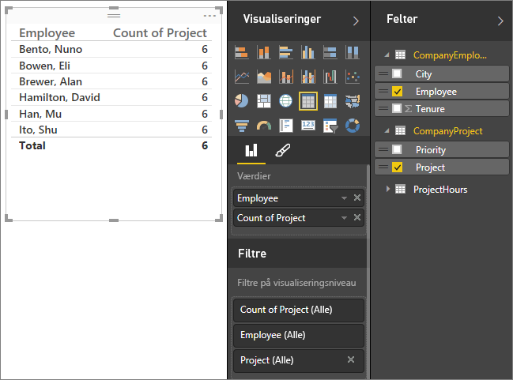
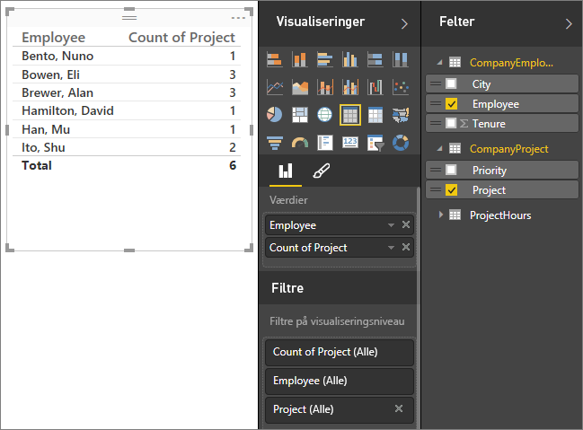
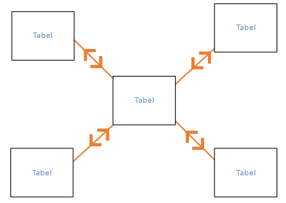
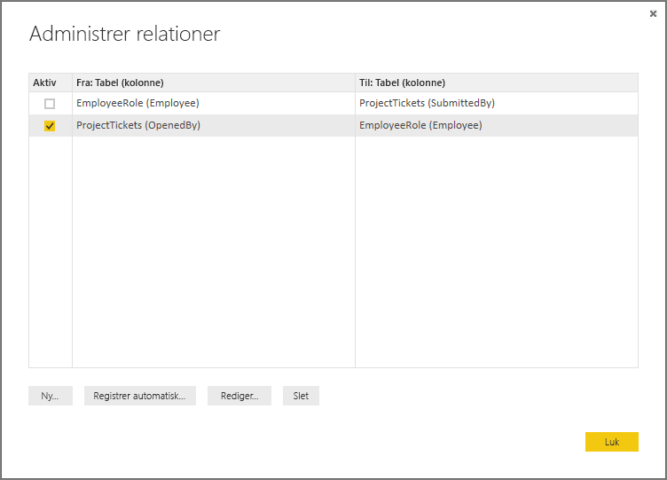
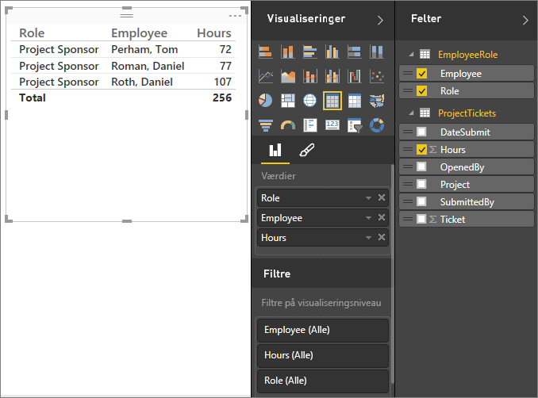
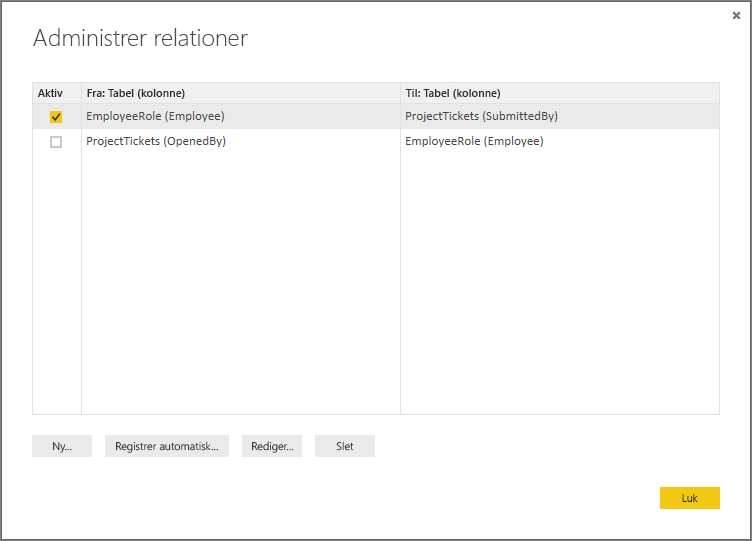

# Opret og administrer relationer i Power BI Desktop
Når du importerer flere tabeller, er det muligt, at du skal udføre analyser ved hjælp af data fra alle disse tabeller. Der skal være relationer mellem disse tabeller, før du kan beregne præcise resultater og vise korrekte oplysninger i dine rapporter. I Power BI Desktop er det nemt at oprette disse relationer. I de fleste tilfælde behøver du faktisk ikke at foretage dig noget – funktionen Registrer automatisk kan gøre det for dig. Men i nogle tilfælde skal du muligvis selv oprette relationer, eller det kan være nødvendigt at foretage ændringer i en relation. I begge tilfælde er det vigtigt at forstå relationer i Power BI Desktop, og hvordan du opretter og redigerer dem.

## Registrer automatisk under indlæsning
Hvis du forespørger to eller flere tabeller på én gang, når der indlæses data, forsøger Power BI Desktop at finde og oprette relationer for dig. Egenskaberne Kardinalitet, Tværgående filterretning og Aktiv angives automatisk. Power BI Desktop kigger på kolonnenavne i de tabeller, som du forespørger, for at se, om der er mulige relationer. Hvis der er, oprettes disse relationer automatisk. Hvis Power BI Desktop ikke med stor sandsynlighed kan afgøre, om der er et match, oprettes relationen ikke automatisk. Du kan stadig bruge dialogboksen Administrer relationer til at oprette eller redigere relationer.

## Opret en relation via Automatisk registrering
Under fanen **Hjem** skal du klikke på **Administrer relationer** \> **Automatisk registrering**.

## Opret en relation manuelt
1. Under fanen **Hjem** skal du klikke på **Administrer relationer** \> **Ny**.
2. I dialogboksen**Opret relation** skal du vælge en tabel på den første rulleliste med tabeller og derefter vælge den kolonne, du vil bruge i relationen.
3. I den anden rulleliste med tabeller skal du vælge den anden tabel, du ønsker i relationen, vælge den anden kolonne, du vil bruge, og derefter klikke på **OK**.

Som standard konfigurerer Power BI Desktop automatisk egenskaberne Kardinalitet (retning), Tværgående filterretning og Aktiv for din nye relation. Du kan dog ændre disse, hvis det er nødvendigt. Du kan finde flere oplysninger i afsnittet Om yderligere indstillinger senere i denne artikel.

Bemærk, at du får vist en fejl, der angiver, at *en af kolonnerne skal have entydige værdier*, hvis ingen af de tabeller, der er valgt for relationen, indeholder entydige værdier. Mindst én tabel i en relation *skal* have en særskilt og entydig liste over nøgleværdier, som er et almindeligt krav for alle relationsdatabaseteknologier. 

Hvis du får vist denne fejl, er der et par forskellige måder, du kan rette problemet på:

* Brug "Fjern identiske rækker" til at oprette en kolonne med entydige værdier. Ulempen ved denne metode er, at du vil miste oplysninger, når dublerede rækker fjernes, og der er ofte en god grund til, at en nøgle (række) er dubleret.
* Tilføj en mellemliggende tabel, der består af listen over særskilte nøgleværdier i modellen, som derefter knyttes til begge de oprindelige kolonner i relationen.

Du kan finde flere oplysninger i dette [blogindlæg](https://blogs.technet.microsoft.com/cansql/2016/12/19/relationships-in-power-bi-fixing-one-of-the-columns-must-have-unique-values-error-message/).

## Rediger en relation
1. Under fanen **Hjem** skal du klikke på **Administrer relationer**.
2. I dialogboksen**Administrer relationer** skal du vælge relationen og derefter klikke på **Rediger**.

## Konfigurer yderligere indstillinger
Når du opretter eller redigerer en relation, kan du konfigurere yderligere indstillinger.  Yderligere indstillinger konfigureres som standard automatisk baseret på et bedste gæt. Disse indstillinger kan være forskellige for de enkelte relationer baseret på dataene i kolonnerne.

## Kardinalitet
**Mange til en(\*: 1)** – Dette er den mest almindelige, dvs. standardtypen. Det betyder, at kolonnen i én tabel kan have mere end én forekomst af en værdi, og at den anden relaterede tabel, der ofte kaldes opslagstabellen, kun har én forekomst af en værdi.

**En til en (1:1)** – Det betyder, at kolonnen i én tabel kun har én forekomst af en bestemt værdi, og at den anden relaterede tabel kun har én forekomst af en bestemt værdi.

I afsnittet Om yderligere indstillinger senere i denne artikel kan du finde flere oplysninger om, hvornår du skal ændre kardinaliteten.

## Tværgående filterretning
**Begge** – Dette er den mest almindelige, dvs. standardretningen. Det betyder, at begge tabeller i forbindelse med filtrering behandles, som om de er en enkelt tabel.  Det fungerer fint sammen med en enkelt tabel, der har flere opslagstabeller, som omgiver den.  Et eksempel kan være en tabel med faktiske salgsværdier med en opslagstabel for afdeling.  Dette kaldes også en stjerneskemakonfiguration (en central tabel med flere opslagstabeller).  Men hvis du har to eller flere tabeller, der også har opslagstabeller (hvor nogle af dem er fælles), er det ikke en god ide at bruge indstillingen Begge.  Hvis vi fortsætter med eksemplet, skal du i dette tilfælde også have en budgetsalgstabel, der registrerer målbudgettet for hver afdeling.  Og afdelingstabellen er knyttet til både salgs- og budgettabellen.  Undgå indstillingen Begge for denne form for konfiguration.

**Enkelt** – Det betyder, at filtreringsindstillinger i tilknyttede tabeller fungerer i den tabel, hvor værdierne aggregeres. Hvis du importerer en datamodel fra Power Pivot i Excel 2013 eller tidligere, har alle relationer en enkelt retning. 

I afsnittet Om yderligere indstillinger senere i denne artikel kan du finde flere oplysninger om, hvornår du skal ændre den tværgående filterretning.

## Aktivér denne relation
Når denne indstilling er markeret, betyder det, at relationen fungerer som den aktive standardrelation.  I de tilfælde, hvor der er mere end én relation mellem to tabeller, gør den aktive relation det muligt for Power BI Desktop automatisk at oprette visualiseringer, der inkluderer begge tabeller.

I afsnittet Om yderligere indstillinger senere i denne artikel kan du finde flere oplysninger om, hvornår du skal gøre en bestemt relation aktiv.

## Om relationer
Når du har knyttet to tabeller til en relation, kan du arbejde med dataene i begge tabeller, som om de var en enkelt tabel. På den måde undgår du at skulle bekymre dig om relationsdetaljer, og du behøver ikke at fladgøre disse tabeller til en enkelt tabel, før du importerer dem.  I mange situationer kan Power BI Desktop automatisk oprette relationer for dig, så det er måske slet ikke nødvendigt at oprette disse relationer selv. Hvis Power BI Desktop ikke med en høj grad af sikkerhed kan afgøre, om der findes en relation mellem to tabeller, oprettes relationen ikke automatisk. Hvis det er tilfældet, skal du oprette relationen.   

Lad os lave et lille selvstudie, så vi bedre kan vise dig, hvordan relationer fungerer i Power BI Desktop.

>[!TIP]
>Du kan selv udføre denne lektion. Kopiér tabellen ProjectHours nedenfor til et Excel-regneark, markér alle cellerne, og klik på **INDSÆT** \> **Tabel**. I dialogboksen **Opret tabel** skal du klikke på **OK**. Derefter skal du skrive **ProjectHours** i **Tabelnavn**. Gør det samme for tabellen CompanyProject. Du kan derefter importere dataene ved hjælp af **Hent data** i Power BI Desktop. Vælg din projektmappe og dine tabeller som datakilde.

Den første tabel, ProjectHours, er en oversigt over arbejdsbilletter, der registrerer antallet af timer, som en person har arbejdet på et bestemt projekt.  

**ProjectHours**

| **Ticket** | **SubmittedBy** | **Hours** | **Project** | **DateSubmit** |
| ---:|:--- | ---:|:--- | ---:|
| 1001 |Brewer, Alan |22 |Blue |1/1/2013 |
| 1002 |Brewer, Alan |26 |Red |2/1/2013 |
| 1003 |Ito, Shu |34 |Yellow |12/4/2012 |
| 1004 |Brewer, Alan |13 |Orange |1/2/2012 |
| 1005 |Bowen, Eli |29 |Purple |10/1/2013 |
| 1006 |Bento, Nuno |35 |Green |2/1/2013 |
| 1007 |Hamilton, David |10 |Yellow |10/1/2013 |
| 1008 |Han, Mu |28 |Orange |1/2/2012 |
| 1009 |Ito, Shu |22 |Purple |2/1/2013 |
| 1010 |Bowen, Eli |28 |Green |10/1/2013 |
| 1011 |Bowen, Eli |9 |Blue |10/15/2013 |

Den anden tabel, CompanyProject, er en liste over projekter med en tildelt prioritet, som kan være A, B eller C. 

**CompanyProject**

| **ProjName** | **Priority** |
| --- | --- |
| Blue |A |
| Red |B |
| Green |C |
| Yellow |C |
| Purple |B |
| Orange |C |

Bemærk, at de enkelte tabeller har en projektkolonne. De hedder noget forskelligt, men værdierne ser ud til at være de samme. Det er vigtigt, og det vender vi tilbage til om lidt.

Nu, hvor vi har importeret vores to tabeller til en model, skal vi oprette en rapport. Det første, vi ønsker at gøre, er at få antallet af timer sendt efter projektprioritet, så vi vælger **Prioritet** og **Timer** i Felter.

 

Hvis vi kigger på vores tabel på rapportlærredet, kan du se, at antallet af timer er **256,00** for de enkelte projekter, og det er også totalen. Det er helt klart ikke korrekt. Hvorfor? Det skyldes, at vi ikke kan beregne en sumtotal af værdier fra én tabel (Timer i projekttabellen) opdelt efter værdier i en anden tabel (Prioritet i tabellen CompanyProject), hvis der ikke findes en relation mellem disse to tabeller.

Så lad os oprette en relation mellem disse to tabeller.

Kan du huske de kolonner, vi så i begge tabeller med et projektnavn men med værdier, der ser ens ud? Vi vil bruge disse to kolonner til at oprette en relation mellem vores tabeller.

Hvorfor disse kolonner? Hvis vi ser på kolonnen Project i tabellen ProjectHours, kan vi se værdier som Blue, Red, Yellow, Orange osv. Vi kan faktisk se flere rækker, der indeholder den samme værdi. Vi har mange farveværdier for Project.

Hvis vi kigger på kolonnen ProjName i tabellen CompanyProject, kan vi se, at der kun er én af hver farveværdi for projektet. Hver farveværdi i denne tabel er entydig, og det er vigtigt, da vi kan oprette en relation mellem disse to tabeller. I dette tilfælde en mange til en-relation. I en mange til en-relation skal mindst én kolonne i en af tabellerne indeholde entydige værdier. Der findes nogle yderligere indstillinger for nogle relationer, og dem kigger vi på senere, men indtil videre opretter vi en relation mellem Project-kolonnerne i hver af vores to tabeller.

### Sådan opretter du en ny relation
1. Klik på **Administrer relationer**.
2. I **Administrer relationer** skal du klikke på **Ny**. Derved åbnes dialogboksen **Opret relation**, hvor vi kan vælge de tabeller, kolonner og eventuelle yderligere indstillinger, vi vil bruge til vores relation.
3. I den første tabel skal du vælge **ProjectHours** og derefter vælge kolonnen **Project**. Dette er mange-siden i vores relation.
4. I den anden tabel skal du vælge **CompanyProject** og derefter vælge kolonnen **ProjName**. Dette er én-siden i vores relation.  
5. Klik på **OK** både i dialogboksen **Opret relation** og dialogboksen **Administrer relationer**.

Vi kan nu afsløre, at du i virkeligheden lige har oprettet denne relation på den svære måde. Du kunne bare have klikket på knappen Registrer automatisk i dialogboksen Administrer relationer. Registrer automatisk ville faktisk allerede have gjort det for dig, da du indlæste dataene, hvis begge kolonner havde det samme navn. Men det er der jo ingen udfordringer i!

Lad os nu se på tabellen på vores rapportlærred igen.

 

Den ser meget bedre ud nu, gør den ikke?

Når vi opsummerer timer efter prioritet, søger Power BI Desktop efter hver forekomst af de entydige farveværdier i opslagstabellen CompanyProject og søger så efter hver forekomst af hver af disse værdier i tabellen CompanyProject. Derefter beregnes en samlet sum for hver enkelt værdi.

Det var faktisk ret nemt, og med Registrer automatisk behøver du måske slet ikke at gøre så meget.

## Om yderligere indstillinger
Når der oprettes en relation enten vha. Registrer automatisk, eller ved at du opretter den manuelt, konfigurerer Power BI Desktop automatisk yderligere indstillinger på baggrund af dataene i tabellerne. Du kan konfigurere disser yderligere indstillinger for relationer, som befinder sig i den nederste del af dialogboksen Opret/rediger relation.

 

Som sagt angives disse som regel automatisk, og du behøver ikke at gøre noget. Men der er mange situationer, hvor det kan være en god idé at konfigurere disse indstillinger selv.

## Fremtidige opdateringer af dataene kræver en anden kardinalitet
Power BI Desktop kan som regel automatisk se, hvad der er den bedste kardinalitet for relationen.  Hvis du vil tilsidesætte den automatiske indstilling, fordi du ved, at dataene ændres i fremtiden, kan du vælge det i kardinalitetsfunktionen. Lad os se på et eksempel, hvor vi skal vælge en anden kardinalitet.

I tabellen CompanyProjectPriority nedenfor kan du se en liste over alle virksomhedens projekter og deres prioritet. Tabellen ProjectBudget indeholder de projekter, hvor budgettet er blevet godkendt.

**ProjectBudget**

| **Godkendte projekter** | **BudgetAllocation** | **AllocationDate** |
|:--- | ---:| ---:|
| Blue |40,000 |12/1/2012 |
| Red |100,000 |12/1/2012 |
| Green |50,000 |12/1/2012 |

**CompanyProjectPriority**

| **Project** | **Priority** |
| --- | --- |
| Blue |A |
| Red |B |
| Green |C |
| Yellow |C |
| Purple |B |
| Orange |C |

Hvis vi opretter en relation mellem kolonnen Project i tabellen CompanyProjectPriority og kolonnen ApprovedProjects i tabellen ProjectBudget, sker der følgende:

 

Kardinaliteten angives automatisk til en til en (1:1), og den tværgående filtrering angives til Begge (som vist).  Dette skyldes, at for Power BI Desktop ser den bedste kombination af de to tabeller i virkeligheden ud som følger:

| **Project** | **Priority** | **BudgetAllocation** | **AllocationDate** |
|:--- | --- | ---:| ---:|
| Blue |A |40,000 |12/1/2012 |
| Red |B |100,000 |12/1/2012 |
| Green |C |50,000 |12/1/2012 |
| Yellow |C |  |  |
| Purple |B |  |  |
| Orange |C |  |  |

Der er en en til en-relation mellem vores to tabeller, fordi der ikke er gentagne værdier i kolonnen Project i den kombinerede tabel. Kolonnen Project er entydig, fordi de enkelte værdier kun optræder én gang, så rækkerne fra de to tabeller kan kombineres direkte uden dubletter.

Men lad sige, at du ved, at dataene ændres, næste gang du opdaterer dem. En opdateret version af tabellen ProjectBudget har nu ekstra rækker for Blue og Red:

**ProjectBudget**

| **Godkendte projekter** | **BudgetAllocation** | **AllocationDate** |
| --- | ---:| ---:|
| Blue |40,000 |12/1/2012 |
| Red |100,000 |12/1/2012 |
| Green |50,000 |12/1/2012 |
| Blue |80,000 |6/1/2013 |
| Red |90,000 |6/1/2013 |

 Det betyder, at den bedste kombination af de to tabeller, nu ser ud som følger: 

| **Project** | **Priority** | **BudgetAllocation** | **AllocationDate** |
| --- | --- | ---:| ---:|
| Blue |A |40,000 |12/1/2012 |
| Red |B |100,000 |12/1/2012 |
| Green |C |50,000 |12/1/2012 |
| Yellow |C |  |  |
| Purple |B |  |  |
| Orange |C |  |  |
| Blue |A |80000 |6/1/2013 |
| Red |B |90000 |6/1/2013 |

I denne nye kombinerede tabel indeholder kolonnen Project gentagne værdier.  De to oprindelige tabeller har ikke en en til en-relation, når tabellen er opdateret. Da vi i dette tilfælde ved, at disse fremtidige opdateringer vil medføre, at kolonnen Project får dubletter, vil vi angive kardinaliteten til en mange til én-relation (\*: 1), hvor mange er på ProjectBudget-siden, og én er på CompanyProjectPriority-siden.

## Juster den tværgående filterretning for at få et avanceret sæt tabeller med relationer
For de fleste relationer er den tværgående filterretning angivet til 'Begge'.  I mere sjældne tilfælde kan det dog være nødvendigt at angive noget andet end standardværdien, f.eks. hvis du importerer en model fra en ældre version af Power-Pivot, hvor hver relation er angivet til en enkelt retning. 

Indstillingen Begge gør det muligt for Power BI Desktop at behandle alle aspekter af de tilknyttede tabeller, som om de var en enkelt tabel.  Der kan dog være situationer, hvor Power BI Desktop ikke kan angive en relations tværgående filterretning til 'Begge' og samtidig sørge for, at et entydigt sæt standarder er tilgængeligt for rapportering. Hvis en relations tværgående filterretning ikke er angivet til Begge, skyldes det som regel, at det ville medføre tvetydighed.  Hvis standardindstillingen for tværgående filtrering ikke virker for dig, kan du prøve at angive den til en bestemt tabel eller Begge.

Tværgående filtrering i én retning fungerer i mange situationer.  Hvis du har importeret en model fra Power Pivot i Excel 2013 eller tidligere, angives alle relationer faktisk til én retning.  Enkelt retning betyder, at filtreringsindstillinger i tilknyttede tabeller fungerer i den tabel, hvor værdierne aggregeres.  Nogle gange kan det være vanskeligt at forstå tværgående filtrering, så lad os se på et eksempel.

 

Hvis du angiver tværgående filtrering i én retning, og du opretter en rapport, der indeholder en oversigt over projektets timer, kan du vælge at opsummere (eller filtrere) efter CompanyProject, Priority eller CompanyEmployee, City.   Men hvis du vil tælle antallet af medarbejdere pr. projekt (et mindre almindeligt spørgsmål), fungerer det ikke. Du får vist en kolonne med værdier, som alle er ens.  I eksemplet nedenfor er begge relationers tværgående filterretning angivet til en enkelt retning – mod tabellen ProjectHours:

 

Filterspecifikationen overføres fra CompanyProject til CompanyEmployee (som vist på billedet nedenfor), men den kan ikke føres op til CompanyEmployee.  Men hvis du angiver den tværgående filterretning til Begge, fungerer det.  Med indstillingen Begge kan filterspecifikationen føres op til Employee.

 

Hvis den tværgående filterretning er angivet til Begge, ser vores rapport nu korrekt ud:

 

Tværgående filtrering i begge retninger fungerer godt for et mønster af tabelrelationer, der ligner mønsteret ovenfor. Dette kaldes ofte et stjerneskema som i det følgende:

 

Tværgående filterretning kan ikke bruges sammen med et mere generelt mønster, der ofte findes i databaser, som i dette diagram:

 

Hvis du har et tabelmønster med løkker som i dette eksempel, kan tværgående filtrering oprette et tvetydigt sæt af relationer. Hvis du f.eks. opsummerer et felt fra TableX og derefter vælger at filtrere efter et felt i TableY, er det ikke tydeligt, i hvilken retning filteret skal gå – fra øverste tabel eller nederste tabel. Et almindeligt eksempel på denne form for mønster er, at TableX er en salgstabel med faktiske data, og at TableY indeholder budgetdata. Tabellerne i midten er opslagstabeller, som begge tabeller bruger, f.eks. Division eller Region. 

På samme måde som med aktive/inaktive relationer tillader Power BI Desktop ikke, at en relation angives til Begge, hvis det medfører tvetydighed i rapporter. Du kan løse dette problem på flere forskellige måder. Her er de to mest almindelige måder:

* Slet eller markér relationer som inaktive for at reducere tvetydighed. Derefter kan du muligvis angive en relations tværgående filtrering til Begge.
* Hent en tabel to gange (med et andet navn den anden gang) for at fjerne løkker.  Derved oprettes mønsteret for relationer som et stjerneskema.  I et stjerneskema kan alle relationer angives til Begge.

## Forkert aktiv relation
Når Power BI Desktop automatisk opretter relationer, støder den nogle gange på mere end én relation mellem to tabeller.  Når dette sker, er det kun én af relationerne, der kan angives som aktiv.  Den aktive relation fungerer som standardrelationen, så hvis du vælger felter fra to forskellige tabeller, kan Power BI Desktop automatisk oprette en visualisering for dig.  I nogle tilfælde kan den relation, der vælges automatisk, dog være den forkerte.  Du kan bruge dialogboksen Administrer relationer til at angive en relation som aktiv eller inaktiv, eller du kan angive den aktive relation i dialogboksen Rediger relation. 

For at sikre, at der er en standardrelation, tillader Power BI Desktop til enhver tid kun en enkelt aktiv relation mellem to tabeller.  Så du skal først angive den aktuelle relation som inaktiv og derefter angive den relation, der skal være aktiv.

Lad os tage et kig på et eksempel. Den første tabel er ProjectTickets, og den næste tabel er EmployeeRole.

**ProjectTickets**

| **Ticket** | **OpenedBy** | **SubmittedBy** | **Hours** | **Project** | **DateSubmit** |
| ---:|:--- |:--- | ---:|:--- | ---:|
| 1001 |Perham, Tom |Brewer, Alan |22 |Blue |1/1/2013 |
| 1002 |Roman, Daniel |Brewer, Alan |26 |Red |2/1/2013 |
| 1003 |Roth, Daniel |Ito, Shu |34 |Yellow |12/4/2012 |
| 1004 |Perham, Tom |Brewer, Alan |13 |Orange |1/2/2012 |
| 1005 |Roman, Daniel |Bowen, Eli |29 |Purple |10/1/2013 |
| 1006 |Roth, Daniel |Bento, Nuno |35 |Green |2/1/2013 |
| 1007 |Roth, Daniel |Hamilton, David |10 |Yellow |10/1/2013 |
| 1008 |Perham, Tom |Han, Mu |28 |Orange |1/2/2012 |
| 1009 |Roman, Daniel |Ito, Shu |22 |Purple |2/1/2013 |
| 1010 |Roth, Daniel |Bowen, Eli |28 |Green |10/1/2013 |
| 1011 |Perham, Tom |Bowen, Eli |9 |Blue |10/15/2013 |

**EmployeeRole**

| **Employee** | **Role** |
| --- | --- |
| Bento, Nuno |Projektstyring |
| Bowen, Eli |Projektkundeemne |
| Brewer, Alan |Projektstyring |
| Hamilton, David |Projektkundeemne |
| Han, Mu |Projektkundeemne |
| Ito, Shu |Projektkundeemne |
| Perham, Tom |Projektsponsor |
| Roman, Daniel |Projektsponsor |
| Roth, Daniel |Projektsponsor |

Der er faktisk to relationer her. Den ene er mellem SubmittedBy i tabellen ProjectTickets og Employee i tabellen EmployeeRole, og den anden er mellem OpenedBy i tabellen ProjectTickets og Employee i tabellen EmployeeRole.

 

Hvis vi føjer begge relationer til modellen (først OpenedBy), viser dialogboksen Administrer relationer, at OpenedBy er aktiv:

 

Hvis vi nu opretter en rapport, der bruger felterne Role og Employee fra EmployeeRole og feltet Hours fra ProjectTickets i en tabelvisualisering på rapportlærredet, kan vi kun se projektsponsorer, da det kun er dem, der har åbnet en projektbillet.

 

Vi kan ændre den aktive relation og hente SubmittedBy i stedet for OpenedBy. Vi fjerner markeringen i ProjectTickets(OpenedBy) for relationen EmployeeRole(Employee) i Administrer relationer, og derefter markerer vi ProjektTickets(SubmittedBy) for relationen EmployeeRole(Employee).

## Se alle dine relationer i relationsvisning
Nogle gange indeholder din model flere tabeller, og der kan være komplekse relationer mellem dem. I relationsvisningen i Power BI Desktop vises alle relationerne i din model, deres retning og kardinaliteten i et diagram, der er let at forstå, og som kan tilpasses. Du kan få mere at vide under [Relationsvisning i Power BI Desktop](desktop-relationship-view.md).

