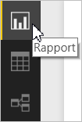

# Opret rapporter, der er optimeret til Power BI-telefonapps
Når du [opretter en rapport i Power BI Desktop](desktop-report-view.md), kan du forbedre oplevelsen ved at bruge den i mobilapps på telefoner ved at oprette en version af rapporten beregnet til telefonen. Du tilpasser din rapport til telefonen ved at omarrangere og tilpasse visualiseringer og måske ikke inkludere alle for at få en optimal oplevelse. Du kan også oprette [*dynamiske* visuals](#optimize-a-visual-for-any-size) og [dynamiske udsnitsværktøjer](#enhance-slicers-to-to-work-well-in-phone-reports), der tilpasses flot til visning på en telefon. Og hvis du føjer filtre til din rapport, vises disse filtre automatisk i telefonrapporten. Læserne af din rapport kan se dem og filtrere rapporten med dem.

## Opsæt en rapportside for telefonen i Power BI Desktop
Når du har [oprettet en rapport i Power BI Desktop](desktop-report-view.md), kan du optimere den til telefoner.

1. Vælg **Rapportvisning** i den venstre navigationslinje i Power Bi Desktop.
   
    
2. Vælg **Telefonlayout** under fanen **Vis**.  
   
    
   
    Du kan se et tomt telefonlærred. Alle visualiseringerne på den originale rapportside er vist i ruden Visualiseringer til højre.
3. Føj en visualisering til telefonlayoutet ved at trække det fra ruden Visualiseringer til telefonlærredet.
   
    Telefonrapporter bruger et gitterlayout. Når du trækker visualiseringer til mobilgitteret, falder de på plads i gitteret.
   
    
   
    Du kan føje nogle eller alle visualiseringerne på masterrapportsiden til telefonrapportsiden. Du kan kun tilføje hver visualisering én gang.
4. Du kan tilpasse størrelsen på dine visualiseringer i gitteret, ligesom du ville gøre det for felter på dashboards og mobildashboards.
   
   > [!NOTE]
   > Telefonrapportgitteret tilpasses telefoner af forskellig størrelse, så din rapport ser lige så flot ud på telefoner med små som store skærme.
   > 
   > 
   
   

## Optimer en visualisering til enhver størrelse
Du kan indstille visualiseringerne på dit dashboard eller i din rapport til at være *dynamiske*, så de ændres dynamisk for at vise den maksimale mængde data og indsigt, uanset skærmstørrelse. 

Når visualiseringen ændrer størrelse, prioriterer Power BI datavisningen ved f.eks. at fjerne udfyldning og flytte signaturforklaringen automatisk, så den vises over visualiseringen, således at visualiseringen forbliver informativ, selvom den bliver mindre.

Du kan vælge, om du vil gøre hver enkelt visualisering dynamisk. Læs mere om at [optimere visualiseringer](desktop-create-responsive-visuals.md).

## Overvejelser ved oprettelse af layouts for telefonrapporter
* Hvad angår rapporter med flere sider, kan du optimere alle siderne eller kun nogle få. 
* Hvis du har defineret en baggrundsfarve for en rapportside, vil telefonrapporten have den samme baggrundsfarve.
* Du kan ikke modificere formateringsindstillinger kun for telefonen. Formatering er ensartet mellem master- og mobillayouts. Skriftstørrelser vil f.eks. være de samme.
* Du kan ændre en visualisering, f.eks. ændre formateringen, datasættet, filtre eller andre egenskaber, ved at vende tilbage til den almindelige tilstand for rapportskrivning.
* Power BI giver telefonrapporter i mobilappen standardtitler og -sidenavne. Hvis du har oprettet tekstvisualiseringer for titler og sidenavne i din rapport, skal du overveje ikke at føje dem til dine telefonrapporter.     

## Fjern en visualisering fra telefonlayoutet
* Fjern en visualisering ved at klikke på X i visualiseringens øverste højre hjørne på telefonlærredet, eller markér det, og tryk på **Slet**.
  
   Hvis du fjerner visualiseringen her, fjernes den kun fra lærredet til telefonlayout. Visualiseringen og den originale rapport ændres ikke.
  
   

## Gør udsnit bedre, så de fungerer godt i telefonrapporter
Udsnit muliggør filtrering af rapportdata på lærredet. Når du designer udsnit i den almindelige tilstand til rapportskrivning, kan du modificere nogle udsnitsindstillinger for at gøre dem mere anvendelige i telefonrapporter:

* Beslut, om læserne af rapporten kun kan vælge et eller flere elementer.
* Placer en boks omkring udsnittet for at gøre rapporten nemmere at scanne.
* Gør udsnitsværktøjet lodret, vandret eller *dynamisk*. 

Hvis du gør udsnitsværktøjet dynamisk, når du ændrer dets størrelse og form, vises flere eller færre indstillinger. Det kan være højt, kort, bredt eller smalt. Du kan gøre det så lille, at det blot bliver et filterikon på rapportsiden. 

Læs mere om [oprettelse af dynamiske udsnit](power-bi-slicer-filter-responsive.md).

## Udgiv en telefonrapport
* Udgiv en telefonversion af en rapport ved at [udgive hovedrapporten fra Power BI Desktop til Power BI-tjenesten](desktop-upload-desktop-files.md), så udgives telefonversionen på samme tid.
  
    Læs mere om [deling og tilladelser i Power BI](service-how-to-collaborate-distribute-dashboards-reports.md).

## Vis optimerede og ikke-optimerede rapporter på en telefon
I mobilapperne på telefoner registrerer Power BI automatisk optimerede og ikke-optimerede telefonrapporter. Hvis der findes en telefonoptimeret rapport, åbner Power BI-telefonappen automatisk rapporten i telefonrapporttilstand.

Hvis der ikke findes en telefonoptimeret rapport, åbnes rapporten i ikke-optimeret liggende visning.  

Hvis en telefons retning ændres til liggende, når en telefonrapport er åben, åbnes rapporten i den ikke-optimerede visning med det oprindelige rapportlayout, uanset om rapporten er optimeret eller ej.

Hvis du kun optimerer nogle sider, får læserne vist en meddelelse i stående visning, der indikerer, at rapporten er tilgængelig i liggende visning.

Læserne af rapporten kan vende deres telefon, så den ligger på siden, for at se rapporten i liggende visning. Læs mere om at [interagere med Power BI-rapporter, der er optimeret til din telefon](mobile-apps-view-phone-report.md).

## Næste trin
* [Opret en telefonvisning af et dashboard i Power BI](service-create-dashboard-mobile-phone-view.md)
* [Få vist Power BI-rapporter, der er optimeret til din telefon](mobile-apps-view-phone-report.md)
* [Opret dynamiske visualiseringer, der er optimeret til alle størrelser](desktop-create-responsive-visuals.md)
* Har du flere spørgsmål? [Prøv at spørge Power BI-community'et](http://community.powerbi.com/)

