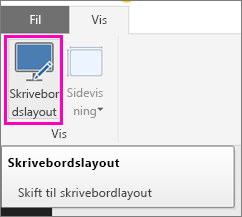
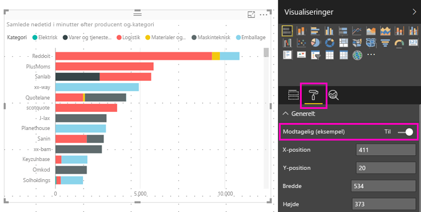

# Optimer en Power BI-visualisering til enhver størrelse
Du kan indstille visualiseringerne på dit dashboard eller i din rapport til at være *dynamiske*, så de ændres dynamisk for at vise den maksimale mængde data og indsigt, uanset skærmstørrelse.

Når visualiseringen ændrer størrelse, prioriterer Power BI datavisningen ved f.eks. at fjerne udfyldning og flytte forklaringen til øverst i visualiseringen automatisk, således at visualiseringen fortsat er informativ, selvom den bliver mindre. Dynamisk funktionalitet er især nyttigt i forbindelse med visualiseringer i Power BI-mobilappen på telefoner.

Du kan slå dynamisk funktionalitet til for alle visualiseringer med X- og Y-akser og udsnit.

## Slå dynamisk funktionalitet til i Power BI Desktop
1. I Power BI Desktop på fanen **Vis** skal du sikre, at du har åbnet **Skrivebordslayout**.
   
    
2. Vælg en visualisering, og i ruden **Visualiseringer** skal du vælge sektionen **Format**.
3. Udvid **Generelt** > skub **Dynamisk** til **Til**.
   
    
   
     Når du nu [opretter en rapport, der er optimeret til telefonen](desktop-create-phone-report.md) og tilføjer denne visualisering, tilpasses den på fornem vis.

## Slå dynamisk funktionalitet til i Power BI-tjenesten
Du kan slå dynamisk funktionalitet til for en visualisering i en rapport i Power BI-tjenesten. Du skal have mulighed for at redigere rapporten.

1. I en rapport i Power BI-tjenesten ([https://powerbi.com](https://powerbi.com)) skal du vælge **Rediger rapport**.
2. Vælg en visualisering, og i ruden **Visualiseringer** skal du vælge sektionen **Format**.
3. Udvid **Generelt** > skub **Dynamisk** til **Til**.
   
    
   
     Når du nu [opretter en telefonvisning af et dashboard](service-create-dashboard-mobile-phone-view.md) og tilføjer denne visualisering, tilpasses den på fornem vis.

## Næste trin
* [Opret rapporter, der er optimeret til Power BI-telefonapps](desktop-create-phone-report.md)
* [Opret en telefonvisning af et dashboard i Power BI](service-create-dashboard-mobile-phone-view.md)
* [Få vist Power BI-rapporter, der er optimeret til din telefon](mobile-apps-view-phone-report.md)
* Har du flere spørgsmål? [Prøv at spørge Power BI-community'et](http://community.powerbi.com/)

