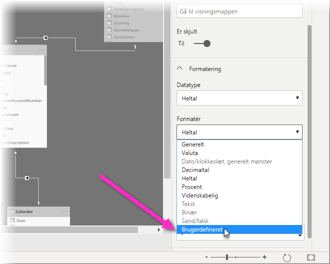

# Brug brugerdefinerede formatstrenge i Power BI Desktop

Med brugerdefinerede formatstrenge i **Power BI Desktop** kan du tilpasse den måde felter vises på i visualiseringer og sikre, at dine rapporter ser ud, ligesom du ønsker.

## Sådan bruger du brugerdefinerede formatstrenge

Du opretter brugerdefinerede formatstrenge ved at vælge feltet i visningen **Udformning** og derefter vælge **Format** i ruden **Egenskaber**.

Når du har valgt **Brugerdefineret** på rullelisten **Format**, kan du vælge fra en liste over almindeligt anvendte formatstrenge. 

## Understøttet syntaks for brugerdefineret format

Brugerdefinerede formatstrenge følger VBA-syntaksen, som er fælles for Excel og andre Microsoft-produkter, men understøtter ikke al syntaks, der bruges i andre produkter. 

I følgende tabeller kan du se, hvilken syntaks der understøttes i Power BI.

Følgende tabel viser understøttede **datosymboler**:

| **Symbol** | **Interval** |
| --- | --- |
| _d_ | 1-31 (dag i måneden uden foranstillet nul) |
| _dd_ | 01-31 (dag i måneden med foranstillet nul) |
| _m_ | 1-12 (måned i året uden foranstillet nul, med start fra januar = 1) |
| _mm_ | 01-12 (måned i året med foranstillet nul, med start fra januar = 01) |
| _mmm_ | Viser forkortede månedsnavne (Hijri-månedsnavne har ingen forkortelser) |
| _mmmm_ | Viser fulde månedsnavne |
| _å_ | 1-366 (dag i året) |
| _åå_ | 00-99 (de sidste to cifre i året) |
| _åååå_ | 100-9999 (tre- eller firecifret år) |

Følgende tabel viser understøttede **symboler for klokkeslæt**:

| **Symbol** | **Interval** |
| --- | --- |
| _t_ | 0-23 (1-12 efterfulgt af &quot;AM&quot; eller &quot;PM&quot;) (time på dagen uden foranstillet nul) |
| _tt_ | 00-23 (01-12 efterfulgt af &quot;AM&quot; eller &quot;PM&quot;) (time på dagen med foranstillet nul) |
| _n_ | 0-59 (minut i timen uden foranstillet nul) |
| _nn_ | 00-59 (minut i timen med foranstillet nul) |
| _m_ | 0-59 (minut i timen uden foranstillet nul). Kun hvis _t_ eller _tt_ er foranstillet |
| _mm_ | 00-59 (minut i timen med foranstillet nul). Kun hvis _t_ eller _tt_ er foranstillet |
| _s_ | 0-59 (sekund i minuttet uden foranstillet nul) |
| _ss_ | 00-59 (sekund i minuttet med foranstillet nul) |

Du kan se et [eksempel](https://docs.microsoft.com/office/vba/language/reference/user-interface-help/format-function-visual-basic-for-applications#example) på, hvordan du formaterer brugerdefinerede værdistrenge.

Et udtryk med et brugerdefineret format for tal kan have mellem én og tre sektioner adskilt af semikoloner. Hvis du bruger semikoloner uden noget imellem dem, vises den manglende sektion ikke (den vil være &quot;&quot;). Hvis semikolonet ikke er angivet, bruges det positive format.

Her er eksempler på forskellige formater til forskellige værdistrenge:

|   | **Formatstrenge** |   |   |   |
| --- | --- | --- | --- | --- |
| **Værdier** | **0,00;-0,0;&quot;Nul&quot;** | **0,00;;** | **0,00;-0,0;** | **0,00;** |
| **-1,234** | -1,2 | &quot;&quot; | -1,2 | &quot;&quot; |
| **0** | &quot;Nul&quot; | &quot;&quot; | &quot;&quot; | 0,00 |
| **1,234** | 1,23 | 1,23 | 1,23 | 1,23 |

I følgende tabel identificeres de foruddefinerede **navngivne formater af dato og klokkeslæt**:

| **Navn på format** | **Beskrivelse** |
| --- | --- |
| **Generel dato** | Vis en dato og/eller et klokkeslæt, f.eks. 3/4-93 17:34. Hvis der ikke er en brøkdel, vises der kun en dato, f.eks. 3/4-93. Hvis der ikke er en del af heltallet, vises klokkeslættet kun, f.eks. 17:34. Datovisningen bestemmes af systemindstillingerne. |
| **Lang dato** | Vis en dato i henhold til systemets lange datoformat. |
| **Kort dato** | Vis en dato i henhold til systemets korte datoformat. |
| **Langt klokkeslæt** | Vis et klokkeslæt i henhold til systemets lange klokkeslætsformat; omfatter timer, minutter, sekunder. |
| **Kort klokkeslæt** | Vis et klokkeslæt i henhold til 24-timers formatet, f.eks. 17:45. |

Navngivne numeriske formater

I følgende tabel identificeres de foruddefinerede **navngivne numeriske formater**:

| **Navn på format** | **Beskrivelse** |
| --- | --- |
| **Generelt tal** | Vis tal uden tusindtalsseparator. |
| **Valuta** | Vis tal med tusindtalsseparator, hvis det er relevant. Vis to cifre til højre for decimalseparatoren. Output er baseret på indstillinger for systemets landestandard. |
| **Fast** | Vis mindst ét ciffer til venstre og to cifre til højre for decimalseparatoren. |
| **Standard** | Vis tal med tusindtalsseparator med mindst ét ciffer til venstre og to cifre til højre for decimalseparatoren. |
| **Procent** | Vis tal ganget med 100 efterfulgt af et procenttegn ( **%** ) til højre. Vis altid to cifre til højre for decimalseparatoren. |
| **Videnskabelig** | Brug den videnskabelige standardnotation. |

I følgende tabel identificeres de tegn, du kan bruge til at oprette **brugerdefinerede formater for dato/klokkeslæt**.

| **Tegn** | **Beskrivelse** |
| --- | --- |
| ( **:** ) | Klokkeslætsseparator. For nogle landestandarder kan der bruges andre tegn til at repræsentere klokkeslætsseparatoren. Klokkeslætsseparatoren adskiller timer, minutter og sekunder, når klokkeslætsværdier formateres. Det faktiske tegn, der bruges som klokkeslætsseparator i formateret output, bestemmes af systemindstillingerne. |
| ( **/** ) | Datoseparator. For nogle landestandarder kan der bruges andre tegn til at repræsentere datoseparatoren. Datoseparatoren adskiller dag, måned og år, når datoværdierne formateres. Det faktiske tegn, der bruges som datoseparator i formateret output, bestemmes af systemindstillingerne. |
| d | Vis dagen som et tal uden et foranstillet nul (1-31). |
| dd | Vis dagen som et tal med et foranstillet nul (01-31). |
| ddd | Vis dagen som en forkortelse (søn-lør). Lokaliseret. |
| dddd | Vis dagens fulde navn (søndag-lørdag). Lokaliseret. |
| m | Vis måneden som et tal uden et foranstillet nul (1-12). Hvis m kommer umiddelbart efter t eller tt, vises minuttallet i stedet for måneden. |
| mm | Vis måneden som et tal med et foranstillet nul (01-12). Hvis m kommer umiddelbart efter t eller tt, vises minuttallet i stedet for måneden. |
| mmm | Vis måneden som en forkortelse (jan-dec). Lokaliseret. |
| mmmm | Vis månedens fulde navn (januar-december). Lokaliseret. |
| å | Vis dagen i året som et tal (1-366). |
| åå | Vis året som et 2-cifret tal (00-99). |
| åååå | Vis året som et 3- eller 4-cifret tal (100-9999). |
| t | Vis timen som et tal uden et foranstillet nul (0-23). |
| tt | Vis timen som et tal med et foranstillet nul (00-23). |
| n | Vis minuttet som et tal uden et foranstillet nul (0-59). |
| nn | Vis minuttet som et tal med et foranstillet nul (00-59). |
| s | Vis sekundet som et tal uden et foranstillet nul (0-59). |
| ss | Vis sekundet som et tal med et foranstillet nul (00-59). |
| AM/PM | Brug 12-timers uret, og få vist AM med store bogstaver efter timer før middag og PM med store bogstaver efter timer mellem middag og midnat. |

I følgende tabel identificeres de tegn, du kan bruge til at oprette **brugerdefinerede talformater**.

| **Tegn** | **Beskrivelse** |
| --- | --- |
| Ingen | Vis tallet uden formatering. |
| (**0**) | Pladsholder for ciffer. Vis et ciffer eller et nul. Hvis der er et ciffer i udtrykket på den placering, hvor 0 vises i formatstrengen, vises cifret. Ellers vises et nul på denne placering. Hvis tallet har færre cifre, end der er nuller (på begge sider af decimalen), i formatudtrykket, vises foranstillede eller efterstillede nuller. Hvis tallet har flere cifre til højre for decimalseparatoren, end der er nuller til højre for decimalseparatoren i formatudtrykket, afrundes tallet til så mange decimalpladser, som der er nuller. Hvis tallet har flere cifre til venstre for decimalseparatoren, end der er nuller til venstre for decimalseparatoren i formatudtrykket, vises de ekstra cifre uden ændringer. |
| ( **#** ) | Pladsholder for ciffer. Vis et ciffer eller ingenting. Hvis der er et ciffer i udtrykket på den placering, hvor # vises i formatstrengen, vises cifret. Ellers vises ingenting på denne placering. Dette symbol fungerer på samme måde som pladsholderen for 0-cifret, bortset fra at foranstillede og efterstillede nuller ikke vises, hvis tallet har det samme antal eller færre cifre, end der er #-tegn på begge sider af decimalseparatoren i formatudtrykket. |
| ( **.** ) | Decimalpladsholder. For nogle landestandarder bruges et komma som decimalseparatoren. Decimalpladsholderen bestemmer, hvor mange cifre der vises til venstre og højre for decimalseparatoren. Hvis formatudtrykket indeholder tal til venstre for dette symbol, begynder tal, der er mindre end 1, med en decimalseparator. Hvis du vil have vist et foranstillet nul med brøktal, skal du bruge 0 som pladsholder for det første ciffer til venstre for decimalseparatoren. Det faktiske tegn, der bruges som en decimalpladsholder i det formaterede output, afhænger af det talformat, som genkendes af dit system. |
| (  **%)** | Procentplaceholder. Udtrykket multipliceres med 100. Procenttegnet ( **%** ) indsættes på den placering, hvor den vises i formatstrengen. |
| ( **,** ) | Tusindtalsseparator. For nogle landestandarder bruges et punktum som tusindtalsseparator. Tusindtalsseparatoren adskiller tusinder fra hundreder i et tal, hvor der er fire eller flere pladser til venstre for decimalseparatoren. Standardbrug af tusindtalsseparatoren angives, hvis formatet indeholder en tusindtalsseparator omgivet af cifferpladsholdere (**0** eller **#** ). To tilstødende tusindtalsseparatorer eller en tusindtalsseparator umiddelbart til venstre for decimalseparatoren (uanset om der er angivet et decimal) betyder &quot;skaler tallet ved at dele det med 1000 med den nødvendige afrunding&quot;. Du kan f.eks. bruge formatstrengen &quot;##0,,&quot; til at repræsentere 100 millioner som 100. Tal mindre end 1 million vises som 0. To tilstødende tusindtalsseparatorer på en hvilken som helst placering, som ikke er umiddelbart til venstre for decimalseparatoren, behandles ganske enkelt som angivelse af en tusindtalsseparator. Det faktiske tegn, der bruges som tusindtalsseparatoren i det formaterede output, afhænger af det talformat, som genkendes af dit system. |
| ( **:** ) | Klokkeslætsseparator. For nogle landestandarder kan der bruges andre tegn til at repræsentere klokkeslætsseparatoren. Klokkeslætsseparatoren adskiller timer, minutter og sekunder, når klokkeslætsværdier formateres. Det faktiske tegn, der bruges som klokkeslætsseparator i formateret output, bestemmes af systemindstillingerne. |
| ( **/** ) | Datoseparator. For nogle landestandarder kan der bruges andre tegn til at repræsentere datoseparatoren. Datoseparatoren adskiller dag, måned og år, når datoværdierne formateres. Det faktiske tegn, der bruges som datoseparator i formateret output, bestemmes af systemindstillingerne. |
| (**E- E+ e- e+** ) | Videnskabeligt format. Hvis formatudtrykket indeholder mindst én cifferpladsholder (**0** eller **#** ) til højre for E-, E+, e- eller e+, vises tallet i videnskabeligt format, og E eller e indsættes mellem tallet og dets eksponent. Antallet af cifferpladsholdere til højre bestemmer antallet af cifre i eksponenten. Brug E- eller e- til at placere et minustegn ved siden af negative eksponenter. Brug E+ eller e+ til at placere et minustegn ved siden af negative eksponenter og et plustegn ved siden af positive eksponenter. |
| **- + $** ( ) | Viser et bogstaveligt tegn. Hvis du vil have vist et tegn, som ikke er angivet, skal du foranstille det med en omvendt skråstreg (\) eller omslutte det med dobbelte citationstegn (&quot; &quot;). |
| (* *\** ) | Viser det næste tegn i formatstrengen. Foranstil det med en omvendt skråstreg for at vise et tegn, der har en særlig betydning som et bogstaveligt tegn (\). Selve den omvendte skråstreg vises ikke. Brug af en omvendt skråstreg er det samme som at omslutte det næste tegn med dobbelte citationstegn. Hvis du vil have vist en omvendt skråstreg, skal du bruge to omvendte skråstreger (\\). Eksempler på tegn, der ikke kan vises som bogstavelige tegn er tegn til dato- og klokkeslætsformatering (a, c, d, h, m, n, p, q, s, t, w, y, / og :), numeriske formateringstegn (#, 0, %, E, e, komma og punktum) og tegn til strengformatering (@, &amp;, \&lt;, \&gt;, og !). |
| (&quot;ABC&quot;) | Viser strengen inde i dobbelte citationstegn (&quot; &quot;). |

## Næste trin
Du vil måske også være interesseret i følgende artikler:

* [VBA-formatstrenge](https://docs.microsoft.com/office/vba/language/reference/user-interface-help/format-function-visual-basic-for-applications#example)
* [Målinger i Power BI Desktop](desktop-measures.md)
* [Datatyper i Power BI Desktop](desktop-data-types.md)
* [Betinget formatering af tabeller](desktop-conditional-table-formatting.md)

