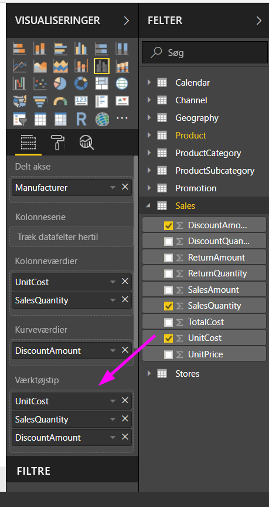
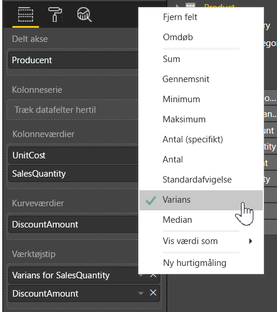

# Tilpasning af værktøjstips i Power BI Desktop
Værktøjstips er en elegant måde at angive flere oplysninger om kontekst og detaljer om datapunkter på i en visualisering. På følgende billede vises et værktøjstip, der er anvendt på et diagram i Power BI Desktop.

Når der oprettes en visualisering, viser standardværktøjstippet datapunktets værdi og kategori. Tilpasning af oplysningerne i værktøjstips kan i mange tilfælde være meget nyttigt og give yderligere kontekst og oplysninger til brugere, der får vist visualiseringen. Med brugerdefinerede værktøjstips kan du angive yderligere datapunkter, der vises som en del af værktøjstippet.

## Sådan tilpasser du værktøjstips
Du opretter et brugerdefineret værktøjstip på følgende måde: I brønden **Felter** i ruden **Visualiseringer** skal du blot trække et felt til den bucket, der hedder **Værktøjstips**, som vist på følgende billede. I det følgende billede er to felter blevet placeret i feltet **Værktøjstip**.

Når du har føjet værktøjstip til feltet, vises værdierne for disse felter i værktøjstippet, når du peger med musen på et datapunkt i visualiseringen.

## Tilpasning af værktøjstips med sammenlægning eller Hurtig beregning
Du kan tilpasse et værktøjstip yderligere ved at vælge en sammenlægningsfunktion eller en *Hurtig beregning*. Det gør du ved at vælge pilen ved siden af feltet i den bucket, der hedder **Værktøjstips**, og vælge mellem de tilgængelige indstillinger.

Der er mange forskellige måder at tilpasse **Værktøjstips** på ved hjælp af et hvilket som helst felt i dit datasæt, så du hurtigt kan vise oplysninger og levere indsigt til dine brugere, som får vist dine dashboards eller rapporter.

