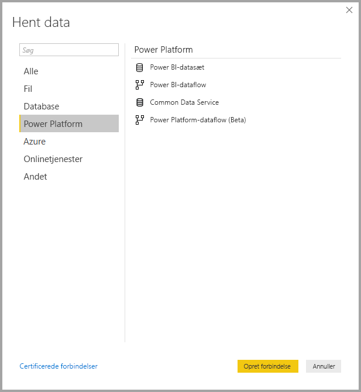
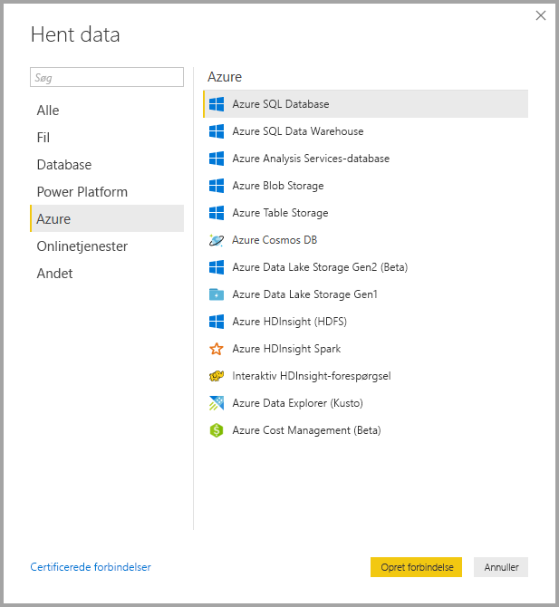
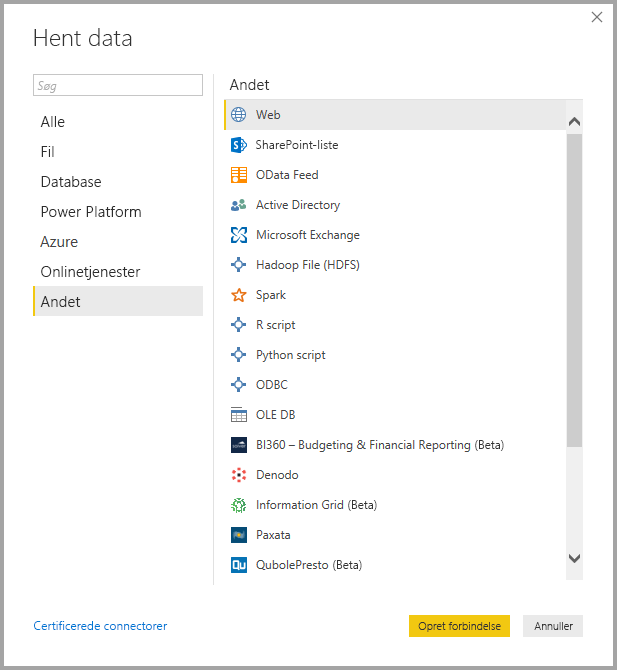
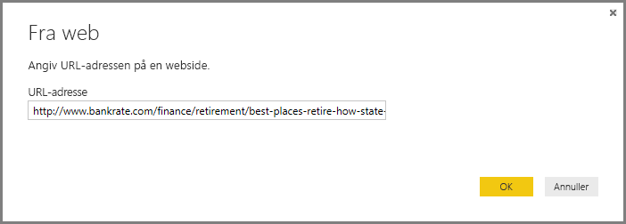
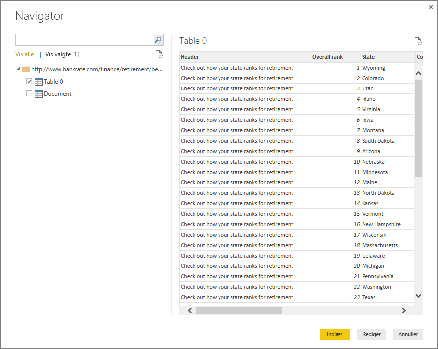

# <a name="data-sources-in-power-bi-desktop"></a>Datakilder i Power BI Desktop
Med Power BI Desktop kan du oprette forbindelse til data fra mange forskellige kilder. Der findes en komplet liste over tilgængelige datakilder nederst på siden.

Hvis du vil oprette forbindelse til data, skal du vælge **Hent data** på båndet **Hjem**. Hvis du vælger pil ned eller teksten **Hent data** på knappen, vises menuen med de **mest almindelige** datatyper på følgende billede:


Hvis du vælger **Mere...** i menuen **Mest almindelige**, vises vinduet **Hent data**. Du kan også åbne vinduet **Hent data** (og omgå menuen **Mest almindelige**) ved at vælge **ikonet** **Hent data** direkte.


> [!NOTE]
> Power BI-teamet udvider hele tiden de datakilder, der er tilgængelige for **Power BI Desktop** og **Power BI-tjenesten**. Du kan derfor ofte se tidlige versioner af igangværende datakilder markeret som *Beta* eller *Preview*. Alle datakilder, der er markeret som *Beta* eller *Preview*, har begrænset support og funktionalitet og skal ikke bruges i produktionsmiljøer. 

> Derudover er alle data, der er markeret som *beta* eller *prøveversion* for **Power BI Desktop**, muligvis ikke tilgængelige til brug i **Power BI-tjenesten** eller andre Microsoft-tjenester, før datakilden bliver generelt tilgængelig.

## <a name="data-sources"></a>Datakilder
Datatyper er organiseret i følgende kategorier:

* Alle
* Fil
* Database
* Power BI
* Azure
* Onlinetjenester
* Andet

Kategorien **Alle** inkluderer alle dataforbindelsestyper fra alle kategorier.

Kategorien **Fil** indeholder følgende dataforbindelser:

* Excel
* Tekst/CSV
* XML
* JSON
* Mappe
* PDF
* SharePoint-mappe

På følgende billede vises vinduet **Hent data** for **Fil**.


Kategorien **Database** indeholder følgende dataforbindelser:

* SQL Server-database
* Access-database
* SQL Server Analysis Services-database
* Oracle-database
* IBM DB2-database
* IBM Informix-database (beta)
* IBM Netezza
* MySQL-database
* PostgreSQL-database
* Sybase-database
* Teradata
* SAP HANA-database
* SAP Business Warehouse-programserver
* SAP Business Warehouse-meddelelsesserver
* Amazon Redshift
* Impala
* Google BigQuery
* Vertica
* Snowflake
* Essbase
* AtScale-kuber (beta)
* BI Connector
* Dremio
* Exasol
* Indexima (Beta)
* InterSystems IRIS (Beta)
* Jethro (beta)
* Kyligence Enterprise (beta)
* MarkLogic (Beta)

> [!NOTE]
> Nogle databaseforbindelser kræver, at du aktiverer dem ved at vælge **Filer > Indstillinger > Indstillinger** og derefter vælger **Funktioner til eksempelvisning** og aktiverer forbindelsen. Hvis du ikke kan se nogle af de forbindelser, der er nævnt ovenfor, og du vil bruge dem, skal du kontrollere dine indstillinger for **Funktioner til eksempelvisning**. Bemærk også, at alle datakilder, der er markeret som *Beta* eller *Preview*, har begrænset support og funktionalitet og skal ikke bruges i produktionsmiljøer.

På følgende billede vises vinduet **Hent data** for **Database**.


Kategorien **Power Platform** indeholder følgende dataforbindelser:

* Power BI-datasæt
* Power BI-dataflow
* Common Data Service
* Power Platform-dataflow (beta)

På følgende billede vises vinduet **Hent data** for **Power Platform**.



Kategorien **Azure** indeholder følgende dataforbindelser:

* Azure SQL Database
* Azure SQL Data Warehouse
* Azure Analysis Services-database
* Azure Blob Storage
* Azure Table Storage
* Azure Cosmos DB
* Azure Data Lake Storage Gen2 (beta)
* Azure Data Lake Storage Gen1
* Azure HDInsight (HDFS)
* Azure HDInsight Spark
* Interaktiv HDInsight-forespørgsel
* Azure Data Explorer (Kusto)
* Azure Cost Management (Beta)

På følgende billede vises vinduet **Hent data** for **Azure**.



Kategorien **Onlinetjenester** indeholder følgende dataforbindelser:

* SharePoint Online-liste
* Microsoft Exchange Online
* Dynamics 365 (online)
* Dynamics NAV
* Dynamics 365 Business Central
* Dynamics 365 Business Central (i det lokale miljø)
* Microsoft Azure Consumption Insights (beta)
* Azure DevOps (beta)
* Azure DevOps Server (beta)
* Salesforce-objekter
* Salesforce-rapporter
* Google Analytics
* Adobe Analytics
* appFigures (beta)
* Data.World - Get Dataset (Beta)
* Facebook
* GitHub (beta)
* MailChimp (beta)
* Marketo (beta)
* Mixpanel (beta)
* Planview Enterprise One – PRM (beta)
* Planview Projectplace (beta)
* QuickBooks Online (beta)
* Smartsheet
* SparkPost (beta)
* Stripe (beta)
* SweetIQ (beta)
* Planview Enterprise One – CMT (beta)
* Twilio (beta)
* tyGraph (beta)
* Webtrends (beta)
* Zendesk (beta)
* Dynamics 365 Customer Insights (beta)
* Emigo datakilde (beta)
* Entersoft Business Suite (Beta)
* Industrial App Store
* Intune Data Warehouse (Beta)
* Microsoft Graph Security (beta)
* Quick Base
* TeamDesk (beta)


På følgende billede vises vinduet **Hent data** for **Onlinetjenester**.


Kategorien **Andet** indeholder følgende dataforbindelser:

* Web
* SharePoint-liste
* OData-feed
* Active Directory
* Microsoft Exchange
* Hadoop-fil (HDFS)
* Spark
* R Script
* Python-script
* ODBC
* OLE DB
* BI360 - Budgeting & Financial Reporting (Beta)
* Denodo
* Information Grid (Beta)
* Paxatas 
* QubolePresto (Beta)
* Roamler (Beta)
* SurveyMonkey (beta)
* Tenforce (Smart)List (Beta)
* Workforce Dimensions (beta)
* Tom forespørgsel

På følgende billede vises vinduet **Hent data** for **Andet**.



> [!NOTE]
> På nuværende tidspunkt er det ikke muligt at oprette forbindelse til brugerdefinerede datakilder, der er beskyttet via Azure Active Directory.

## <a name="connecting-to-a-data-source"></a>Opret forbindelse til en datakilde
For at oprette forbindelse til en datakilde skal du vælge datakilden i vinduet **Hent data** og vælge **Opret forbindelse**. På følgende billede er **Web** valgt fra kategorien **Andet** for dataforbindelsen.


Der vises et forbindelsesvindue, som er specifikt for typen af dataforbindelse. Hvis der kræves legitimationsoplysninger, bliver du bedt om at angive dem. På følgende billede vises en URL-adresse, der angives for at oprette forbindelse til en webdatakilde.



Når der er angivet forbindelsesoplysninger for URL-adressen eller ressourcen, skal du vælge **OK**. Power BI Desktop opretter forbindelse til datakilden og viser de tilgængelige datakilder i **navigatoren**.



Du kan enten indlæse data ved at vælge knappen **Indlæs** nederst i ruden **Navigator**, eller du kan redigere forespørgslen, før du indlæser data, ved at vælge knappen **Rediger**.

Det er det eneste, du skal gøre for at oprette forbindelse til datakilder i Power BI Desktop! Prøv at oprette forbindelse til data fra vores stadig større liste over datakilder, og vend ofte tilbage – vi tilføjer hele tiden nye datakilder på denne liste.

## <a name="using-pbids-files-to-get-data"></a>Brug af PBIDS-filer til at hente data

PBIDS-filer er Power BI Desktop-filer, der har en bestemt struktur, og som har filtypenavnet PBIDS, der identificerer, at der er tale om en Power BI-datakildefil.

Du kan oprette en PBIDS-fil for at strømline **Hent data** for forfattere af rapporter i din organisation. Det anbefales, at administratorer opretter disse filer til almindeligt anvendte forbindelser for at lette brugen af PBIDS-filer for nye rapportforfattere. 

Når en forfatter åbner en PBIDS-fil, åbnes Power BI Desktop, og brugeren bliver bedt om at angive legitimationsoplysninger for at godkende og oprette forbindelse til den datakilde, der er angivet i filen. Dialogboksen Navigation vises, og brugeren skal vælge de tabeller i datakilden, der skal indlæses i modellen. Brugerne skal muligvis også vælge databasen eller databaserne, hvis der ikke blev angivet en i PBIDS-filen. 

Fremover kan brugeren begynde at oprette visualiseringer eller besøge de seneste kilder igen for at indlæse et nyt sæt tabeller i modellen. 

I øjeblikket understøtter PBIDS-filer kun en enkelt datakilde i én fil. Hvis du angiver mere end én datakilde, resulterer det i en fejl. 

Administratorer opretter PBIDS-filen ved at angive de påkrævede input for en enkelt forbindelse samt forbindelsesmåden som enten **DirectQuery**  eller **Import**. Hvis **tilstand** mangler/er null i filen, bliver den bruger, der åbner filen i Power BI Desktop, bedt om at vælge DirectQuery eller Import. 

### <a name="pbids-file-examples"></a>Eksempler på PBIDS-filer

Dette afsnit indeholder nogle eksempler på datakilder, der ofte bruges. PBIDS-filtypen understøtter kun dataforbindelser, der også understøttes i Power BI Desktop, med to undtagelser: Live Connect og Tom forespørgsel. 

PBIDS-filen indeholder *ikke* oplysninger om godkendelse og tabel- og skemaoplysninger.  

Nedenfor ses flere almindelige eksempler på PBIDS-filen, men listen er ikke fuldstændig. I forbindelse med andre datakilder kan du se [DSR-formatet (Data Source Reference) for protokol- og adresseoplysninger](https://docs.microsoft.com/azure/data-catalog/data-catalog-dsr#data-source-reference-specification).

Disse eksempler er kun ment som en hjælp og er ikke en udtømmende liste. De omfatter heller ikke alle understøttede connectors i DSR-format. Administratorer eller organisationer kan oprette deres egne datakilder ved hjælp af disse eksempler som vejledninger og benytte dem til at oprette og understøtte deres egne datakildefiler. 


**Azure AS**
```
{ 
    "version": "0.1", 
    "connections": [ 
    { 
        "details": { 
        "protocol": "analysis-services", 
        "address": { 
            "server": "server-here" 
        }, 
        } 
    } 
    ] 
}
```


 

**Mappe**
```
{ 
  "version": "0.1", 
  "connections": [ 
    { 
      "details": { 
        "protocol": "folder", 
        "address": { 
            "path": "folder-path-here" 
        } 
      } 
    } 
  ] 
} 
```

**OData**
```
{ 
  "version": "0.1", 
  "connections": [ 
    { 
      "details": { 
        "protocol": "odata", 
        "address": { 
            "url": "URL-here" 
        } 
      } 
    } 
  ] 
} 
```
 
**SAP BW**
```
{ 
  "version": "0.1", 
  "connections": [ 
    { 
      "details": { 
        "protocol": "sap-bw-olap", 
        "address": { 
          "server": "server-name-here", 
          "systemNumber": "system-number-here", 
          "clientId": "client-id-here" 
        }, 
      } 
    } 
  ] 
} 
```
 
**SAP Hana**
```
{ 
  "version": "0.1", 
  "connections": [ 
    { 
      "details": { 
        "protocol": "sap-hana-sql", 
        "address": { 
          "server": "server-name-here:port-here" 
        }, 
      } 
    } 
  ] 
} 
```

**SharePoint-liste**

URL-adressen skal pege på selve SharePoint-webstedet og ikke en liste på webstedet. Brugerne får en navigator, der giver dem mulighed for at vælge en eller flere lister fra det pågældende websted, som hver især bliver en tabel i modellen. 
```
{ 
  "version": "0.1", 
  "connections": [ 
    { 
      "details": { 
        "protocol": "sharepoint-list", 
        "address": { 
          "url": "URL-here" 
        }, 
       } 
    } 
  ] 
} 
```
 
 
**SQL Server**
```
{ 
  “version”: “0.1”, 
  “connections”: [ 
    { 
      “details”: { 
        “protocol”: “tds”, 
        “address”: { 
          “server”: “server-name-here”, 
          “database”: “db-name-here (optional)” 
        } 
      }, 
      “options”: {}, 
      “mode”: “DirectQuery” 
    } 
  ] 
} 
} 
```
 

**Tekstfil**
```
{ 
  "version": "0.1", 
  "connections": [ 
    { 
      "details": { 
        "protocol": "file", 
        "address": { 
            "path": "path-here" 
        } 
      } 
    } 
  ] 
} 
```
 

**Web**
```
{ 
  "version": "0.1", 
  "connections": [ 
    { 
      "details": { 
        "protocol": "http", 
        "address": { 
            "url": "URL-here" 
        } 
      } 
    } 
  ] 
} 
```
 


## <a name="next-steps"></a>Næste trin
Du kan gøre mange forskellige ting med Power BI Desktop. Du kan finde flere oplysninger om funktionerne i følgende ressourcer:

* [Hvad er Power BI Desktop?](desktop-what-is-desktop.md)
* [Oversigt over forespørgsler i Power BI Desktop](desktop-query-overview.md)
* [Datatyper i Power BI Desktop](desktop-data-types.md)
* [Udform og kombiner data med Power BI Desktop](desktop-shape-and-combine-data.md)
* [Almindelige forespørgselsopgaver i Power BI Desktop](desktop-common-query-tasks.md)    
