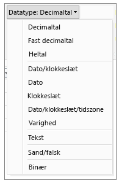
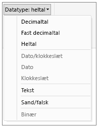

# Datatyper i Power BI Desktop
I denne artikel beskrives de datatyper, der understøttes i Power BI Desktop, og DAX-udtryk (Data Analysis Expressions). 

Når du indlæser data i Power BI Desktop, vil programmet forsøge at konvertere datatypen for kildekolonnen til en datatype, der bedre understøtter mere effektiv lagring, mere effektive beregninger samt datavisualisering. Hvis en kolonne med værdier, som du importerer fra Excel, for eksempel ikke indeholder decimalværdier, konverterer Power BI Desktop hele kolonnen med data til en heltal-datatype, hvilket er mere velegnet til lagring af heltal.

Dette koncept er vigtigt, da der er specielle krav til datatyper for nogle DAX-funktioner. I mange tilfælde konverterer DAX implicit datatypen for dig, men der er nogle tilfælde hvor det ikke sker.  Hvis DAX-funktionen f.eks. har brug for datatypen Date (Dato), og datatypen for kolonnen er Text (Tekst), fungerer DAX-funktionen ikke korrekt.  Det er derfor både vigtigt og nyttigt at anvende den korrekte datatype for en kolonne. Implicitte konverteringer beskrives senere i denne artikel.

## Angiv en kolonnes datatype
I Power BI Desktop kan du angive en kolonnes datatype i forespørgselseditoren eller i datavisningen eller rapportvisningen:

**Datatyper i forespørgselseditoren**

**Datatyper i datavisning eller rapportvisning**

Rullelisten Datatype i forespørgselseditoren har to datatyper, der ikke i øjeblikket er til stede i data- eller rapportvisningen: **Date/Time/Timezone** og **Duration**. Når en kolonne med disse datatyper indlæses i modellen og vises i data- eller rapportvisningen, konverteres en kolonne med datatypen Dato/klokkeslæt/tidszone til datatypen Dato/klokkeslæt, og en kolonne med datatypen Varighed konverteres til et decimaltal.

Datatypen **binær** understøttes ikke i øjeblikket uden for Forespørgselseditoren. Du kan bruge den i Forespørgselseditoren, når du indlæser binære filer, hvis du konverterer datatypen til andre datatyper, før du indlæser den i en Power BI-model. Datatypen findes i menuerne Datavisning og Rapportvisning af hensyn til ældre funktioner, men hvis du forsøger at indlæse binære kolonner i Power BI-modellen, kan du støde på fejl.  

### Taltyper
Power BI Desktop understøtter tre taltyper:

**Decimal Number** – repræsenterer et 64-bit (8-byte) flydende tal. Det er den mest almindelige taltype og svarer til tal, som du normalt vil tænke på tal.  Selvom programmet er udviklet til at håndtere tal med decimalværdier, kan det også håndtere heltal.  Decimaltaltypen kan håndtere negative værdier fra -1,79E +308 til og med -2,23E -308, 0 og positive værdier fra 2,23E -308 til og med 1,79E + 308. Tal som f.eks. 34, 34,01 og 34,000367063 er gyldige decimaltal. Den største værdi, der kan gengives i en decimaltaltype, er 15 tegn lang.  Decimaltegnet kan stå hvor som helst i tallet. Decimaltaltypen svarer til, hvordan tal lagres i Excel.

**Fixed Decimal Number** – har en fast placering af decimaltegnet. Decimaltegnet har altid fire cifre til højre, og gør det muligt at have 19 signifikante cifre.  Den største værdi, den kan repræsentere, er 922.337.203.685.477,5807 (positiv eller negativ).  Typen med faste decimaltal er nyttig i de tilfælde, hvor afrunding kan medføre fejl.  Når du arbejder med mange tal, der har små decimalværdier, kan de nogle gange blive akkumuleret og resultere i, at et tal bliver lidt forkert.  Eftersom værdierne efter fire cifre til høre for decimaltegnet afkortes, kan typen med faste decimaltal forhindre denne type fejl.   Hvis du kender SQL Server, svarer denne datatype til SQL Servers decimal (19.4), eller valutadatatypen i Power Pivot. 

**Whole Number** – repræsenterer en 64-bit (8-byte) heltalsværdi. Eftersom der er tale om et heltal, er der ingen cifre til højre for decimaltegnet. Værdien muliggør 19 cifre; positive eller negative heltal mellem -9,223,372,036,854,775,807 (-2^63+1) og 9,223,372,036,854,775,806 (2^63-2). Den kan repræsentere det størst mulige tal for de forskellige numeriske datatyper.  Som med typen til faste decimaltal kan typen til heltal være nyttig i de tilfælde, hvor du skal kunne kontrollere afrundingen. 

> [!NOTE]
>  Datamodellen i Power BI Desktop understøtter 64-bit heltalsværdier, men det største tal, de visuelle elementer kan udtrykke sikkert er 9.007.199.254.740.991 (2^53-1) på grund af JavaScript-begrænsninger. Hvis du arbejder med højere tal i din datamodel, kan du reducere størrelsen via beregninger, før du føjer dem til et visuelt element 
> 
>

### Dato/klokkeslæt-typer
Power BI Desktop understøtter fem dato/klokkeslæt-datatyper i forespørgselsvisningen.  Både Date/Time/Timezone (Dato/klokkeslæt/tidzone) og Duration (Varighed) konverteres ved indlæsning i modellen. Power BI Desktop-datamodellen understøtter kun dato/klokkeslæt, men de kan formateres som datoer eller klokkeslæt uafhængigt af hinanden. 

**Date/Time** – repræsenterer både en dato- og en klokkeslætsværdi.  Dato/klokkeslæt-værdien lagres som en decimaltaltype.  Så du kan faktisk skifte mellem begge to.   Klokkeslætsdelen af en dato gemmes som en brøkdel af hele intervaller på 1/300 sekunder (3,33 ms).  Datoer mellem år 1900 og 9999 understøttes.

**Date** – repræsenterer kun en dato (ingen klokkeslætsdel).  Når den konverteres til modellen, er en dato det samme som en dato/klokkeslæt-værdi med nul for brøkdelen.

**Time** – repræsenterer kun et tidspunkt (ingen datodel).  Når det konverteres til modellen, er en tidsværdi identisk med en dato/klokkeslæt-værdi uden cifre til venstre for decimaltegnet.

**Date/Time/Timezone** – repræsenterer en UTC-dato/klokkeslæt med en forskydning af tidszone.  Den konverteres til en dato/klokkeslæt-værdi, når den indlæses i modellen. Power BI-modellen justerer ikke tidszonen på baggrund af en brugers placering eller landestandard osv. Hvis en værdi på 09:00 indlæses i modellen i USA, vises den som 09:00, uanset hvor rapporten åbnes eller vises. 

**Duration** – repræsenterer et tidsrum. Den konverteres til en decimaltalstype, når den indlæses i modellen.  Som decimaltalstype kan den lægges til eller trækkes fra et dato/klokkeslæt-felt med korrekte resultater.  Som decimaltalstype kan du nemt bruge den i visuelle effekter, der viser størrelse.

### Teksttype
**Text** – en datastreng med et Unicode-tegn. Det kan være strenge, tal eller datoer, der repræsenteres i et tekstformat. Den maksimale strenglængde er 268.435.456 Unicode-tegn (256 megategn) eller 536.870.912 byte.

### True/false-type
**True/False** – en boolesk værdi, der er enten true eller false.

### Typen med tomme værdier/null-værdier
**Blank** – er en datatype i DAX, der repræsenterer og erstatter SQL null-værdier. Du kan oprette en tom værdi ved hjælp af funktionen [BLANK](https://msdn.microsoft.com/library/ee634820.aspx) og undersøge, om der er tomme værdier, ved hjælp af den logiske funktion [ISBLANK](https://msdn.microsoft.com/library/ee634204.aspx).

### Binær datatype

Den binære datatype kan bruges til at repræsentere andre data med et binært format. Du kan bruge den i Forespørgselseditoren, når du indlæser binære filer, hvis du konverterer datatypen til andre datatyper, før du indlæser den i en Power BI-model. Binære kolonner understøttes ikke i Power BI-datamodellen. Datatypen findes i menuerne Datavisning og Rapportvisning af hensyn til ældre funktioner, men hvis du forsøger at indlæse binære kolonner i Power BI-modellen, kan du støde på fejl.

> [!NOTE]
>  Hvis en binær kolonne er i outputtet i et forespørgselstrin, kan det medføre fejl, hvis du forsøger at opdatere dataene via en gateway. Det anbefales, at du eksplicit fjerner alle binære kolonner som det sidste trin i dine forespørgsler.    
> 
>

### Tabeldatatype
DAX bruger en tabeldatatype i mange funktioner, f.eks sammenlægninger og time intelligence-beregninger. Nogle funktioner kræver en reference til en tabel, andre funktioner returnerer en tabel, der kan bruges som input til andre funktioner. I nogle funktioner, der kræver en tabel som input, kan du angive et udtryk, der evaluerer til en tabel. For visse funktioner er en reference til en basistabel påkrævet. Du kan finde oplysninger om kravene i bestemte funktioner i [DAX-funktionsreference](https://msdn.microsoft.com/library/ee634396.aspx).

## Konvertering af implicitte og eksplicitte datatyper i DAX-formler
Hver DAX-funktion har specifikke krav til de datatyper, der bruges som input og output. Visse funktioner kræver f.eks. heltal for nogle argumenter og datoer for andre. Andre funktioner kræver tekst eller tabeller.

Hvis dataene i den kolonne, som du angiver som et argument, ikke er kompatible med den datatype, som funktionen kræver, returneres der i mange tilfælde en fejl i DAX. Hvor det er muligt, vil DAX dog forsøge at konvertere dataene implicit til den korrekte datatype. Eksempel:

* Du kan skrive en dato som en streng, hvorefter DAX fortolker strengen og forsøger at omdanne den til et af formaterne i Windows for dato og klokkeslæt.
* Du kan tilføje TRUE + 1 og få resultatet 2, fordi TRUE implicit konverteres til tallet 1, og handlingen 1 + 1 udføres.
* Hvis du tilføjer værdier i to kolonner, og én værdi repræsenteres som tekst ("12") og den anden som et tal (12), konverterer DAX implicit strengen til et tal, og fortager derefter additionen for et numerisk resultat. Følgende udtryk returnerer 44: = "22" + 22.
* Hvis du forsøger at sammenkæde to tal, viser Excel dem som strenge, der efterfølgende sammenkædes. Følgende udtryk returnerer "1234": = 12 & 34.

### Tabel med implicitte datakonverteringer
Den type konvertering, der udføres, bestemmes af den operator, som omdanner de værdier, der kræves, før den anmodede handling kan udføres. I disse tabeller vises operatorerne og den type konvertering, der finder sted for hver datatype i kolonnen, når den sammenkædes med datatypen i den krydsende række.

> [!NOTE]
>  Text-datatyper er ikke inkluderet i disse tabeller. Når et tal repræsenteres som et tekstformat, forsøger Power BI i nogle tilfælde at bestemme taltypen og vise den som et tal.
> 
> 

**Addition (+)**

| Operator(+) | INTEGER | CURRENCY | REAL | Date/time |
| --- | --- | --- | --- | --- |
| INTEGER |INTEGER |CURRENCY |REAL |Date/time |
| CURRENCY |CURRENCY |CURRENCY |REAL |Date/time |
| REAL |REAL |REAL |REAL |Date/time |
| Date/time |Date/time |Date/time |Date/time |Date/time |

Hvis der f.eks. bruges et rigtigt tal i en additionshandling i kombination med valutadata, konverteres begge værdier til REAL, og resultatet returneres som REAL.

**Subtraktion (-)**

I følgende tabel er rækkeoverskriften minuend (venstre side), og kolonneoverskriften er subtrahend (højre side).

| Operator(-) | INTEGER | CURRENCY | REAL | Date/time |
| --- | --- | --- | --- | --- |
| INTEGER |INTEGER |CURRENCY |REAL |REAL |
| CURRENCY |CURRENCY |CURRENCY |REAL |REAL |
| REAL |REAL |REAL |REAL |REAL |
| Date/time |Date/time |Date/time |Date/time |Date/time |

Hvis en dato f.eks. bruges i en subtraktionshandling med en anden datatype, konverteres begge værdier til datoer, og den returnerede værdi er også en dato.

> [!NOTE]
>    Datamodeller understøtter også monadiskoperatoren – (negativ), men denne operator ændrer ikke operandens datatype.
> 
> 

**Multiplikation (*)**

| Operator(\*) | INTEGER | CURRENCY | REAL | Date/time |
| --- | --- | --- | --- | --- |
| INTEGER |INTEGER |CURRENCY |REAL |INTEGER |
| CURRENCY |CURRENCY |REAL |CURRENCY |CURRENCY |
| REAL |REAL |CURRENCY |REAL |REAL |

Hvis et heltal f.eks. kombineres med et reelt tal i en multiplikationshandling, konverteres begge tal til reelle tal, og den værdi, der returneres, er også REAL.

**Division (/)**

I følgende tabel er rækkeoverskriften tælleren og kolonneoverskriften nævneren.

| Operator(/) (række/kolonne) | INTEGER | CURRENCY | REAL | Date/time |
| --- | --- | --- | --- | --- |
| INTEGER |REAL |CURRENCY |REAL |REAL |
| CURRENCY |CURRENCY |REAL |CURRENCY |REAL |
| REAL |REAL |REAL |REAL |REAL |
| Date/time |REAL |REAL |REAL |REAL |

Hvis et heltal f.eks. kombineres med en valutaværdi i en divisionshandling, konverteres begge værdier til reelle tal, og resultatet er også et reelt tal.

### Sammenligningsoperatorer
I sammenligningsudtryk anses booleske værdier for værende større end strengværdier, og strengværdier anses for værende større end numeriske værdier og dato/klokkeslæt-værdier. Tal- og dato/klokkeslæt-værdier anses for at have samme rangering. Der udføres ingen implicitte konverteringer for booleske værdier eller strengværdier; BLANK eller en tom værdi konverteres til 0/""/false, afhængigt af datatypen for den anden sammenlignede værdi.

Følgende DAX-udtryk illustrerer denne funktionsmåde:

=IF(FALSE()\>"true","Expression is true", "Expression is false"), returneres "Expression is true"

=IF("12"\>12,"Expression is true", "Expression is false"), returneres "Expression is true"

=IF("12"=12,"Expression is true", "Expression is false"), returneres "Expression is false"

Konverteringer udføres implicit for numeriske typer eller dato/klokkeslæt-typer, som beskrevet i tabellen nedenfor:

| Sammenligningsoperator | INTEGER | CURRENCY | REAL | Date/time |
| --- | --- | --- | --- | --- |
| INTEGER |INTEGER |CURRENCY |REAL |REAL |
| CURRENCY |CURRENCY |CURRENCY |REAL |REAL |
| REAL |REAL |REAL |REAL |REAL |
| Date/time |REAL |REAL |REAL |Dato/klokkeslæt |

### Håndtering af tomme værdier, tomme strenge og nulværdier
I DAX repræsenteres en null-værdi, en tom værdi, en tom celle eller en manglende værdi med den samme nye værditype, nemlig BLANK. Du kan generere tomme værdier ved hjælp af funktionen BLANK og undersøge, om der er tomme værdier ved hjælp af den logiske funktion ISBLANK.

Håndteringen af tomme værdier i handlinger som f.eks. addition eller sammenkædning afhænger af den pågældende funktion. I følgende tabel vises en oversigt over forskellen mellem DAX- og Microsoft Excel-formler, i forhold til hvordan tomme celler håndteres.

| Udtryk | DAX | Excel |
| --- | --- | --- |
| BLANK + BLANK |BLANK |0(zero) |
| BLANK + 5 |5 |5 |
| BLANK * 5 |BLANK |0(zero) |
| 5/BLANK |Uendelig |Fejl |
| 0/BLANK |NaN |Error |
| BLANK/BLANK |BLANK |Fejl |
| FALSE ELLER BLANK |FALSE |FALSE |
| FALSE OG BLANK |FALSE |FALSE |
| TRUE ELLER BLANK |TRUE |TRUE |
| TRUE OG BLANK |FALSE |TRUE |
| BLANK ELLER BLANK |BLANK |Fejl |
| BLANK OG BLANK |BLANK |Fejl |

