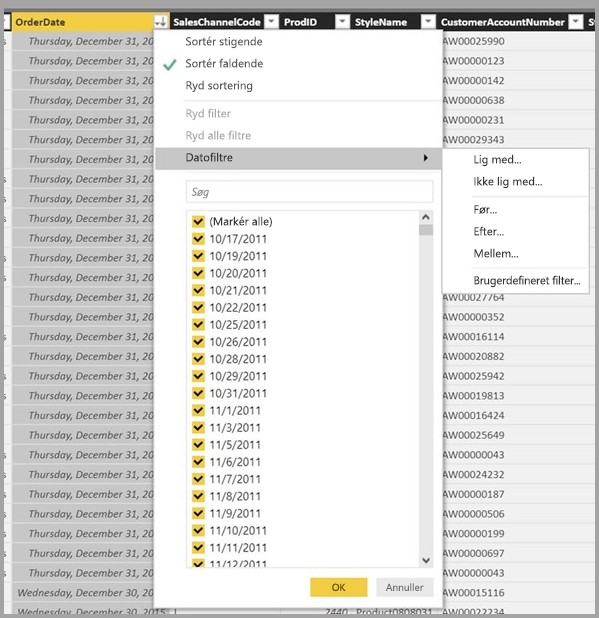

# Datavisning i Power BI Desktop
Med **Datavisning** kan du få hjælp til at undersøge, udforske og forstå data i din **Power BI Desktop**-model. Det er forskelligt fra den måde, du ser tabeller, kolonner og data på i **Forespørgselseditor**. Med Datavisning ser du dine data, *efter* de er blevet indlæst i modellen.

Når du udformer dine data, har du nogle gange brug for at se, hvad der rent faktisk findes i en tabel eller kolonne uden at skulle oprette en visualisering på rapportcanvasset, ofte helt ned på rækkeniveau. Dette er især praktisk, når du opretter målinger og beregnede kolonner, eller du har brug for at identificere en datatype eller datakategori.

Lad os se nærmere på nogle af elementerne i **Datavisning**.

1. **Ikonet Datavisning** – vælg dette ikon for at skifte til Datavisning.

2. **Datagitter** – her vises den valgte tabel og alle kolonner og rækker i den. De kolonner, der er skjult i **Rapportvisning**, er nedtonet. Du kan højreklikke på en kolonne for at se indstillingerne.

3. **Udformning af båndet** – her kan du administrer relationer, oprette beregninger og skifte datatype, format og datakategori for en kolonne.

4. **Formellinje** – angiv DAX-formler for målinger og beregnede kolonner.

5. **Søg** – søg efter en tabel eller kolonne i modellen.

6. **Listen Felter** – vælg en tabel eller kolonne, du vil have vist i datagitteret.

## Filtrering i datavisning

Du kan også filtrere og sortere data i **Datavisning**. I hver kolonne vises et ikon, der identificerer sorteringsrækkefølgen (hvis installeret).

Du kan filtrere de enkelte værdier, eller du kan bruge avanceret filtrering på basis af dataene i kolonnen. 

