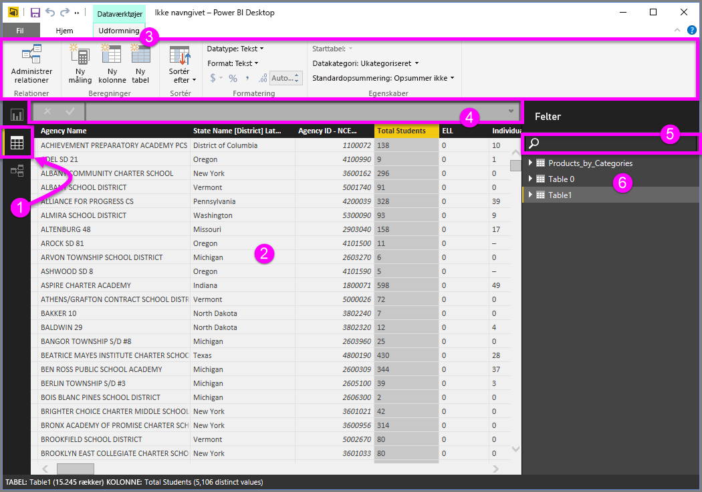

# Datavisning i Power BI Desktop
Med **Datavisning** kan du undersøge, udforske og forstå data i din Power BI Desktop-model. Det er forskelligt fra den måde, du ser tabeller, kolonner og data på i **Forespørgselseditor**. Med Datavisning ser du dine data, *efter* de er blevet indlæst i modellen.

Når du udformer dine data, har du nogle gange brug for at se, hvad der rent faktisk findes i en tabel eller kolonne uden at skulle oprette en visualisering på rapportcanvasset, ofte helt ned på rækkeniveau. Dette er særligt tilfældet, når du opretter målinger og beregnede kolonner, eller du har brug for at identificere en datatype eller datakategori.

Lad os se nærmere på det.

**1.** Ikonet Datavisning – Klik for at angive Datavisning.

**2.** Datagitter – Her vises den valgte tabel og alle kolonner og rækker i den. Kolonner, der er skjult i Rapportvisning, er nedtonet. Du kan højreklikke på en kolonne for at se indstillingerne.

**3.** Udformning af båndet – Administrer relationer, opret beregninger, og skift datatype, format og datakategori for en kolonne.

**4.** Formellinje – Angiv DAX-formler for målinger og beregnede kolonner.

**5.** Søg – Søg efter en tabel eller kolonne i modellen.

**6.** Listen Felter – Vælg en tabel eller kolonne, du vil have vist i datagitteret.

