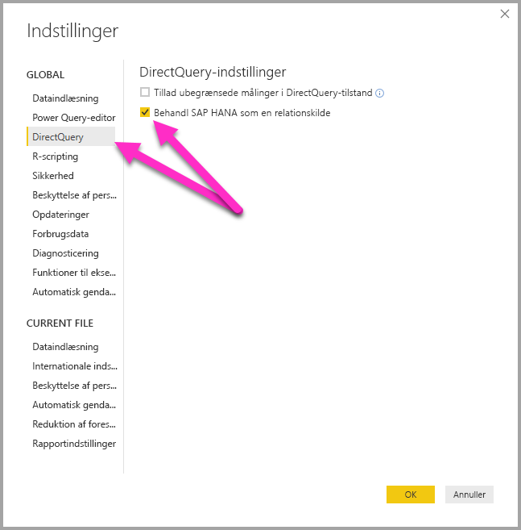

# DirectQuery og SAP HANA
Du kan oprette forbindelse til **SAP HANA**-datakilder direkte ved hjælp af **DirectQuery**. Der er to muligheder, når du opretter forbindelse til SAP HANA:

* **Behandl SAP HANA som en flerdimensionel kilde (standard):** I dette tilfælde er funktionsmåden den samme som, når der oprettes forbindelse mellem Power BI og andre flerdimensionelle kilder, f.eks. SAP Business Warehouse eller Analysis Services. Når du opretter forbindelse til SAP HANA ved hjælp af denne indstilling, markeres en enkelt analyse- eller beregningsvisning, og alle målinger, hierarkier og attributter i den pågældende visning er tilgængelige på feltlisten. I takt med at visualiseringerne oprettes, hentes de aggregerede data altid fra SAP HANA. Dette er den anbefalede tilgang og er standard for nye DirectQuery-rapporter via SAP HANA.

* **Behandl SAP HANA som en relationel kilde:** I dette tilfælde behandler Power BI SAP HANA som en relationel kilde. Dette giver større fleksibilitet, men man skal sikre, at målinger aggregeres som forventet for at undgå problemer med ydeevnen.

En global værktøjsindstilling styrer, hvilken tilgang der bruges til at oprette forbindelse. Denne indstilling angives ved at vælge **Filer > Indstillinger** og derefter **Indstillinger > DirectQuery**. Markér derefter indstillingen **Behandl SAP HANA som en relationel kilde** som vist på følgende billede. 

Indstillingen til at behandle SAP HANA som en relationel kilde styrer, hvilken tilgang der bruges for alle *nye* rapporter, der bruger DirectQuery over SAP HANA. Den påvirker ikke eksisterende SAP HANA forbindelser i den aktuelle rapport eller forbindelser i nogen andre rapporter, der åbnes. Hvis indstillingen i øjeblikket ikke er markeret, vil en ny forbindelse, der føjes til SAP HANA ved hjælp af **Hent data**, behandle SAP HANA som en flerdimensionel kilde. Men hvis en anden rapport åbnes, som også opretter forbindelse til SAP HANA, så vil denne rapport fortsat fungere i henhold til den indstilling, der blev angivet *på det tidspunkt, den blev oprettet*. Det betyder, at alle rapporter, der opretter forbindelse til SAP HANA, og som blev oprettet før februar 2018, fortsat vil behandle SAP HANA som en relationel kilde. 

De to tilgange resulterer i meget forskellige funktionsmåder, og det er ikke muligt at ændre tilgangen for en eksisterende rapport til en anden tilgang. 

Herunder følger en mere detaljeret gennemgang af disse to tilgange.

## Behandl SAP HANA som en flerdimensionel kilde (standard)

Alle nye forbindelse til SAP HANA bruger denne forbindelsesmetode som standard og behandler SAP HANA som en flerdimensionel kilde. Hvis du vil behandle en forbindelse til SAP HANA som en relationel kilde, skal du vælge **Filer > Indstillinger > Indstillinger** og derefter markere feltet under **DirectQuery > Behandl SAP HANA som en relationel kilde**. Mens denne funktion er en **prøveversion**, kan rapporter, der oprettes ved hjælp af tilgangen for multidimensionel kilde, *ikke* publiceres i Power BI-tjenesten, og hvis du forsøger at gøre det, vil der opstå fejl, når rapporten åbnes i Power BI-tjenesten.  

Når du opretter forbindelse til SAP HANA som en flerdimensionel kilde, gælder følgende:

* I **navigatoren Hent data** kan en enkelt SAP HANA visning markeres. Det er ikke muligt at markere særskilte målinger eller attributter. Der er ikke defineret nogen forespørgsel på tidspunktet for oprettelse af forbindelse, hvilket er anderledes end at importere data eller bruge DirectQuery, mens SAP HANA behandles som en relationel kilde. Det betyder også, at det ikke er muligt at bruge en SAP HANA SQL-forespørgsel direkte, når denne forbindelsesmetode vælges.

* Alle målinger, hierarkier og attributter i den valgte visning vises på feltlisten. 

* Når en måling bruges i en visualisering, laves der en forespørgsel til SAP HANA for at hente målingsværdien på det aggregeringsniveau, der er nødvendigt for visualiseringen. Så når du arbejder med ikke-additive målinger (tællere, forhold osv.), udføres alle aggregeringer af SAP HANA, og der udføres ikke yderligere aggregeringer af Power BI. 

* Der skal indføres visse begrænsninger for at sikre, at de korrekte aggregerede værdier altid kan hentes fra SAP HANA. Det er f.eks. ikke muligt at tilføje beregnede kolonner eller kombinere data fra flere SAP HANA visninger i den samme rapport. 

Du får ikke den samme fleksibilitet ved at behandle SAP HANA som en flerdimensionel kilde, som du får med den alternative tilgang for behandling som *relationel kilde*, men det er enklere og sikrer korrekte aggregerede data, når du arbejder med mere komplekse SAP HANA målinger, og det resulterer generelt i højere ydeevne. 

**Feltlisten** indeholder alle målinger, attributter og hierarkier fra SAP HANA-visningen. Bemærk følgende funktionsmåde, som gælder, når du bruger denne forbindelsesmetode:

* Alle attributter, der er inkluderet i mindst ét hierarki, skjules som standard. Du kan dog få dem vist, hvis det er nødvendigt, ved at markere **Vis skjulte** i genvejsmenuen på feltlisten. De kan skjules via den samme genvejsmenu, hvis det er nødvendigt.

* I SAP HANA kan du definere, at en attribut skal bruge en anden attribut som navn. **Product** (med værdierne 1, 2, 3 etc.) kan f.eks. bruge **ProductName** (med værdierne Cykel, Bluse, Handsker etc.) som sit navn. I dette tilfælde vises et enkelt felt, **Product**, på feltlisten med værdierne Cykel, Bluse, Handsker etc., som sorteres efter – og entydigt bestemmes af – nøgleværdierne 1, 2, 3. Der oprettes også en skjult kolonne, **Product.Key**, som giver adgang til de underliggende nøgleværdier, hvis det er nødvendigt. 

Eventuelle variabler, der defineres i den underliggende SAP HANA-visning, vises, når der oprettes forbindelse, og der kan opnås adgang til de nødvendige værdier. Disse værdier kan efterfølgende ændres ved at vælge **Rediger forespørgsler** på båndet og derefter **Administrer parametre** i den viste rullemenu. 

De tilladte udformningshandlinger er mere begrænset end generelt, når DirectQuery bruges, pga. behovet for at sikre, at de korrekte aggregerede data altid kan hentes fra SAP HANA. Det er dog stadig muligt at lave mange tilføjelser og ændringer, herunder målinger, omdøbning af felter og mulighed for at skjule dem samt definere visningsformater. Alle disse ændringer gemmes, når der opdateres, og alle ændringer af SAP HANA visningen, der ikke er modstridende, anvendes. 

### Yderligere begrænsninger for udformning

De primære yderligere begrænsninger for udformning, der gælder, når der oprettes forbindelse til SAP HANA ved hjælp af DirectQuery (Behandl som multidimensionel kilde), er følgende: 

* **Ingen understøttelse af beregnede kolonner:** Muligheden for at oprette beregnede kolonner er deaktiveret. Det betyder også, at gruppering og clustering, som opretter beregnede kolonner, ikke er tilgængelig.
* **Yderligere begrænsninger for målinger:** Der er yderligere begrænsninger i DAX-udtryk, som kan bruges i målinger til at afspejle den samme understøttelse som den, der tilbydes af SAP HANA.
* **Ingen understøttelse af definerende relationer:** Der kan kun sendes forespørgsler til en enkelt visning i en rapport, og derfor understøttes definerende relationer ikke.
* **Ingen datavisning:** **Datavisningen** viser som regel dataene på detaljeniveau i tabeller. Grundet beskaffenheden af OLAP-kilder, f.eks. SAP HANA, er denne visning ikke tilgængelig via SAP HANA.
* **Kolonne- og måleoplysninger er blevet rettet:** Listen over kolonner og mål, der er registreret på feltlisten, er rettet af den underliggende kilde og kan ikke ændres. Det er f.eks. ikke muligt at slette en kolonne eller at ændre datatypen for den, men den kan dog omdøbes.
* **Yderligere begrænsninger i DAX:** Der er flere begrænsninger for DAX, der kan bruges i definitioner af målinger til at afspejle begrænsningerne i kilden. Det er f.eks. ikke muligt at bruge en aggregeringsfunktion via en tabel.

### Yderligere visualiseringsbegrænsninger

Der er nogle begrænsninger i visualiseringer, når der oprettes forbindelse til SAP HANA ved hjælp af DirectQuery (Behandl som multidimensionel kilde): 
* **Ingen aggregering af kolonner:** Det er ikke muligt at ændre aggregeringen for en kolonne i en visualisering. Det er altid *Opsummer ikke*.

## Behandl SAP HANA som en relationel kilde 

Når du vælger at oprette forbindelse til SAP HANA som en relationel kilde, får du lidt mere fleksibilitet. Du kan f.eks. oprette beregnede kolonner, inkludere data fra flere SAP HANA visninger og oprette relationer mellem de oprettede tabeller. Men når du bruger SAP HANA på denne måde, er det vigtigt at forstå bestemte aspekter af, hvordan forbindelser behandles for at sikre følgende: 

* Resultaterne er som forventet, når SAP HANA-visningen indeholder ikke-additive målinger (f.eks. adskilte optællinger eller gennemsnit i stedet for en almindelig sumfunktion).
* De oprettede forespørgsler er effektive

Det er en god idé at starte med at præcisere funktionsmåden af en relationel kilde, f.eks SQL Server, når den forespørgsel, der er defineret i **Hent data** eller **Forespørgselseditor** udfører en aggregering. I eksemplet nedenfor returnerer en forespørgsel, der er defineret i **Forespørgselseditor**, gennemsnitsprisen efter *ProductID*.  

Hvis dataene importeres til Power BI (i modsætning til at bruge DirectQuery), vil følgende ske:

* Dataene importeres på det aggregeringsniveau, der er defineret i den forespørgsel, som er oprettet i **Forespørgselseditor**. Eksempelvis gennemsnitspris efter produkt. Dette giver en tabel med to kolonner, *ProductID* og *AveragePrice*, som kan bruges i visuelle gengivelser.
* I en visuel gengivelse udføres alle efterfølgende aggregeringer, f.eks. *Sum*, *Average*, *Min* og andre, på de importerede data. Hvis du f.eks. inkluderer *AveragePrice* i en visualisering, bruges funktionen *Sum* som standard, og summen af *AveragePrice* for hvert *ProductID* returneres – som i dette tilfælde vil være 13,67. Det samme gælder for alle alternative aggregeringsfunktioner, som f.eks. *Min*, *Average*osv., der bruges på den visuelle gengivelse. *Average* af *AveragePrice* returnerer f.eks. gennemsnittet af 6,66, 4 og 3, som giver 4,56, og ikke gennemsnittet af *Price* for de seks poster i den underliggende tabel, som er 5,17.
  
Hvis du bruger **DirectQuery** (via den samme relationelle kilde) i stedet for funktionen Import, gælder den samme semantik, og resultaterne vil være nøjagtigt de samme:  

* Hvis du bruger den samme forespørgsel, vil det logisk set være de samme data, som bruges i rapporteringslaget – selvom dataene egentlig ikke importeres.

* I en visuel gengivelse udføres alle efterfølgende aggregeringer, f.eks. *Sum*, *Average*, *Min* og andre, på de importerede data. Og igen returnerer en visuel gengivelse, der indeholder *Average* af *AveragePrice*, resultatet 4,56.
  
I det følgende beskrives funktionsmåden af SAP HANA, når forbindelsen behandles som en relationel kilde. Power BI kan fungere med både *Analytic Views* og *Calculation Views* i SAP HANA, som begge kan indeholde mål. Men i dag følger tilgangen til SAP HANA de samme principper som beskrevet tidligere i dette afsnit: Den forespørgsel, der defineres i **Hent data** eller **Forespørgselseditor**, bestemmer, hvilke data der er tilgængelige, og alle efterfølgende aggregeringer i en visualisering udføres for disse data, og det samme gælder for både Import og DirectQuery.  
Som det er naturligt med SAP HANA, vil den forespørgsel, der oprindeligt er defineret i dialogboksen **Hent data** eller i **Forespørgselseditor** altid være en aggregeringsforespørgsel, og den vil generelt inkludere målinger, hvor den aggregering, der faktisk bruges, er defineret i SAP HANA visningen.

Modstykket til det ovenstående SQL Server eksempel er, at der er en SAP HANA visning, der indeholder *ID*, *ProductID*, *DepotID* og målinger, inklusive *AveragePrice*, som er defineret i visningen som *Average of Price*.  
    
Hvis de foretagne valg var for **ProductID** og målingen **AveragePrice** i **Hent data**, vil det definere en forespørgsel for visningen, som anmoder om disse aggregerede data (i det tidligere eksempel bruges der for nemheds skyld pseudo-SQL, som ikke stemmer overens med den præcise syntaks i SAP HANA SQL). Hvis der defineret flere aggregeringer i en visualisering, vil disse være resultatet af en sådan forespørgsel. Som beskrevet herover for SQL Server gælder dette både i forbindelse med Import og DirectQuery. Vær opmærksom på, at når der bruges DirectQuery, vil forespørgslen fra **Hent data** eller **Forespørgselseditor** blive brugt i en undermarkering, der sendes i en enkelt forespørgsel til SAP HANA, og det er derfor ikke alle data, der indlæses, før den ekstra aggregering.  

Alle disse overvejelser og funktionsmåder nødvendiggør følgende vigtige overvejelser, når DirectQuery bruges via SAP HANA:  

* Du skal være opmærksom på eventuel ekstra aggregering, der udføres i visualiseringer, når målingen i SAP HANA er ikke-additiv (f.eks. ikke en simpel *Sum*, *Min* eller *Max*).

* I **Hent data** eller **Forespørgselseditor** skal du kun inkludere de kolonner, der kræves for at hente de nødvendige data. Resultatet skal være en forespørgsel, der kan sendes til SAP HANA. Hvis der f.eks. vælges mange kolonner, fordi de muligvis skal bruges efterfølgende i visualiseringer, så vil det selv for DirectQuery medføre, at en simpel visualisering vil indeholde disse mange kolonner, og det vil medføre en dårlig ydeevne.
  
Lad os tage et kig på et eksempel. I det følgende eksempel vælges der fem kolonner (**CalendarQuarter**, **Color**, **LastName**, **ProductLine**, **SalesOrderNumber**) i dialogboksen **Hent data** sammen med målingen *OrderQuantity*. Det betyder, at hvis der senere oprettes en simpel visualisering, som indeholder Min OrderQuantity, vil det resultere i følgende SQL-forespørgsel til SAP HANA. Det gråtonede er undermarkeringen, som indeholder forespørgslen fra **Hent data** / **Forespørgselseditor**. Hvis denne undermarkering resulterer i meget høj kardinalitet, vil den deraf følgende SAP HANA ydeevne sandsynligvis være dårlig.  

   
På grund af denne funktionsmåde anbefales det, at de elementer, der vælges i **Hent data** eller **Forespørgselseditor**, begrænses til de nødvendige elementer, da det samtidig medfører, at der sendes en rimelig forespørgsel til SAP HANA.  

## Bedste praksis 

For begge tilgange for at oprette forbindelse til SAP HANA gælder anbefalingerne om at bruge DirectQuery også for SAP HANA, især dem, der er relateret til at sikre god ydeevne. Disse anbefalinger er detaljeret beskrevet i artiklen [Brug af DirectQuery i Power BI](desktop-directquery-about.md).
   
## Begrænsninger

På følgende liste beskrives alle SAP HANA-funktioner, der ikke understøttes fuldt ud, eller som fungerer anderledes, når du bruger Power BI. 

* **Overordnet/underordnet-hierarkier** – Overordnet/underordnet-hierarkier er ikke synlige i Power BI.
Det skyldes, at Power BI tilgår SAP HANA ved hjælp af SQL-grænsefladen, og at der ikke kan opnås fuld adgang til overordnet/underordnet-hierarkier via SQL.
* **Andre metadata for hierarkier** – Den grundlæggende struktur af hierarkier vises i Power BI, men nogle metadata for hierarkier (f.eks. styring af funktionsmåden af ujævne hierarkier) har ingen effekt.
Dette skyldes igen de begrænsninger, der pålægges af SQL-grænsefladen.
* **Oprettelse af forbindelse ved hjælp af SSL** – Du kan ikke oprette forbindelse til SAP HANA-forekomster, der er konfigureret til at bruge SSL.
* **Understøttelse af attributvisninger** – I Power BI kan der oprettes forbindelse til analyse- og beregningsvisninger, men der kan ikke oprettes direkte forbindelse til attributvisninger.
* **Understøttelses af katalogobjekter** – Der kan ikke oprettes forbindelse til katalogobjekter i Power BI.
* **Ændring af variabler efter publicering** – Du kan ikke ændre værdierne for nogen SAP HANA variabler direkte i Power BI tjenesten, efter rapporten er publiceret. 
 
## Kendte problemer 
På følgende liste beskrives alle kendte problemer, når der oprettes forbindelse til SAP HANA (DirectQuery) ved hjælp af Power BI. 

* **SAP HANA problem, når der sendes en forespørgsel om tællere og andre målinger** – Der returneres forkerte data fra SAP HANA, hvis der oprettes forbindelse til en analysevisning, og der inkluderes en tællermåling og andre forholdsmålinger i den samme visualisering. Dette er dækket i SAP-bemærkning 2128928 (Uventede resultater, når der sendes en forespørgsel om en beregnet kolonne og en tæller). Forholdsmålingen vil i dette tilfælde være forkert.) 

* **Flere Power BI kolonner fra en enkelt SAP HANA kolonne** – I forbindelse med nogle beregningsvisninger, hvor en SAP HANA kolonne bruges i mere end ét hierarki, fremvises disse som to separate attributter i SAP HANA. Dette resulterer i, at der oprettes to kolonner i Power BI.  Disse kolonner er dog som standard skjult, og funktionsmåden af alle forespørgsler, der omfatter hierarkierne eller kolonnerne direkte, er korrekt. 
 
## Næste trin

Du kan finde flere oplysninger om DirectQuery i følgende ressourcer:

* [DirectQuery i Power BI](desktop-directquery-about.md)
* [Datakilder, der understøttes af DirectQuery](desktop-directquery-data-sources.md)
* [DirectQuery og SAP BW](desktop-directquery-sap-bw.md)
* [Datagateway i det lokale miljø](service-gateway-onprem.md)

