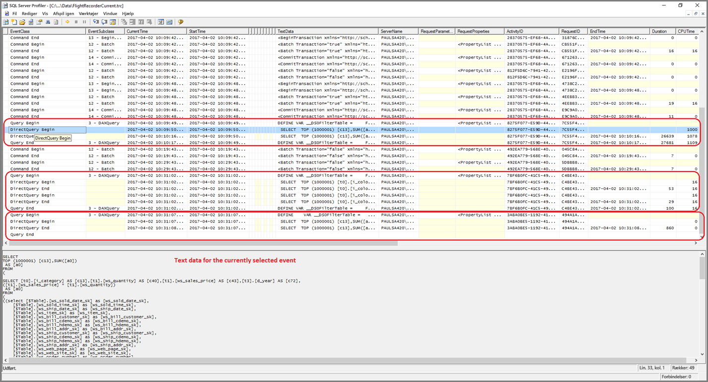
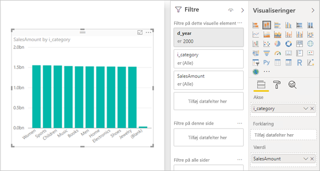

# <a name="directquery-model-troubleshooting-in-power-bi-desktop"></a>Fejlfinding af DirectQuery-model i Power BI Desktop

Denne artikel er henvendt til designere af datamodeller, som udvikler DirectQuery-modeller i Power BI enten ved hjælp af Power BI Desktop eller Power BI-tjenesten. Den indeholder en beskrivelse af, hvordan problemer med ydeevnen diagnosticeres, og hvordan du får mere detaljerede oplysninger, der gør det muligt at optimere rapporterne.

## <a name="performance-analyzer"></a>Effektivitetsanalyse

Det anbefales på det kraftigste, at enhver diagnosticering af problemer med ydeevnen starter i Power BI Desktop og ikke i Power BI (tjenesten eller Power BI- rapportserver). Ofte er problemer med ydeevnen ganske enkelt baseret på niveauet for ydeevnen i den underliggende datakilde, og de er nemmere at identificere og diagnosticere i det meget mere isolerede miljø i Power BI Desktop. Dermed udelukkes visse komponenter fra starten (f.eks. Power BI-gatewayen). Det er kun, hvis problemerne med ydeevnen ikke er relateret til Power BI Desktop, at undersøgelsen skal fokusere på de specifikke data i rapporten i Power BI. [Effektivitetsanalyse](desktop-performance-analyzer.md) er et nyttigt værktøj til at identificere problemer gennem hele processen.

På samme måde anbefales det, at du først forsøger at isolere eventuelle problemer til en enkelt visualisering i stedet for mange visualiseringer på en side.

Lad os sige, at disse trin (fra forrige afsnit i dette emne) er gennemgået – vi har nu en enkelt visualisering på en side i Power BI Desktop, der stadig er langsom. Du kan bruge Effektivitetsanalyse til at fastlægge, hvilke forespørgsler der sendes til den underliggende kilde af Power BI Desktop. Det er også muligt at få vist sporings-/diagnosticeringsoplysninger, der måske udsendes af den underliggende datakilde. Sådanne sporinger kan også indeholde nyttige oplysninger om, hvordan forespørgslen blev udført, og hvordan den kan forbedres.

Selv om sådanne sporinger fra kilden ikke bliver fundet, er det dog muligt at få vist de forespørgsler, der er sendt af Power BI, sammen med deres kørselstider, som beskrevet nedenfor.

## <a name="review-trace-files"></a>Gennemse sporingsfiler

Som standard logfører Power BI Desktop hændelser i løbet af en given session til en sporingsfil kaldet **FlightRecorderCurrent.trc**.

For nogle DirectQuery-kilder indeholder denne log alle forespørgsler, der er sendt til den underliggende datakilde (de resterende DirectQuery-kilder understøttes muligvis i fremtiden). Følgende kilder skriver forespørgsler til loggen:

- SQL Server
- Azure SQL Database
- Azure SQL Data Warehouse
- Oracle
- Teradata
- SAP HANA

Sporingsfilen findes i mappen **AppData** for den aktuelle bruger: _\\\<Bruger>\AppData\Local\Microsoft\Power BI Desktop\AnalysisServicesWorkspaces_

Her er en nem måde at få adgang til denne mappe: I Power BI Desktop skal du vælge _Filer > Indstillinger > Indstillinger_ og derefter vælge siden **Diagnosticering**. Følgende vindue vises:


Når du vælger linket **Åbn mappen crashdump/sporinger** under Samling af crashdump, åbnes følgende mappe: _\\\<Bruger>\AppData\Local\Microsoft\Power BI Desktop\Sporinger_

Når du navigerer til denne mappes overordnede mappe vises mappen, der indeholder _AnalysisServicesWorkspaces_, som vil indeholde én undermappe for et arbejdsområde for hver åbne forekomst af Power BI Desktop. Disse undermapper er navngivet med et heltalssuffiks, f.eks. _AnalysisServicesWorkspace2058279583_.

I mappen er der en undermappe af typen _\Data_, som indeholder sporingsfilen FlightRecorderCurrent.trc for den aktuelle Power BI-session. Den tilsvarende arbejdsområdemappe slettes, når den tilknyttede Power BI Desktop-session afsluttes.

Sporingsfilerne kan åbnes ved hjælp af værktøjet SQL Server Profiler, der kan downloades gratis som en del af SQL Server Management Studio. Du kan hente det på [denne placering](/sql/ssms/download-sql-server-management-studio-ssms?view=sql-server-2017).

Når du downloader og installerer SQL Server Management Studio, skal du køre SQL Server Profiler.



Hvis du vil åbne sporingsfilen, skal du benytte følgende fremgangsmåde:

1. Vælg _Filer > Åbn > Sporingsfil_ i SQL Server Profiler
2. Angiv stien til sporingsfilen for den åbne Power BI-session, f.eks.: _\\\<Bruger>\AppData\Local\Microsoft\Power BI Desktop\AnalysisServicesWorkspaces\AnalysisServicesWorkspace2058279583\Data_
3. Åbn _FlightRecorderCurrent.trc_

Alle hændelser fra den aktuelle session vises. Der vises et anmærket eksempel nedenfor, hvor grupper af hændelser er fremhævet. Hver enkelt gruppe har følgende:

- En hændelse af typen _Query Begin_ og _Query End_, der repræsenterer start og slutning af en DAX-forespørgsel, som genereres af brugergrænsefladen (f.eks. fra en visualisering eller fra udfyldningen af en liste over værdier i brugergrænsefladen for filteret)
- Et eller flere par af hændelserne _DirectQuery Begin_ og _DirectQuery End_, som repræsenterer en forespørgsel, der er sendt til den underliggende datakilde som en del af evalueringen af DAX-forespørgslen

Bemærk, at flere DAX-forespørgsler kan udføres parallelt, så hændelser fra forskellige grupper kan indskydes. Værdien af aktivitets-id'et kan bruges til at afgøre, hvilke hændelser der tilhører samme gruppe.


Følgende kolonner er også interessante:

- **TextData:** Tekstdetaljerne for hændelsen. For hændelserne _Query Begin/End_ vil dette være DAX-forespørgslen. For hændelserne _DirectQuery Begin/End_ vil dette være den SQL-forespørgsel, der er sendt til den underliggende kilde. Værdien _TextData_ for den hændelse, der er valgt i øjeblikket, vises også nederst i området.
- **EndTime:** Når hændelsen er fuldført.
- **Duration:** Varigheden i millisekunder for det tidsrum, det har taget at udføre DAX- eller SQL-forespørgslen.
- **Error:** Angiver, om der opstod en fejl, og i så fald vises hændelsen også med rødt.

Nogle af de mindre interessante kolonner er blevet gjort smallere på billedet ovenfor, hvilket gør de muligt at se de interessante kolonner mere tydeligt.

Vi anbefaler følgende metode til registrering af en sporing for at hjælpe med at diagnosticere et muligt problem med ydeevnen:

- Åbn en enkelt Power BI Desktop-session (for at undgå forvirring med flere arbejdsområdemapper)
- Udfør det sæt handlinger, du er interesseret i, i Power BI Desktop. Inkluder derudover nogle få ekstra handlinger for at sikre dig, at de interessante hændelser inkluderes i sporingsfilen.
- Åbn SQL Server Profiler, og undersøg sporingen, som beskrevet tidligere. Husk, at sporingsfilen slettes, når Power BI Desktop lukkes. Desuden vises yderligere handlinger i Power BI Desktop ikke med det samme – sporingsfilen skal lukkes og åbnes igen, før du kan se de nye hændelser.
- Bevar individuelle sessioner, der er rimeligt små (10-sekunders handlinger – ikke hundredvis), for at gøre det nemmere at fortolke sporingsfilen (da der er en grænse for størrelsen på sporingsfilen, er der en risiko for at tidlige hændelser fjernes for lange sessioner).

## <a name="understand-queries-sent-to-the-source"></a>Forstå forespørgsler, der er sendt til kilden

I det generelle format af forespørgsler, der genereres og sendes af Power BI Desktop, bruges underforespørgsler for hver af de tabeller, der henvises til, hvor underforespørgslen er defineret i Power Query-forespørgslen. Antag f.eks. følgende TPC-DS-tabeller i en SQL Server-relationsdatabase:


Tag følgende visualisering og konfigurationen af den i betragtning, hvor du bemærker, at målingen **SalesAmount** er defineret med følgende udtryk:

```dax

SalesAmount = SUMX(Web_Sales, [ws_sales_price] * [ws_quantity])

```



Opdatering af denne visualisering vil resultere i den T-SQL-forespørgsel, der vises under næste afsnit. Som du kan se, er der tre underforespørgsler for modeltabellerne **Web_Sales**, **Item** og **Date_dim**. Hver af disse tabeller returnerer alle kolonner i modeltabellerne, selvom der faktisk kun henvises til fire kolonner i visualiseringen. Disse underforespørgsler (som er nedtonet) er nøjagtigt definitionen af Power Query-forespørgslerne. Brug af underforespørgsler på denne måde ser ikke ud til at påvirke ydeevnen i forbindelse med de datakilder, der indtil videre understøttes for DirectQuery. Datakilder i stil med SQL Server fjerner henvisningerne til ubrugte kolonner.

En grund til, at Power BI gør brug af dette mønster, er, at du kan definere en Power Query-forespørgsel til at bruge en specifik sætning i forespørgslen. Så den bruges "som den leveres" uden et forsøg på at skrive til den igen. Bemærk, at dette mønster begrænser brug af sætninger i forespørgsler, som bruger CTE'er (Common Table Expressions) og gemte procedurer. Disse sætninger kan ikke bruges i underforespørgsler.


## <a name="gateway-performance"></a>Ydeevne af gateway

Du kan finde oplysninger om, hvordan du foretager fejlfinding af gatewayens ydeevne i artiklen [Foretag fejlfinding af gateways – Power BI](service-gateway-onprem-tshoot.md).

## <a name="next-steps"></a>Næste trin

Du kan finde flere oplysninger om DirectQuery i følgende ressourcer:

- [Brug DirectQuery i Power BI Desktop](desktop-use-directquery.md)
- [DirectQuery-modeller i Power BI Desktop](desktop-directquery-about.md)
- [Vejledning til DirectQuery-model i Power BI Desktop](guidance/directquery-model-guidance.md)
- Har du spørgsmål? [Prøv at spørge Power BI-community'et](https://community.powerbi.com/)
