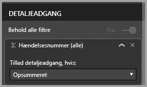

# Brug detaljeadgang i Power BI Desktop
Med **detaljeadgang** i **Power BI Desktop** kan du oprette en side i rapporten, som fokuserer på et bestemt objekt – f.eks. en leverandør, en kunde eller en producent. Brugerne kan højreklikke på et datapunkt på andre rapportsider. Derefter de kan få detaljeadgang til den fokuserede side for at få oplysninger, der er filtreret til denne kontekst.

## Brug detaljeadgang
1. Hvis du vil bruge **detaljeadgang**, skal du oprette en rapportside med de visuals, du ønsker til den type enhed, som du vil have detaljeadgang til. 

    Lad os f.eks. sige, at du vil angive detaljeadgang til producenter. Så kan du oprette en side med detaljeadgang med visuelle elementer, der viser det samlede salg, enheder leveret i alt, salg efter kategori, salg efter område osv. Det betyder, at når du får detaljeadgang til denne side, er de pågældende visuals specifikke for den valgte producent.

2. På siden med detaljeadgang kan du derefter gå til sektionen **Felter** i ruden **Visualiseringer** og trække det felt, du vil aktivere detaljeadgang til, til området **Detaljeadgangsfiltre**.

    

    Når du føjer et felt til området **Detaljeadgangsfiltre**, opretter **Power BI Desktop** automatisk et visuelt element for knappen *Tilbage*. Denne visual bliver en knap i publicerede rapporter. Brugere, der anvender din rapport i **Power BI-tjenesten**, kan bruge denne knap til at komme tilbage til den rapportside, de kom fra.

    

## Brug dit eget billede på en Tilbage-knap    
 Da knappen Tilbage er et billede, kan du erstatte billedet af denne visual med et hvilken som helst billede, du ønsker. Det fungerer stadig som en tilbage-knap, så brugerne af rapporter kan vende tilbage til den oprindelige side. Hvis du vil bruge dit eget billede som tilbage-knap, skal du gøre følgende:

1. På fanen **Hjem** vælger du **Image**. Finde derefter dit billede, og placer det på siden med detaljeadgang.

2. Vælg det nye billede på siden med detaljeadgang. I afsnittet **Formatér billede** skal du indstille skyderen **Link** til **Til** og derefter indstille **Type** til **Tilbage**. Billedet fungerer nu som en Tilbage-knap.

    

    
     Nu kan brugerne højreklikke på et datapunkt i din rapport og få en genvejsmenu, der understøtter detaljeadgang til denne side. 

    

    Når brugerne vælger at få detaljeadgang, filtreres siden, så den viser oplysninger om det datapunkt, de har højreklikket på. Lad os f.eks. sige, at de har højreklikket på et datapunkt om Contoso (en producent) og valgt at få detaljeadgang. Den side med detaljeadgang, som de skal du gå til, filtreres til Contoso.

## Overfør alle filtre i detaljeadgang

Fra og med versionen af **Power BI Desktop** fra maj 2018 kan du overføre alle anvendte filtre til detaljeadgangsvinduet. Du kan f.eks. kun vælge en bestemt kategori af produkter og de visuals, der filtreres til denne kategori, og derefter vælge detaljeadgang. Du er måske interesseret i at se, hvordan denne detaljeadgang ville se ud med alle de anvendte filtre.

Hvis du vil beholde alle anvendte filtre, skal du gå til afsnittet **Detaljeadgang** i ruden **Visualiseringer** og slå indstillingen **Overfør alle filtre** **til**. 

I versioner af **Power BI Desktop**, der er udgivet før maj 2018, svarer funktionsmåden til at slå denne indstilling **fra**.

Når du derefter udfører detaljeadgang på et visuelt element, kan du se, hvilke filtre der er anvendt som resultat af det visuelle kildeelement, hvor der er anvendt midlertidige filtre. I vinduet med detaljeadgang vises disse midlertidige filtre med kursiv. 

Du kan gøre dette med sider med værktøjstip, men det giver en forkert oplevelse, fordi værktøjstippet ikke ser ud til at fungere korrekt. Derfor anbefales det ikke at gøre dette med værktøjstip.

## Føj et mål til detaljeadgang

Ud over at overføre alle filtre til vinduet med detaljeadgang kan du også tilføje et mål (eller en numerisk kolonne med en opsummering) i detaljeområdet. Træk detaljeadgangsfeltet til detaljeadgangskortet for at anvende det. 

Når du tilføjer et mål eller en numerisk kolonne med en opsummering, kan du få adgang til siden, når feltet bruges i området *Værdi* for en visual.

Så nemt er det at bruge **detaljeadgang** i dine rapporter. Det kan give dig en udvidet visning af de enhedsoplysninger, som du valgte til dit detaljeadgangsfilter.

## Næste trin

Du vil måske også være interesseret i følgende artikler:

* [Brug af udsnitsværktøjer i Power BI Desktop](visuals/desktop-slicers.md)

