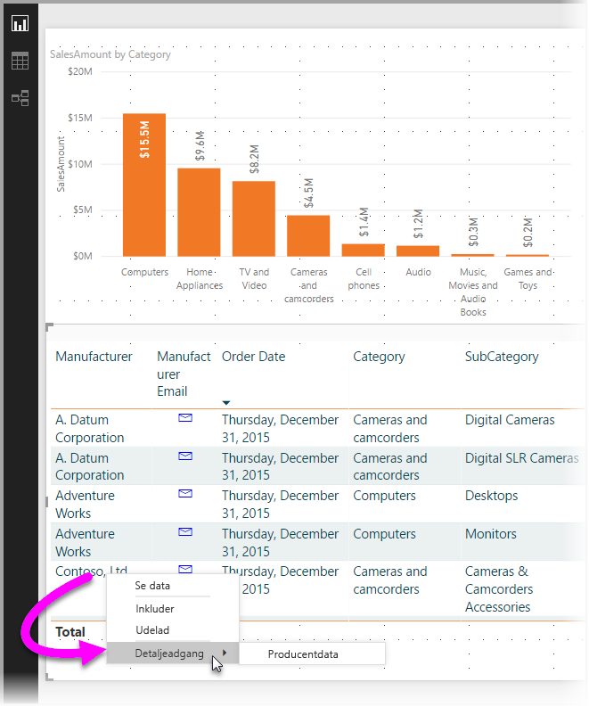
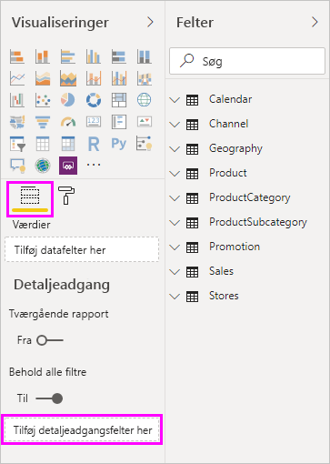
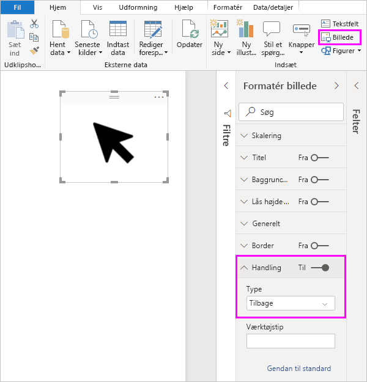
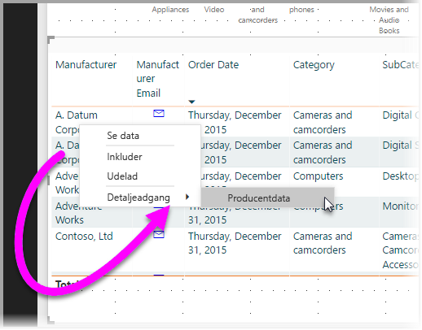
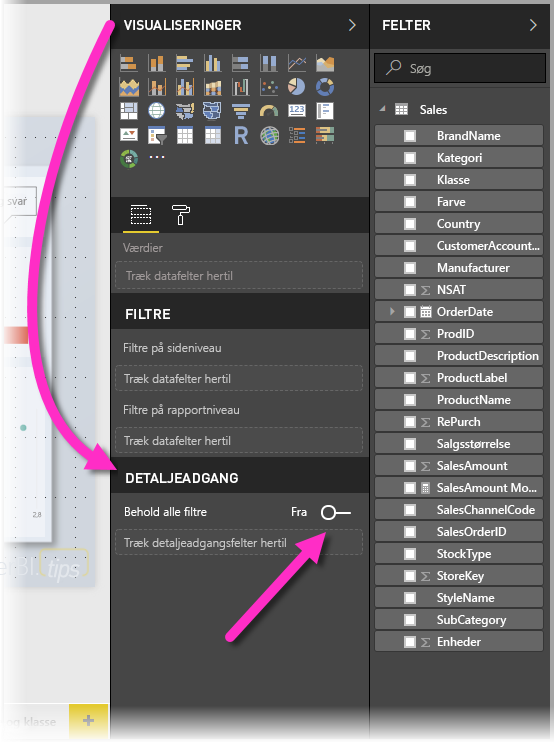
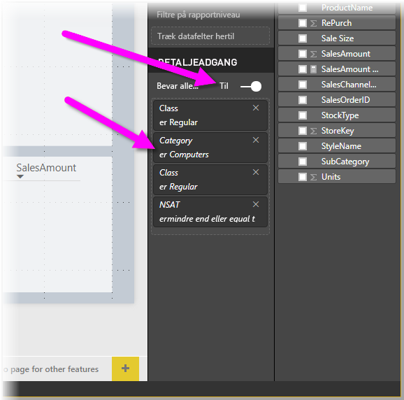

# Brug detaljeadgang i Power BI Desktop
Med **detaljeadgang** i **Power BI Desktop** kan du oprette en side i rapporten, som fokuserer på et bestemt objekt – f.eks. en leverandør, en kunde eller en producent. Når denne rapportside er i fokus, kan brugere højreklikke på et datapunkt på andre rapportsider og få detaljeadgang til siden med fokus for at få oplysninger, der er filtreret i forhold til denne kontekst.

## Brug detaljeadgang
1. Hvis du vil bruge **detaljeadgang**, skal du oprette en rapportside, der indeholder de visuals, du gerne vil have vist for den type enhed, som du vil have detaljeadgang til. 

    Hvis du f.eks. vil angive detaljeadgang for producenter, kan du oprette en side med detaljeadgang med visuelle elementer, der viser det samlede salg, enheder leveret i alt, salg efter kategori, salg efter område osv. Det betyder, at når du får detaljeadgang til denne side, er de pågældende visuals specifikke for den valgte producent.

2. På siden med detaljeadgang kan du derefter gå til sektionen **Felter** i ruden **Visualiseringer** og trække det felt, du vil have detaljeadgang til, til området **Detaljeadgangsfiltre**.

    

    Når du føjer et felt til området **Detaljeadgangsfiltre**, opretter **Power BI Desktop** automatisk et visuelt element for knappen *Tilbage*. Dette visuelle element bliver en knap i udgivne rapporter, så brugere, der anvender din rapport i **Power BI-tjenesten**, nemt kan komme tilbage til den rapportside, de kom fra (den side, de valgte at få detaljeadgang fra).

    

## Brug dit eget billede på en Tilbage-knap    
 Eftersom knappen Tilbage er et billede, kan du erstatte billedet af dette visual med et hvilket som helst billede, og det fungerer stadig som en Tilbage-knap, der sender brugere af rapporten tilbage til den oprindelige side.

1. På fanen **Startside** skal du klikke på **Billede** og derefter finde billedet og placere det på siden detaljeadgang.
2. Vælg det nye billede på siden Detaljeadgang og indstil skyderen for **Link** til On i afsnittet Formatér billede, og angiv **Type** til **Tilbage**. Billedet fungerer nu som en Tilbage-knap.

    

    Når din side med **detaljeadgang** er fuldført, og brugere højreklikker på et datapunkt i din rapport, der benytter det felt, du har anbragt i området **Detaljeadgangsfiltre**, vises en genvejsmenu, der understøtter detaljeadgang til denne side.

    

    Når brugerne vælger at få detaljeadgang, filtreres siden, så den viser oplysninger om det datapunkt, de har højreklikket på. Hvis de f.eks. har højreklikket på et datapunkt om Contoso (en producent) og har valgt at få detaljeadgang, filtreres den side med detaljeadgang, de sendes videre til, til Contoso.

## Overfør alle filtre i detaljeadgang

Fra og med versionen af **Power BI Desktop** fra maj 2018 kan du overføre alle anvendte filtre til detaljeadgangsvinduet. Hvis du f.eks. kun har valgt en bestemt produktkategori og de visuelle elementer, der er filtreret under denne kategori, kan du vælge detaljeadgang. Du er måske interesseret i at se, hvordan denne detaljeadgang ville se ud med alle de anvendte filtre.

Hvis du vil beholde alle anvendte filtre, skal du gå til sektionen **Detaljeadgang** i ruden **Visualiseringer** og bare slå indstillingen **Overfør alle filtre** **til**. 

I versioner af **Power BI Desktop** før maj 2018 svarer funktionsmåden til at slå denne indstilling **fra**.

Når du derefter udfører detaljeadgang på et visuelt element, kan du se, hvilke filtre der er anvendt som resultat af det visuelle kildeelement, hvor der er anvendt midlertidige filtre. I vinduet med detaljeadgang vises disse midlertidige filtre med kursiv. 

Bemærk, at du kan gøre dette med sider med værktøjstip, men det giver en forkert oplevelse (værktøjstippet ser ikke ud til at fungere korrekt), så det anbefales ikke at gøre det med værktøjstip.

Så nemt er det at bruge **detaljeadgang** i dine rapporter. Det kan give dig en udvidet visning af de enhedsoplysninger, du vælger til dit detaljeadgangsfilter.

## Næste trin

Du vil måske også være interesseret i følgende artikler:

* [Brug af udsnitsværktøjer i Power BI Desktop](desktop-slicers.md)

