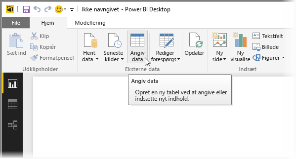
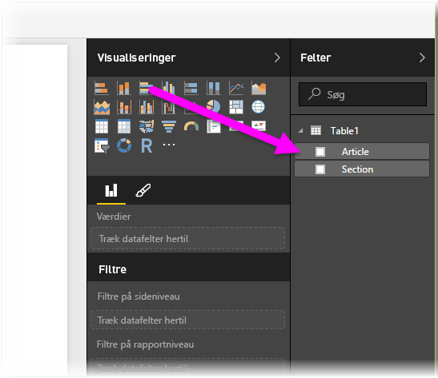

# Angiv data direkte i Power BI Desktop
Med Power BI Desktop kan du skrive data direkte i og bruge dem i dine rapporter og visualiseringer. Du kan for eksempel kopiere dele af en projektmappe eller webside og derefter indsætte det i Power BI Desktop.

Hvis du vil indtaste data direkte, skal du vælge **Indtast data** på båndet **Hjem**.

Power BI Desktop forsøger måske at foretage mindre transformeringer af dataene, hvis det er passende, på samme måde som når du indlæser data fra en kilde. I følgende tilfælde har den f.eks. hævet den første række data til overskrifter.

Hvis du vil forme de data, du har angivet (eller indsat), kan du vælge knappen Rediger for at få vist **forespørgselseditoren**, hvor du kan forme og transformere dataene, før du viser dem i Power BI Desktop. Eller du kan vælge knappen **Indlæs** for at importere dataene, som de vises.

Når du vælger **Indlæs**, opretter Power BI Desktop en ny tabel ud fra dine data og gør den tilgængelig i ruden **Felter**. På følgende billede viser Power BI Desktop min nye tabel, der som standard kaldes *Table1*, og de to felter i tabellen, der er oprettet.

Og det var det – så nemt er det at indtaste data i Power BI Desktop.

Du er nu klar til at bruge dataene i Power BI Desktop til at oprette visualiseringer og rapporter eller interagere med andre data, som du måske vil oprette forbindelse til og importere, f.eks. Excel-projektmapper, databaser eller en hvilken som helst anden datakilde.

## Næste trin
Du kan oprette forbindelse til mange forskellige typer data ved hjælp af Power BI Desktop. Du kan finde flere oplysninger om datakilder i følgende ressourcer:

* [Hvad er Power BI Desktop?](desktop-what-is-desktop.md)
* [Datakilder i Power BI Desktop](desktop-data-sources.md)
* [Udform og kombiner data med Power BI Desktop](desktop-shape-and-combine-data.md)
* [Opret forbindelse til Excel-projektmapper i Power BI Desktop](desktop-connect-excel.md)   
* [Opret forbindelse til CSV-filer i Power BI Desktop](desktop-connect-csv.md)   

