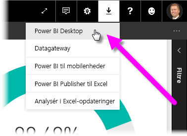
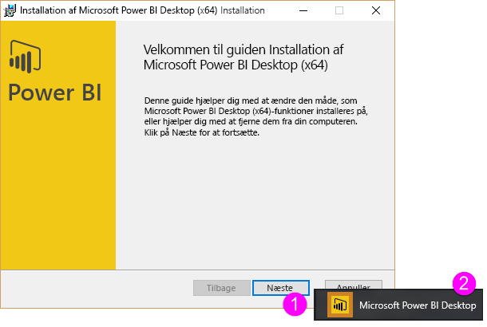
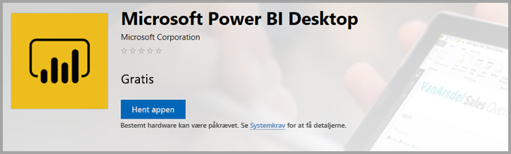
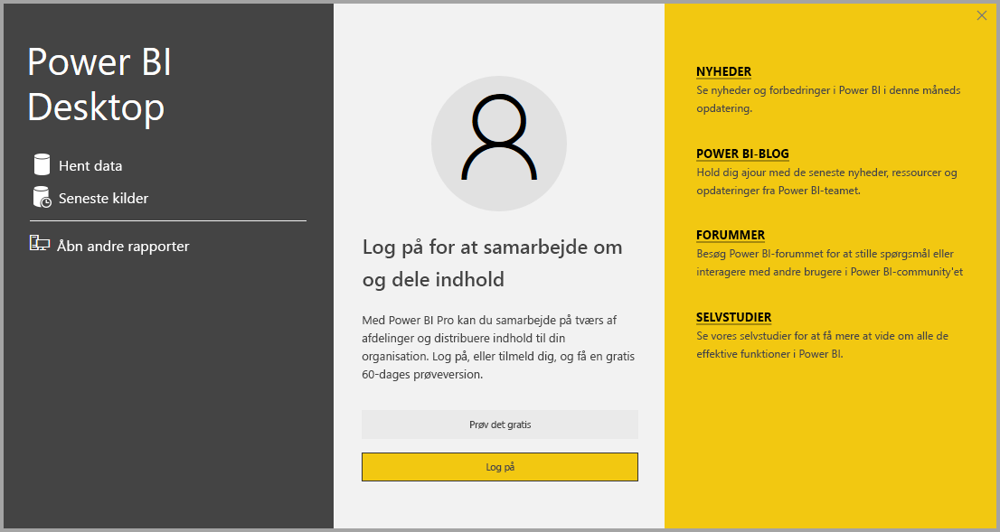

# <a name="get-power-bi-desktop"></a>Hent Power BI Desktop
Med **Power BI Desktop** kan du oprette avancerede forespørgsler, modeller og rapporter, som visualiserer data. Med **Power BI Desktop** kan du oprette datamodeller, oprette rapporter og dele dit arbejde ved at udgive det i Power BI-tjenesten.  **Power BI Desktop** kan downloades gratis.

Du kan hente **Power BI Desktop** på to måder, som beskrevet i følgende afsnit:

* Direkte **download** (en pakke, du kan downloade og installere på din computer)
* Installér som en app fra **Microsoft Store**

Begge fremgangsmåder henter den nyeste version af **Power BI Desktop** på computeren, men der er et par forskelle, du skal være opmærksom på, som beskrevet i følgende afsnit.

## <a name="download-power-bi-desktop"></a>Download Power BI Desktop
Hvis du vil downloade den nyeste version af **Power BI Desktop**, kan du vælge downloadikonet i øverste højre hjørne af Power BI-tjenesten og vælge **Power BI Desktop**.



Du kan også downloade den nyeste version af Power BI Desktop fra følgende downloadside:

* [**Download af Power BI Desktop**  (både 32- og 64-bit versionen)](https://powerbi.microsoft.com/desktop).
  
  [](https://powerbi.microsoft.com/desktop)

Uanset hvordan du downloader **Power BI Desktop**, bliver du bedt om at køre installationsfilen, når den er hentet:


Fra og med udgivelsen i juli 2019 sendes **Power BI Desktop** som en enkelt .exe-installationspakke, der indeholder alle understøttede sprog. Der er separate. exe-filer til 32-bit-og 64-bit versioner. .msi-pakkerne ophørte fra og med udgivelsen i september 2019, hvilket kræver den eksekverbare .exe-fil til installation. Denne tilgang gør distribution, opdateringer og installation (især for administratorer) meget nemmere og mere praktisk. Du kan også bruge kommandolinjeparametre til at tilpasse installationsprocessen, som beskrevet i afsnittet [Brug af kommandolinjeindstillinger under installationen](#using-command-line-options-during-installation) senere i denne artikel.

Efter du har lanceret installationspakken, installeres **Power BI Desktop** som et program og køres på din computer.



> [!NOTE]
> Du kan ikke installere den downloadede version (MSI) og **Microsoft Store**-versionen af **Power BI Desktop** på samme computer (hvilket også kaldes for en *side om side*-installation).
> 
> 

## <a name="install-as-an-app-from-the-microsoft-store"></a>Installér som en app fra Microsoft Store
Du kan også hente **Power BI Desktop** via Microsoft Store ved hjælp af følgende link:

* [Installér **Power BI Desktop** via **Microsoft Store**](http://aka.ms/pbidesktopstore)

  

Der er nogle fordele ved at hente **Power BI Desktop** via Microsoft Store:

* **Automatiske opdateringer** – Windows downloader automatisk den nyeste version i baggrunden, så snart den bliver tilgængelig, så din version altid er opdateret.
* **Mindre downloads** – **Microsoft Store** sikrer, at det kun er komponenter, som er ændret i de enkelte opdateringer, der downloades til computeren, hvilket resulterer i mindre downloads for hver opdatering.
* **Der kræves ikke administratorrettigheder** – Når du downloader pakken direkte og installerer den, skal du være administrator, før installationen kan fuldføres. Når du henter **Power BI Desktop** via Microsoft Store, kræves der *ikke* administratorrettigheder.
* **It-udrulning aktiveret** – **Microsoft Store**-versionen kan nemmere *udrulles* for alle i organisationen og gøre **Power BI Desktop** tilgængelig via **Microsoft Store til Virksomheder**.
* **Registrering af sprog** – Versionen fra **Microsoft Store** indeholder alle understøttede sprog og kontrollerer, hvilket sprog der bruges på computeren, hver gang den startes. Dette påvirker også oversættelse af modeller, der oprettes i **Power BI Desktop**. Indbyggede datohierarkier vil f.eks. bruge det sprog, som **Power BI Desktop** brugte, da .pbix-filen blev oprettet.

Der er et par overvejelser og begrænsninger i forbindelse med at installere **Power BI Desktop** via Microsoft Store. De er som følger:

* Hvis du bruger SAP-connectoren, skal du muligvis flytte dine SAP-driverfiler til mappen *Windows\System32*.
* Brugerindstillingerne fra .exe-versionen kopieres ikke ved installation af **Power BI Desktop** via Microsoft Store. Du skal muligvis oprette forbindelse til dine seneste datakilder igen og angive dine legitimationsoplysninger til datakilden igen. 

> [!NOTE]
> Du kan ikke installere den downloadede version (MSI) og **Microsoft Store**-versionen af **Power BI Desktop** på samme computer (hvilket også kaldes for en *side om side*-installation). Du skal fjerne **Power BI Desktop** manuelt, før du downloader den fra **Microsoft Store**
> 
> [!NOTE]
> Power BI-rapportserverversionen af **Power BI Desktop** er en separat version og adskiller sig fra de versioner, der er beskrevet i denne artikel. Du kan finde oplysninger om rapportserverversionen af **Power BI Desktop** under [Opret en Power BI-rapport til Power BI-rapportserveren](report-server/quickstart-create-powerbi-report.md).
> 
> 

## <a name="using-power-bi-desktop"></a>Brug Power BI Desktop
Når du starter **Power BI Desktop**, vises der et *velkomstbillede*.



Hvis det er første gang, du bruger **Power BI Desktop** (og installationen ikke er en opgradering), bliver du bedt om at udfylde en formular og svare på et par spørgsmål eller logge på **Power BI-tjenesten**, før du kan fortsætte.

Herfra kan du gå i gang med at oprette datamodeller eller rapporter og dele dem med andre brugere af Power BI-tjenesten. Se linksene med **Flere oplysninger** sidst i denne artikel for at få links til vejledninger, der kan hjælpe dig med at komme i gang med at bruge **Power BI Desktop**.

## <a name="minimum-requirements"></a>Minimumkrav
Følgende liste indeholder minimumkravene til at køre **Power BI Desktop**:

* Windows 7/Windows Server 2008 R2 eller nyere
* .NET 4.5
* Internet Explorer 10 eller nyere
* **Hukommelse (RAM):** Mindst 1 GB ledig hukommelse, 1,5 GB eller mere anbefales.
* **Skærm:** Mindst 1440 x 900 eller 1600 x 900 (16:9) anbefales. En lavere opløsning, f.eks. 1024 x 768 eller 1280 x 800 anbefales ikke, da visse kontrolelementer (f.eks. lukning af startskærmen) vises ud over disse opløsninger.
* **Indstillinger for visning af vinduer:** Hvis dine visningsindstillinger er angivet til at ændre størrelsen på tekst, apps og andre elementer til mere end 100 %, kan du muligvis ikke se visse dialogbokse, der skal lukkes eller besvares for at fortsætte med at bruge **Power BI Desktop**. Hvis du oplever dette problem, skal du kontrollere dine **skærmindstillinger** ved at gå til **Indstillinger > System > Skærm** i Windows og bruge skyderen for at ændre skærmindstillinger tilbage til 100 %.
* **CPU:** x86- eller x64-bit processor med 1 gigahertz (GHz) eller hurtigere anbefales.

## <a name="considerations-and-limitations"></a>Overvejelser og begrænsninger

Vi ønsker altid, at du har en fantastisk oplevelse med Power BI Desktop. Det kan ske, at du støder på et problem med Power BI Desktop, så dette afsnit indeholder løsninger eller forslag til at løse problemer, der kan opstå. 

### <a name="installing-power-bi-desktop-on-remote-machines"></a>Installation af Power BI Desktop på eksterne maskiner

Hvis du udruller Power BI Desktop til dine brugere med et værktøj, der kræver en Windows-installationsfil (. msi-fil), kan du udtrække .msi-filen fra .exe-installationsfilen til Power BI Desktop. Du kan bruge tredjepartsværktøjer, f.eks. WiX Toolset, til at opnå dette.

> [!NOTE]
> Da WiX Toolset er et tredjepartsprodukt, kan indstillingerne blive ændret uden varsel. Tjek deres dokumentation for at få de nyeste oplysninger, og kontakt deres mailliste for brugere for at få hjælp.

* På den computer, hvor du har downloadet Power BI Desktop-installationsprogrammet, skal du downloade og installere den nyeste version af WiX Toolset fra WiX-webstedet på https://wixtoolset.org/.
* Åbn et kommandolinjevindue som administrator, og naviger til den mappe, hvor du har installeret WiX Toolset.
* Kør følgende kommando: 
    
    ```Dark.exe <path to Power BI Desktop installer> -x <output folder>```

    Kør f.eks.:

    ``` Dark.exe C:\PBIDesktop_x64.exe -x C:\output```

* Outputmappen indeholder en mappe med navnet *AttachedContainer*, som indeholder. msi-filerne.


### <a name="using-command-line-options-during-installation"></a>Brug af kommandolinjeindstillinger under installationen 

Når du installerer Power BI Desktop, kan du angive egenskaber og indstillinger med kommandolinjeparametre. Dette er især nyttigt for administratorer, der administrerer eller letter installationen af Power BI Desktop på tværs af organisationer. Disse indstillinger gælder for .msi- og .exe-installationer. 


|Kommandolinjeindstilling  |Adfærd  |
|---------|---------|
|-q, -quiet, -s, -silent     |uovervåget installation         |
|-passive     |statuslinjen vises under installationen         |
|-norestart     |undertryk kravet om genstart af computeren         |
|-forcerestart     |genstart computeren efter installation uden en prompt         |
|-promptrestart     |spørg brugeren, om der kræves genstart af computeren (standard)         |
|-l<>, -log<>     |logfør installationen af en bestemt fil med den fil, der er angivet i <>         |
|-uninstall     |fjern Power BI Desktop         |
|-repair     |reparer installationen (eller installér, hvis det ikke er installeret i øjeblikket)         |
|-package, -update     |installér Power BI Desktop (standard, så længe -uninstall eller -repair ikke er angivet)         |

Du kan også bruge følgende **syntaksparametre**, som er angivet med syntaksen "PROPERTY=VALUE":


|Parameter  |Betydning  |
|---------|---------|
|ACCEPT_EULA     |Kræver værdien 1 for automatisk at acceptere slutbrugerlicensaftalen         |
|ENABLECXP     |Værdien 1 tilmelder programmet for kundeoplevelsen, hvor telemetri om brug af produktet registreres         |
|INSTALLDESKTOPSHORTCUT     |Værdien 1 tilføjer en genvej på skrivebordet         |
|INSTALLLOCATION     |Filsti til det sted, hvor den skal installeres         |
|LANGUAGE     |Landestandardkoden, f.eks. en-US, de-DE, pr-BR, til at gennemtvinge standardsproget for programmet. Hvis der ikke er angivet et sprog, vises Windows OS-sproget i Power BI Desktop. Dette kan ændres af brugeren i dialogboksen Indstillinger.         |
|REG_SHOWLEADGENDIALOG     |Værdien 0 deaktiverer visning af den viste dialogboks, før du har logget på Power BI Desktop         |


Du kan f.eks. køre den med følgende syntaks for at installere uden nogen brugergrænseflade ved hjælp af det tyske sprog: 

```“-quiet LANG=de-DE ACCEPT_EULA=1”```


### <a name="issues-when-using-previous-releases-of-power-bi-desktop"></a>Problemer med brug af tidligere udgaver af Power BI Desktop

Nogle brugere støder på en fejl, der svarer til følgende, når du bruger en forældet version af **Power BI Desktop**: 

    "We weren't able to restore the saved database to the model" 

Du kan som regel løse problemet ved at opdatere til den aktuelle version af Power BI Desktop.

### <a name="disabling-notifications"></a>Deaktivering af meddelelser
Vi anbefaler, at du opdaterer til den nyeste version af Power BI Desktop for at drage fordel af fremskridt inden for funktioner, ydeevne, stabilitet og andre forbedringer. Nogle organisationer vil måske ikke have, at brugerne opdaterer til hver eneste nye version. Du kan deaktivere meddelelser ved at redigere registreringsdatabasen via følgende trin:

1. Brug editoren for registreringsdatabasen til at navigere til *HKEY_LOCAL_MACHINE\SOFTWARE\Microsoft\Microsoft Power BI Desktop*
2. Opret en ny post med følgende indstillinger: *REG_DWORD : DisableUpdateNotification*
3. Angiv værdien af den nye post til **1**.

Du skal genstarte computeren, før ændringerne træder i kraft.

### <a name="power-bi-desktop-loads-with-a-partial-screen"></a>Power BI Desktop indlæses med en delvis skærm

Nogle brugere kan i visse tilfælde, herunder ved visse konfigurationer af skærmopløsningen, se Power BI Desktop gengive indhold med store sorte områder. Dette er normalt et resultat af de seneste opdateringer af operativsystemet, der påvirker den måde elementer gengives på, i stedet for et direkte resultat af den måde indhold vises på i Power BI Desktop. Uanset hvad årsagen er, er store sorte områder ikke så betagende som fantastiske visualiseringer, så for at håndtere dette problem kan du følge disse trin:

1. Tryk på tasten Start, og skriv ordet *blurry* i den søgelinje, der vises.
2. I den dialogboks, der vises, skal du vælge: *Lad Windows rette apps, der er slørede.*
3. Genstart Power BI Desktop.

Dette problem løses muligvis efter udgivelsen af efterfølgende Windows-opdateringer. 
 

## <a name="next-steps"></a>Næste trin
Når du får **Power BI Desktop** installeret, kan følgende indhold hjælpe dig med at komme i gang hurtigt:

* [Hvad er Power BI Desktop?](desktop-what-is-desktop.md)
* [Oversigt over forespørgsler i Power BI Desktop](desktop-query-overview.md)
* [Datakilder i Power BI Desktop](desktop-data-sources.md)
* [Opret forbindelse til data i Power BI Desktop](desktop-connect-to-data.md)
* [Udform og kombiner data med Power BI Desktop](desktop-shape-and-combine-data.md)
* [Almindelige forespørgselsopgaver i Power BI Desktop](desktop-common-query-tasks.md)   

