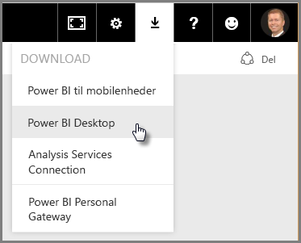
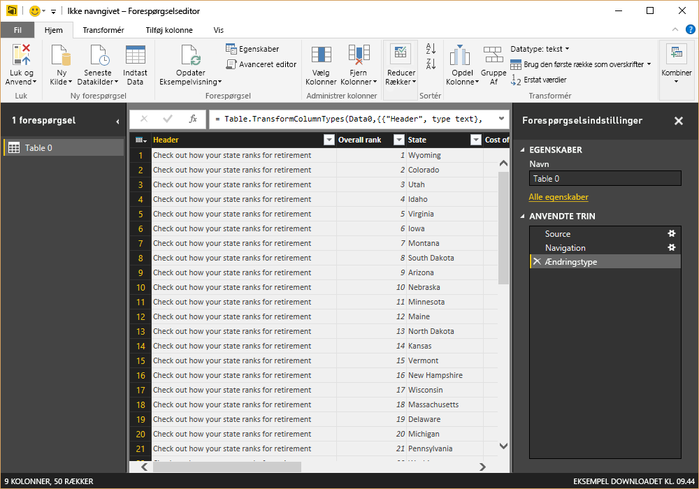
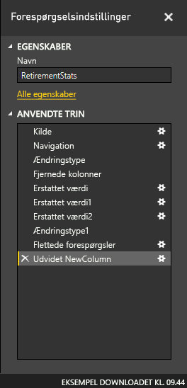
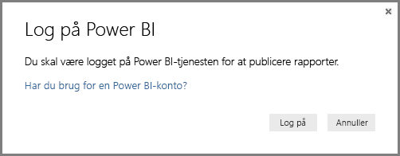

# Kom i gang med Power BI Desktop
Velkommen til **Introduktionsvejledning til Power BI Desktop**. Med denne korte præsentation af Power BI Desktop får du en idé om, hvordan det fungerer, og du får mulighed for at sætte skub i oprettelsen af robust datamodeller – sammen med fantastiske rapporter – som styrker din indsats på business intelligence-området. 

Foretrækker du at se noget i stedet for at læse? Du er velkommen til at [ser nærmere på vores introduktionsvideo](desktop-videos.md). Hvis du vil følge med vha. matchende eksempeldata, mens du ser videoen, kan du [downloade denne Excel-projektmappe med eksempler](http://go.microsoft.com/fwlink/?LinkID=521962).

Power BI Desktop gør det muligt for dig med at oprette en samling af forespørgsler, dataforbindelser og rapporter, der nemt kan deles med andre. Power BI Desktop kan integrere dokumenterede Microsoft-teknologier – det effektive forespørgselsprogram, datamodeller og visualiseringer – og det fungerer uden problemer med den online [**Power BI-tjeneste**](https://app.powerbi.com/).

Med kombinationen af **Power BI Desktop** (hvor analytikere og andre kan oprette effektive dataforbindelser, modeller og rapporter) og [**Power BI-tjenesten**](https://preview.powerbi.com/) (hvor Power BI Desktop-rapporter kan deles, så brugerne kan få vist og interagere med dem) er det lettere at modellere, bygge, dele og udvide indsigt fra dataenes verden.

Dataanalytikere vil opleve, at Power BI Desktop er et avanceret, fleksibelt og meget lettilgængeligt værktøj, der kan bruges til at oprette forbindelse til og forme data, bygge robuste modeller og oprette velstrukturerede rapporter.

## Sådan bruger du denne vejledning
Du kan bruge denne vejledning på flere måder – skimme den for at få et hurtigt overblik eller læse hver enkelt sektion for at få en detaljeret forståelse af, hvordan Power BI Desktop fungerer.

Hvis du har travlt, kan du tage en visuel tur gennem denne vejledning på få minutter, og stadig få en god idé om, hvordan Power BI Desktop fungerer, og hvordan du bruger det. Det meste af denne vejledning består af skærmbilleder, der visuelt viser, hvordan Power BI Desktop fungerer.

Hvis du vil have en mere grundig forståelse, kan du læse hver sektion, udføre disse trin, og slutte af med at få din egen Power BI Desktop-fil, der er klar til at blive postet på **Power BI**-tjenesten og blive delt med andre.

>[!NOTE]
>Der er også en separat og specialiseret version af **Power BI** kaldet [**Power BI-rapportserver**](report-server/get-started.md), som er til kunder, der har brug for, at deres data og rapportering skal forblive i det lokale miljø. Til brug med denne specialiserede version er der også en separat og specialiseret version af **Power BI Desktop** kaldet **Power BI Desktop til Power BI-rapportserver**, som kun fungerer sammen med rapportserver-versionen af Power BI. Denne artikel beskriver den almindelige **Power BI Desktop**.

## Sådan fungerer Power BI Desktop
Med Power BI Desktop kan du *oprette forbindelse til data* (normalt flere datakilder), *forme disse data* (med forespørgsler, der opretter nyttige, overbevisende datamodeller) og bruge denne model til at *oprette rapporter* (som andre kan benytte, bygge videre på og dele).

Når trinnene er gennemgået tilfredsstillende – forbinde, forme og rapportere – kan du gemme dit arbejdet i Power BI Desktop-filformatet, dvs. filtypenavnet .pbix. Power BI Desktop-filer kan deles som alle andre filer, men den bedste metode til deling af filer i Power BI Desktop er at uploade dem (dele dem) til [**Power BI-tjenesten**](https://preview.powerbi.com/). 

I Power BI Desktop centraliseres, forenkles og strømlines det, der ellers kan være en spredt, usammenhængende og besværlig proces til design og oprettelse af business intelligence-lagre og -rapporter.

Er du klar til at prøve? Lad os komme i gang.

## Installér og kør Power BI Desktop
Du kan downloade Power BI Desktop fra **Power BI**-tjenesten ved at vælge **tandhjuls**ikonet og derefter vælge **Power BI Desktop**.

Power BI Desktop er installeret som et program og kører på din computer.

Når du kører Power BI Desktop, vises der et *velkomst*skærmbillede.

Du kan **hente data**, se de **seneste kilder** eller **åbne andre** **rapporter** direkte fra *velkomst*skærmbilledet (via links i ruden til venstre). Hvis du lukker skærmbilledet (vælg **x** i øverste højre hjørne), vises visningen **Rapport** af Power BI Desktop.

Der er tre visninger i Power BI Desktop: **Rapport**, **Data** og **Relationer**. Power BI Desktop indeholder også **Query Editor**, som åbnes i et separat vindue. I **Query Editor** kan du oprette forespørgsler og transformere data. Derefter indlæser du denne tilpassede datamodel i Power BI Desktop og opretter rapporter.

På følgende skærmbillede kan du se de tre visningsikoner til venstre i Power BI Desktop: **Rapport**, **Data** og **Relationer** (oppefra og ned). Den aktuelle visning er angivet af den gule søjle til venstre. I dette tilfælde vises visningen **Rapport**. Du kan ændre visning ved at vælge et af de tre ikoner.

Når Power BI Desktop er installeret, er du klar til at oprette forbindelse til data, forme data og oprette rapporter (normalt i denne rækkefølge). I de næste par sektioner vil vi foretage en præsentation af dem hver især.

## Opret forbindelse til data
Når Power BI Desktop er installeret, er du klar til at oprette forbindelse til en verden af data, der konstant udvides. Der er *alle mulige* tilgængelige datakilder i forespørgselsvinduet. På følgende billede kan du se, hvordan du opretter forbindelse til data ved at vælge båndet **Hjem** og derefter **Hent data \> Flere**.

 

Som en del af denne hurtige præsentation opretter vi forbindelse til et par forskellige **web**datakilder.

Forestil dig, at du vil pensioneres – du vil bo et sted, hvor der er masser af sol, bedre skatter og et godt sundhedsvæsen – eller måske er du dataanalytiker og har brug for disse oplysninger for at hjælpe dine kunder. Du vil måske gerne hjælpe din solbrilleforhandler med at målrette salget efter, hvor der er mest solskin.

Uanset hvad, indeholder følgende webressource interessante data om disse emner med mere:

[*http://www.bankrate.com/finance/retirement/best-places-retire-how-state-ranks.aspx*](http://www.bankrate.com/finance/retirement/best-places-retire-how-state-ranks.aspx)

Vælg **Hent data \> Web**, og indsæt adressen.

 

Når du vælger **OK**, begynder **forespørgsel**sfunktionen i Power BI Desktop at arbejde. Forespørgslen kontakter webressourcen, og i **navigator**vinduet returneres resultaterne fra den pågældende webside. I dette tilfælde blev der fundet en tabel (*Tabel 0*) og det generelle webdokument. Vi er interesseret i tabellen, så vi vælger den på listen. I **navigatorvinduet** vises der et eksempel.

 

På nuværende tidspunkt kan vi redigere forespørgslen, før tabellen indlæses, ved at vælge **Rediger** nederst i vinduet, eller vi kan indlæse tabellen.

Når vi vælger **Rediger**, startes Forespørgselseditor, og der vises en repræsentativ visning af tabellen. Ruden **Forespørgselsindstillinger** vises (hvis det ikke er tilfældet, kan du vælge **Visning** på båndet og derefter vælge **Vis \> Forespørgselsindstillinger** for at få vist ruden **Forespørgselsindstillinger**). Sådan ser det ud.

 

Du kan finde flere oplysninger om oprettelse af forbindelse til data, under [Opret forbindelse til data i Power BI Desktop](desktop-connect-to-data.md).

I næste sektion justerer vi dataene, så de passer til vores behov. Processen med tilpasning af de forbundne data kaldes *formning* af data.

## Form og kombiner data
Nu, hvor vi har oprettet forbindelse til en datakilde, skal vi justere dataene, så de opfylder vores behov. Nogle gange betyder justeringen, at dataene skal *transformeres* – f.eks. omdøbning af kolonner eller tabeller, ændring af tekst til tal, fjernelse af rækker,angivelse af den første række som overskrifter osv.

Forespørgselseditor i Power BI Desktop gør rig brug af genvejsmenuer, ud over at opgaver er tilgængelige på båndet. Det meste af det, du kan vælge på båndet **transformation**, er også tilgængeligt, hvis du højreklikker på et element (f.eks. en kolonne) og vælger i den viste menu.

## Form data
Når du former data i **Forespørgselseditor**, angiver du en trinvis vejledning (som **Forespørgselseditor** udfører for dig) for at justere datamængden, efterhånden som **Forespørgselseditor** indlæser og præsenterer den. Den oprindelige datakilde påvirkes ikke. Det er kun denne bestemte visning af dataene, der justeres eller *formes*.

De angivne trin (f.eks. omdøbning af en tabel, transformation af en datatype eller sletning af kolonner) registreres af **Forespørgselseditor**, og hver gang denne forespørgsel opretter forbindelse til datakilden, udføres disse trin, så dataene er altid er formet på den måde, du angiver. Denne proces foregår, når du bruger forespørgslen i Power BI Desktop eller andre, som den er delt med, f.eks. i **Power BI**-tjenesten. Disse trin er hentet, i rækkefølge, i ruden **Forespørgselsindstillinger** under **Anvendte trin**.

På følgende billede vises ruden **Forespørgselsindstillinger** for en forespørgsel, som er formet – vi gennemgår hvert enkelt trin i de næste afsnit.

 

Lad os komme tilbage til vores pensioneringsdata, som vi fandt ved at oprette forbindelse til en webdatakilde. Så kan vi forme disse data efter vores behov.

For det første blev de fleste klassificeringer lagt ind i **Forespørgselseditor** som heltal, men ikke alle (én kolonne indeholdt tekst og tal, så den blev ikke konverteret automatisk). Vi har brug for, at alle data er tal. Det er ikke noget problem – du skal bare højreklikke på kolonneoverskriften og vælge **Skift type \> Heltal** for at ændre datatypen. Hvis vi skulle vælge mellem mere end én kolonne, kunne vi først vælge en kolonne og derefter holde **SKIFT** ned, vælge yderligere tilstødende kolonner og derefter højreklikke på en kolonneoverskrift for at ændre alle de valgte kolonner. Du kan også bruge **CTRL** til at vælge kolonner, der ikke støder op til hinanden.

 

Du kan også ændre eller *transformere* disse kolonner fra tekst til overskrift vha. båndet **Transformation**. Her er båndet **Transformation** med en pil, der peger på knappen **Datatype**, som gør det muligt at transformere den aktuelle datatype til en anden.

 

Bemærk, at under **Forespørgselsindstillinger**, afspejler **Anvendte trin** de ændringer, der er foretaget. Hvis jeg vil fjerne et trin fra formningsprocessen, skal jeg ganske enkelt vælge det pågældende trin, og derefter vælge **X** til venstre for trinnet.

 

Vi skal foretage lidt flere ændringer for at får forespørgslen helt på plads:

* *Fjern den første kolonne* – vi behøver den ikke, den indeholder bare redundante rækker, hvor der står "Se, hvordan din stat er rangeret i forhold til pensionering", hvilket er en artefakt, da dette er en webbaseret tabel

<!-- -->

* *Ret nogle få fejl* – på websiden var der én kolonne, hvor tekst var blandet med tal (nogle stater var samlet i en enkelt kategori). Det fungerer fint på webstedet, men ikke i vores dataanalyse. Det er nemt (i dette tilfælde) at rette, og der vises nogle smarte funktioner og egenskaber i **Forespørgselseditor** og de **Anvendte trin**

<!-- -->

* *Skift tabelnavnet* – **Tabel 0** er ikke en nyttige beskrivelse, men det er let at ændre navnet

Hvert af disse trin er vist under **[Form og kombiner data i Power BI Desktop](desktop-shape-and-combine-data.md)**. Du kan se nærmere på den side eller fortsætte med dette dokument for at se, hvad du herefter kan gøre. Næste sektion fortsættes umiddelbart efter, at ovenstående ændringer er implementeret.

## Kombiner data
Dataene omkring de forskellige stater er interessante og kan bruges til at skabe yderligere analyser og forespørgsler. Men der er et problem: De fleste data anvender forkortelser på to bogstaver for statskoder og ikke statens fulde navn. Vi skal bruge en måde at knytte forkortelserne for staterne til deres navne på.

Vi er heldige. Der er en anden offentlig datakilde, som gør lige præcis dette, men den skal formes en del, før vi kan knytte den til vores pensioneringstabel. Her er webressourcen med forkortelser for stater:

<http://en.wikipedia.org/wiki/List_of_U.S._state_abbreviations>

På båndet **Hjem** i **Forespørgselseditor** vælger vi **Hent data \> Web** og angiver adressen. Derefter vælger vi **OK**, hvorefter resultaterne fra den pågældende webside vises i vinduet  **Navigator**.

 

Vi vælger **Tabel[rediger]**, fordi den indeholder de ønskede data, men den skal formes lidt for at trimme dataene i tabellen. Hvert af disse trin vises også under **[Form og kombiner data i Power BI Desktop](desktop-shape-and-combine-data.md)**. Som opsummering af disse trin gør vi følgende:

Vi vælger **Rediger**, derefter er fremgangsmåden som følger:

* *Fjern de øverste to rækker* – de er resultatet af den måde, websidens tabel blev oprettet på, og dem behøver vi ikke.

<!-- -->

* *Fjern de nederste 26 rækker* – de indeholder alle territorierne, som vi ikke behøver at inkludere.

<!-- -->
* *Filtrer Washington DC fra* – statistiktabellen for pensionering indeholder ikke DC, så derfor skal den udelukkes fra listen.

<!-- -->

* *Fjern et par unødvendige kolonner* – vi behøver kun tilknytning af staten til den officielle forkortelse på to bogstaver, så vi kan fjerne de andre kolonner.

<!-- -->

* *Brug den første række som overskrifter* – da vi har fjernet de tre øverste rækker, er den aktuelle øverste række den overskrift, vi vil have.

    >[!NOTE]
    >Dette er et godt tidspunkt at påpege, at *rækkefølgen* af de anvendte trin i **Forespørgselseditor** er vigtig, og den kan påvirke, hvordan datatypen formes. Det er også vigtigt at overveje, hvordan ét trin kan påvirke efterfølgende trin. Hvis du fjerner et trin fra **Anvendte trin**, fungerer de efterfølgende trin muligvis ikke som oprindeligt tiltænkt, på grund af effekten af rækkefølgen af trin i forespørgslen.

* *Omdøb kolonnerne og selve tabellen* – som sædvanlig er der flere måder at omdøbe en kolonne på. Du kan vælge den, du foretrækker.

Når tabellen *Statskoder* er formet, kan vi kombinere disse to tabeller, eller forespørgsler, i én. Da de tabeller, vi har nu, er et resultat af de forespørgsler, vi anvendte på dataene, refereres de ofte til som *forespørgsler* .

Der er to primære måder at kombinere forespørgsler på – *fletning* og *tilføjelse*.

Når du har en eller flere kolonner, som du vil føje til en anden forespørgsel, skal du **flette** forespørgslerne. Når du har flere rækker med data, som du vil føje til en eksisterende forespørgsel, skal du **tilføje** forespørgslen.

I dette tilfælde vil vi flette forespørgsler. For at komme i gang vælger vi den forespørgsel, *som* vi vil flette med den anden forespørgsel. Derefter vælger vi **Flet forespørgsler** under fanen **Hjem** på båndet.

 

Vinduet **Flet** åbnes, og vi bliver bedt om at vælge, hvilken tabel vi vil flette med den valgte tabel, og derefter de tilsvarende kolonner, der skal bruges til fletningen. Vælg *Stat* i tabellen *Pensioneringsstatistik* (forespørgsel), og vælg derefter forespørgslen *Statskoder* (let i dette tilfælde, da der kun er én anden forespørgsel – når du opretter forbindelse til mange forskellige datakilder, er der mange forespørgsler at vælge imellem). Når vi vælger de korrekte matchende kolonner – *Stat* fra *Pensioneringsstatistik* og *Statnavn* fra *Statkoder* – ser vinduet **Flet** ud som følger, og knappen **OK** er aktiveret.

 

Den nye kolonne **NewColumn** oprettes i slutningen af forespørgslen, som er indholdet af tabellen (forespørgsel), der blev flettet med den eksisterende forespørgsel. Alle kolonner fra den flettede forespørgsel samles i **NyKolonne**, men du kan vælge at **udvide** tabellen og inkludere de ønskede kolonner. Hvis du vil udvide den flettede tabel og vælge, hvilke kolonner der skal inkluderes, skal du vælge udvidelsesikonet (). Vinduet **Udvid** vises.

 

I dette tilfælde vil vi kun have kolonnen *Statskode*, så vi vælger kun den pågældende kolonne og vælger derefter **OK**. Vi fjerne markeringen i afkrydsningsfeltet fra **Brug det oprindelige kolonnenavn som præfiks**, da vi ikke skal bruge det. Hvis vi bevarer markeringen, vil den flettede kolonne blive navngivet *NyKolonne.Statskode* (det oprindelige kolonnenavn, eller *NyKolonne* efterfulgt af et punktum, hvorefter kolonnenavnet føres ind i forespørgslen).

>[!NOTE]
>Vil du prøve at importere tabellen *NyKolonne*? Du kan eksperimentere lidt, og hvis du ikke kan lide resultatet, skal du bare slette dette trin på listen **Anvendte trin** i ruden **Forespørgselsindstillinger**. Din forespørgsel vender tilbage til tilstanden før trinnet **Udvid** blev anvendt. Du har mulighed for at prøve det af, så mange gange du har lyst, indtil udvidelsesprocessen ser ud, som den skal.

Vi har nu en enkelt forespørgsel (tabel), der kombinerer to datakilder, som er blevet formet efter vores behov. Denne forespørgsel kan fungere som udgangspunkt for mange ekstra, interessante dataforbindelser – f.eks. boligomkostningsstatistikker, demografi eller jobmuligheder i en vilkårlig stat.

Du kan se en mere detaljeret beskrivelse af hvert af disse trin til formning og kombination af data under [Form og kombiner data i Power BI Desktop](desktop-shape-and-combine-data.md).

Nu har vi nok data til at oprette et par interessante rapporter i Power BI Desktop. Da dette er en milepæl, gemmer vi denne Power BI Desktop-fil – vi kalder den **Introduktion til Power BI Desktop**. Hvis du vil anvende ændringerne i **Forespørgselseditor** og indlæse dem i Power BI Desktop, skal du vælge **Luk og anvend** på båndet **Hjem**.

## Opret rapporter
Der kan foretages yderligere ændringer efter indlæsning af tabellen, og du kan genindlæse en model for at anvende evt. ændringer, du foretager. Men på nuværende tidspunkt er det fint, som det er. I visningen **Rapport** i Power BI Desktop kan du begynde at oprette rapporter.

Visningen **Rapport** har fem hovedområder:

1. Båndet, som viser almindelige opgaver, der er knyttet til rapporter og visualiseringer
2. Visningen **Rapport**, eller lærred, hvor visualiseringer oprettes og arrangeres
3. Faneområdet **Sider** langs bunden, hvor du kan vælge eller tilføje en rapportside
4. Ruden **Visualiseringer**, hvor du kan ændre visualiseringer, tilpasse farver eller akser, anvende filtre, trække felter m.m.
5. Ruden **Felter**, hvorfra forespørgselselementer og filtre kan trækkes til visningen **Rapport** eller trækkes til området **Filtre** i ruden **Visualiseringer**
   
   

Ruden **Visualiseringer** og **Felter** kan skjules ved at vælge den lille pil langs med kanten, så der er mere plads i visningen **Rapport** til at oprette flotte visualiseringer. Når du redigerer visualiseringer, får du også vist disse pile pegende op eller ned, hvilket betyder, at du kan udvide eller skjule det pågældende afsnit tilsvarende.

 

For at oprette en visualisering skal du bare trække et felt fra listen **Felter** over på visningen **Rapport**. I dette tilfælde trækker vi feltet *Stat* fra *Pensioneringsstatistik* og ser, hvad der sker.

 

Se her... I Power BI Desktop er der automatisk oprettet en kortbaseret visualisering, fordi det blev genkendt, at feltet *Stat* indeholdt geoplaceringsdata.

Bemærk, at i ruden **Visualiseringer** kan jeg vælge forskellige visualiseringstyper, og i området under disse ikoner kan jeg trække felter til forskellige områder for at anvende en forklaring eller på anden måde ændre visualiseringen.

 

Lad os spole lidt frem, og se, hvordan visningen **Rapport** ser ud, når der er tilføjet en række visualiseringer samt et par nye rapportsider. Du kan finde flere oplysninger om rapporter under [Rapportvisning i Power BI Desktop](desktop-report-view.md).

På den første side i rapporten får du et overblik over de data, der er baseret på *den generelle placering*. Når vi vælger en af visualiseringen, vises det i ruden **Felter og filtre**, hvilke felter der er valgt samt strukturen for visualiseringer (som felter anvendes for på **Delt akse**, **Kolonneværdier** og **Linjeværdier**).

 

Der er seks **sider** i denne rapport – hver især en visualisering af visse elementer af vores data.

1. På den første side, der er vist ovenfor, vises alle stater baseret på *den generelle placering*.
2. På den anden side fokuseres der på de øverste ti stater baseret på *den generelle placering*.
3. På den tredje side er de bedste 10 stater i forbindelse med leveomkostninger (og tilknyttede data) visualiseret.
4. På den fjerde side er vejret i fokus, filtreret efter de 15 solrigeste stater.
5. På den femte side er lokalsamfundets velbefindende kortlagt og visualiseret for de 15 øverst placerede stater.
6. Og endelig er kriminalitetsstatistikken visualiseret med visning af de bedste (og ja, sidste) 10 stater.

Her kan du se, hvordan rapportsiden, der fokuserer på leveomkostninger, ser ud.

 

Du kan oprette alle mulige forskellige interessante rapporter og visualiseringer.

## Del dit arbejde
Nu hvor vi har en Power BI Desktop-rapport, der er godt og vel færdig, kan vi dele den med andre på **Power BI**-tjenesten. Der er et par forskellige måder at dele dit arbejde på i Power BI Desktop. Du kan publicere til **Power BI**-tjenesten, du kan uploade .pbix-filen direkte fra Power BI-tjenesten, eller du kan gemme .pbix-filen og sende den præcis som enhver anden fil.

Lad os først se på publicering til **Power BI**-tjenesten direkte fra Power BI Desktop. På båndet **Hjem** skal du vælge **Publicer**.

Du bliver muligvis bedt om at logge på Power BI.

Når du er logget på, og udgivelsesprocessen er gennemført, så får du vist den følgende dialogskærm.

Når du logger på Power BI, får du vist den Power BI Desktop-fil, du lige har indlæst, i sektionerne **Dashboards**, **Rapporter** og **Datasæt** i tjenesten.

Du kan også dele dit arbejde ved at indlæse de fra **Power BI**-tjenesten. Følgende link åbner **Power BI**-tjenesten i en browser:

`https://app.powerbi.com`

Vælg **Hent data** for at starte indlæsningen af din Power BI Desktop-rapport.

 

Siden **Hent data** vises. Her kan du vælge, hvor du vil hente dine data fra. I dette tilfælde vælger vi **Hent** fra feltet **Filer**.

Visningen **Filer** vises. I dette tilfælde vælger vi **Lokal fil**.

Når du vælger denne fil, uploades filen i Power BI.

Når filen er uploadet, kan du vælge den under **Rapporter** i ruden til venstre i Power BI-tjenesten.

I **Power BI**-tjenesten vises den første side i rapporten. Nederst på siden kan du vælge en vilkårlig fane for at få vist den pågældende side i rapporten.

 

Du kan foretage ændringer i en rapport i **Power BI**-tjenesten ved at vælge **Rediger rapport** øverst i rapportcanvassen.

Hvis du vil gemme din rapport, skal du vælge **Filer\> Gem som** i tjenesten. Der er alle mulige forskellige interessante visualiseringer, du kan oprette i **Power BI**-tjenesten på baggrund af din rapport og fastgøre til et *dashboard*. Du kan få mere at vide om dashboards i **Power BI**-tjenesten**[ under Tip til design af et fantastisk dashboard](service-dashboards-design-tips.md)**.

 

Når du har gemt, kan du vælge ikonet **Del** på hovedsiden.

 

Herfra kan du sende en mail til kollegaer, som du vil dele dashboardet med.

 

Du kan finde flere oplysninger om oprettelse, deling og ændring af dashboards under [Del et dashboard](service-share-dashboards.md).

Der er alle mulige forskellige overbevisende datarelaterede miks og visualiseringer, du kan oprette vha. Power BI Desktop og Power BI-tjenesten. Du kan finde flere oplysninger i næste sektion.

## Næste trin
Du kan gøre mange forskellige ting med Power BI Desktop. Du kan finde flere oplysninger om funktionerne i følgende ressourcer:

* [Oversigt over forespørgsler i Power BI Desktop](desktop-query-overview.md)
* [Datakilder i Power BI Desktop](desktop-data-sources.md)
* [Opret forbindelse til data i Power BI Desktop](desktop-connect-to-data.md)
* [Udform og kombiner data med Power BI Desktop](desktop-shape-and-combine-data.md)
* [Almindelige forespørgselsopgaver i Power BI Desktop](desktop-common-query-tasks.md)   

